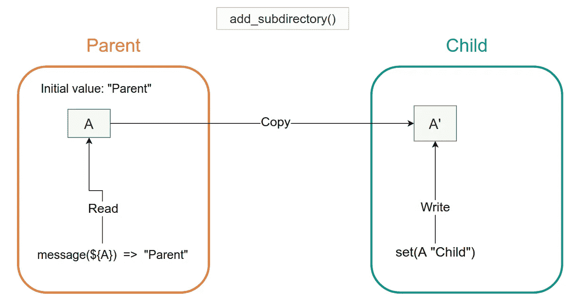
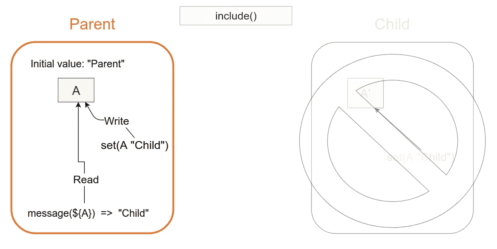
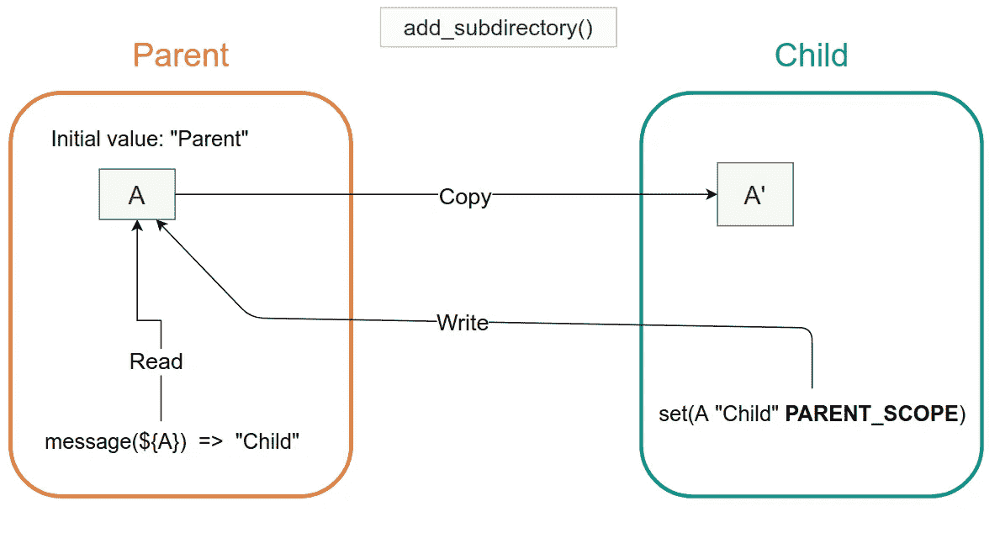
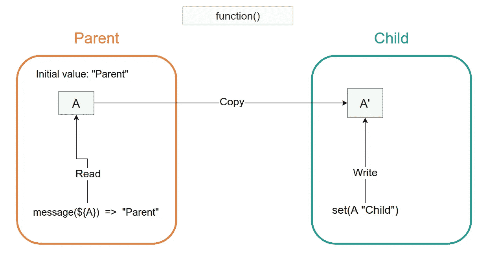
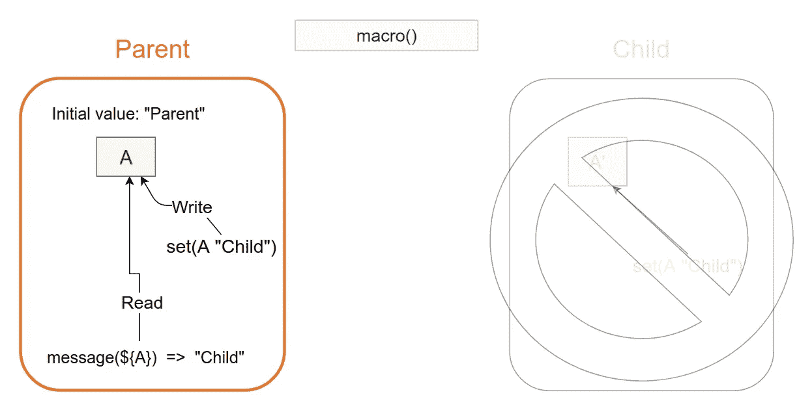
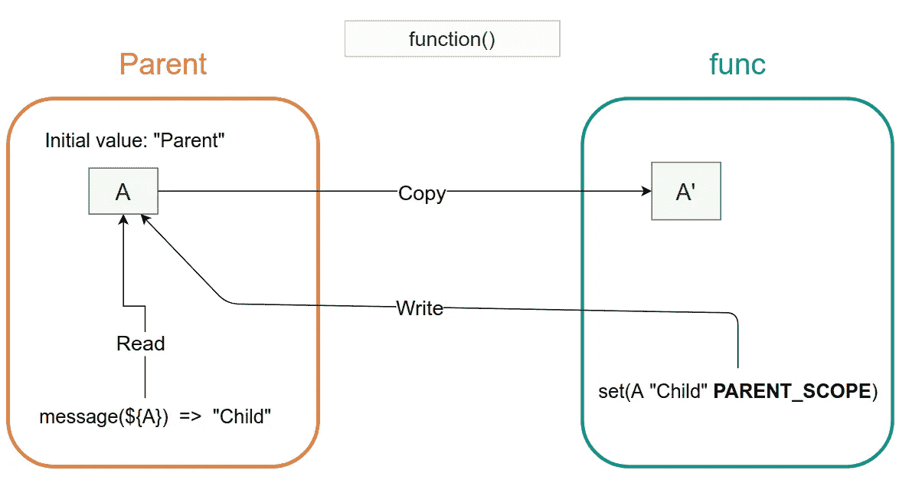

# CMake 变量范围

> 原文：<https://levelup.gitconnected.com/cmake-variable-scope-f062833581b7>

## CMake 中的 add _ 子目录 vs include、函数 vs 宏


# 介绍

您可能已经知道，CMake 是一个流行的管理软件构建过程的开源工具。

使用 CMake，您可以定义变量以及一组指令和指示来描述您的项目过程(构建、测试、打包等)。您可以将 CMake 中的变量视为其他编程语言中的变量。现在，你一定在想，变量是编程中的一个基本概念，没有什么复杂的。然而，CMake 变量的“作用域”的概念可能很难理解，如果您事先不知道，它可能会减慢您的日常开发。在这篇文章中，我将用简单的例子和图表解释 CMake 变量的范围。

# add_subdirectory()与 include()

首先，让我们看看下面的简单示例 CMake 项目。

```
cmake_variable_scope_tutorial
├── child  // child could be a some library in practice.
│   └── CMakeLists.txt  // child
└── CMakeLists.txt     // parent
```

它有一个父 CMakeLists.txt 文件，如下所示。

```
# parent CMakeLists.txtcmake_minimum_required(VERSION 3.2)
project(CMakeVariableScopeTutorial)set(A "Parent")**add_subdirectory(child)**message(STATUS ${A}) # **Prints "Parent"**
```

它将变量`A`设置为`“Parent”`，然后调用`add_subdirectory`将`child`目录添加到构建中。CMakeLists.txt 子文件如下所示。

```
# child CMakeLists.txtset(A "Child")
```

如你所见，它只是将变量`A`设置为`“Child”`。乍一看，父 CMakeLists.txt 和子 CMakeLists.txt 文件似乎共享同一个变量`A`。所以，你可能会猜测`A`最终会更新为`“Child”`，并且`message`命令会打印出`“Child”`。然而，有一个问题。事实证明，当执行 cmake 时，它打印出`**“Parent”**`作为`A`的值。

这是为什么呢？为了理解这个结果，我们必须看看`add_subdirectory`的行为。实际上，当执行`add_subdirectory`时，它会创建一个单独的作用域来处理子 CMakeLists.txt，并为新创建的作用域创建一个`A`的副本。下图解释了这种行为。



如您所见，它在子范围中创建了一个`A` ( `A’`)的副本。写入子 CMakeLists.txt 中的`A`实际上是写入 `A’`。所以，父作用域中原来的`A`变量不受影响。

接下来，让我们检查调用`include`而不是`add_subdirectory`的行为。

```
# parent CMakeLists.txtcmake_minimum_required(VERSION 3.2)
project(CMakeVariableScopeTutorial)set(A "Parent")**include**(child/CMakeLists.txt)message(STATUS ${A}) # **Prints "Child"**
```

在这种情况下，它打印`**“Child”**`。这是因为，与`add_subdirectory`相反，`include`不会创建一个单独的作用域来处理包含的文件，而是共享同一个作用域。这也是为什么这次写入子 CMakeLists.txt 中的`A`被反映到父作用域中的`A`。



那么如果你正在使用`add_subdirectory`并且需要更新子目录中的一个变量，你能做什么呢？解决办法很简单。你可以使用`**PARENT_SCOPE**`选项，当你设置一个值给子变量时。下面是例子。

```
# child CMakeLists.txtset(A "Child" **PARENT_SCOPE**)
```

这告诉 CMake 更新父变量范围内的原始`A`变量。父 CMakeLists.txt 和之前一样，只是这次的`message`命令打印的是`“Child”`。

```
# parent CMakeLists.txtcmake_minimum_required(VERSION 3.2)
project(CMakeVariableScopeTutorial)set(A "Parent")**add_subdirectory**(child)message(STATUS ${A})  # **Prints "Child"**
```

下图描述了该行为。



同样，如果你在下面的童趣中打印`A`变量的值，它打印的是`“Parent”`，而不是`“Child”`。

```
# child CMakeLists.txtset(A "Child" PARENT_SCOPE)message(STATUS ${A}) // **Prints "Parent" (Read A')**
```

乍一看这可能令人惊讶，但这是因为如前所述，`add_subdirectory`在子作用域中创建了`A` ( `A’`)的副本，并且`message`函数中的`A` 变量指向`A’`，而不是父作用域中的`A`。同时，`A’`保存一个最初从`A`复制的值，该值为`“Parent”`。

现在我们已经看到了变量作用域在`add_subdirectory`和`include`情况下的不同行为。接下来，我们将看看`function`和`macro`在变量范围方面的行为。幸运的是，我们到目前为止使用的相同推理和图表可以应用于`function`和`macro`。

# 函数与宏

这一次，我们进一步简化了示例项目。现在它只有一个 CMakeLists.txt。

```
cmake_variable_scope_tutorial
└── CMakeLists.txt
```

CMakeLists.txt 如下所示。

```
# CMakeLists.txtcmake_minimum_required(VERSION 3.2)
project(CMakeVariableScopeTutorial)**function(func)**
    set(A "Child")
**endfunction()**set(A "Parent")**func()**message(STATUS ${A}) # **Prints "Parent"**
```

如您所见，它定义了一个名为`func`的函数，将`A`设置为`“Child”`。并且在`A`被设置为`“Parent”`后调用`func`。如果我们执行它，它会打印出`**“Parent”**`。

即使我们把`A`作为`func`的一个参数传递，结果还是和之前一样。

```
# CMakeLists.txtcmake_minimum_required(VERSION 3.2)
project(CMakeVariableScopeTutorial)function(func **param**)
    set(**${param}** "Child")
endfunction()set(A "Parent")func(**A**)message(STATUS ${A}) # **Prints "Parent"**
```

这是为什么呢？这是因为`function`创建了一个单独的新作用域，并从父作用域创建了变量的副本，就像我们调用`add_subdirectory`时一样。



现在，让我们看看用`macro`替换`func`。

```
# CMakeLists.txtcmake_minimum_required(VERSION 3.2)
project(CMakeVariableScopeTutorial)**macro(mac)**
    set(A "Child")
**endmacro()**set(A "Parent")**mac(A)**message(STATUS ${A}) # **Prints "Child"**
```

事实证明，它这次打印的是`**“Child”**`。这是因为当我们调用`include`时`macro`与父节点共享范围。



同样，您可以使用`**PARENT_SCOPE**` 选项来改变`function`的行为，就像我们对`add_subdirectory`案例所做的那样。

```
# CMakeLists.txtcmake_minimum_required(VERSION 3.2)
project(CMakeVariableScopeTutorial)function(func)
    set(A "Child" **PARENT_SCOPE**)
endfunction()set(A "Parent")func()message(STATUS ${A}) # **Prints "Child"**
```

这使得`set`函数指向父作用域中的`A`,并使得从`function`内部更新它成为可能。



通常，你给`A`作为`function`的输出参数，这样任何看到`function`的人都可以知道哪个变量将被`function`覆盖，调用者也可以显式地传递这个变量。

```
# CMakeLists.txtcmake_minimum_required(VERSION 3.2)
project(CMakeVariableScopeTutorial)function(func **output**)
    set(${**output**} "Child" PARENT_SCOPE)
endfunction()set(A "Parent")func(A)message(STATUS ${A}) # **Prints "Child"**
```

# 结论

CMake 变量像其他编程语言中的变量一样有作用域的概念。一些 CMake 指令、命令如`add_subdirectory`、`include`、`function`和`macro` ⁴根据变量范围表现出不同的行为。

你可以记住`add_subdirectory`和`function`都创建了一个新的作用域和副本，但是`include`和`macro`只是与父对象(它们被调用的地方)共享作用域。

使用 CMake 时，在遇到问题之前了解两者的区别是很有帮助的。

[1]:[https://cmake . org/cmake/help/latest/command/add _ subdirectory . html](https://cmake.org/cmake/help/latest/command/add_subdirectory.html)

【2】:【https://cmake.org/cmake/help/latest/command/include.html 

【3】:【https://cmake.org/cmake/help/latest/command/function.html 

【4】:[https://cmake.org/cmake/help/latest/command/macro.html](https://cmake.org/cmake/help/latest/command/macro.html)