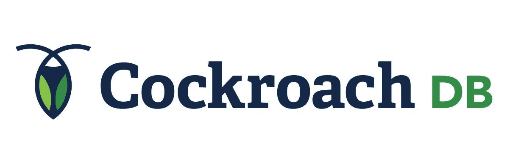
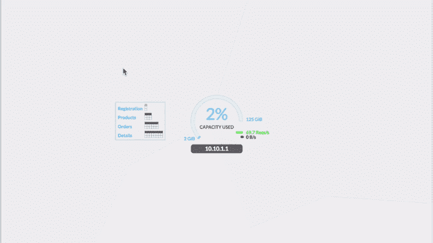
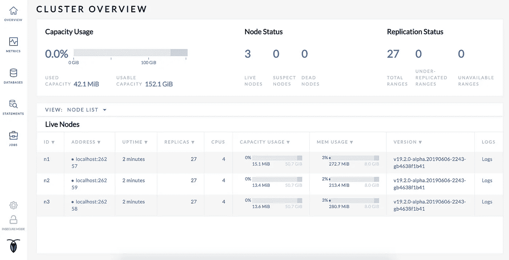

# 作为数据库选择的 NewSQL

> 原文：<https://levelup.gitconnected.com/cockroachdb-newsql-as-a-choice-of-database-b7629ef40481>



为您的系统选择哪个数据库可能是要做出的关键决定之一。无论是提供 ACID 事务和标准化 SQL 语法的 PostgreSQL 和 MySQL 等关系数据库，还是提供横向扩展存储和高可用性的 MongoDB 等 NoSQL。

两者各有优势，是所有开发者的可靠选择。但是，如果我们想要一个可靠的分布式数据库，它仍然提供 ACID 事务并且仍然是可水平伸缩的，该怎么办呢？

是的，您仍然可以在关系数据库中使用主从复制，但是它真的可以扩展吗？它只针对读取功能进行扩展，而插入、更新和删除仍然由主机执行。

我们还可以通过升级服务器的规格，在关系数据库中进行垂直扩展。但是成本不是很高吗？而且它本身确实缺乏音阶的弹性。因此，我们将很难扩大和缩小数据库，以适应系统的需求。

最后，关系数据库并不意味着也永远不会托管在分布式系统上。而 NoSQL 也不提供大多数系统通常需要的 ACID 事务。

# **介绍新 SQL**



CockroachDB 互动演示 GIF

诸如 CockroachDB 之类的 NoSQL 是一个分布式数据库系统，它建立在 RocksDB(持久键值存储数据库)上，并使用标准化的熟悉的 SQL 查询来提供可水平扩展的系统、ACID 事务。

CockroachDB 的灵感来自 Google 的 Spanner 和 F1 技术，幸运的是，这是一个开源数据库，可以跨多个服务器在多个节点上运行。顾名思义，它提供了蟑螂自身的适应力。

# **cocroach db 的主要优势**

1.  **高可用性**

凭借一致的复制和修复能力，无论发生在软件或硬件级别的故障是长是短，从节点重启到数据中心问题，都无需担心。

```
ALTER RANGE default CONFIGURE ZONE USING num_replicas = 5;
```

您还可以决定每个数据的复制因子，默认情况下只有 3。
副本的分发将由每个节点自己处理，防止任何灾难发生时的停机或数据丢失。

对于短期中断，通常该过程将仅存储在大部分副本中，当节点启动时，复制过程将继续。

对于长期停机，群集将找到另一个可用节点，通过从死节点的数据的其他副本进行复制来复制死节点的所有值。

这就是为什么建议建立一个由跨多个数据中心的多个节点组成的系统。

**2。大规模、智能且简单的扩展**

CockroachDB 自动平衡集群中的数据范围，以避免故障域并帮助处理繁重的工作负载。当我们建立一个新的或关闭一个节点时，CockroachDB 会自动重新平衡分布数据，无需任何手动干预。这为系统的升级/降级提供了便利和弹性。我们所要做的就是将该节点指定为集群的一部分，或者关闭任何节点，它将智能地重新稳定自身。

**3。分布式交易**

CockroachDB 将事务分布在您的集群中，无论是一个位置的几个服务器还是多个数据中心的许多服务器。与分片设置不同，您不需要知道数据的精确位置；您只需与集群中的任何节点进行对话，CockroachDB 就会将您的事务无缝地发送到正确的位置。

# **代价是什么？**

1.  **可用性的权衡**

当我们设置复制因子时，它将决定数据本身的可用性。复制因子越大，当任何节点出现故障时，数据就越可用。但这意味着，任何插入、更新、删除的过程都会像复制因子一样被触发。这将导致操作记录的查询延迟更长，还将导致更高的容量消耗。数据越可用，意味着我们需要查询延迟和存储大小作为代价。

**2。错误查询是致命查询**

这意味着您需要根据系统使用情况仔细设计数据库。任何糟糕的表和索引设计都会导致分布式系统比关系数据库更糟糕。因为所有执行的查询都将在多个节点中交换，所以未编制索引的查询和错误设计的表将产生混乱的结果。优化索引、交错特性和列族可能是这个问题的答案。

# **依我拙见**

在 cockroachDB 系统中使用和管理多个数据库后，我发现做几件事情变得非常容易，例如:

*   通过添加或关闭一个节点来扩展和缩减，而无需任何停机时间
*   升级版本时，您可以轻松地一次升级一个节点，无需任何停机时间
*   隔离调整，我们可以区分每个节点的每个设置，以进行任何基准测试，为我们的系统提供最佳设置
*   更少的数据库停机时间，是的，我提到了三次
*   酷内置管理用户界面
*   伟大的开源社区

此外，每个节点拥有 3 到 5 台低端服务器比拥有 1 台高端服务器更便宜



# **总之**

您选择的数据库将基于您的系统的行为，如果您确实需要高可用性、水平可伸缩性，同时仍然提供标准化的 SQL 和 ACID 事务，那么 NewSQL(如 CockroachDB)可能是一个值得考虑的选择。然而，延迟和存储的价格可能是另一个需要考虑的问题。

像往常一样，我们在东京有一个空缺。我们是一家印度尼西亚科技公司，我们的使命是通过技术实现商业民主化，帮助每个人实现更多。
在 Tokopedia 和我们一起寻找你梦想的工作！https://www.tokopedia.com/careers/
T3

来源:
[https://www.youtube.com/watch?v=udmdgcmQJZw&t = 2s](https://www.youtube.com/watch?v=udmdgcmQJZw&t=2s)
[https://www.cockroachlabs.com/](https://www.cockroachlabs.com/)