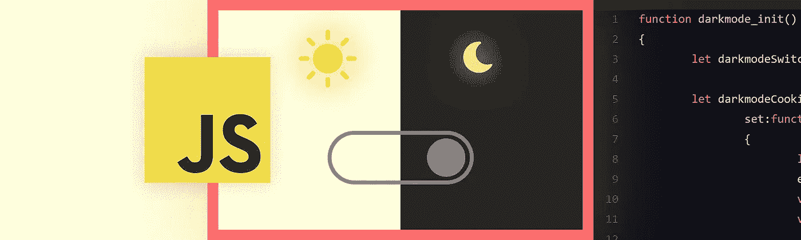
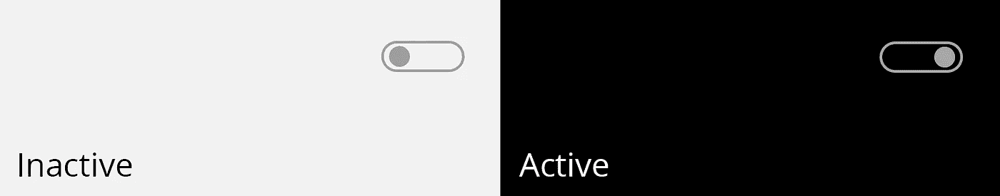
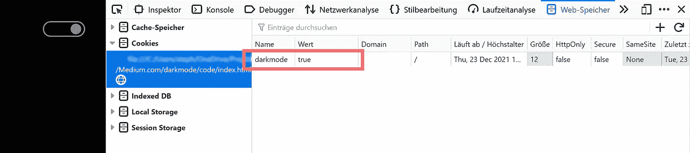
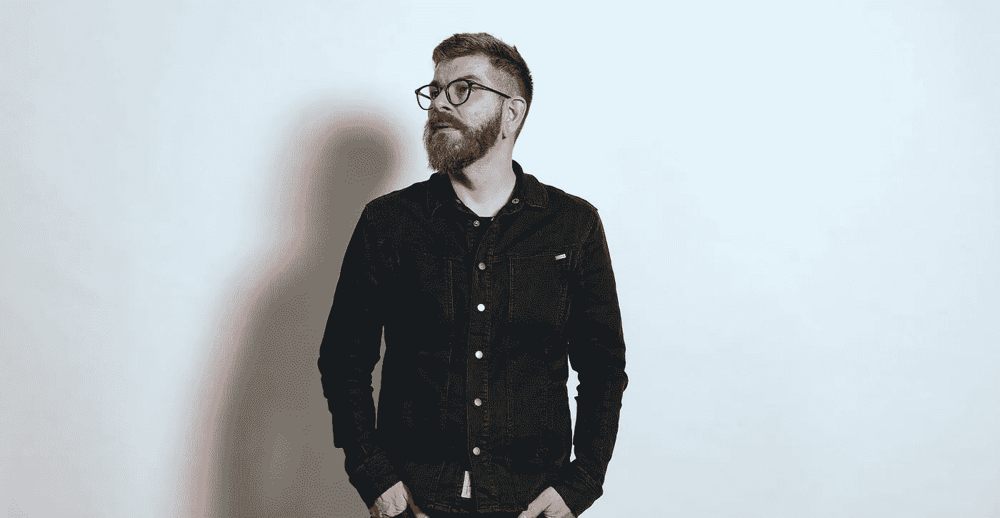

# 用 CSS 和普通 JavaScript 编写一个基于 cookie 的黑暗模式开关

> 原文：<https://levelup.gitconnected.com/code-a-cookie-based-darkmode-switch-in-css-and-vanilla-javascript-b2d89f99ea7d>

## 在本文中，我将向您展示如何用 52 行 JavaScript 轻松地编写黑暗模式开关。

> **更新:**感谢[vojtēch Musil](https://medium.com/u/ce71a9a3f88c?source=post_page-----b2d89f99ea7d--------------------------------)的评论！为了更好的语义和可访问性，我将 darkmode 开关的`
`元素改为了`<button>`元素。

# HTML

对于这个黑暗模式演示，我需要一个简单的 HTML 文件。在`head`部分，我包含了 CSS 文件`styles.css`和两个 JavaScript 文件`darkmode.js`和`project.js`。

元字符集、元视口和标题只是为了完成一个最小的 head 部分。

**黑暗模式按钮**位于*线 13* 上的`<header>`元件内。

# CSS

在样式表中，我定义了`body`的明暗状态。另外，我将暗模式按钮的设计设置为亮模式和暗模式(classname active)状态。

超级简单的黑暗模式按钮

展示的 CSS 是最基本的。

# project.js 文件

我用这个文件在 [DOMContentLoaded](https://developer.mozilla.org/de/docs/Web/API/Window/DOMContentLoaded_event) 事件中用后面描述的函数`darkmode_init()`初始化黑暗模式。

# darkmode.js 文件

在这个例子中，我使用一个函数来包装完整的黑暗模式行为。这是完整的脚本。接下来，我用**四个简单的步骤**来解释这个脚本。

## 步骤 1:引用按钮

首先我从大教堂里拿了个开关。

## 步骤 2:建立 cookie 功能

`darkmodeCookie`对象包含三种方法:

*   `set`设置黑暗模式 cookie
*   `get`读取黑暗模式 cookie 是否存在
*   `remove`删除黑暗模式 cookie

## Steph 3: CSS 类处理

使用`darkmodeCookie`对象的 get 方法，我检查 darkmode cookie 是否存在。如果是的话，我给开关添加一个**活动类**，给`body`添加一个**黑暗模式类**。

## 步骤 4:开关处理

这部分脚本向开关添加了一个**事件监听器**来切换它自己和主体的类。

在*第 6 行*中，我检查了在*第 4 行*中 toggeling 之后车身是否有黑暗模式等级。如果有，我设置了 darkmode cookie，在这个例子中是一个月后到期(2，628，000，000 毫秒)。如果页面是 SSL 加密的，则第 8 行中`darmodeCookie.set()`的最后一个参数必须设置为 *true* 。对于本地测试，只需将其设置为*假*。第二个参数是值，我只使用 *true* 作为字符串。

在浏览器的开发工具中，你可以检查你的 cookies

如果 cookie 必须被删除，因为主体不包含 darkmode 类，我使用`darkmodeCookie.remove()`删除 darkmode cookie。

# 结论

通过这些简单的步骤，您可以使用 darkmode switch 扩展使您的网站更加用户友好。为了更加灵活和可控，我会用 PHP 而不是 JavaScript 来设置 body darkmode 类。

**工作示例**
[https://www . Stephan-rom hart . de/medium . com/dark mode-switch-vanilla-js/](https://www.stephan-romhart.de/medium.com/darkmode-switch-vanilla-js/)

**感谢阅读。** 期待您的反馈。😍

请评论、书签或关注我，支持我的频道。

照片由戈平根的 Tobias Frö hner 拍摄

如果你想让我写第二篇关于在 wordpress 或 xenforo 中实现 darkmode 的文章，请告诉我！

如果你心中有一个特定的主题，你会希望我写下来，让我在推特上知道:[https://www.twitter.com/@stephan_romhart](https://www.twitter.com/@stephan_romhart)