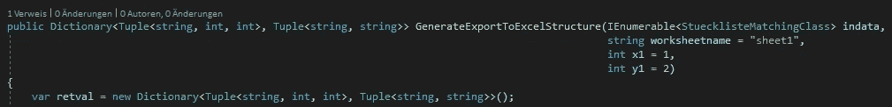

# 让你对人性失去信心的代码示例

> 原文：<https://levelup.gitconnected.com/code-examples-that-will-make-you-lose-faith-in-humanity-a2a36ea9d331>

## 不能再糟了…

在本文中，我想展示一些我多年来收集的代码“瑰宝”。所有示例都来自生产环境中使用的应用程序。

[T](https://unsplash.com/@titouanc?utm_source=medium&utm_medium=referral) 在 [Unsplash](https://unsplash.com?utm_source=medium&utm_medium=referral) 上拍照

## 如何使一个方法异步…不

如何使一个方法异步…不

这个方法是广泛使用`async/await`的. NET 应用程序的一部分。这可能是为什么开发人员希望这个方法是异步的，而不考虑成本的原因。但是创建一个异步运行的空任务对象是非常困难的...让我们说不寻常的方式🤣不强求，方法同步就好。允许异步方法中的同步方法调用，但不允许反过来👍

## 异常数据类型第 1 部分

多么令人困惑的返回类型…

我不得不调试这个方法，相信我，这一点也不好笑。这就像租了一个公寓，破坏了所有的内部，然后不赔偿损失就走了。这里我们有一个完美的例子，说明为什么你应该总是使用具有良好属性命名的自定义对象作为返回类型或参数，而不是这种讨厌的类型或参数。如果不调试这个方法，没有人会看到这些字符串和整数应该代表什么。不要把这么糟糕的代码留给你的同事。

## 异常数据类型第 2 部分

字典中的字典字典中的字典

类似上面这样的例子。不要把一本字典放在另一本字典里面，这太复杂了，很难理解。为此创建一个自定义对象。

## 一个非常大的基类

一个非常大的基类

一个包含抽象方法的类，由继承它的类实现，它有 400 多行代码。有些人会认为这个类太大了，即使它不是一个基类。我很确定每一个合理的编程规则都被打破了。固体，亲吻，YAGNI，干净的代码，…不是这个家伙！

## 不要去那么大

一个拥有超过 22，000 行代码的 Delphi 单元…

嗯…看到这个单位我就无语了。超过 20，000 行代码，没有单元测试，并且定期更新。我对开发人员最大的敬意是，他们不尊重简单的软件工程指导方针，还维护着一个对公司至关重要的程序，因为它管理着所有的客户数据。我不想和你换，伙计！

## 结论

生产代码的糟糕程度令人吃惊。但是我们不应该太苛刻，因为我们对原因一无所知。我只是想表明，即使你不是一个完美的程序员，你仍然可以出去用你的技能赚些钱。试着向有经验的程序员学习，避免类似的错误。

如果你喜欢这篇文章，我会很高兴得到掌声👏(你知道可以拍几次吗？😎)另外，如果你还没有跟上我，我也很感激。

🌲 [linktr.ee](https://linktr.ee/xeladu) | ☕ [咖啡](https://www.buymeacoffee.com/xeladu) |🎁[捐赠](https://www.paypal.com/donate/?hosted_button_id=JPWK39GGPAAFQ) |💻GitHub |🔔[订阅](https://xeladu.medium.com/subscribe)

顺便说一下:如果你还没有 Medium 会员，我推荐你使用[│我的推荐链接◀](https://medium.com/@xeladu/membership) ,因为它可以让你访问 Medium 上的所有内容，并以一小部分费用支持我，而不需要你支付任何额外费用。谢谢大家！✨

## 相关故事

 [## 如何在 git 合并或 git 重置后修复一个损坏的分支

### 本指南向您展示了如何使用断开分支的原始更改来创建新分支。

levelup.gitconnected.com](/how-to-fix-a-broken-branch-after-a-git-merge-or-git-rebase-4ca61c0cb6fd)  [## 如何使用 winget 安装、更新和删除您的 Windows 应用程序

### 如何用 Windows 包管理器(winget)安装应用程序，如何保持应用程序更新，以及如何使用…

xeladu.medium.com](https://xeladu.medium.com/app-management-with-winget-on-windows-e668086a03f7)  [## 如何在 C#和 SpecFlow 中使用行为驱动开发(BDD)

### 这是一个关于如何在. NET 中使用 C#和 SpecFlow 的行为驱动开发(BDD)的介绍性指南…

xeladu.medium.com](https://xeladu.medium.com/behaviour-driven-development-bdd-with-c-and-specflow-1bb2deb13024) 

# 分级编码

感谢您成为我们社区的一员！升级正在改变技术招聘。 [**在最好的公司**找到你的完美工作](https://jobs.levelup.dev/talent) **，而不仅仅是你的*下一份工作*。**

 [## 提升——改变招聘流程

### 🔥让软件工程师找到他们热爱的完美角色🧠寻找人才是最痛苦的部分…

作业. levelup.dev](https://jobs.levelup.dev/talent)