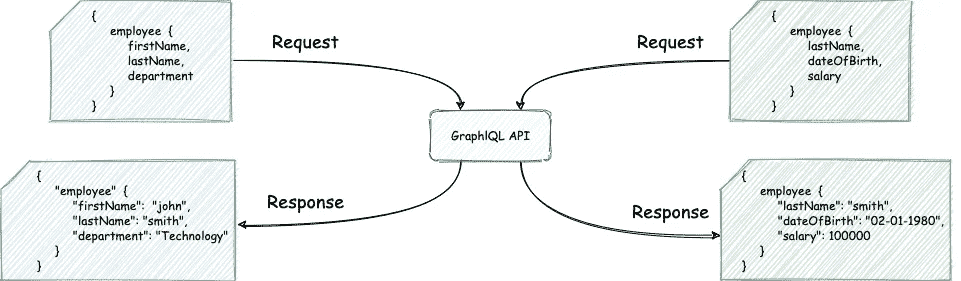
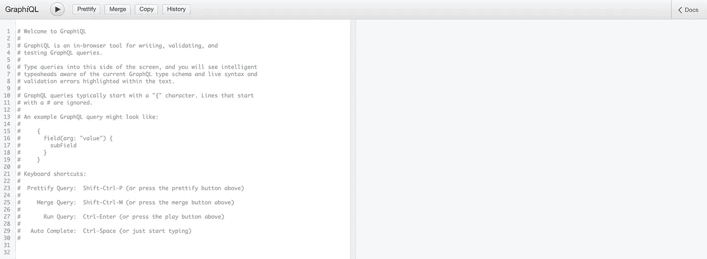
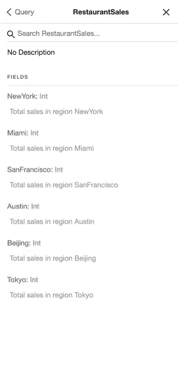
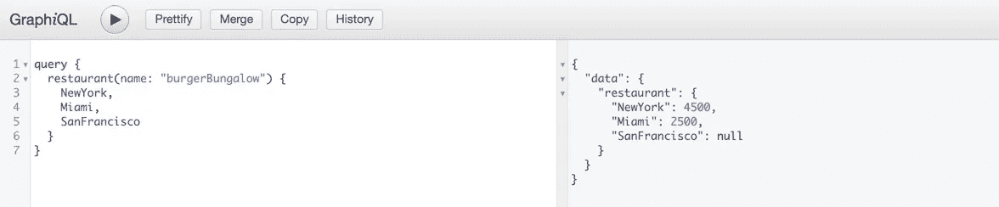

# 使用 GraphQL.js 的代码优先 GraphQL 模式

> 原文：<https://levelup.gitconnected.com/code-first-graphql-schema-with-graphql-js-bfec4664d1a5>

## 如何以编程方式生成 GraphQL 模式

## GraphQL 是什么？

GraphQL 是一种用于 API 的查询语言和运行时，它允许客户端定义服务器返回的响应的数据元素和结构。与典型的 REST API 不同，在 REST API 中，服务器根据预定义的数据契约进行响应，而使用 GraphQL API，客户端可以请求并接收它需要的数据。

例如，考虑一个雇员API，它允许客户查询组织中雇员的信息。从联系信息(电子邮件、电话)，到个人信息(出生日期、地址)，再到组织信息(工资、职位、部门)，有相当多的数据元素可以与一个员工相关联，而且任何一个客户都不可能对每个数据元素都感兴趣。

通过使用 GraphQL 查询，客户能够通过指定他们感兴趣的数据元素来定义雇员 API 响应的内容和结构。



GraphQL 查询示例。(图片由作者提供)

## GraphQL 模式

GraphQL 模式描述了由 GraphQL 服务器展示的可查询数据元素或字段的结构。回到上面的雇员示例，我们可以将模式定义为:

上面的语法被称为**模式定义语言**(或者 **SDL** )，正如您所看到的，它定义了对象类型(本例中为*雇员*)、对象的字段以及这些字段的数据类型。SDL 也可以表示需要输入参数的类型。例如，这个 API 的客户端可能希望查询关于给定某个雇员标识符的特定雇员的数据。当对雇员进行查询时，GraphQL 服务器可以要求将该标识符作为输入参数传递。产生的模式看起来像这样:

**注意:**`String!`中的`!`表示该参数不可为空。

## 什么是代码优先模式？

虽然 SDL 是一种简单易读的表示模式的方式，但是以 SDL 的形式编写和维护 GraphQL 模式可能会变得很麻烦，尤其是当字段数量增加以及需要进行更改以反映 API 所连接的后端数据库的更改时。

代码优先模式允许我们以编程方式定义 GraphQL 模式，而无需显式编写 SDL。我们将通过一个示例应用程序来了解这是如何实现的。

# 示例场景

假设你在一家餐饮公司工作，该公司拥有遍布世界各地的快餐连锁店。您希望创建一个 GraphQL API，允许客户查询各个城市中每个连锁店销售的餐食数量。

为了实现这一点，我们将使用 Express 和 GraphQL.js 创建一个 GraphQL API 服务器。我不会在本文的基础知识上花费太多时间，因为您可以在这里找到关于这些技术的入门教程:[https://graph QL . org/graph QL-js/running-an-Express-graph QL-server](https://graphql.org/graphql-js/running-an-express-graphql-server/)/

然而，GraphQL 文档中的代码示例都使用 SDL 来定义模式，而我们将使用代码优先的方法以编程方式生成模式。

## 构建应用程序

从一个空的 node.js 项目开始，我们将使用 NPM 安装必要的包:

```
npm install express express-graphql graphql
```

处理完依赖关系后，我们将填充应用程序入口点。我们使用`graphqlHTTP`中间件来允许我们的 Express 应用程序接受 GraphQL 查询，传递模式(我们将很快定义)并指定`graphiql: true`来启用基于 web 的 GraphQL GUI，以便对我们的服务器执行 graph QL 查询。

## 创建一些示例数据

我们将创建几个简单的 JSON 文件来模拟后端数据库，而不是建立一个数据库服务器来存放我们的应用程序将使用的数据。

第一个文件包含三家快餐连锁店在不同地区的销售数据:

第二个文件包含公司开展业务的所有不同地区。

有了一些示例数据，我们现在将创建一个数据访问对象，它公开了检索数据的函数。在现实世界的应用程序中，这些函数可能会对外部 SQL 数据库执行查询，而不是简单地从静态 JSON 文件中读取。

## 定义模式

现在是精彩的部分。我们将为一个`RestaurantSales`类型定义一个模式，客户可以用它来查询一个特定的连锁餐厅在多个地点的销售数据，我们不会编写任何 SDL 来创建这个模式。相反，我们将从我们创建的样本数据动态构建模式，这意味着随着底层数据的变化(例如，如果添加了新的区域)，我们的应用程序的模式将自动更新以反映这些变化。

首先，这里是前面在应用程序入口点中引用的`schema`模块。当应用程序启动时，下面的`GraphQLSchema`对象将被传递到`graphqlHTTP`中间件中。

让我们走一遍:

*   首先，需要注意的是，`query`类型是每个 GraphQL 服务共有的特殊类型。除了它是所有服务查询的入口点之外，`query`类型就像任何其他类型一样(比如前面的 Employee 类型)。也就是说，服务中定义的所有其他类型都是顶级`query`类型的字段。您可以在这里阅读关于`query`类型和另一种特殊类型`mutation`的更多信息:[https://graph QL . org/learn/schema/# the-query-and-mutation-types](https://graphql.org/learn/schema/#the-query-and-mutation-types)
*   在上面代码的**第 6 行**中，我们将`query`类型定义为应用程序模式中的顶级对象。
*   在**第 9 行**中，我们指定顶级`query`类型包含一个名为`restaurant`的字段，该字段属于`RestaurantSales`类型(我们将很快定义该类型)，接受一个名为`name`的参数，并通过使用前面的`restaurantDataService`查询一家快餐连锁店的销售数据来解析。实际调用的是`resolve`函数，用数据填充`restaurant`字段。

最后一步是定义`RestaurantSales`类型。类似于`query`类型，它将有一个名称和一个字段集合。`ResaurantSales`类型的字段将是公司运营的不同区域，我们将使用之前放入“数据库”的区域列表以编程方式定义这些字段。

*   在**第 12 行，**我们创建了`RestaurantSales`类型作为`GraphQLObjectType`的一个新实例，我们给该类型一个名称，并将该类型的字段设置为等于`getRegionFields()`函数的结果。
*   `getRegionFields()`函数使用`restaurantDataService`来查找区域列表，并为每个区域向`fields`集合添加一个新字段。`fields`对象是一个键-值映射，其中键是字段的名称，值是具有`type`和`description`的对象。每个字段的类型都是`GraphQLInt`，并且有一个基于区域名称的简单描述。

仅此而已。我们现在已经使用“数据库”中的区域列表定义了我们的`RestaurantSales`类型，而不是显式地单独列出每个区域。让我们测试一下这个应用程序。

## 运行应用程序

要启动该应用程序，请运行以下命令:

```
node index.js
```

您应该会看到如下输出消息:

```
Running a GraphQL API server at [http://localhost:4000/graphql](http://localhost:4000/graphql)
```

导航到[http://localhost:4000/graph QL](http://localhost:4000/graphql)，您应该会看到前面提到的 GraphiQL GUI。它看起来会像这样:



图形用户界面。(图片由作者提供)

左窗格是我们可以编写针对服务器执行的 GraphQL 查询的地方，右窗格是我们可以看到服务器响应的地方。在我们执行任何查询之前，让我们通过展开右上角的 **Docs** 菜单来检查服务器的模式。

从顶级的`query`类型开始，我们可以深入到我们的自定义`RestaurantSales`类型，查看我们类型的字段。



正如所料，`RestaurantSales`类型包含一个字段，用于存储在我们后端“数据库”中的 regions 列表中定义的每个区域。

这样做的好处是，当新的区域被添加到区域列表(或者可能是现实应用程序中的区域表)中时，我们的应用程序会自动选取它们，并在启动时将它们作为字段添加到`RestaurantSales`类型中。

最后，让我们尝试一个销售数据查询。我们将获得纽约、迈阿密和旧金山的虚拟快餐连锁店 Burger ballout 销售的餐数。



# 结论

在本文中，我们看到了如何使用代码优先的方法定义 GraphQL 模式，而不是使用 SDL 显式定义模式。这种代码优先的方法是编写和维护大型模式的好方法，这些模式可能像 SDL 一样难以阅读和修改。

感谢阅读。如有任何问题或意见，请随时联系我们。

## 参考

以下是我发现的一些有助于学习 GraphQL 和 GraphQL 模式的资源:

*   [https://graphql.org/graphql-js/](https://graphql.org/graphql-js/)
*   https://graphql.org/learn/schema/
*   [https://blog . log rocket . com/code-first-vs-schema-first-development-graph QL/](https://blog.logrocket.com/code-first-vs-schema-first-development-graphql/)

这里有一个 GitHub 存储库，包含本文中提到的 GraphQL 服务器应用程序:

*   [https://github.com/gnovack/code-first-graphql](https://github.com/gnovack/code-first-graphql)