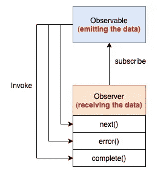

# RxJS 中入职反应式编程的代码片段

> 原文：<https://levelup.gitconnected.com/code-fragments-to-onboarding-reactive-programming-in-rxjs-283709a933a7>

## RxJS，JavaScript 的反应式扩展库


RxJS 图片来自[https://rxjs.dev/](https://rxjs.dev/)

[**反应式编程**](https://en.wikipedia.org/wiki/Reactive_programming) 在过去的几年里变得非常流行。这是一种创建对数据变化做出反应的程序的方法。

[**RxJS**](https://rxjs.dev/guide/overview) 是做反应式编程的 javascript 库。在这篇文章中，我们将学习如何使用这个库来实现反应式编程。

RxJS 基于两个实体:**可观测的**和**观测者。**



可观察的和观察者

**Observable** 是一个知道如何创建数据流并处理发出数据的**的对象。每次当一个新的项目可用时，可观察对象将它推给它的观察者。**

**观察者**是一个知道如何使用流中的数据并处理接收数据的**的对象。**

够概念！是时候开始编码了。

# 1.转换一串数字

在这个简单的例子中，我们根据一系列数字创建了一个可观察值。经过一些转换后，我们最终将数据传递给观察者。


RxJS 大理石图(操作:地图+过滤器)，作者绘制

上面的代码不需要解释，运行一下就可以看到下面的结果。

```
Observer got a next value: 25
Observer got a next value: 36
Observer got a next value: 49
Observer got a complete notification
```

# 2.创建自定义操作员

运算符是 RxJS 的组成部分之一。该库提供了许多操作符，但有时创建我们自己的操作符会很有帮助。

在这个例子中，我们使用一个真实的人对象，它有姓名、年龄和电子邮件字段。我们从可观察的来源中筛选出 18 岁以上的人，并给他们每人发一封电子邮件。

`sendEmailOp`是我们创建的自定义运算符。它有一个内部函数，接受一个可观察值并返回一个可观察值。

如果您对自定义操作符感到困惑，请查看以下链接。

[](https://netbasal.com/creating-custom-operators-in-rxjs-32f052d69457) [## 在 RxJS 中创建自定义运算符

### 运算符是 RxJS 的组成部分之一。该库附带了许多操作符，可以用来处理…

netbasal.com](https://netbasal.com/creating-custom-operators-in-rxjs-32f052d69457) 

# 3.多重观察者

有时，我们需要不止一个观察者来订阅同一个可观察对象。RxJS 主题是一种特殊类型的可观察对象，它允许将值多播给许多观察者。


作者绘制的 RxJS 大理石图(行为对象)

结果:

```
observerA: 0
observerA: 1
observerA: 2
observerA: 3
observerB: 3
observerA: 4
observerB: 4
observerA: complete
observerB complete
```

当一个观察者订阅了一个**行为主题**时，它开始发射源可观察对象最近发射的物品，然后继续发射源可观察对象后来发射的任何其他物品。

这里有一个关于 RxJS 主题的好帖子，请阅读。

[](https://luukgruijs.medium.com/understanding-rxjs-behaviorsubject-replaysubject-and-asyncsubject-8cc061f1cfc0) [## 了解 RxJS 行为主体、replay 主体和 async 主体

### 探索它们不同的特点

luukgruijs.medium.com](https://luukgruijs.medium.com/understanding-rxjs-behaviorsubject-replaysubject-and-asyncsubject-8cc061f1cfc0) 

RxJS 适合处理异步代码。开始在你的下一个项目中使用它，你会得到很多好处。