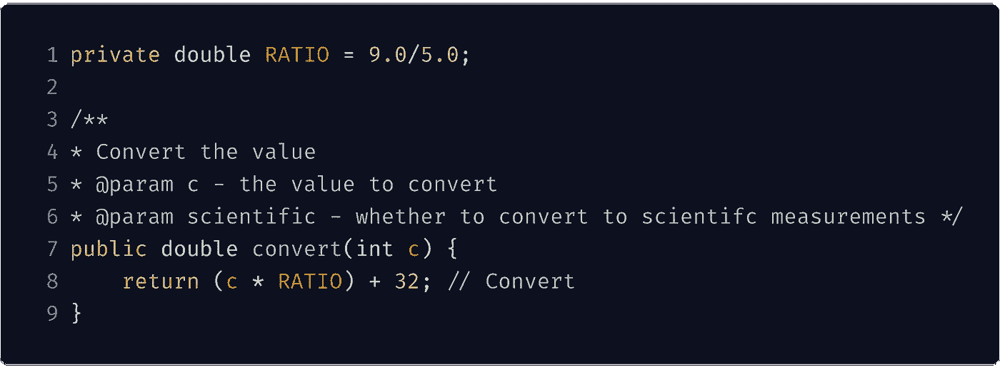
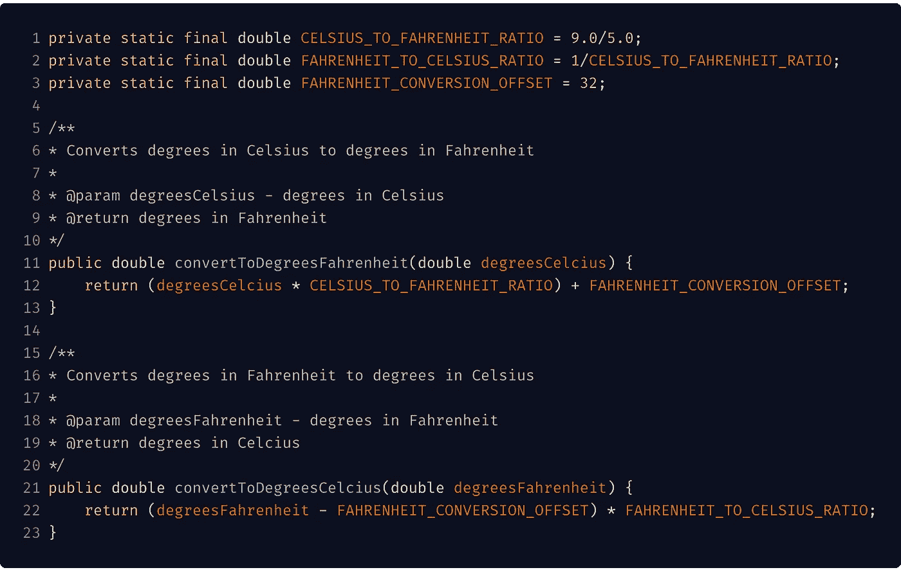

# 我经常评论的代码问题

> 原文：<https://levelup.gitconnected.com/code-issues-i-always-comment-on-e2fbf4c40e21>

我[爱读代码](https://medium.com/@dangoslen/you-should-love-reading-code-7ba87060877c)。我倾向于像喜欢写代码一样喜欢阅读好的代码，因为阅读伟大的代码并研究它是成为更好的程序员的重要部分。

因此，我为我的团队做了很多代码审查。我总是一遍又一遍地评论同样的事情。

开发人员、他们的经验，甚至他们使用的是什么都不重要。这些是我看到的错误，因为它们很容易犯。

今天，我想向大家介绍几个我经常评论的最常见的问题。希望我能向你展示一些你可以作为评审员带到你的团队的东西，或者只是一种练习自己写更好的代码的方法。

## 小例子

下面是一个简单函数的小例子(假设它在类层次结构中的位置很好)。下面以此为例，说明我平时评论的常见问题。

## 糟糕的名字

坏名字是所有编码罪恶的根源。命名不当的变量或方法可能会让后续的读者误解其意图，并且不能正确地使用这些组件。一个名为`Handler`的类是模糊和令人困惑的——它处理什么！？我如何使用它？

相反，争取真正有意义的名字。要声明！具体点！在占用太多的行长度之前，你有足够的字符来描述一个变量。你有时间为你的函数想一个合适的名字。

在上面的例子中，我们看到了变量和函数命名的糟糕例子。如果是`degreesCelsius`，那么`c`的说法就更有道理了。不变的名字`RATIO`最好命名为`CELSIUS_TO_FAHRENHEIT_RATIO`。这个函数，在这一点上很明显，应该被命名为`convertCelsiusToFahrenhiet`和 boom:整个函数是有意义的。

此外，一个好的“家长上下文”名称将更容易为孩子找到有意义的名字。一个好的类名使得命名字段和函数更加容易。命名良好的函数允许更好的上下文参数和局部变量。好名声是相互建立的。我没有在示例中显示类名，但是为了简单起见，它可能是类似于`TemperatureUtil`的东西。

如果你发现自己必须想出很长的名字，那么很有可能你有太多的事情要做，你应该考虑把你的工作分解成更小的功能。

对于名称，一个好的起点是接受您的 IDE 自动完成建议。他们可能是香草，但它将有助于给你一个快速和有意义的名字开始。

在离开这个话题之前，记住名字是硬的！有人评论你的名字一点也不坏。我们都需要别人的观点来看我们如何改进我们的代码。但是不要让你的评论者来评论它们。多花 20-30 秒想出一个好名字。如果你想不出一个好的，那就想出你能想到的最好的，然后*让代码评审对话帮助你找到一个更好的。*

## 不当评论

评论就等着迷惑其他开发者吧(包括你未来的自己！).[鲍伯·马丁](https://blog.cleancoder.com/uncle-bob/2017/02/23/NecessaryComments.html)在*清洁代码*中强调:

> …我经常提出，每一个注释都代表着代码无法自我解释。我建议程序员把注释作为最后的手段。

“每一个注释都代表了代码自我解释的失败”，这听起来很刺耳，但这是真的。回到好名字，如果你有富有表现力的名字，它们会自己“评论”自己。

更糟糕的是过时或误导性的评论。这些注释伤害或违背了你的代码正在做的事情。一个开发人员会阅读代码，感到困惑，阅读注释，然后变得更加困惑！

我们的编码示例有一个很好的例子。首先，我们看到 Javadoc 注释并没有提供比方法更多的有用信息。理想情况下，我们的 Javadoc 会说“将摄氏度转换为华氏度。”

其次，Javadoc 没有`@return`值，而`@param scientific`的文档也不再是一个参数。这个方法的读者可能会感到困惑“它应该有这个参数吗？我需要加回去吗？”更不用说，一个公共 API 的消费者会认为，“这没有意义。我看的是正确的文件吗？”总之，它对代码库没有任何帮助。当参数为时，它应该已被移除。

第三，行内评论完全没用。即使有一个像`convert`这样的坏名字，代码也清楚地传达出它正在转换*某种东西。* 一行字说着同样的事情，只是杂乱无章。我知道一个微不足道的例子，但是这些线总是出现。像`//sorting`或`'reverse the list`这样的注释不会给你的代码增加任何价值，如果它足够有表现力的话。

也就是说，有时候你**需要**的评论。如果你必须颠倒一系列算法才能工作，也许要解释为什么，而不只是重复显而易见的东西。如果在 bash 脚本中有一个奇怪的 curl 命令或其他 CLI 命令，那么说明并引用原因是一个很好的注释用法(当然，非黑客的东西会更好)。

库内的公共 API 或 REST APIs 也是代码的例子，它们应该有关于它们做什么以及它们如何使用参数的清晰文档。通常，这是以文档形式完成的，可以生成可导出的文档(markdown、HTML、.json)供以后消费，并可在网上查看。Javadoc、RDoc、documentation.js 都是这样的例子。

在这些情况下，您应该确保您的文档清晰、简洁，并且**总是最新的**！代码评审是在发布之前评审那些注释的主要方法。

## 不正确的变量声明

然而，作为代码评审者，最让我沮丧的一个问题是不正确的变量声明。把类型搞错；当一个变量应该是常量时，却没有把它变成常量；在应该是`private`的时候使用`public`。

对我来说，这意味着缺乏理解或简单的懒惰。大多数 ide 会警告你这些事情，一些编译器甚至也会产生警告。知道何时以及如何使用适当的变量修饰符和声明是成为工匠的一部分。

深入学习你的语言。知道静态变量和非静态变量的区别。javascript 中的`let`、`const`和`var`之间。事实上，许多这些看似句法上细微差别的决定揭示了你对自己正在做的事情有多了解。

并彻底了解您的业务需求。了解应用程序的背景。你需要整数吗？如果是，你会怎么圆？你将如何处理浮点计算？

在我们的例子中，我们主要在两个地方看到这一点。首先，我们的常量`RATIO`没有被声明为常量。在 Java 里要做常量，应该是`static final`。

我们还看到函数中的参数`c`是一个`int`。这应该是一个`double`,因为大多数时候学位通常比整数更细化。您可能会认为这只是意味着 convert 函数也应该返回一个`int`,这没问题——但是无论哪种情况，这个方法都使用了错误的类型！你得把这些事情做好。

## 神奇的价值观

这里我们要讨论的最后一件事是魔力价值的问题。幻值是数字、文字等。在未命名的代码中。他们就在那里。

魔力价值很快变得危险，原因有几个。首先，如果您需要引用其他地方的值，您可能会复制和粘贴几次。您可能最终会将值重构为一个常量，但是您已经造成了损害:现在，祝您在尝试找到将该值作为常量引用的所有正确位置时好运

其次，魔值是没有办法配置的。在某些情况下，比如转换示例，这不是问题。但是，在其他情况下，如超时、URL 或机器学习变量，如果不完全重新编译代码，您将无法更改这些值。相反，使值可配置，并通过依赖注入将值传递给需要它的类。

在我们上面的例子中，幻值 32 是一个幻值。因为摄氏到华氏的公式是静态的，所以让它可配置没有意义。但是，我们可以给它一个名称，并在代码中将其作为常量引用。一个好名字可能会超级冗长，比如`FAHRENHEIT_OFFSET`或`FAHRENHIET_CONVERSION_OFFSET`。

有些人可能会认为这是大材小用，但是如果我们添加一个相反方向的方法会怎么样呢？正如我们将在下面展示的，这使我们能够毫不犹豫地编写另一个函数，轻松地重用该常数。

## 把它放在一起

让我们看看这些微小的变化是如何从根本上使我们的代码更容易阅读、理解，并用来编写另一个函数。

我们添加一个新函数的能力非常简单，并且重用了现有的常量，因为我们花时间把第一个函数做对了。之后的任何读者都将能够快速理解意图，如何使用每个功能，并做出更改(当然使用 TDD！).

这些只是在评论中出现的一些代码问题。还有很多，**还有很多**，但这些是我看到的最常见的，也是我经常不假思索评论的。希望这能帮助你成为一个更好的编码者和更好的评论者。

编码快乐！