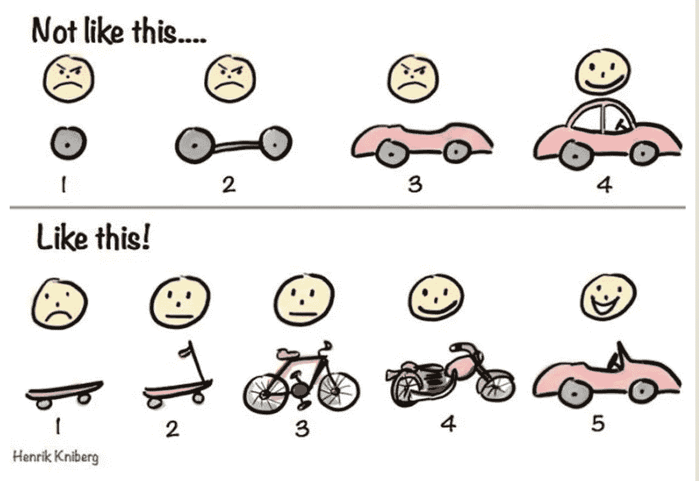

# 少编码，多思考…增量！🔊

> 原文：<https://levelup.gitconnected.com/code-less-think-more-incrementally-98adee22df9b>

## 拥有 100%的东西比 99%的一无所有要好

悉尼港的图片(澳大利亚)。在左边，有海港大桥。在中间，有一艘停靠着三艘船的大型游轮。在右边，有悉尼歌剧院。背景中有一些建筑。

听听音频版！

上次我写了关于[持续集成:一个合并的故事](https://hackernoon.com/continuous-integration-a-merge-story-16d8c81b4077)。这篇文章描述了一个 6 个月的项目是如何失败的，因为它没有实现持续集成的原则。

回想起来，有几件事情本可以有所不同:

*   尽快将代码更改集成到其他人的工作中，最好是一天多次。
*   少编码，多思考。

但是怎么做呢？

在软件项目中，每个人都必须应对一个基本的挑战:

**屎要变了**

如果**不得不花**个月而不是几天来完成一个项目，你怎么能每天持续集成它呢？

> 如果一个问题的所有可能的解决方案都没有一个可行的答案，你唯一的选择就是改变这个问题。

而不是问“我如何才能建立一个大项目？”你应该问“我怎样才能把一个大项目分割成最小的有用部分呢？”

**增量交付**是寻找不同方法解决问题的想法。它旨在以小增量交付大项目，而不是直接瞄准最终的大项目。

这幅著名的漫画总结得很好:

这幅漫画总结了**增量交付**背后的理念。有两个例子，一个在顶部，一个在底部。在上面的例子中，有一个标题“不是这样的”,包含了制造汽车的 4 个步骤。第一步制造车轮，第二步制造底盘，第三步制造外壳，最后一步制造成品汽车。用户对所有步骤都不满意，除了最后一步。在底部的例子中，有一个标题“像这样！”组装汽车的五个步骤。第一步造一个溜冰鞋，第二步造一个滑板车，第三步造一辆自行车，第四步造一辆摩托车，最后一步造一辆敞篷车。用户在第一步不开心，但是从第二步开始变得开心。用户对底部例子的最终结果比对顶部例子的更满意。

从这幅漫画来看，有些事情并不明显。

在第一个例子中，最后一辆车是非敞篷车。原因是当用户和她的丈夫请求制造汽车时，她已经结婚了。他们想要一辆封闭式汽车。然而，在开发过程中，用户离婚了，改变了主意。他们想要一辆敞篷车。

第一个例子的开发人员已经从“大项目”的全貌开始了。车轮是专为非敞篷车型打造的，中间不可能有变化。用户得到了他们**要求**的东西，尽管这不是他们**想要的东西**。

最终，用户“只是”高兴。

在第二个例子中，因为它解决的是**加快速度的问题**，而不是**拥有一辆车的解决方案**，所以在整个过程中有许多变化的可能性。开发商建造了一辆敞篷车，以应对婚姻的意外结束。最终，用户获得了改变他们**想要的**的权力，这与他们**要求**的不同。

他们更快乐。

> 处理可能改变的事情的最好方法是开发你现在最少需要的东西，而不是猜测你以后可能需要什么。

还有一点不明显。

在第一个例子中，制造汽车需要 4 个步骤。然而，在底部的例子中，它采取了 5 个步骤来实现敞篷车。

增量交付不会让你真的“更快”如果你认为“速度”的技术方面是你在更短的时间内完成的事情的数量，那么增量交付实际上会花费更多的时间来完成整个事情！

然而，如果你认为“速度”是你所交付的价值总量，那么你完全有可能花更多的时间去做某事，而花更少的时间去完成！诀窍是构建能让用户满意的最小可行的东西，即使它不是最终的“大项目”

人们想要的会改变，原来的要求会变得过时。或者像我之前说的:

狗屎要变了。

你唯一能做的就是从一开始就接受这个事实，并据此制定计划。

不要试图改变世界，去冲浪吧。

> 增量交付处理的是问题，而不是解决方案，这让你工作更少，速度更快。

在可转换的例子中，开发人员不需要知道用户想要什么。他们的目标是在过程中改进问题的解决方案，尽管总是朝着正确的方向。

***注:*** *你可以认为这部漫画是一个不符合现实的坏例子，原因有很多……你是对的！详见* [*此响应*](https://medium.com/@fagnerbrack/great-question-2adb02f4c7b1) *。*

这一原则可以应用于几乎任何工作，而不仅仅是面向用户的产品开发。

当你总是写一些小的东西时，你可以发现新的信息，这些信息可能会改变你对你必须做的“大任务”的看法。这也是一种避免做多余事情的方法，并且适应你对问题理解的变化。

比方说，你加入了加密货币潮流，并在几个交易所开始了一些购买/出售操作，但是，这些交易所不允许你清楚地看到当前和未来销售的利润/损失。

**你可以建一个网站。**

该网站将连接到您使用的所有交易所的 API，并提供图表。这些图表将显示你从过去的销售中获利多少。它还会显示如果你现在卖掉你的硬币，你会得到多少利润。

在这种情况下，您必须构建一个服务器，将其托管在某个地方，规划架构，查看一些用于制图的开源库、测试框架等…

建造任何有用的东西都需要很长时间！

**或者你可以构建一个小函数。**

该函数将返回购买/销售操作的利润，您可以在 Chrome DevTools 中运行它。

在这种情况下，它几乎不费吹灰之力就能为你传递价值。它还允许您在将来可能会(也可能不会)建立的网站中重复使用该功能。

您还可以添加几个`console.log`语句作为“测试框架”的替代。这应该足以验证该功能正在工作。你甚至可以使用 [TDD](https://medium.com/@fagnerbrack/why-test-driven-development-4fb92d56487c) 来构建它！

[JavaScript 代码](https://gist.github.com/FagnerMartinsBrack/fa8fb9b32e71e597901258340d4936a8)用于计算买入/卖出操作的利润/亏损百分比。使用 **console.log** 语句进行测试。

如果你想提供一个更好的界面，你可能不需要服务器。您可以创建一个包含几个文本输入的 HTML 文件，并从文件系统本地运行它。

当你真的需要的时候，启动一个静态服务器，复制 HTML。

> 你不能一步一步地造桥，但是看过河的问题有很多方法。

文章“大教堂和集市”展示了增量交付在[开源](https://hackernoon.com/lets-implement-the-open-source-model-but-which-open-source-a89c82d1b494)中的应用。它被用于 Linux 的开发。以下是摘录:

> Linus 以最有效的方式将用户视为合作开发人员:
> 
> 7.提前释放。经常释放。倾听顾客的心声。
> 
> ——摘自[《大教堂与集市》，1999 年](http://www.catb.org/esr/writings/cathedral-bazaar/cathedral-bazaar/ar01s04.html)

这个原则最终以“[通过早期和持续交付有价值的软件](http://agilemanifesto.org/principles.html)来满足客户”的形式出现在敏捷宣言中。

如果你总是从一开始就构建一个大任务，而没有增量开发的想法，你很可能会陷入困境。即使你在编写代码，那也不意味着你在创造价值和富有成效。

不要看解决方案，要看问题。[不看答案，看问题](https://hackernoon.com/the-journey-for-the-right-question-c3f5b9e90035)。

作为工程师，我们倾向于用努力工作来衡量进展。然而，我们需要更聪明地工作。

这意味着少写代码，多思考。

确保你没有从错误的轮子开始…

…否则你可能会错失良机。

如果你的团队从我关于这篇文章或我正在进行的任何其他项目的谈话和/或问答中受益，请在`contact at fagnermartins.com`给我写信。

另请参见[缺少的实用分步 TDD](https://itnext.io/the-missing-practical-step-by-step-test-driven-development-a7140ca4b71) ，它展示了增量交付的一个很好的例子。

感谢阅读。如果您有任何反馈，请通过 [Twitter](https://twitter.com/FagnerBrack) 、[脸书](https://www.facebook.com/fagner.brack)或 [Github](http://github.com/FagnerMartinsBrack) 联系我。

想当面聊聊吗？你可以在 [**悉尼软件工匠聚会**](https://www.meetup.com/Software-Crafters-Sydney/) 中找到我。