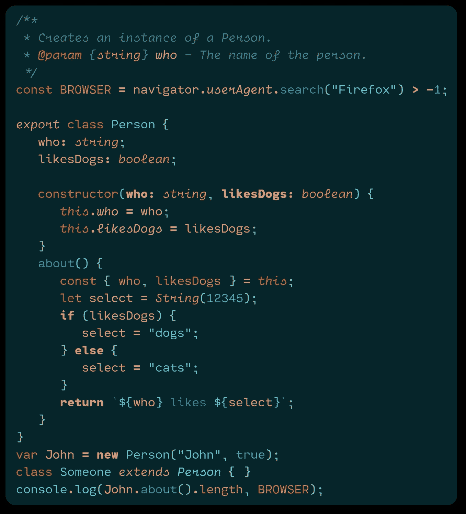
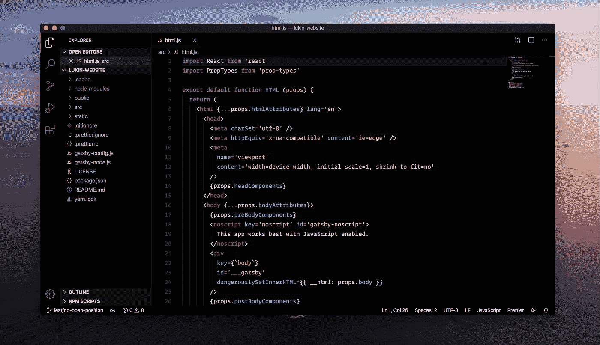

# 在这些主题中为 Visual Studio 代码编写漂亮的代码

> 原文：<https://levelup.gitconnected.com/code-pretty-in-these-themes-for-visual-studio-4162aa35aee1>

## 10 个令人敬畏的主题来优化你的编码体验

大多数开发人员花大量时间编写代码。这很好，因为这是大多数开发人员最喜欢做的事情。这意味着您还将在 Visual Studio 中花费相当长的时间。所以为什么不花点时间优化你的 Visual Studio，让它看起来漂亮一点呢？

选择一个既能让你的眼睛舒服又不会让你分心的主题真的能让你更专注。这是直接影响你工作效率的事情。最重要的是，当使用这些漂亮的主题之一时，您将获得更好的编码体验。

让我来帮你分享这 10 个符合你需求的好主题，你可以从今天开始使用。不要担心:每个人都有适合自己的东西！

# 1.塑料的

Plastic 是一个简单的语法和 UI 主题，主要着眼于 JavaScript。这是因为这个主题的创建者大部分时间都在用 JavaScript 编码。它的灵感来自 Atom 的一个黑暗主题，但更黑暗一点，根据主题的创作者，它更简单。

[下载此处](https://marketplace.visualstudio.com/items?itemName=will-stone.plastic)

# 2.黑夜

Palenight 主题带来了如此多的优雅。下载量超过 30 万，这绝对不仅仅是一个主题。这是一个被全世界开发者推荐的主题，因为它有着丰富的素材和优雅的风格。

[下载这里](https://marketplace.visualstudio.com/items?itemName=whizkydee.material-palenight-theme)

# 3.原子一号

这可能是 Visual Studio 最受欢迎的主题之一。超过 110 万次安装，这是许多开发者选择的主题。

这个主题中使用的配色方案非常微妙，由于配色方案的变化，很容易区分所有不同的元素。

[下载这里](https://marketplace.visualstudio.com/items?itemName=akamud.vscode-theme-onedark)

# 4.紫色的阴影

紫色的阴影是一个更具表现力的主题。这个主题，因为紫色是主色调，所以它的名字很重要。这个主题是用几种紫色和一些对比色构建的，以使事物流行起来。

[在这里下载](https://marketplace.visualstudio.com/items?itemName=ahmadawais.shades-of-purple)

# 5.诺德

Nord 主题将自己描述为北极、浅蓝色、干净优雅的 Visual Studio 代码主题。这是对这个冰冷却优雅的主题的准确描述。凭借近 25 万次的安装，这个主题绝对值得进入前 10 名。

[下载此处](https://marketplace.visualstudio.com/items?itemName=arcticicestudio.nord-visual-studio-code)

# 6.夜盲症

Noctis 是一个明暗主题的集合，具有温暖和寒冷的中等对比色的良好平衡的混合。这绝对是这个列表中的主题之一，因为它的暖色而脱颖而出。

这个主题的设计是为了让眼睛看起来舒服，并且给所有的颜色赋予语义。

[下载这里](https://marketplace.visualstudio.com/items?itemName=liviuschera.noctis)

# 7.德古拉官方

一想到德古拉，脑海里浮现的大概就是一些阴暗的东西。这正是这个主题。这绝对是这个列表中名字最大胆的主题。

超过 110 万次安装，这绝对是开发者们喜爱的主题——而且理由充分。

[下载这里](https://marketplace.visualstudio.com/items?itemName=dracula-theme.theme-dracula)

# 8.熊猫

熊猫是一个超级简约和黑暗的语法主题。我个人很喜欢这个主题的配色。这个主题已经存在很多年了，已经安装了大约 22.5 万次。

[在这里下载](https://marketplace.visualstudio.com/items?itemName=tinkertrain.theme-panda)

# 9.材料主题

材料主题是这个列表中的大人物。它拥有超过 200 万的安装量，是 Visual Studio 市场上安装量第二大的主题。我不认为这个主题对大多数开发者来说需要任何进一步的介绍。

[在此下载](https://marketplace.visualstudio.com/items?itemName=Equinusocio.vsc-material-theme)

# 10.VS 代码的 Lukin 主题

卢金主题是新闻中最热门的，因此也是最不受欢迎的主题。它是在三月底发布的，这也是为什么它的下载量没有大多数主题多的原因。然而，这个主题以其极简和超暗的外观看起来非常好。

[在此下载](https://marketplace.visualstudio.com/items?itemName=lukinco.lukin-vscode-theme)

# 包装东西

我希望你至少找到了一个引起你注意并符合你需求的主题。如果你发现这些主题之一改善了你的编码体验，请告诉我。

很高兴知道你可以很容易地调整这些主题。比如说，如果你不喜欢某个主题中的某个特定颜色，但其他颜色都很好，你可以很容易地把这个颜色换成你更喜欢的颜色。

感谢阅读！