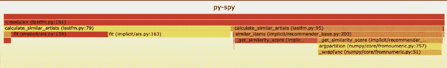

# Python 代码分析器:优化代码的瓶颈

> 原文：<https://levelup.gitconnected.com/code-profilers-how-to-save-time-and-your-sanity-3ee5bb0787cb>

## 如何节省时间和你的理智


马库斯·斯皮斯克在 [Unsplash](https://unsplash.com?utm_source=medium&utm_medium=referral) 上的照片

我看着屏幕，猛地呼出一口气，不知道该把精力放在哪里。我浏览了一遍代码行，摇着头想知道哪部分代码会导致程序变慢。许多数据开发人员在解决这些障碍或瓶颈时不知道去哪里。在本文中，我想展示 python 分析器并展示优化代码的实现。

# 目录

1.  [什么是代码分析器？](#db6d)
2.  如果我不是工程师，我应该在意吗？
3.  [对于 Python 开发者来说，最好的免费代码剖析器有哪些？](#7407)
4.  [如何使用代码分析器发现应用程序中的问题区域](#a705)
5.  [我可以在我的 jupyter 笔记本中实现 profilers 吗？](#ea9b)

# 什么是代码分析器？

代码概要分析对于开发人员来说是一个非常有价值的工具，有助于识别和修复代码中的性能问题。它可以用来确定代码的哪些部分占用了最多的时间，或者哪些部分占用了过多的内存。

# **我不是工程师应该在意吗？**

是的，你应该。代码分析器对于数据科学项目来说是必不可少的，因为它们可以帮助您了解代码的每个部分执行需要多少时间。这有助于理解瓶颈，并对代码进行优化，从而缩短执行时间。

我们拥有的数据越多，我们的代码就需要越高效。数据是一种有价值的资源，为了能够有效地利用它，我们需要确保代码不仅能处理数据，还能发挥其潜力。

# Python 开发者最好的免费代码剖析器有哪些？

**时间**

时间模块包括 perf 计数器函数，它从操作系统的高分辨率计时器中获取任意时间戳。

**Timeit**

timeit.timeit 模块旨在测量 Python 代码片段的运行时性能。它通过多次运行代码片段来实现这一点，然后获得所有这些迭代的总运行时间。这可以用来测量一个特定的操作或函数调用在一个紧循环中的执行情况，但更常用于比较做同样事情的不同方法的性能。

**cProfile**

cProfile 模块可用于跟踪运行代码时每个单独步骤所用的时间，并提供整个代码总运行时间的最终汇总。它还可以用来查看某些函数被调用的次数，让您发现哪些函数降低了应用程序的速度。

**间谍间谍**

py-spy 是一个用于 Python 程序的开源采样分析器。Py-spy 有助于在不中断程序或以任何方式修改代码的情况下可视化程序的大部分时间。

# 如何使用代码分析器找到应用程序中有问题的地方

让我们从简单的开始，然后我们可以进入更多的细节。

我将以 timeit 和 time 为例开始。

```
python -m timeit [-n N] [-r N] [-s S] [-t] [-c] [-h] [code statement ...]
```

命令行参数:

*   -n N:希望代码执行的次数。
*   -r N:希望 timeit()函数重复的次数
*   -s S:这将具有在代码执行之前执行的设置细节。
*   为此，你可以利用 time.time()
*   为此，您可以使用 time.clock()
*   -h:求助

```
C:\pythontest>python -m timeit -s 'text="hello world"'
20000000 loops, best of 5: 13.1 nsec per loop
```

我们真的不知道太多细节，只知道运行它所花的时间。

接下来，我们将查看 cProfile。

```
import hashlib
import cProfile
cProfile.run("hashlib.md5('abcdefghijkl'.encode()).digest()")
```

结果呢？

```
6 function calls in 0.000 seconds
Ordered by: standard name
ncalls  tottime  percall  cumtime  percall filename:lineno(function)
1    0.000    0.000    0.000    0.000 <string>:1(<module>)
1    0.000    0.000    0.000    0.000 {built-in method _hashlib.openssl_md5}
1    0.000    0.000    0.000    0.000 {built-in method builtins.exec}
1    0.000    0.000    0.000    0.000 {method 'digest' of '_hashlib.HASH' objects}
1    0.000    0.000    0.000    0.000 {method 'disable' of '_lsprof.Profiler' objects}
1    0.000    0.000    0.000    0.000 {method 'encode' of 'str' objects}
```

*   **ncalls** 是打电话的次数。
*   **tottime** 是在给定函数中花费的总时间。
*   **percall** 指总时间除以 ncalls 的商
*   **累计时间**是在该功能和所有子功能中花费的累计时间。甚至对递归函数也很准确！
*   第二个 **percall 列**是累计时间除以原始调用的商
*   **filename:line no(function)**提供各功能的数据

当您在 [programiz](https://www.programiz.com/python-programming/online-compiler/) 上运行该示例时，您可以得到相同的结果。

我知道这不太好，但是让我们一行一行地努力吧。

首先，字符串被编码。结果的最后一行表明了这一点。任何带有 _hashlib 的东西都是 hashlib 库的一部分。最后，任何带有“Profiler”的东西都是 cProfile 的一部分。

最后，我想看看 py-spy。py-spy 很好，因为用户可以可视化他们的结果，并自动找出与其他文件和函数相比哪个文件和函数占用的时间最多。



来自 github 的 py-spy 的图片

幸运的是，这个特殊的程序在执行时是平等的。然而，如果有一个区域比其他区域大得多，那将是你需要关注的区域。

# **我可以在我的 jupyter 笔记本中实现 profilers 吗？**

是的，你可以！在 jupyter 笔记本中实现这些分析器实际上只有两个步骤。

首先，您需要将库加载到一个单元格中，例如，

```
%load_ext line_profiler
```

其次，您可以按如下方式使用它:

*   `%time`:计时单个语句的执行时间
*   `%timeit`:定时重复执行一条语句，以提高准确性
*   `%prun`:用概要分析器运行代码
*   `%lprun`:用逐行分析器运行代码
*   `%memit`:测量单个语句的内存使用情况
*   `%mprun`:使用逐行内存分析器运行代码

[*Python 数据科学手册*](http://shop.oreilly.com/product/0636920034919.do) 中的 Jake VanderPlas 有一个很棒的笔记本，你可以自己浏览并执行。这是[笔记本](https://colab.research.google.com/github/jakevdp/PythonDataScienceHandbook/blob/master/notebooks/01.07-Timing-and-Profiling.ipynb#scrollTo=FIl4Dr46XRVK)。⁴

代码剖析是一个非常有价值的工具，但在数据领域却没有得到充分利用。

```
References1\. [https://www.machinelearningplus.com/python/cprofile-how-to-profile-your-python-code/](https://www.machinelearningplus.com/python/cprofile-how-to-profile-your-python-code/)
2\. [https://github.com/benfred/py-spy](https://github.com/benfred/py-spy)
3\. [https://www.blog.pythonlibrary.org/2014/03/20/python-102-how-to-profile-your-code/](https://www.blog.pythonlibrary.org/2014/03/20/python-102-how-to-profile-your-code/)
4.[https://colab.research.google.com/github/jakevdp/PythonDataScienceHandbook/blob/master/notebooks/01.07-Timing-and-Profiling.ipynb#scrollTo=FIl4Dr46XRVK](https://colab.research.google.com/github/jakevdp/PythonDataScienceHandbook/blob/master/notebooks/01.07-Timing-and-Profiling.ipynb#scrollTo=FIl4Dr46XRVK)
```