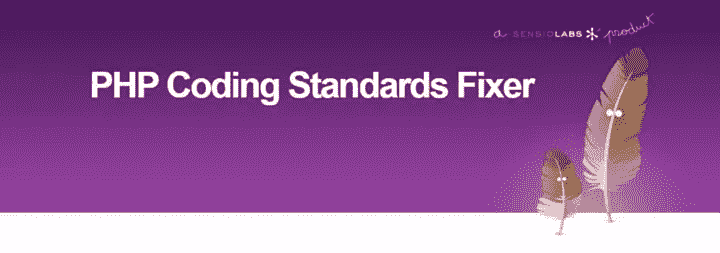
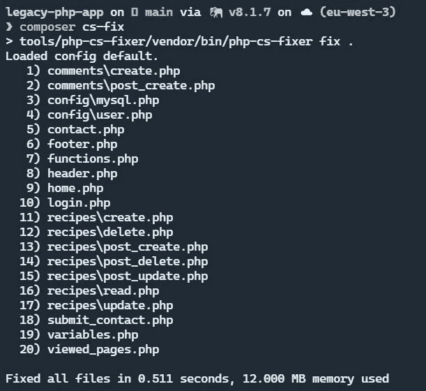
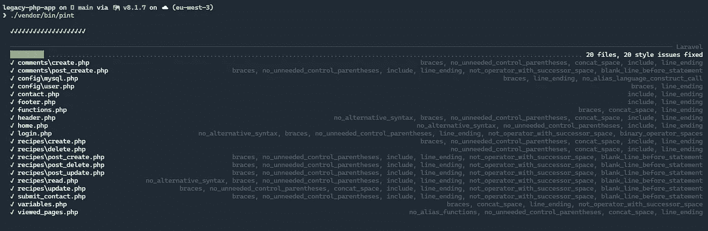
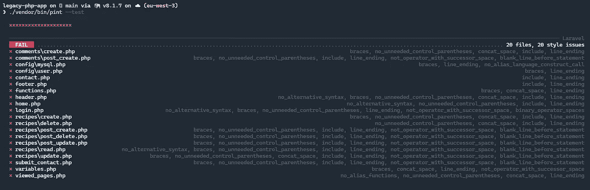

# 如何用 Symfony PHP-CS-Fixer 和 Laravel Pint 格式化代码

> 原文：<https://levelup.gitconnected.com/code-quality-right-with-symfony-php-cs-fixer-and-laravel-pint-1e4c6a79a1be>

## 并自动修复 PHP 编码标准问题！

在我之前的职业生涯中，我是 PrestaShop 和 Symfony 开源项目的积极贡献者。当人们校对我的稿件时，没有什么比看到时间浪费在无用的评论上更让我恼火的了，比如:

"*请在文件*的末尾添加一个空行，"或

"*你必须回到右括号*后的那一行."

> 特别献给某个 Pierre，他浪费了我这么多可用的大脑时间来辩论这个*🤡*

最令人沮丧的是看到代码校对者在讨论贡献的兴趣之前**做出这样的评论:**

*   这个功能有帮助吗？
*   这个“错误修复”产生的问题比它修复的少吗？等等。


照片由[米米·蒂安](https://unsplash.com/@mimithian?utm_source=medium&utm_medium=referral)在 [Unsplash](https://unsplash.com?utm_source=medium&utm_medium=referral) 上拍摄

## 但是我们为什么要有代码标准呢？

在一个项目的团队中工作是很常见的；在现实世界中，我们花在阅读和理解代码上的时间和生产代码的时间一样多。

如果每个人都按照自己的意愿编码，那么阅读和理解项目就更有挑战性了。

如果有人接手项目，那就白费劲了！

然后 PSR 标准出现了。也就是说，PHP 生态系统中最杰出的参与者同意了一组建议。

开始时，它相当美观，并且是所有项目的共同需求，比如加载 PHP 类或日志。

> 当这个小组开始尝试在更大的框架上强加通用的高级设计规则时，许多人离开了这个项目，但这将是未来更“巨魔”风格文章的主题*😜*

> 长话短说，你必须尊重标准。

建议 [PSR-1](https://www.php-fig.org/psr/psr-1/) 和 [PSR-12](https://www.php-fig.org/psr/psr-12/) 记录了如何编写你的 PHP 代码，所谓的“基本编码标准”和“扩展编码风格”

**在 Python 生态系统中，这些被称为**[**PEPS**](https://peps.python.org/)**，我想象大部分编程语言都有类似的规则。**

下面是一些 PHP 推荐(PSR-1)的具体例子:

*   必须使用 StudlyCaps 表示法声明类名；
*   必须使用 camelCase 表示法命名方法；

**我懒得学这个，再加上我的代码管用🤔**

我明白了！你并没有决定成为一名用代码进行设计的开发人员。

这就是为什么一群工具迅速出现来重新格式化代码以遵循标准。其中，我建议你使用 [**PHP-CS-Fixer**](https://cs.symfony.com/) 。

# PHP-CS-Fixer 自动遵循编码标准



演职员表:[https://cs.symfony.com/](https://cs.symfony.com/)

它是由 Symfony PHP 框架的创建者(法比安·✨)用 PHP 开发的软件，可以用 Composer 安装。

您将自己定位在 PHP 项目的根目录，并安装 PHP-CS-Fixer *作为开发依赖*。

这里建议根据文档将其安装在单独的文件夹中:

您必须将它安装在项目的 tools/php-cs-fixer 文件夹中

> 另一个有效的替代方法是安装 [shim](https://github.com/PHP-CS-Fixer/shim) 作为一个独立的 php-cs-fixer。

那么，你有两个选择:

*   要求工具执行实际的错误纠正；
*   或者显示它想要进行的修正而不执行它们；

两种情况下的执行指令是相同的:“fix”命令！

在修复命令中，点(“.”)指的是当前文件夹:您可以为 PHPStan 决定哪些文件夹应该遵循标准。

> 理论上，**所有文件夹**都应该适用。

**我运行这个命令时会出错🥺**

请不要惊慌，我的朋友！

我将与您分享我的懒惰的提示，因为我不记得这种冗长的命令:在您项目的 Composer 配置文件中编写一个定制命令。

> 请注意，我们谈论的是项目根目录下的文件 **composer.json** 而不是文件夹【工具/php-cs-fixer *中的文件**🔴***

仔细看看更新前后 Composer 配置文件的内容:

要在您的项目中运行 PHP-CS-Fixer，您必须直接使用 Composer:

```
composer cs-fix
```

查看我的 [PHP 遗留项目](https://github.com/mickaelandrieu/legacy-php-app)的输出:



你再也不用担心“编码标准”了😉

这就是 PHP-CS-Fixer 的小演示！

# Laravel 品脱是 PHP-CS-Fixer 对类固醇

如果你是 Laravel 的开发者，你可能听说过 Pint，因为 Laravel 9.0 和更高版本从 Laravel 9.0 开始默认安装它。

Pint 是建立在 PHP-CS-Fixer 之上的，它使确保您的代码风格保持干净和一致变得简单。

> 默认情况下，Pint 不需要任何配置，并会通过遵循 Laravel 的**固执己见的编码风格来修复您代码中的代码风格问题。**

## 安装 Laravel Pint 并开始修复您的代码

您通过 Composer 安装 Laravel Pint:

您可以通过调用项目的 **vendor/bin** 目录中的`pint`二进制文件来指示 Pint 修复代码风格问题:

> 作为 PHP-CS-Fixer，默认情况下会忽略**供应商**文件夹

查看我的 PHP 遗留项目的输出:



*   UI 比 PHP-CS-Fixer 更漂亮，对 Pint 更有帮助；
*   你不需要记住任何复杂的命令；

如果您希望看到 Pint 完成的修复，而不将它们应用到您的文件中，您必须使用参数" **test** "来完成您的指令:

对于以下输出:



## 如何为 Symfony 项目配置 Laravel Pint

如果你想在 Symfony 项目上使用 Pint 或者配置应用于你的项目的规则列表，该怎么办？

您可以在项目的根目录下创建一个名为 **pint.json** 的文件，内容如下:

Pint 目前支持的预置有:`laravel`、`psr12`和`symfony`。

> 现在是时候在你的 PHP 项目上安装你最喜欢的工具，彻底解决代码风格的问题了 *✅*

如果你喜欢这篇文章，[关注我](https://medium.com/@mickael-andrieu/)，我会在以后的文章发布时通知你！

[](https://medium.com/@mickael-andrieu/membership) [## 通过我的推荐链接加入 Medium-mickal Andrieu

### 作为一个媒体会员，你的会员费的一部分会给你阅读的作家，你可以完全接触到每一个故事…

medium.com](https://medium.com/@mickael-andrieu/membership)