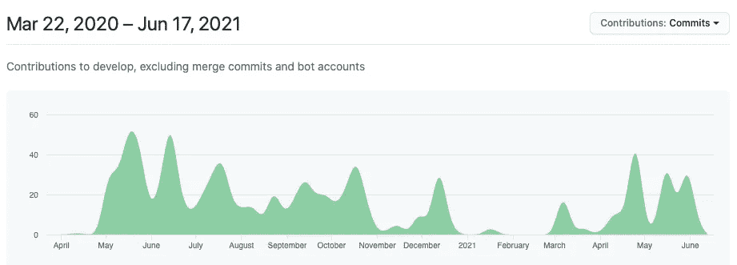
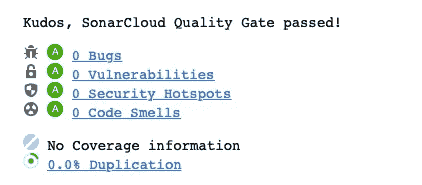
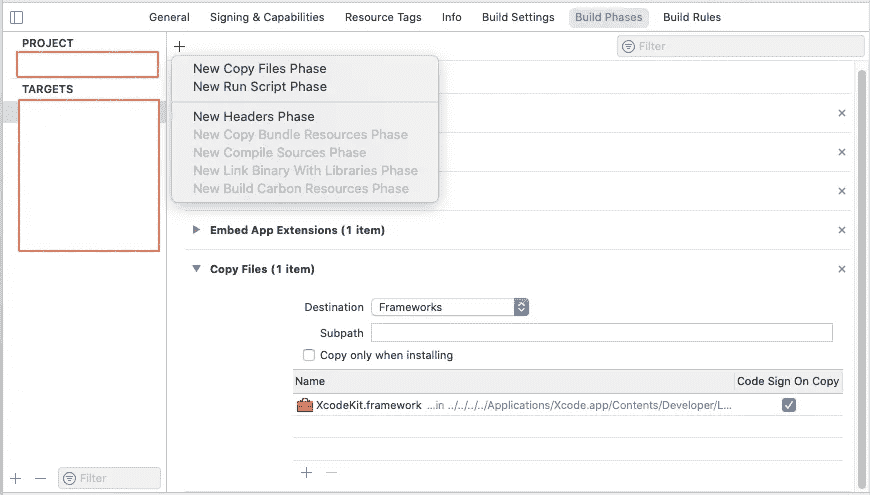

# 代码质量和 Swift 风格

> 原文：<https://levelup.gitconnected.com/code-quality-swift-style-3d8db194297f>

## 你如何衡量代码质量


塞巴斯蒂安·马克在 [Unsplash](https://unsplash.com/s/photos/matrix?utm_source=unsplash&utm_medium=referral&utm_content=creditCopyText) 上的照片

在当今的行业中，衡量程序员编写的代码的质量从未像现在这样重要。当我们在任何事物中构建智能时，我们需要确保我们开发的代码对那些跟随我们的人有意义。

但是你如何衡量像代码质量这样邪恶的东西呢？如何判断一段代码优于另一段代码？在这篇文章中，我想谈谈业界目前使用的一些指标，并看看您可以在自己的项目中实现的一些解决方案。您需要在自己的代码上运行的度量标准，以给自己一个客观的遵循路线。和工具来帮助代码遵循这些原则。

我们可以在这里查看许多指标。常见的有认知复杂性、循环矩阵复杂性和流失。

认知复杂性是对代码中嵌套控件和/或布尔逻辑的一种度量。圈矩阵复杂度是不同路径数量的度量。变动是项目中文件的更新速率。代码风格也是衡量一个项目管理和更新的重要标准。

[erica sadun](https://medium.com/u/38754f9f680a?source=post_page-----3d8db194297f--------------------------------) 在她的名为 [Swift Style](https://medium.com/pragmatic-programmers/table-of-contents-98b5d26fa1d7) 的实用程序员系列的第二版书中，将重点放在了这里提到的最后一点上。一本关于编码风格最佳实践的书。最重要的是，我认为这个特定指标最重要的方面是在你的团队中保持一致性。

# 验证 Swift 风格

让我们以一个开放源码的应用程序为例，它是我们许多人现在最关心的，它可以帮助追踪新冠肺炎病毒的接触者。为了让大家体验一下我和一个叫做 [SwiftLint](https://github.com/realm/SwiftLint) 的开源应用一起讨论的内容。你可以在这里找到的应用程序上的 [Vineet Choudhary](https://medium.com/u/a580dca0df7a?source=post_page-----3d8db194297f--------------------------------) 文章中读到所有相关信息。

[](https://medium.com/developerinsider/how-to-use-swiftlint-with-xcode-to-enforce-swift-style-and-conventions-368e49e910) [## 如何在 Xcode 中使用 SwiftLint 来强制执行 Swift 样式和约定？

### 最初发表在 DeveloperInsider 上:如何使用 SwiftLint 和 Xcode 来强制 Swift 风格和约定？

medium.com](https://medium.com/developerinsider/how-to-use-swiftlint-with-xcode-to-enforce-swift-style-and-conventions-368e49e910) 

它的数据库中有超过 200 条规则，人们认为这些规则是很好的编码实践。Erica 在她的书中也提到了良好的编码实践。我们都应该遵循的惯例。这里有一个描述每个规则[的数据库。默认情况下，它会检查其中的 84 条规则。让我们仔细看看我们的合同追踪应用程序。它做得怎么样。](https://realm.github.io/SwiftLint/rule-directory.html)

# 新冠肺炎联系人追踪应用程序

它标记了 1111 个问题，这听起来很多，但它的重要性在于理解这里的字里行间。在这些问题中，它将其中的 255 个归类为严重错误，这是 SwiftLint a 的开发人员必须解决的问题。让我们靠近一点看。它发现了什么问题。我将把结果分成两组。第一个严重错误[根据 SwiftLint]和第二个警告[显然，SwiftLint 规则]。

```
 error: File Line Length Violation
 error: Force Cast Violation
 error: Force Try Violation
 error: Function Body Length Violation
 error: Identifier Name Violation
 error: Line Length Violation
 error: Shorthand Operator Violation
 error: Type Body Length Violation
 error: Type Name Violation
```

有了这些警告。

```
 warning: Class Delegate Protocol Violation
 warning: Closure Parameter Position Violation
 warning: Cyclomatic Complexity Violation
 warning: Discarded Notification Center Observer Violation
 warning: Empty Enum Arguments Violation
 warning: File Line Length Violation
 warning: For Where Violation
 warning: Function Body Length Violation
 warning: Function Parameter Count Violation
 warning: Identifier Name Violation
 warning: Leading Whitespace Violation
 warning: Legacy Constructor Violation
 warning: Line Length Violation
 warning: Multiple Closures with Trailing Closure Violation
 warning: Nesting Violation
 warning: No Fallthrough Only Violation
 warning: Opening Brace Spacing Violation
 warning: Private over fileprivate Violation
 warning: Redundant Optional Initialization Violation
 warning: Switch and Case Statement Alignment Violation
 warning: Todo Violation
 warning: Trailing Comma Violation
 warning: Type Body Length Violation
 warning: Type Name Violation
 warning: Unused Optional Binding Violation
 warning: Unused Setter Value Violation
 warning: Weak Delegate Violation
```

毫无疑问，他们可以雇佣一个程序员来做除了修复这些标志之外的事情，尽管你可以开始意识到判断编码标准是一个挑战，就像设置要遵循的标准一样。正如我已经提到的，无论你选择/同意哪种风格，最重要的是保持一致。我们在这里还能做什么来检查代码库的质量。让我们拍一张谁在工作的快照。

有 14 名程序员开发了这个应用程序，据我所知，他们几乎都在同一家公司工作。我发现 18 个月内有 943 起犯罪。我在这个应用程序上提到的客户流失看起来不错，同样的人在过去的 18 个月里一直在持续工作。



一个人 Stefan Mitterrutzner 做了大部分的提交，对其中的 603 个负责。我认为他是这个项目的项目经理，所以说他对 SwiftLint 标记的大多数失礼行为负责可能是不公平的，但同样地，你可以说他是应该确保他们得到修复的人[对 Stefan 公平地说，我非常确定他们没有使用这个工具，他们使用的是 solarcloud，这是一个商业产品来做同样的事情。它最近的一份关于上述代码的报告这样写道..]



代码气味是程序源代码中可能表明更深层次问题的任何特征，所以基本上与我们的 SwiftLint 标记的是同一类东西。

但是等等，我还没有讲完这个故事，因为我想谈谈《实用程序员》书架上的另一本书，你可以在 medium.com 上找到。那本书是克里斯·阿达姆松的《T2 Xcode 宝藏》。特别是在该书中，他在第 12 章中概述了编辑器扩展。

其中有创建 Xcode 扩展的教程。一个扩展，您可以用它来构建自己的 lint 工具，使用自己的规则。当然，您也可以加入 SwiftLint 项目…但这更容易，而且您肯定可以在内部完成，不会遭到高级管理层的任何反对。

也就是说我不想复制他的章节，你可以通过 medium.com 得到这本书。尽管我还想补充几点。这个扩展有点像包装一样耗费我的钱。所以不要把它添加到当前的项目中，不要。你需要创建一个新的 MacOS 项目，在其中配置扩展，然后运行它。它将启动第二个 Xcode 会话，通过这个会话，您可以打开您的主项目并使用它运行扩展代码。

也就是说，我必须修复 dyld 错误消息才能完成这项工作。这个快照概述了我为此所做的更改。注意我已经选择了项目的目标来获得这个窗口。



扩展中的代码如下所示…

这是一个超级简单的例子，旨在给你一个你需要做什么的感觉。虽然我没有这样做，但是 formattingMasks 例程在这里是正则表达式识别和重新格式化代码的主要位置。它看到的字符串是运行扩展的文件中的代码行。

我以此结束这篇论文，它已经比我预期的要长了一点。去看看 SwiftLint 吧。也可以看看一些有用的预建扩展，也许可以用来管理您的项目。当然，你也应该看看实用的程序员书籍《Swift Style》和《Xcode Treasures 》,这两本书都是无价的参考书。

如果你觉得这篇文章有趣，请给我一两下掌声，并关注我了解更多关于 medium.com 的内容。

[](https://marklucking.medium.com) [## 马克·卢金-中号

### 在 SwiftUI Publishers 中使用 Just、Sequence、Record 和 Future 是 Combine 框架的生命线，并且…

marklucking.medium.com](https://marklucking.medium.com)