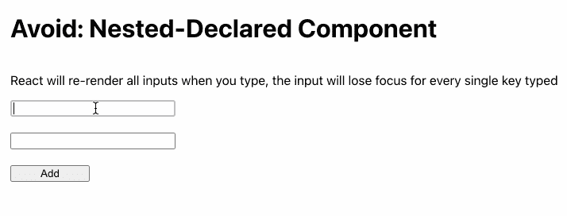
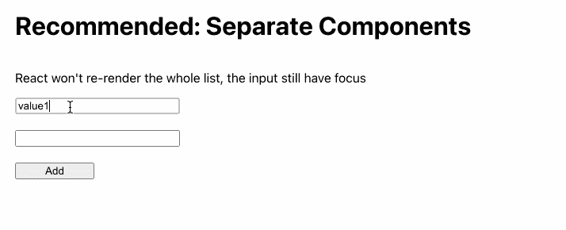

# 代码审查:避免在父组件中声明 React 组件

> 原文：<https://levelup.gitconnected.com/code-review-avoid-declaring-react-component-inside-parent-component-1768a645f523>


费伦茨·阿尔马西在 [Unsplash](https://unsplash.com/s/photos/react-js?utm_source=unsplash&utm_medium=referral&utm_content=creditCopyText) 上的照片

前几天，我的一个同事让我查看他的拉动式请求(PR)。PR 是关于实现文本输入的动态列表。该程序将允许用户通过“添加”按钮添加任意多的字段。

这家伙遇到了一个问题:当用户键入一个键时，输入会失去焦点。每当用户键入一个键时，ReactJs 似乎会重新呈现所有输入；因此，没有人关注。他尝试了许多解决方案，但没有一个奏效:

*   使用受控组件，将状态存储为字符串数组
*   使用受控组件，将状态存储为对象数组
*   使用非受控组件，通过 ref 访问输入值

我查了他的代码，发现一切都很好，除了一个重大的事情。代码看起来类似于下面的示例:

```
import { useState } from 'react';

const Form = () => {
  const [values, setValues] = useState(['', '']);

  const onChange = (value, index) => {
    const newValues = [...values];
    newValues[index] = value;
    setValues(newValues);
  };

  const Input = (props) => {
    return <input type='text' {...props} />;
  };

  return (
    <>
      {values.map((value, index) => (
        <Input
          key={index}
          value={value}
          onChange={(e) => onChange(e.target.value, index)}
        />
      ))}
      <button onClick={() => setValues([...values, ''])}>Add</button>
    </>
  );
};
```

问题是，他在父组件(表单)中声明了输入组件。每当表单重新呈现时，都会重新声明输入组件。虽然我们使用了相同的名称(事实上，它的名称只对人类有影响，对机器没有影响)，但第二次渲染的输入与前一次渲染的输入是不同的组件。这就是为什么所有的文本输入都要重新渲染。



为了解决这个问题，我们只需要将输入移出表单。

```
import { useState } from 'react';

const Input = (props) => {
  return <input type='text' {...props} />;
};

const SeparateComponent = () => {
  const [values, setValues] = useState(['', '']);

  const onChange = (value, index) => {
    const newValues = [...values];
    newValues[index] = value;
    setValues(newValues);
  };

  return (
    <>
      {values.map((value, index) => (
        <Input
          key={index}
          value={value}
          onChange={(e) => onChange(e.target.value, index)}
        />
      ))}
      <button onClick={() => setValues([...values, ''])}>Add</button>
    </>
  );
};
```



虽然我之前没有犯同样的错误，但我在代码审查中并没有真正反对它。在上面的部分之后，我在 React 的代码审查清单中添加了一个注释:**避免在另一个组件中声明一个组件**。

. . .

这篇文章是我关于代码评审的系列文章的一部分，它讲述了我在评审代码时的笔记。对某些人来说，它们中的每一个都可能很小或者没什么特别的。但是因为一个小小的错误会让开发人员付出很大的代价，所以其他人留意所有的可能性可能会有所帮助。

我已经把上面的例子放在了 Github 库中，以防有人想试用它们。

*原发布于*[*https://huynvk . dev*](https://huynvk.dev/blog/code-review-avoid-declaring-react-component-inside-parent-component)*。*

# 分级编码

感谢您成为我们社区的一员！[订阅我们的 YouTube 频道](https://www.youtube.com/channel/UC3v9kBR_ab4UHXXdknz8Fbg?sub_confirmation=1)或者加入 [**Skilled.dev 编码面试课程**](https://skilled.dev/) 。

[](https://skilled.dev) [## 编写面试问题+获得开发工作

### 掌握编码面试的过程

技术开发](https://skilled.dev)