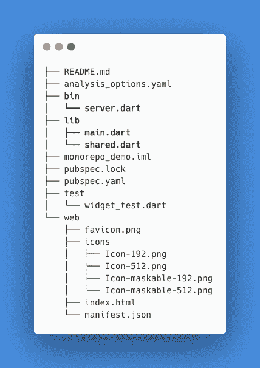
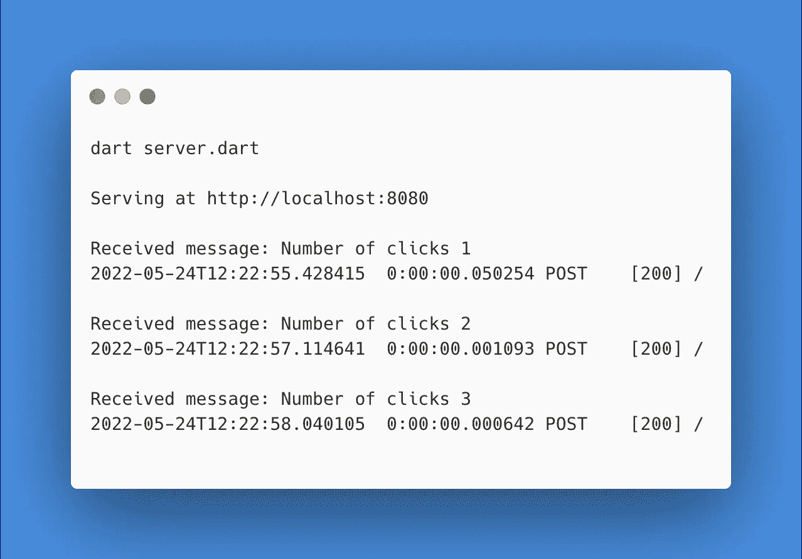

# 简单服务器-客户端数据在 Flutter 中的代码共享 monorepos

> 原文：<https://levelup.gitconnected.com/code-sharing-monorepos-in-flutter-for-simple-server-client-data-a2d79563b5e7>

如果你在网络上工作，毫无疑问你需要发送数据到服务器，并得到一些结果。当你这样做时，你的数据被强制转换成一个字符串(或原始字节)，不管你是使用了 [JSON](https://www.json.org/json-en.html) 、 [Messagepack](https://msgpack.org/index.html) ，还是一个定制的编码。

样板文件中最麻烦的部分之一是将数据转换成这个字符串的序列化代码:服务器和客户机使用不同的语言；你的后端人员选择的 JSON 库与 Javascript 的`JSON.stringify`有不同的特点；一个团队在编写他们的序列化程序时使用了 PascalCase，现在我们都被困在了这个端点上，因为更改它会破坏其他东西——您知道该如何操作。

Flutter 在几年前首次进入开发领域，拥有令人印象深刻的开发人员体验，可以创建在 Android 和 iOS 上运行良好的应用程序。我们现在处于 Flutter v3.0 版本，除了移动平台，还支持原生 Windows、MacOS、Linux 和 Web 输出，这使得它成为任何跨平台工作的人的强大选择。或者，就此而言，如果你只做一个。我已经使用 Flutter 构建了几个 Web 应用程序的前端，这些应用程序从未被设计成跨平台的——使用我所知道的东西比回到 HTML/CSS/JS/ `$FRAMEWORK_OF_THE_WEEK`的世界要简单得多。

虽然 Dart 越来越流行，但我很少看到它在服务器端的使用。Dart 可以像 Python 或 Java(或您选择的服务器语言)一样用于运行您的服务器堆栈。在我最近的个人项目中，我选择了这样做。每当我在代码的不同区域工作时，我都期待着不需要转换语言的好处。

由于我的前端和后端现在共享一种语言，我开始考虑共享代码。共享代码最明显的地方是服务器-客户端通信的编码。我可以用适当的 JSON 转换将消息编写为 Dart 类，客户机和服务器都使用这些方法进行通信。下一个挑战是如何共享代码——它应该是自己的包吗？应该是 git 子模块吧？因为只有我一个人在做这个，而不是一个大的团队，我希望它简单，并决定我将有一个单一的前端和后端代码库。

这证明工作得很好。Flutter 在构建时会优化掉你不使用的代码，所以你可以自由地为服务器端安装和编写你想要的代码，它不会让你的前端应用程序膨胀。共享的代码可以有效地共享。我也不会经常切换编辑器窗口来处理同一个应用程序的不同部分。

那么这看起来像什么？我首先创建了一个默认的 Flutter 应用程序，然后添加了服务器端。首先，pubspec.yaml 看起来会像这样:

我留了一个空行来分隔服务器和应用程序的依赖关系。shelf 是一个使服务器端代码更容易使用的包。http 将在前端用于进行调用。

Flutter/Dart 对你的文件夹结构的布局有很好的约定。可执行文件保存在`bin`中，而库代码保存在`lib`中。Flutter 略有不同，因为主 flutter 文件也放在`lib`中，因为该文件被编译成本地平台可执行文件。bin 中的可执行文件可以导入 lib 中的文件，但反之则不行。因此，为共享代码创建一个服务器可执行文件和一个文件给出了这个文件结构

在`shared.dart`中，我们将放入服务器和客户端都需要的代码。目前，它只是一条简单的消息，包含一些文本和一个数字。记住包括序列化和反序列化对象的方法:

从 flutter 发送这个很容易。我已经删除了大多数默认的脚手架，所以每次按下按钮时，都会有一条消息发送到服务器:

`jsonEncode`使用在类上定义的`toJson`方法。在服务器端，fromJson 用于解码它:

运行服务器和应用程序，我们看到每次按下按钮时，消息都在服务器端被接收和解码。

这消除了用两种语言编写样板编码/解码的需要。它消除了使用像 [Protobuf](https://developers.google.com/protocol-buffers) 这样的系统从消息文件中生成代码的需要。总的来说，这似乎是一种更快捷的工作方式。

还有一个好处是，共享类型不必是简单的数据对象。它们可以附加方法，服务器和客户端都可以调用这些方法——允许系统更好地重用代码，比如需要在服务器和客户端上运行的验证。