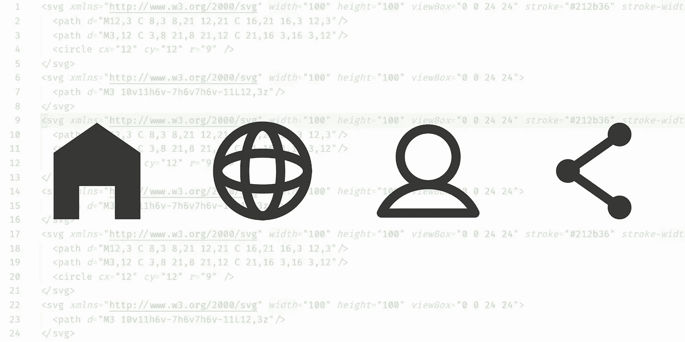
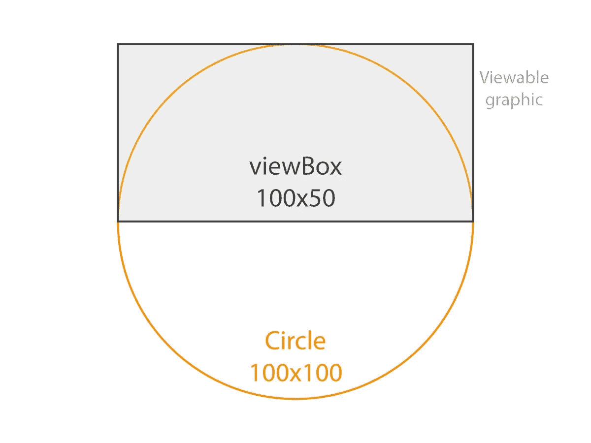
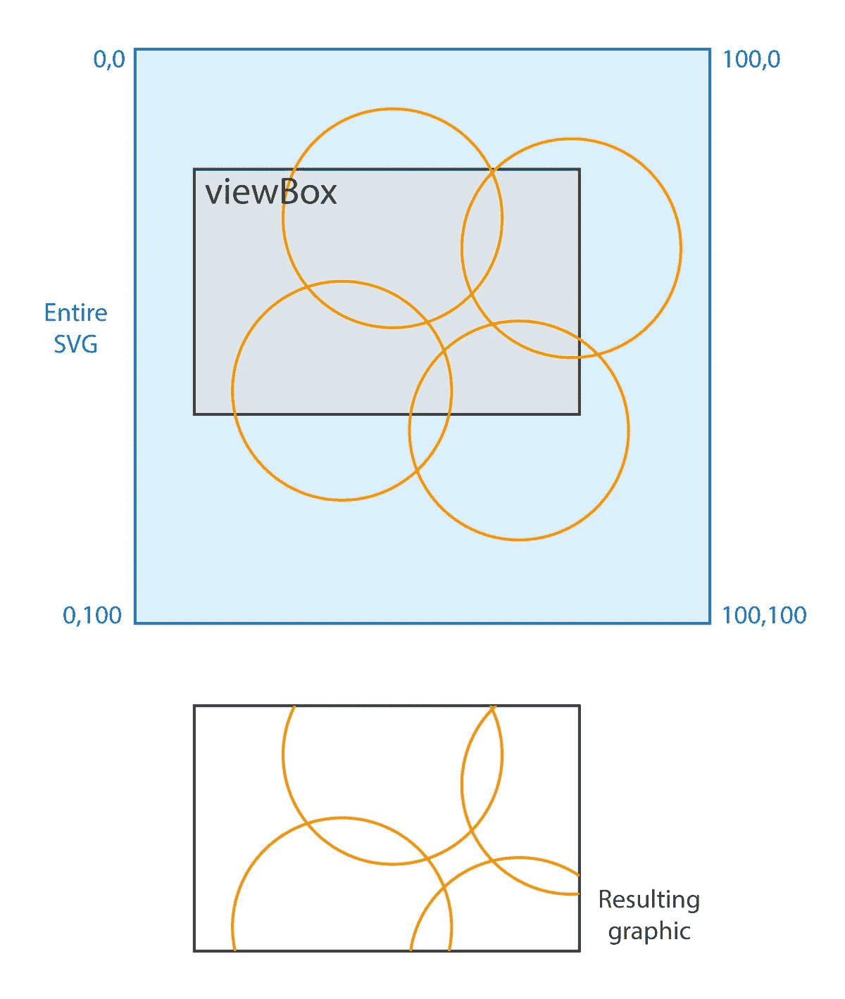
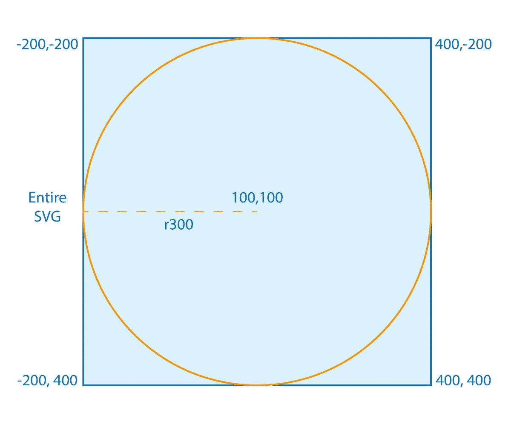
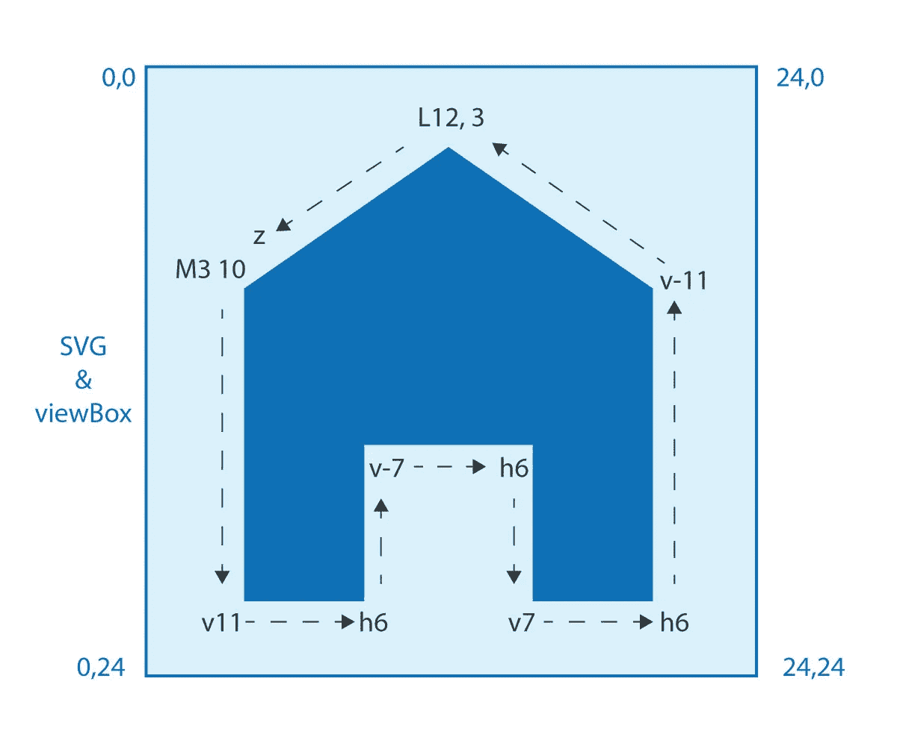
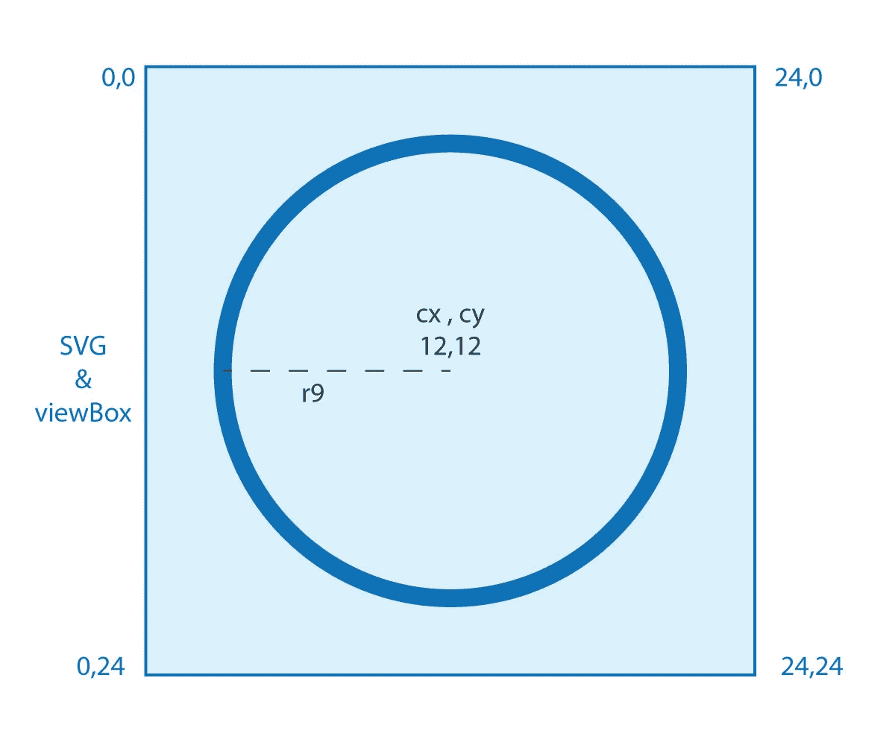
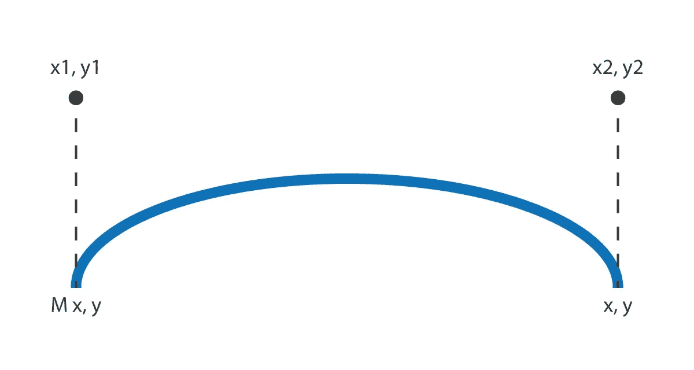
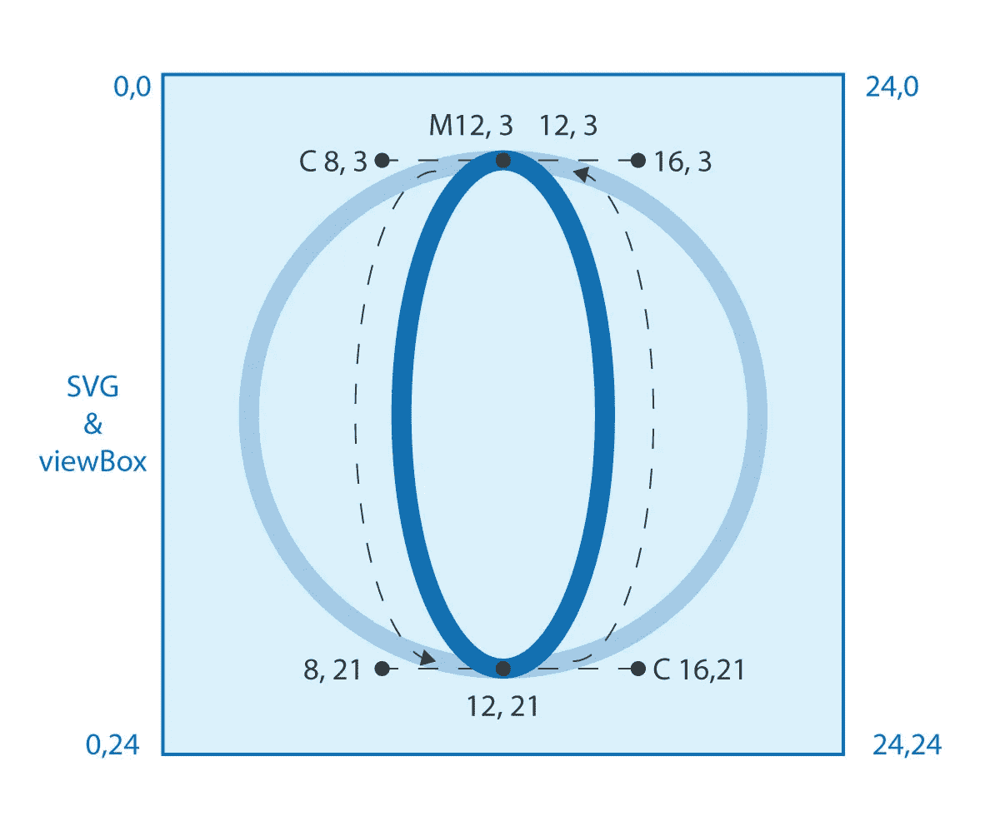
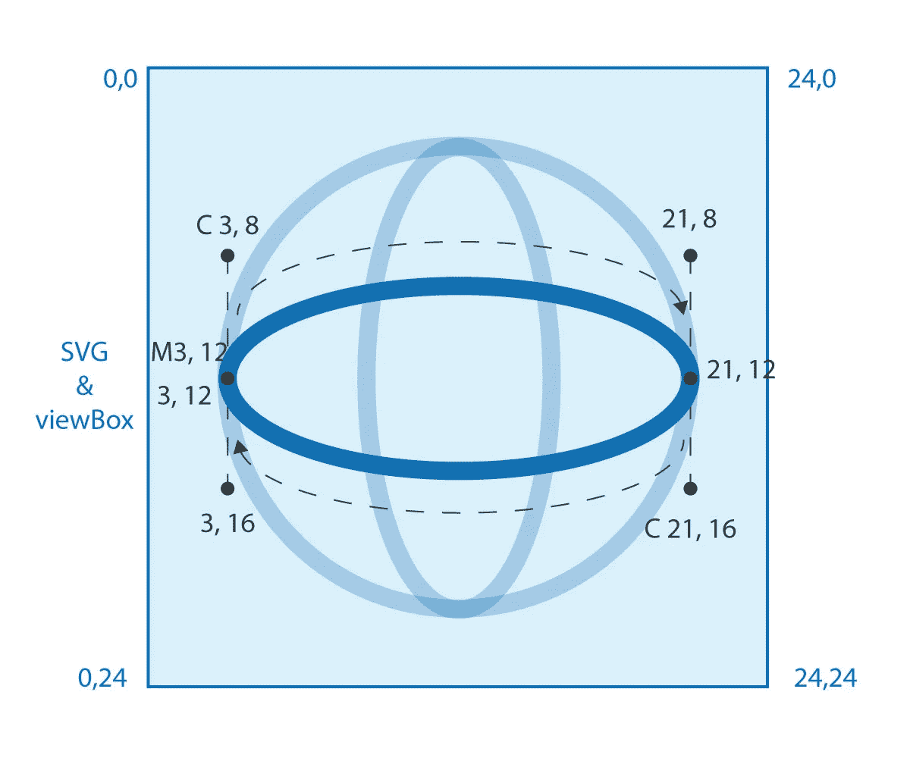

# 代码简单的 SVG 图标(主页、全球、个人资料、共享)

> 原文：<https://levelup.gitconnected.com/code-simple-svg-icons-home-globe-profile-share-8c337f3d8332>

> 什么…没有矢量编辑器？



作为一名开发人员，我经常遇到需要图标的情况。是的，有像 Glypicons 和 Fontawesome 这样的好库可以帮忙。但是，如果你只需要一个或两个，这感觉就像是多余的。一段简单的 SVG 代码就可以做到这一点。

SVG 看起来令人望而生畏，尤其是当您看到从矢量编辑器导出的代码时。但是，他们不必如此。下面的文章演示了如何创建一些简单的 SVG 图标。这绝不是对 SVG 的全面介绍。但是，它应该为编写简单的图标提供一个很好的起点。剩下的你可以边走边拿。

# 内容

1.  **语法**
2.  **可视框**
3.  **图标**
4.  **注意事项**

# 1.语法

先说基本布局。SVG 类似于 HTML 元素，它们不是定义 DOM 布局，而是定义路径和形状。

为我们的 SVG 定义的每一组指令都位于`<svg></svg>`标签中。在这个元素上，我们可以添加一些基本参数来帮助设置 SVG。

```
<svg width="100px" height="100px" viewBox="0 0 100 100"></svg>
```

`width/height` —不言自明，SVG 元素的总宽度和高度。这些可用于缩放向量以适应特定的维度。

`viewBox`——这让你更难理解，但它仅仅代表了 SVG 画布的可视区域(什么？！—一切都将得到解释)

# 2.视图框

viewBox 属性表示图形的可视区域。例如，假设我们有一个圆，但我们只想显示它的一半，我们可以在 SVG 中创建一个完整的圆，并将视图框设置为穿过该圆。



视图框裁剪 SVG。值得注意的是，SVG 向量的实际大小可以是您想要的任何值。然后`height`和`width`属性将矢量缩放到你需要的大小。

当您将 SVG 看作画布时，视图框更有意义。通俗地说，viewBox 就是你选择框住的画布的一部分。如果我们添加坐标的概念，并假设 SVG 画布是 100x100px。左上角是`0, 0`，右上角是`100, 0`，右下角是`100, 100`，最后，左下角是`100, 0`。然后我们可以结合坐标，视图框和形状来构建我们的图标。



“画布”本身不是具体的，我们选择用于形状的坐标创建了“画布”。建议你试着在脑海中描绘它，并以此为基础画出你的形状。如果我们创建一个圆心在坐标`100, 100`上，半径为`r300`的圆，那么最终的画布将从`-200, -200`延伸到`400, 400`。



如果你不习惯坐标/图表，一开始很难理解。但是，相信我，从长远来看这会让事情变得容易些。

# 3.核标准情报中心

让我们通过例子来构建。只要对形状和坐标有基本的了解，每个图标都很容易制作。这些都被设计成简单的图标，所以设置为 24x24 像素。要增加尺寸，您可以更改宽度和高度。

用于创建每个形状的属性与每个形状一起列出。

## 主页

```
<svg width="24" height="24" viewBox="0 0 24 24">
  <path d="M3 10v11h6v-7h6v7h6v-11L12,3z"/>
</svg>
```

为了创建一个简单的家的符号，我们可以使用`<path>`元素。这个元素的主要属性是`d=””`属性。这设置了形状的每个点的坐标。您可以使用一系列不同的值来创建更复杂的路径。所有类型的属性都是[这里是](https://developer.mozilla.org/en-US/docs/Web/SVG/Tutorial/Paths)。

此形状中的键盘命令:

*   **M** —将光标移动到 SVG 中的一个点
*   **v** —画一条垂直线(正数向下，负数向上)
*   **h** —画一条水平线(正数向右，负数向左)
*   **L** —从当前位置到指定坐标画一条直线
*   **z** —从当前点到起点画一条线，有效地闭合形状

让我们用一张图片分解回家的路径:

```
<path d="M3 10v11h6v-7h6v7h6v-11L12,3z"/>
```



简单主页图标 SVG 的坐标地图

从 M3 10 号开始，然后沿着它走。这就是我们如何建造房子的形状。如果你能理解的话，这很简单。

下面是一些我们可以添加到 path 元素来改变其设计的属性(更多细节可以在[这里](https://developer.mozilla.org/en-US/docs/Web/SVG/Tutorial/Fills_and_Strokes)找到):

*   **笔画** —线条的颜色
*   **笔画宽度** —线条的像素宽度如 2
*   **线条帽** —闭合线的帽，如圆形
*   **线条连接**——连接线条的交叉点，如圆形
*   **填充** —填充颜色

## 地球

```
<svg
  width="24"
  height="24"
  viewBox="0 0 24 24"
  stroke="#212b36"
  stroke-width="2"
  stroke-linecap="round"
  stroke-linejoin="round"
  fill="none"
>
  <circle cx="12" cy="12" r="9" />
  <path d="M12,3 C 8,3 8,21 12,21 C 16,21 16,3 12,3"/>
  <path d="M3,12 C 3,8 21,8 21,12 C 21,16 3,16 3,12"/>
</svg>
```

这有点复杂，让我们来分解一下。

*   全局属性已经应用于`<svg>`元素，以设置所有子元素的属性
*   因为我们想要轮廓，我们已经设置了笔画属性，并设置填充为无
*   我们有 3 个元素来创建这个形状(外圆和 2 个椭圆来创建网格)

类似于主页图标，我们使用`<path>`并引入了`<circle>`元素。

先从圈子说起。关键属性:

*   **CX**—x 轴上的圆心
*   **cy**—y 轴上的圆心
*   **r** —圆的半径

我们将逐元素构建形状。

```
<circle cx="12" cy="12" r="9" />
```



第一部分是不言自明的。设置中心点并选择半径。接下来是垂直椭圆。

此形状中的键盘命令:

*   **M** —将光标移动到 SVG 中的一个点
*   **C** —三次曲线，更多详情请点击阅读[文档](https://developer.mozilla.org/en-US/docs/Web/SVG/Tutorial/Paths)

**C-曲线:**以`C x1,y1 x2,y2 x,y`的形式取 3 个坐标。曲线从光标的上一点开始。然后`x,y`是曲线的终点，以`x1,y1 x2,y2`作为控制点。如果你没有使用贝塞尔曲线或样条的经验，想象这些点在那一点上作为一个拉直线的力。这在本质上扭曲了这些点的线。查看效果的最佳方式是尝试不同的值并查看结果。下图中的`M x, y`代表起点，其他点与`C`属性相关。



回到我们的地球。

```
<path d="M12,3 C 8,3 8,21 12,21 C 16,21 16,3 12,3"/>
```



从顶部的`M12,3`开始，然后向左绕过每个点。这比简单的直线路径要复杂一点，但是当你理解它的时候并不太难。

地球的最后一部分。

```
<path d="M3,12 C 3,8 21,8 21,12 C 21,16 3,16 3,12"/>
```



这次从`M3,12`开始，然后围绕每个点顺时针移动。仅此而已。如果我们把图标分解成简单的形状，我们可以创造很多。

现在我们已经掌握了一些简单形状的窍门，下面是更多的例子和更少的说明。

## 轮廓

```
<svg 
  width="24" 
  height="24" 
  viewBox="0 0 24 24" 
  stroke="#212b36" 
  stroke-width="2" 
  stroke-linecap="round" 
  stroke-linejoin="round" 
  fill="none"
>
  <circle cx="12" cy="8" r="5" />
  <path d="M3,21 h18 C 21,12 3,12 3,21"/>
</svg>
```

这使用了与 globe SVG 相似的函数。头部为圆形，底部为水平线，肩部为贝塞尔曲线。

## 分享

```
<svg width="24" height="24" viewBox="0 0 24 24">
  <path 
    d="M18,6 L6,12 L18,18" 
    stroke="#212b36" 
    stroke-width="2" 
    stroke-linecap="round" 
    stroke-linejoin="round" 
    fill="none"
  />
  <circle cx="18" cy="6" r="3" fill="#212b36"/>
  <circle cx="6" cy="12" r="3" fill="#212b36"/>
  <circle cx="18" cy="18" r="3" fill="#212b36"/>
</svg>
```

这次使用 3 个圆和 1 条路径。这一次请注意我们是如何将 stroke 和 fill 属性直接应用于元素的，因为我们不需要全局值。

# 笔记

一些需要考虑的事情。

1.  在 gists 上你可能会注意到*xmlns = "*[](http://www.w3.org/2000/svg)**"*这告诉浏览器和其他查看器 SVG 应该遵循什么格式/标准。在 html 中你不需要它，但在其他情况下可能需要。*
2.  *要使 SVG 变大或变小，只需改变宽度和高度属性。但是请注意，元素不会改变它们的纵横比，画布将围绕 SVG 变形。你需要利用这些属性来理解我的意思。*

*感谢阅读，我希望这对你的项目有所帮助。*

*我将会写关于开发的各种主题，集中在我开发的解决方案上，这些解决方案是我找不到具体的教程，或者我觉得有用的。如果你喜欢这篇文章，请鼓掌/分享/评论。*