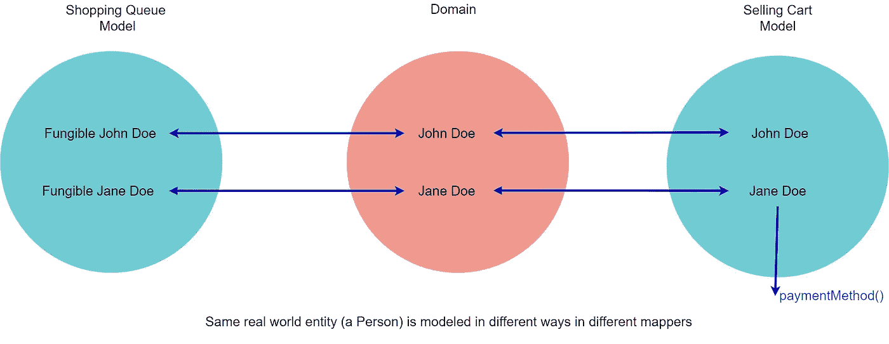

# 代码气味 144 —可替换对象

> 原文：<https://levelup.gitconnected.com/code-smell-144-fungible-objects-c5b014137f73>

## 我们已经听说了很多关于 NFT 的事情。现在我们掌握了可替换的概念


> *TL；尊敬的* [*博士*](https://medium.com/@mcsee/what-is-software-9a78c1172cf9) *。使现实世界中可替代的东西成为可替代的，反之亦然。*

# 问题

*   [双射](https://codeburst.io/the-one-and-only-software-design-principle-5328420712af)故障
*   过度设计

# 解决方法

1.  识别域中可替换的元素
2.  将它们建模为可互换的

# 语境

根据[维基百科](https://en.wikipedia.org/wiki/Fungibility)

> *可替代性是一种商品或商品的属性，其单个单元实质上是可互换的，并且其每个部分与另一个部分无法区分。*

在软件中，我们可以用其他对象替换可替换的对象。

当[将](https://medium.com/@mcsee/what-is-software-9a78c1172cf9)我们的对象与真实对象进行映射时，我们有时会忘记*局部*模型并构建设计。



# 示例代码

## 错误的

```
public class Person implements Serializable {
    private final String firstName;
    private final String lastName; public Person(String firstName, String lastName) {
        this.firstName = firstName;
        this.lastName = lastName;
    }
}shoppingQueueSystem.queue(new Person('John', 'Doe'));
```

## 对吧

```
public class Person  { 
} shoppingQueueSystem.queue(new Person());
// The identity is irrelevant for queue simulation
```

# 侦查

[X]手册

这是一种语义气味。

我们需要理解这个模型来检验它是否正确。

# 标签

*   过度设计

# 结论

使可替代的成为可替代的，反之亦然。

听起来很容易，但需要设计技巧和避免意外的复杂性。

# 信用

安德烈·梅特列夫在 [Unsplash](https://unsplash.com/s/photos/nft) 上拍摄的照片

> 人们认为计算机科学是天才的艺术，但实际情况恰恰相反，只是许多人在互相做事情，就像一堵迷你石墙。

唐纳德·克努特

[](https://blog.devgenius.io/software-engineering-great-quotes-3af63cea6782) [## 软件工程名言

### 有时一个简短的想法可以带来惊人的想法。

blog.devgenius.io](https://blog.devgenius.io/software-engineering-great-quotes-3af63cea6782) 

本文是 CodeSmell 系列的一部分。

[](https://blog.devgenius.io/how-to-find-the-stinky-parts-of-your-code-fa8df47fc39c) [## 如何找到你的代码中有问题的部分

### 代码很难闻。让我们看看如何改变香味。

blog.devgenius.io](https://blog.devgenius.io/how-to-find-the-stinky-parts-of-your-code-fa8df47fc39c) 

# 分级编码

感谢您成为我们社区的一员！更多内容见[级编码出版物](https://levelup.gitconnected.com/)。
跟随:[推特](https://twitter.com/gitconnected)，[领英](https://www.linkedin.com/company/gitconnected)，[通迅](https://newsletter.levelup.dev/)
**升一级正在改造理工大招聘➡️** [**加入我们的人才集体**](https://jobs.levelup.dev/talent/welcome?referral=true)