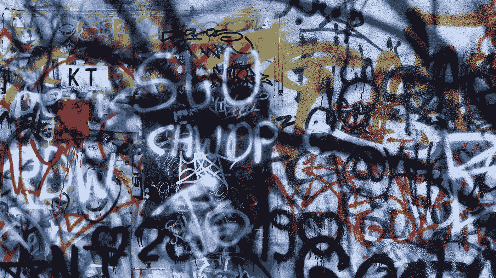

# 代码气味 151 —注释代码

> 原文：<https://levelup.gitconnected.com/code-smell-151-commented-code-3a6feaeedb93>

## *新手怕拆码。许多老年人也是如此。*



> *TL；DR:不要留下注释代码。移除它。*

# 问题

*   可读性
*   死代码
*   缺乏覆盖面
*   缺乏源代码版本控制

# 解决方法

1.  移除注释代码
2.  实现源代码版本控制

# 语境

调试代码时，我们倾向于对代码进行注释，看看会发生什么。

作为最后一步，在我们所有的测试通过之后，我们必须遵循干净的代码实践来移除它们。

# 示例代码

## 错误的

```
function arabicToRoman(num) {
  var decimal = [1000, 900, 500, 400, 100, 90, 50, 40, 10, 9, 5, 4, 1];
  var roman = ['M', 'CM', 'D', 'CD', 'C', 'XC', 'L', 'XL', 'X', 'IX', 'V', 'IV', 'I'];
  var result = ''; for(var i = 0; i < decimal.length; i++) {
    // print(i)
    while(num >= decimal[i]) {
      result += roman[i];
      num -= decimal[i];
    }    
  }
  // if (result > 0 return ' ' += result) return result;
}
```

## 对吧

```
function arabicToRoman(arabicNumber) {
  var decimal = [1000, 900, 500, 400, 100, 90, 50, 40, 10, 9, 5, 4, 1];
  var roman = ['M', 'CM', 'D', 'CD', 'C', 'XC', 'L', 'XL', 'X', 'IX', 'V', 'IV', 'I'];
  var romanString = ''; for(var i = 0; i < decimal.length; i++) {
    while(arabicNumber >= decimal[i]) {
      romanString += roman[i];
      num -= decimal[i];
    }    
  } return romanString;
}
```

# 侦查

[X]半自动

一些机器学习分析器可以检测或解析评论，并指导删除它们。

# 标签

*   评论

# 结论

我们需要删除所有被注释掉的代码。

# 关系

[](https://blog.devgenius.io/code-smell-75-comments-inside-a-method-c911f8729ee1) [## 代码味道 75 —方法内部的注释

### 注释通常是一种代码味道。将它们插入到方法中需要紧急重构。

blog.devgenius.io](https://blog.devgenius.io/code-smell-75-comments-inside-a-method-c911f8729ee1) [](https://blog.devgenius.io/code-smell-05-comment-abusers-feec3aeb926) [## 代码气味 05 —评论滥用者

### 代码有很多注释。注释与实现联系在一起，很难维护。

blog.devgenius.io](https://blog.devgenius.io/code-smell-05-comment-abusers-feec3aeb926) 

# 重构

[](/refactoring-005-replace-comment-with-function-name-76dc38114502) [## 重构 005 —用函数名替换注释

### 评论应该增加价值。还有函数名。

levelup.gitconnected.com](/refactoring-005-replace-comment-with-function-name-76dc38114502) 

# 信用

照片由[马克西姆·鲍勃](https://unsplash.com/@obalance)在 [Unsplash](https://unsplash.com/) 上拍摄

> 不要记录问题，解决它。

*Atli bjrgvin odds son*

[](https://blog.devgenius.io/software-engineering-great-quotes-3af63cea6782) [## 软件工程名言

### 有时一个简短的想法可以带来惊人的想法。

blog.devgenius.io](https://blog.devgenius.io/software-engineering-great-quotes-3af63cea6782) 

本文是 CodeSmell 系列的一部分。

[](https://blog.devgenius.io/how-to-find-the-stinky-parts-of-your-code-fa8df47fc39c) [## 如何找到你的代码中有问题的部分

### 代码很难闻。让我们看看如何改变香味。

blog.devgenius.io](https://blog.devgenius.io/how-to-find-the-stinky-parts-of-your-code-fa8df47fc39c) 

# 分级编码

感谢您成为我们社区的一员！在你离开之前:

*   👏为故事鼓掌，跟着作者走👉
*   📰查看[升级编码出版物](https://levelup.gitconnected.com/?utm_source=pub&utm_medium=post)中的更多内容
*   🔔关注我们:[Twitter](https://twitter.com/gitconnected)|[LinkedIn](https://www.linkedin.com/company/gitconnected)|[时事通讯](https://newsletter.levelup.dev)

🚀👉 [**软件工程师的顶级工作**](https://jobs.levelup.dev/jobs?utm_source=pub&utm_medium=post)