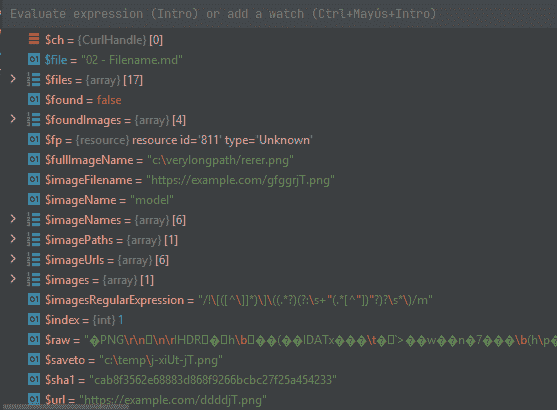

# 代码气味 154 —变量太多

> 原文：<https://levelup.gitconnected.com/code-smell-154-too-many-variables-2d1c0eec8ac2>

## *你调试代码，发现太多变量被声明和激活*


> *TL；DR:变量应该尽可能局部化*

# 问题

*   可读性
*   代码重用

# 解决方法

1.  [提取方法](https://blog.devgenius.io/refactoring-002-extract-method-1478f421b35a)
2.  移除未使用的变量

# 语境

当快速编程和编写测试用例时，我们的代码应该是脏的。

在我们有了好的覆盖率之后，我们需要重构和减少方法。

# 示例代码

## 错误的

```
<?function retrieveImagesFrom(array $imageUrls) {
  foreach ($imageUrls as $index => $imageFilename) {
    $imageName = $imageNames[$index];
    $fullImageName = $this->directory() . "\\" . $imageFilename;
    if (!file_exists($fullImageName)) {
      if (str_starts_with($imageFilename, 'https://cdn.example.com/')) {
          // TODO: Remove Hardcode
          $url = $imageFilename;
          // This variable duplication is not really necessary 
          // When we scope variables        
          $saveto= "c:\\temp"."\\".basename($imageFilename);
          // TODO: Remove Hardcode
          $ch = curl_init ($url);
          curl_setopt($ch, CURLOPT_HEADER, 0);
          curl_setopt($ch, CURLOPT_RETURNTRANSFER, 1);
          $raw = curl_exec($ch);
          curl_close ($ch);
          if(file_exists($saveto)){
               unlink($saveto);
          }
          $fp = fopen($saveto,'x');
          fwrite($fp, $raw);
          fclose($fp);
          $sha1 = sha1_file($saveto);
          $found = false;
          $files = array_diff(scandir($this->directory()), array('.', '..'));
          foreach ($files as $file){
              if ($sha1 == sha1_file($this->directory()."\\".$file)) {                         
                  $images[$imageName]['remote'] = $imageFilename;
                  $images[$imageName]['local'] = $file;
                  $imageFilename = $file;
                  $found = true;
                  // Iteration keeps going on even after we found it
              }
          }
          if (!$found){
            throw new \Exception('We couldnt find image');
         }
        // Debugging at this point our context is polluted with variables
        // from previous executions no longer needed
        // for example: the curl handler
  }
```



## 对吧

```
<?phpfunction retrieveImagesFrom(string imageUrls) {
  foreach ($imageUrls as $index => $imageFilename) {
    $imageName = $imageNames[$index];
    $fullImageName = $this->directory() . "\\" . $imageFilename;
    if (!file_exists($fullImageName)) {
        if ($this->isRemoteFileName($imageFilename)) {
            $temporaryFilename = $this->temporaryLocalPlaceFor($imageFilename);
            $this->retrieveFileAndSaveIt($imageFilename, $temporaryFilename);
            $localFileSha1 = sha1_file($temporaryFilename);
            list($found, $images, $imageFilename) = $this->tryToFindFile($localFileSha1, $imageFilename, $images, $imageName);
            if (!$found) {
                throw new \Exception('File not found locally ('.$imageFilename.'). Need to retrieve it and store it');
            }
        } else {
            throw new \Exception('Image does not exist on directory ' . $fullImageName);
        }
    }
```

# 侦查

[X]自动

大多数棉绒可以建议使用长方法。

这个警告也提示我们打破和范围我们的变量。

# 标签

*   膨胀者

# 结论

[提取方法](https://blog.devgenius.io/refactoring-002-extract-method-1478f421b35a)是我们最好的朋友。

我们应该经常使用它。

# 关系

[](https://blog.devgenius.io/code-smell-03-functions-are-too-long-accea7eb4ae9) [## 代码气味 03 —函数太长

### 人类过了 10 线就烦了。

blog.devgenius.io](https://blog.devgenius.io/code-smell-03-functions-are-too-long-accea7eb4ae9) [](https://blog.devgenius.io/code-smell-107-variables-reuse-222a15b1a819) [## 代码味道 107 —变量重用

### 重用变量使得作用域和边界更难遵循

blog.devgenius.io](https://blog.devgenius.io/code-smell-107-variables-reuse-222a15b1a819) [](https://blog.devgenius.io/code-smell-62-flag-variables-c864eac65a84) [## 代码气味 62 —标志变量

### 旗帜表明发生了什么。除非他们的名字太普通了。

blog.devgenius.io](https://blog.devgenius.io/code-smell-62-flag-variables-c864eac65a84) 

# 重构

[](https://blog.devgenius.io/refactoring-002-extract-method-1478f421b35a) [## 重构 002 —提取方法

### 找到一些可以分组并被原子调用的代码片段。

blog.devgenius.io](https://blog.devgenius.io/refactoring-002-extract-method-1478f421b35a) 

# 信用

由 [Dustan Woodhouse](https://unsplash.com/@dwoodhouse) 在 [Unsplash](https://unsplash.com/s/photos/polluted) 上拍摄的照片

> *临时变量可能是个问题。它们只在自己的程序中有用，因此它们鼓励长时间的复杂程序。*

马丁·福勒

[](https://blog.devgenius.io/software-engineering-great-quotes-3af63cea6782) [## 软件工程名言

### 有时一个简短的想法可以带来惊人的想法。

blog.devgenius.io](https://blog.devgenius.io/software-engineering-great-quotes-3af63cea6782) 

本文是 CodeSmell 系列的一部分。

[](https://blog.devgenius.io/how-to-find-the-stinky-parts-of-your-code-fa8df47fc39c) [## 如何找到你的代码中有问题的部分

### 代码很难闻。让我们看看如何改变香味。

blog.devgenius.io](https://blog.devgenius.io/how-to-find-the-stinky-parts-of-your-code-fa8df47fc39c)