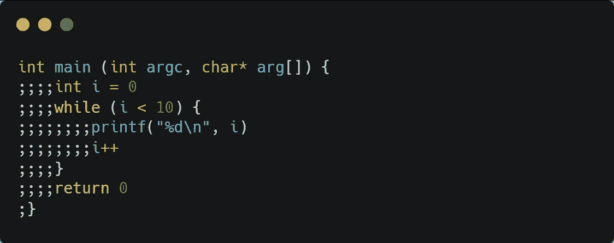
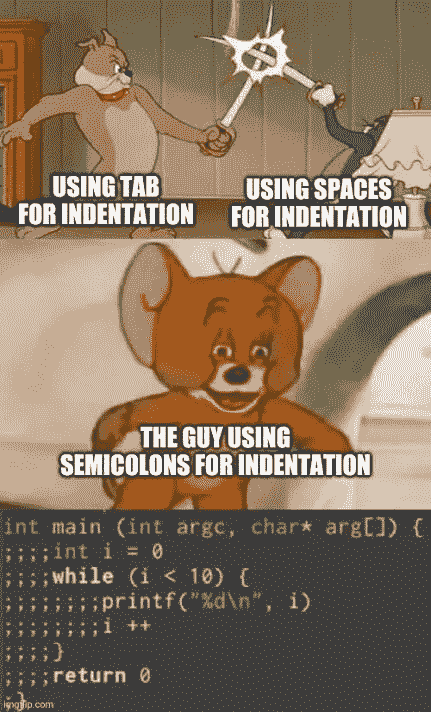

# 代码气味 164 —混合压痕

> 原文：<https://levelup.gitconnected.com/code-smell-164-mixed-indentations-a328947b9a7e>

## 制表符与空格。最重大的计算机问题



> *TL；DR:不要混合缩进样式*

# 问题

*   可读性
*   代码一致性
*   违反标准

# 解决方法

1.  选择其中之一
2.  坚持下去
3.  用代码标准测试来执行它
4.  共享所有代码库的规则
5.  使用像 VS Code 或 WebStorm 这样根本不包含标签页的 IDE。

# 语境

每当我发表一篇文章，许多人都不关心样本的意图，并急于指出缩进错误。

选择其中一个标准将是一个很好的解决方案。

空格始终算作一个。

选项卡可以包含许多不同的选项。

# 示例代码

## 错误的

```
function add(x, y) {
// --->..return x + y; return x + y;
}function main() {
// --->var x = 5,
// --->....y = 7; var x = 5,
        y = 7;
}
```

## 对吧

```
function add(x, y) {
// --->return x + y;
    return x + y;
}
```

# 侦查

[X]自动

任何解析器都可以执行这个规则。

# 例外

像 Python 这样的一些语言认为缩进是语法的一部分。

在这些语言中，缩进不是偶然的，因为它改变了代码语义。

# 标签

*   代码标准

# 结论

在这个问题上有太多的争论。

气味与混合它们有关，而不是用一种代替另一种。

有些 ide 会自动将一种约定转换成另一种。

# 关系

[](https://blog.devgenius.io/code-smell-48-code-without-standards-60c9e0905627) [## 代码气味 48 —没有标准的代码

### 从事个人项目很容易。除非你几个月后再去找它。与许多其他开发人员合作…

blog.devgenius.io](https://blog.devgenius.io/code-smell-48-code-without-standards-60c9e0905627) 

# 更多信息

*   [ES 皮棉](https://eslint.org/docs/latest/rules/no-mixed-spaces-and-tabs)

# 放弃

代码气味只是我的[观点](https://mcsee.medium.com/i-wrote-more-than-90-articles-on-2021-here-is-what-i-learned-76c238f9936f)。



> *无论你用什么设备获取信息，都应该是同样的信息。*

*蒂姆·伯纳斯·李*

[](https://blog.devgenius.io/software-engineering-great-quotes-3af63cea6782) [## 软件工程名言

### 有时一个简短的想法可以带来惊人的想法。

blog.devgenius.io](https://blog.devgenius.io/software-engineering-great-quotes-3af63cea6782) 

本文是 CodeSmell 系列的一部分。

[](https://blog.devgenius.io/how-to-find-the-stinky-parts-of-your-code-fa8df47fc39c) [## 如何找到你的代码中有问题的部分

### 代码很难闻。让我们看看如何改变香味。

blog.devgenius.io](https://blog.devgenius.io/how-to-find-the-stinky-parts-of-your-code-fa8df47fc39c)