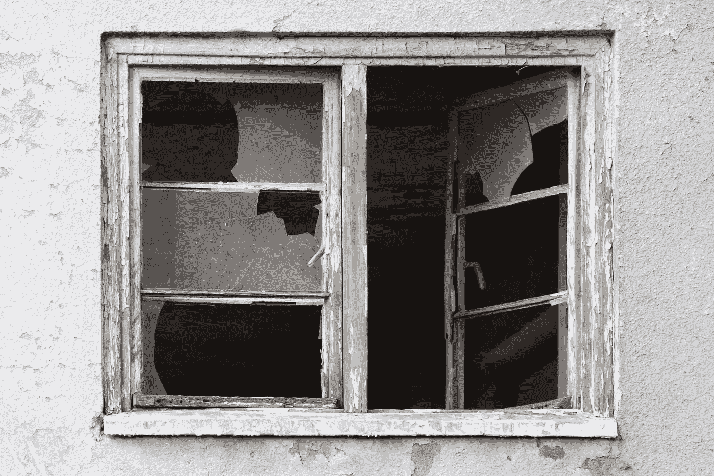

# 气味代码 173——破碎的窗户

> 原文：<https://levelup.gitconnected.com/code-smell-174-broken-windows-ee74f2af2ff2>

## “永远要让露营地比你发现的时候更干净。”如果你发现地上一片狼藉，不管是谁弄的，你都要清理干净。



> *TL；玛:遵循鲍勃叔叔的童子军规则。*

# 问题

*   可读性
*   可维护性

# 解决方法

1.  让代码变得更好
2.  改变它

# 语境

我们读代码的次数比我们写代码的次数多得多。

我们必须对有错误的代码负责，并让它变得更好。

# 示例代码

## 错误的

```
int mult(int a,int  other) 
    { int prod
      prod= 0; 
      for(int i=0;i<other  ;i++) 
        prod+= a ; 
         return prod; 
    } // Formatting, naming, assignment and standards inconsistent
```

## 对吧

```
int multiply(int firstMultiplier, int secondMultiplier) {
  int product = 0; 
  for(int currentIndex=0; currentIndex<secondMultiplier; currentIndex++) {
    product += firstMultiplier; 
  }
  return product; 
} // or just multiply them :)
```

# 侦查

[X]半自动

我们可以使用其他代码气味检测器，让代码保持更好的形状。

# 标签

*   标准

# 结论

我们必须遵守童子军规则，更好地遵守准则。

# 关系

[](/code-smell-164-mixed-indentations-a328947b9a7e) [## 代码气味 164 —混合压痕

### 制表符与空格。最重要的计算机问题

levelup.gitconnected.com](/code-smell-164-mixed-indentations-a328947b9a7e) [](/code-smell-159-mixed-case-acb9f2b8616) [## 代码气味 159 —混合 _ 案例

### 严肃的开发是由许多不同的人完成的。我们必须开始达成一致。

levelup.gitconnected.com](/code-smell-159-mixed-case-acb9f2b8616) 

# 放弃

代码气味只是我的[观点](https://mcsee.medium.com/i-wrote-more-than-90-articles-on-2021-here-is-what-i-learned-76c238f9936f)。

# 信用

Pawel Czerwinski 在 [Unsplash](https://unsplash.com/s/photos/windows-broken) 上拍摄的照片

> 一扇破碎的窗户没有得到修复，这给大楼里的居民灌输了一种被遗弃的感觉。人们开始乱扔垃圾。涂鸦出现。严重的结构破坏开始了。在相对较短的时间内，建筑物受损

安迪·亨特

[](https://blog.devgenius.io/software-engineering-great-quotes-3af63cea6782) [## 软件工程名言

### 有时一个简短的想法可以带来惊人的想法。

blog.devgenius.io](https://blog.devgenius.io/software-engineering-great-quotes-3af63cea6782) 

本文是 CodeSmell 系列的一部分。

[](https://blog.devgenius.io/how-to-find-the-stinky-parts-of-your-code-fa8df47fc39c) [## 如何找到你的代码中有问题的部分

### 代码很难闻。让我们看看如何改变香味。

blog.devgenius.io](https://blog.devgenius.io/how-to-find-the-stinky-parts-of-your-code-fa8df47fc39c)