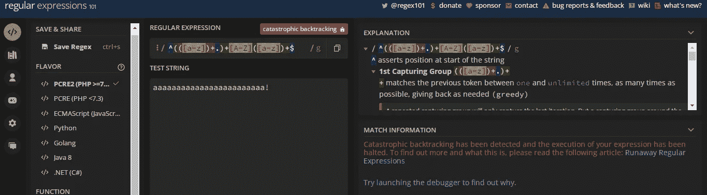

# 代码气味 185 —邪恶的正则表达式

> 原文：<https://levelup.gitconnected.com/code-smell-185-evil-regular-expressions-942c187d821b>

## 正则表达式是一种代码气味。有时也是一个漏洞


> *TL；DR:尽量减少正则表达式的递归规则。*

# 问题

*   安全问题
*   可读性
*   过早优化

# 解决方法

1.  用测试覆盖这些案例，看它们是否停止
2.  使用算法而不是正则表达式
3.  添加超时处理程序

# 语境

这被称为[重做](https://owasp.org/www-community/attacks/Regular_expression_Denial_of_Service_-_ReDoS)攻击，是[拒绝服务](https://en.wikipedia.org/wiki/Denial-of-service_attack)攻击的一个子类型。

ReDoS 攻击可以分为两种类型:

带有恶意模式的字符串被传递给应用程序。然后这个字符串被用作正则表达式，导致重做。

带有矢量攻击格式的字符串被传递给应用程序。然后，该字符串由易受攻击的正则表达式计算，从而导致重做。

# 示例代码

## 错误的

```
package main

import (
    "regexp"
    "fmt"
)

func main() {
    var re = regexp.MustCompile(`^(([a-z])+.)+[A-Z]([a-z])+$`)
    var str = `aaaaaaaaaaaaaaaaaaaaaaaa!`
    for i, match := range re.FindAllString(str, -1) {
        fmt.Println(match, "found at index", i)
    }
}
```



## 对吧

```
package main

import (
    "fmt"
    "strings"
)

func main() {
    var str = `aaaaaaaaaaaaaaaaaaaaaaaa!`
    words := strings.Fields(str)
    for i, word := range words {
        if len(word) >= 2 && word[0] >= 'a' && word[0] <= 'z' &&
           word[len(word)-1] >= 'A' && 
           word[len(word)-1] <= 'Z' {
              fmt.Println(word, "found at index", i)
        }
    }
}
```

# 侦查

[X]半自动

许多语言都避免这种正则表达式。

我们也可以扫描这个漏洞的代码。

# 标签

*   安全性

# 结论

正则表达式很复杂，很难调试。

我们应该尽可能地避免它们。

# 关系

[](https://blog.devgenius.io/code-smell-41-regular-expression-abusers-ae2976eef322) [## 代码气味 41 —正则表达式滥用者

### 正则表达式是一个很棒的工具，我们应该小心使用它们，不要显得太聪明。

blog.devgenius.io](https://blog.devgenius.io/code-smell-41-regular-expression-abusers-ae2976eef322) 

# 更多信息

[灾难性回溯:正则表达式如何导致 ReDoS 漏洞？](https://dev.to/unicorn_developer/catastrophic-backtracking-how-can-a-regular-expression-cause-a-redos-vulnerability-aia)

[](https://owasp.org/www-community/attacks/Regular_expression_Denial_of_Service_-_ReDoS) [## 正则表达式拒绝服务

### 作者:Adar Weidman 供稿人:Ebing，Rsl81，Wichers，Bjoern Kimminich，kingthorin，pi3ch 正则表达式…

owasp.org](https://owasp.org/www-community/attacks/Regular_expression_Denial_of_Service_-_ReDoS) 

[失控正则表达式:灾难性回溯](https://www.regular-expressions.info/catastrophic.html)

# 放弃

代码气味只是我的[观点](https://mcsee.medium.com/i-wrote-more-than-90-articles-on-2021-here-is-what-i-learned-76c238f9936f)。

# 信用

[engin akyurt](https://unsplash.com/@enginakyurt) 在 [Unsplash](https://unsplash.com/s/photos/regular-expression) 上拍摄的照片

> 有些人，当遇到问题时，会想“我知道，我会用正则表达式。”现在他们有两个问题。

杰米·扎温斯基

[](https://blog.devgenius.io/software-engineering-great-quotes-3af63cea6782) [## 软件工程名言

### 有时一个简短的想法可以带来惊人的想法。

blog.devgenius.io](https://blog.devgenius.io/software-engineering-great-quotes-3af63cea6782) 

本文是 CodeSmell 系列的一部分。

[](https://blog.devgenius.io/how-to-find-the-stinky-parts-of-your-code-fa8df47fc39c) [## 如何找到你的代码中有问题的部分

### 代码很难闻。让我们看看如何改变香味。

blog.devgenius.io](https://blog.devgenius.io/how-to-find-the-stinky-parts-of-your-code-fa8df47fc39c)