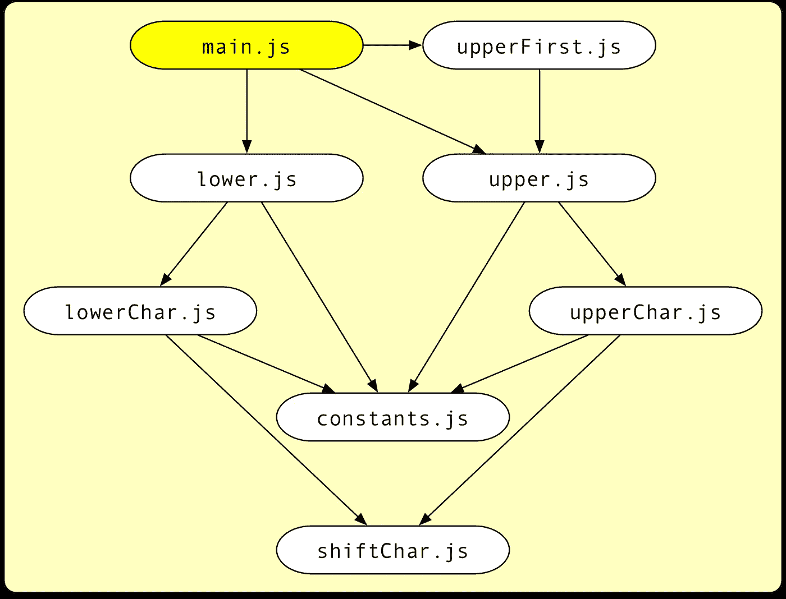
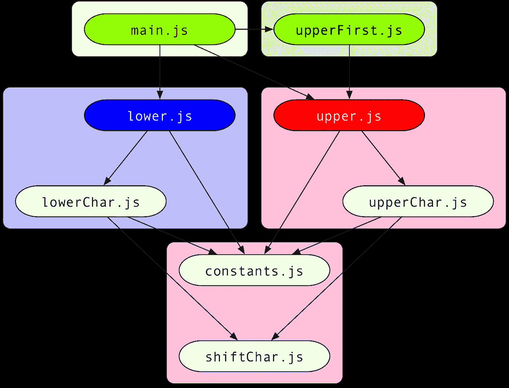

# 库的代码拆分 npm 与汇总 1.0 的捆绑

> 原文：<https://levelup.gitconnected.com/code-splitting-for-libraries-bundling-for-npm-with-rollup-1-0-2522c7437697>


随着最近 Rollup 的 [1.0 发布](https://github.com/rollup/rollup/releases/tag/v1.0.0)，代码分割已经成为臭名昭著的 JavaScript 模块捆绑器的一个一流特性。在这里，我想说明为什么这不仅是前端的游戏规则改变者，也是图书馆的游戏规则改变者。在本文中，您将了解到:

*   如何将库与 Rollup 捆绑在一起(以及为什么需要这样做)，包括一些最佳实践，但最重要的是
*   汇总代码分割是如何工作的，何时以及如何对库使用它

# 我们的图书馆项目

对于这个例子，我们将构建一个强大的实用程序集合，将字符串转换为大写和小写，我们希望以名称`fancy-case`发布到 npm(注意:在撰写本文时，还没有这个名称的库)。

> 将您的源代码写成 es 模块

我强烈推荐使用 [ECMAScript 模块](http://exploringjs.com/es6/ch_modules.html)来编写一个库:

*   现代捆绑器，包括但不限于 Rollup 本身，在包含您的库时会产生更高效的代码
*   ES 模块可以很容易地转换成 Node 的 CommonJS 格式。另一方面，将 CJS 转换成 ES 模块更加困难，不提供完整的功能奇偶校验，导致代码效率更低。

我们将在下面看到如何使用 Rollup 将我们的项目转换为 CJS。现在，以下是项目文件:

遵循良好的编程实践，我们编写包含“只做一件事”的函数的小模块。

> 瞄准小模块

小模块不仅让我们一眼就能看出一个模块是什么，而且还会让我们以后的代码拆分构建更加高效，因为 Rollup 在如何将文件分组为块方面有更多的选择。不可否认，我们在这里有点走极端了。

这是我们的项目到目前为止包含的内容:

*   `main.js`是主入口模块，它导出了三个实用函数`upper`、`lower`和`upperFirst`，这三个函数代表了我们库的公共 API。
*   效用函数本身是在同名的独立模块中定义的。
*   其余模块包含在实用程序函数之间共享的代码。


# 不同的分发格式

一旦我们决定通过 npm 向其他人开放我们的库，我们应该花点时间考虑如何导入它。如今确实有相当多的选择:

## 节点的 CommonJS 模块

这可能是最重要的目标。这允许节点用户和遗留捆绑器通过以下方式将您的库作为 [CommonJS 模块](http://wiki.commonjs.org/wiki/Modules/1.1.1)导入

```
**const fancyCase = require('fancy-case');**
console.log(fancyCase.upper('some Text'));
```

## 要在脚本标记中使用的单个包

发布 JavaScript 的“传统方式”对于那些只需简单设置的手工制作的小网站来说仍然很有意思。这个包创建了一个全局变量，通过这个变量可以访问它的导出。

```
**<script src="fancy-case.js"></script>** <script>
    console.log(fancyCase.upper('some Text'));
</script>
```

## 与 AMD 加载程序一起使用的 AMD 模块

仍然有相当多的基于 AMD/RequireJS 的项目。我们可以分发一个文件，它本身可以作为 AMD 模块的依赖项。

```
**define(['fancy-case.js'], function (fancyCase) {**
    console.log(fancyCase.upper('some Text'));
**});**
```

## 现代捆包机的 ES 模块

[ECMAScript 模块](http://exploringjs.com/es6/ch_modules.html)现在是官方的、标准化的 JavaScript 模块格式。

> 为优化的浏览器包提供一个 ES 模块版本

ES 模块支持卓越的静态分析，这反过来使捆绑器能够使用诸如[范围提升](https://medium.com/adobetech/optimizing-javascript-through-scope-hoisting-2259ef7f5994)和[树摇动](https://medium.com/@Rich_Harris/tree-shaking-versus-dead-code-elimination-d3765df85c80)等技术更好地优化生成的代码。为此，它们是现代捆扎机的首选格式。我们的模块可以通过以下方式使用

```
**import {upper} from 'fancy-case';**
console.log(upper('some Text'));
```

## 面向 CJS 或无害环境管理消费者的直接进口

一种新兴的模式，特别是对于具有许多独立实用功能的库，允许用户从单独的文件中导入库的独立部分。节点用户可以写

```
const upper = require(**'fancy-case/cjs/upper'**);
console.log(upper('some Text'));
```

尽管 ESM 消费者可以写

```
import upper from **'fancy-case/esm/upper'**;
console.log(upper('some Text'));
```

> 提供一种直接导入库的独立部分的方法

直接进口有几个优点:

*   Node 需要加载和解析更少的代码，这导致更快的启动时间和更少的内存消耗。
*   捆绑器需要分析的代码更少，这使得捆绑速度更快。
*   为了避免死代码，在捆绑器中不需要很好的树摇动支持。通常，实用程序库对它们的输出应用奇特的变换，这使得树摇动算法变得无用；使用这种技术可以很容易地避免这种情况。

但是请注意，如果一些模块导入整个库，而其他模块直接导入一些函数，这也会导致更多的捆绑代码。下面我们将展示如何使用 Rollup 的新代码分割以优雅的方式避免这种情况。


# 发布整体捆绑包

目前，我们将专注于前四个发布目标，即 CJS、脚本标签、AMD 和 ESM。为此，让我们准备好要发布的项目:

```
mkdir fancy-casecd fancy-casenpm init --yesgit clone https://gist.github.com/lukastaegert/e9c6c04b8f96adc562a70c096c3e7705 srcnpm install --save-dev rollup
```

这将为我们的项目创建一个`package.json`文件，将我们的示例文件放到一个`src`文件夹中并安装 Rollup。Rollup 支持一种称为[“通用模块定义”](https://github.com/umdjs/umd)的特殊输出格式，它同时支持 CJS、脚本标签和 ESM 用例。要创建它，添加一个名为`rollup.config.js`的新文件到你的项目的根目录:

```
**export default {
    input: 'src/main.js',
    output: {
        file: 'umd/fancy-case.js',
        format: 'umd',
        name: 'fancyCase'
    }
};**
```

这指示 Rollup 从`src/main.js`开始，并将其与所有依赖项一起捆绑到`umd/fancy-case.js`中的 UMD 包中。`name`选项告诉 Rollup 在脚本标签中使用包时创建哪个全局变量，在本例中为`fancyCase`。如果这个包没有在节点或 AMD 上下文中使用，这个变量将只被创建。

如果你跑了

```
npx rollup --config
```

从您的项目的根目录，这将获得我们的配置文件，并创建一个名为“umd”的新文件夹，其中包含我们的 UMD 包。你可以在 Rollup 的网站上查看结果:[https://rollupjs.org/repl?gist = e 9 c 6 c 04 b 8 f 96 ADC 562 a 70 c 096 C3 e 7705](https://rollupjs.org/repl?gist=e9c6c04b8f96adc562a70c096c3e7705)



一个整体包将所有模块合并在一起

如果你切换到网站输出部分的 UMD 标签，并输入正确的`global`变量名，你会看到你所有的文件被压缩在一起，被这样的包装器包围着

```
**(function (global, factory) {
  typeof exports === 'object' && typeof module !== 'undefined' ? factory(exports) :
  typeof define === 'function' && define.amd ? define(['exports'], factory) :
  (global = global || self, factory(global.fancyCase = {}));
}(this, function (exports) { 'use strict';**

  // ... all your bundled code **Object.defineProperty(exports, '__esModule', { value: true });
}));**
```

这个包装器将分析当前的运行时环境，并以一种方便的方式提供模块的导出。注意这一行:

```
Object.defineProperty(exports, '__esModule', { value: true });
```

当试图在 ESM 环境中`import default`我们的 UMD 捆绑包时，现代捆绑器会添加互操作性代码，检查是否存在`__esModule`属性。如果它存在，那么默认导入将不会提供整个导出对象，而只提供该对象的`default`属性。

因为我们无论如何都要创建一个应该在这些情况下使用的专用 ESM 包，所以我们可以考虑通过将`esModule: false`添加到配置文件的`output`部分来跳过这一行。您还可以通过为“cjs”(节点)、“amd”或“iife”(脚本标签)格式创建专用构建来获得更优化的包装器，请查看网站上的相应选项卡。

请注意，与大多数其他打包器不同，除了包装器代码之外，没有添加专用的运行时环境来解析导入。除了它的可配置性之外，这也是为什么 Rollup 很受库创建者欢迎的另一个原因，这些库创建者努力以最小的开销创建高效的包。

> UMD 束应该缩小

特别是对于 AMD 和 script 标签的使用，这个包意味着可以在浏览器中不加修改地运行，我们应该把它缩小。为此，我推荐使用 [TerserJS](https://github.com/terser-js/terser) ，它是更广为人知的 [UglifyJS](http://lisperator.net/uglifyjs/) 的一个分支，支持现代 ES2015+ JavaScript 代码。安装必要的依赖项后

```
npm install --save-dev rollup-plugin-terser
```

你应该这样修改你的`rollup.config.js`:

```
**import {terser} from 'rollup-plugin-terser';**export default {
    input: 'src/main.js',
    **plugins: [terser()],**
    output: {
        file: 'umd/fancy-case.js',
        format: 'umd',
        name: 'fancyCase',
        **esModule: false**
    }
};
```

如上所述，我们还希望提供专用的 ESM 捆绑包。这可以通过在我们的配置中添加第二个`output`来实现，但是由于这个包意味着无论如何都要被其他捆绑器使用，并且不会从缩小中获利(事实上这将使寻找 bug 变得更加困难)，我更建议放弃这个，导出两个单独的配置:

```
import {terser} from 'rollup-plugin-terser';export default **[**
    {
        input: 'src/main.js',
        plugins: [terser()],
        output: {
            file: 'umd/fancy-case.js',
            format: 'umd',
            name: 'fancyCase',
            esModule: false
        }
    },
    **{
        input: 'src/main.js',
        output: {
            file: 'esm/index.js',
            format: 'esm'
        }
    }**
**]**;
```

为了发布我们的模块，我们需要确保我们库的导入者收到正确的文件，并且这个文件是在发布时从最新的资源构建的。为此，修改我们的`packjage.json`文件如下:

```
{
  "name": "fancy-case",
  "version": "1.0.0",
  **"main": "umd/fancy-case.js",
  "module": "esm/index.js",**
  **"scripts": {
    "prepare": "rollup --config"
  },**
  **"files": [
    "esm/*",
    "umd/*"
  ],**
  "devDependencies": {
    "rollup": "^1.1.0",
    "rollup-plugin-terser": "^4.0.2"
  }
}
```

> 添加“主”和“模块”字段

`main`字段确保使用`require`的节点用户将得到 UMD 版本的服务。`module`字段不是一个正式的 npm 特性，而是 bundlers 之间的一个常见约定，用于指定如何导入我们库的 ESM 版本。

> 使用“文件”来包含您的包

`files`字段确保除了一些默认文件之外，只有我们指定的包通过 npm 分发，不包括源代码、测试文件等。这将保持你的用户的`node_modules`文件夹较小，并使`npm install`更快。您也可以创建一个`.npmignore`文件来获得类似的效果，但是使用“拒绝列表”而不是“允许列表”的方法。根据我的经验，“文件”更容易维护。

> 创建一个“准备”脚本

`prepare`脚本是一个特殊的脚本，它将在我们每次运行`npm install`或`npm publish`时由 npm 运行。它还可以直接从 Github 安装分支，通过

```
npm install <user>/<repository>#<branch>
```

现在我们只需运行`npm publish`，我们库的第一个版本将通过`npm install fancy-case`对每个人开放！

> 使用“npm 包”进行发布演习

如果您不确定您是否正确地配置了所有的东西，您可以首先运行`npm pack`来获得一个 tarball，其中包含了发布时将发送给 npm 的所有东西，并对其进行检查。如果你有点偏执，你甚至可以用这个 tarball 进行自动化测试。


# 发布优化的区块

如上所述，如果我们为我们库的独立部分提供直接导入，这对我们的用户是非常有益的。一种方法是将源文件和我们的库一起分发，并指示我们的用户从那里导入。

但是，如果用户代码的不同部分以不同的方式导入我们的库，这会导致令人讨厌的问题。想象一个模块从`"fancy-case"`导入`upper`函数，而另一个模块从`"fancy-case/src/upper"`导入。尽管从技术上来说是相同的代码，但现在这是两个非常不同的函数，并且`upper`将在用户代码中出现两次。

这听起来问题不大，但是想象一下，如果我们在`upper`函数旁边的一个变量中存储一些持久状态(绝对不是推荐的做法，但是这种情况确实发生了)，或者如果用户依赖于比较对我们的`upper`函数的引用，会发生什么。突然间，我们面临着无数奇怪的、难以追踪的错误。此外，未触及的源代码没有受益于任何优化，如范围提升或树摇动，或通过插件如 [rollup-plugin-babel](https://github.com/rollup/rollup-plugin-babel) 应用于代码的任何转换。

> 将库中的独立部分标记为附加条目模块

Rollup 1.0 提供了一个简单但强大的解决方案:您可以将库的独立部分指定为额外的入口点。在我们改变我们的项目之前，看看 https://rollupjs.org/repl? REPL 的结果:[gist = e 9 c 6 c 04 b 8 f 96 ADC 562 a 70 c 096 c3e 7705&entry = lower . js，upper.js，upperFirst.js](https://rollupjs.org/repl?gist=e9c6c04b8f96adc562a70c096c3e7705&entry=lower.js,upper.js,upperFirst.js)



代码分割包将模块分组为块

您可以看到，我们最初的八个模块已经减少到五个块，每个入口模块一个，另外一个块由其他几个块导入。根据您所看到的格式，这些块只是简单地相互`import`或`require`而没有添加任何额外的管理代码或任何代码复制。

为了避免重复，从而避免上面提到的重复状态或引用的潜在问题，Rollup 应用一种“着色”算法，该算法为每个入口模块分配一种单独的颜色，然后遍历模块图，为每个模块分配依赖于它的所有入口点的“混合”颜色。

在我们的例子中，红色入口模块`upper.js`和蓝色入口模块`lower.js`都依赖于`constants.js`和`shiftChar.js`，所以它们被分配给一个新的紫色块。`main.js`和`upperFirst.js`仅依赖于其他入口模块，因此不会进一步改变颜色。

这就是你如何改变你的`rollup.config.js`来为 CJS 和 ESM 用户产生代码分割版本:

```
import {terser} from 'rollup-plugin-terser';export default [
    {
        input: 'src/main.js',
        plugins: [terser()],
        output: {
            file: 'umd/fancy-case.js',
            format: 'umd',
            name: 'fancyCase',
            esModule: false
        }
    },
    {
        **input: {
            index: 'src/main.js',
            upper: 'src/upper.js',
            lower: 'src/lower.js',
            upperFirst: 'src/upperFirst.js'
        },**
        output: [
            {
                **dir: 'esm',**
                format: 'esm'
            },
            {
                **dir: 'cjs',**
                format: 'cjs'
            }
        ]
    }
];
```

如您所见，我们现在提供了一个对象作为`input`，其中属性对应于生成的入口块，而值对应于它们的入口模块。此外，我们现在定义一个输出`dir`来放置所有的块，而不是指定`file`。如果你想调整命名方案和块的位置，看看`[entryFileNames](https://rollupjs.org/guide/en#output-entryfilenames)`和`[chunkFileNames](https://rollupjs.org/guide/en#output-chunkfilenames)`输出选项。要检查结果，只需运行

```
npm run prepare
```

> 为高级配置在配置文件中编写 JavaScript 代码

如果您有很多入口点，而不是单独指定它们，请注意您的配置文件是一个 JavaScript 文件，可以从`node_modules`以及内置节点库中导入任何东西。因此，你可以用`import fs from 'fs'`然后用`fs.readDirSync`从一个目录中构建一个入口模块的对象。

现在剩下要做的事情就是调整您的`package.json`文件以包含新文件和导入目标，然后发布结果:

```
{
  "name": "fancy-case",
  "version": "1.0.0",
  **"main": "cjs/index.js",**
  "module": "esm/index.js",
  "scripts": {
    "prepare": "rollup --config"
  },
  "files": [
    **"cjs/*",**
    "esm/*",
    "umd/*"
  ],
  "devDependencies": {
    "rollup": "^1.1.0",
    "rollup-plugin-terser": "^4.0.2"
  }
}
```

## 使用。mjs

另一种新兴模式是构建双模式包，其中 CJS 和 es 模块相邻放置，CJS 文件带有`.js`扩展名，而 ESM 文件带有`.mjs`扩展名。这可以通过在加法时对两个输出使用相同的`dir`来容易地实现

```
entryFileNames: [name].mjs
```

ESM 输出选项。但是请注意，在使用外部依赖关系时，这可能会改变某些捆绑器中的捆绑行为，因此您应该自担风险。

## 避开瀑布

您可能会注意到，Rollup 似乎向一些块添加了额外的“空”导入。例如，这是您的`main.js`块在 ESM 版本中的外观:

```
import '../chunk-59d826da.js';
export { default as upper } from '../upper.js';
export { default as lower } from '../lower.js';
export { default as upperFirst } from '../upperFirst.js';
```

那么，为什么我们的共享块在顶部有一个额外的导入？让我们看看当我们想要运行`main.js`而不添加这个时会发生什么:

1.  加载并解析`main.js`
2.  解析之后，我们知道我们还需要`upper.js`、`lower.js`和`upperFirst.js`，所以我们加载并解析它们
3.  在解析它们中的任何一个之后，我们知道我们还需要我们的共享块，所以我们也加载并解析那个共享块
4.  运行一切

有了添加的导入，步骤 3 不再需要等待步骤 2，因为一旦条目块被解析，所有的依赖关系都是已知的。因此，节点用户将能够更快地加载您的库，而绑定器将从减少的模块发现时间中受益。

## 外部依赖性

即使我们的库是自给自足的，也很容易添加外部依赖项。但是请注意，在这种情况下，您应该添加`[external](https://rollupjs.org/guide/en#external)`选项来提供所有外部依赖项的数组，否则您将收到来自 Rollup 的警告。要在 UMD 或生命构建中拥有外部依赖，当通过`[globals](https://rollupjs.org/guide/en#output-globals)`输出选项在脚本标签中使用库时，您还需要指定在哪些全局变量名下可以找到外部依赖。


# 结论

通过一个单一的中央配置文件，Rollup 可以同时提供许多不同的包格式。

使用 Rollup 进行代码分割提供了一种捆绑库的新方法，可以防止向用户公开多个导入目标的许多缺陷，同时为您提供了完全的可配置性和灵活性。期待 Rollup 在未来提供更多的代码优化，代码分割和整体捆绑包都将从中受益。

当然，你也可以使用 Rollup 来捆绑 web 应用程序。)，但这并不是本文的重点。

我希望这提供了一个很好的主题介绍，非常欢迎反馈！

[](https://levelup.gitconnected.com)[](https://gitconnected.com/learn/node-js) [## 学习 Node.js -最佳 Node.js 教程(2019) | gitconnected

### 前 31 个 Node.js 教程-免费学习 Node.js。课程由开发人员提交和投票，使您能够…

gitconnected.com](https://gitconnected.com/learn/node-js)