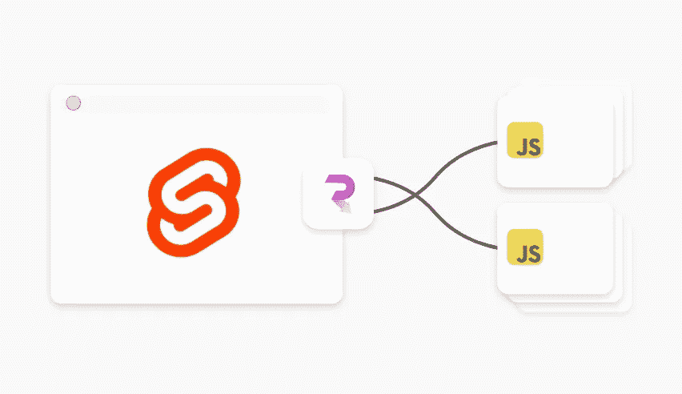
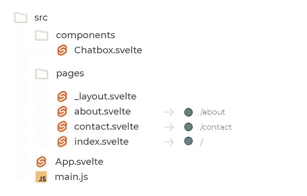
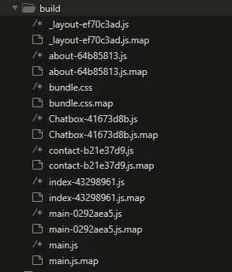
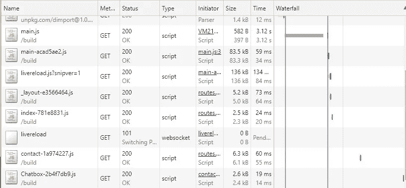

# 苗条 JS + Routify 中的代码拆分

> 原文：<https://levelup.gitconnected.com/code-splitting-in-svelte-js-routify-7de5fe919f61>

## 将我们的代码分割成更小的块，并在更大的客户端应用程序中改善页面加载时间。



代码分割是动态导入在 **ECMAScript (ES)** 中的一个别出心裁的名字。
在制作需要在不同设备上运行更快的大型客户端应用程序时，这是一个推荐选项。

在这篇文章中，让我们看看一个实验性的方法，我们如何做代码分割。

> 目标是不要下载或执行用户不想要的东西。

[Rollup](https://rollupjs.org/guide/en/#code-splitting) 一直支持动态导入形式的代码拆分。
这只是一个配置汇总的问题，以便它将所有动态导入分块。

最好的技术是**在路由器级别分割代码。**

Routify 是一款很有前途的基于文件的路由器，它一直支持动态导入选项。因此，根据我们的应用需求来使用它是很好的。

在开始实际配置之前，让我们看看一些基本的东西。

## 静态与动态导入

静态导入在顶层调用，并在构建时贪婪地解析。

```
//Static ES import
import Card from '../components/Card.svelte';//svelte template can be used as component
<Card/>
```

动态导入像函数一样调用并返回一个承诺，这将在绑定时创建自己的块。这可以称为代码分割。

```
//Dynamically load component on demand (lazy load)
let Card;
import('../components/Card.svelte')
.then(result => Card = result.default);// this will be used
{#if Card}
  <svelte:component this={Card}/>
{/if}
```

此结果汇总会将文件分块为 Card-[hash]。js(参见[文档](https://rollupjs.org/guide/en/#outputchunkfilenames)

## 代码拆分的类型

代码可以分为两种方式。

1.路由器级或页面级(推荐)—这可以是可以加载到一个页面上的多个组件。

2.组件级或文件级(临时)—这可以按需加载单个组件，可以称为用户操作的延迟加载。

## 反模式

有一些**不要**的事情被认为是不同框架上的反模式。

*   自动化方式代码分割所有组件
*   库有自己的代码分割

因为我们需要了解代码拆分的目标和真实用例。

# 配置

在这里，我们将创建一个新的项目，使用 Svelte starter 模板，只添加 Routify 路由器。设置代码分为路由器级和组件级。

**第一步:安装**

```
npx degit [sveltejs/template](https://github.com/sveltejs/template) code-split-pro
cd code-split-pro
npm i 
```

为路由器安装 Routify，
在每次更改的开发中，Rollup 将创建多个带有随机标签的大块文件，未使用的文件需要在构建文件夹中清理，因此我们添加了插件“rollup-plugin-cleaner”。

```
npm install --save-dev @sveltech/routify rollup-plugin-cleaner
```

**步骤 2:汇总配置**

让我们深入了解设置汇总配置的实际过程。

在 rollup.config.js 中，并不是所有的输出格式都支持代码拆分，所以我们需要将`output.format: 'iife'`更改为`output.format: 'esm'`并将`output.file`更改为`output.dir: 'public/build'` 文件夹来存储所有的块文件。

```
output: {
  sourcemap: true,
  format: 'esm',  // format iife into esm
  name: 'app',
  dir: 'public/build' // file into dir
 }
```

“esm”格式不会重写代码中的`import`语句。这意味着我们将依赖浏览器的本机模块加载器。现在所有的浏览器都支持 ES `import`或者动态的`import(...)`并且传统的浏览器可以是多填充的。

让我们继续 Routify 和更干净的插件配置。

导入 Routify 并设置选项`dynamicImport:true`、
导入清理器插件并设置捆绑文件夹作为目标。

```
import {routify} from '[@sveltech/routify](http://twitter.com/sveltech/routify)';
import cleaner from 'rollup-plugin-cleaner';plugins: [ //Added routify plugin with dynamic import support
  routify({ dynamicImports : true}), //Added cleaner to clean the chunk files on changes
  cleaner({
   targets: [
     'public/build/'
   ]
  }),]
```

完整的汇总. config.js 文件

**第 3 步:设置路由路由器**

为了让 Routify 路由器在 Sirv 的 spa 模式下工作，我们必须在其他服务器上启用这个选项(参见[文档](https://routify.dev/guide/installation/install-to-existing-project))。

***a)在包中设置***

```
*/** package.json **/*
...
"scripts": {
    "start": "sirv public --single"
    ...
}
```

**(T22)b)设置应用软件(T24)**

```
/** App.svelte **/<script>
  import { Router } from "[@sveltech/routify](http://twitter.com/sveltech/routify)";
  import { routes } from "[@sveltech/routify](http://twitter.com/sveltech/routify)/tmp/routes";
</script><Router {routes} />
```

上述设置将启动 App.svelte 文件中的路由器，并加载路由。

***c)设置 Routify pages 文件夹***

src 中 Routify 所需页面文件夹。路线是根据 pages 文件夹中的 svelte 文件的名称自动创建的(参见[文档](https://routify.dev/guide/introduction/structure))。

下图显示了我们项目设置的路由文件结构。



对于我们的实验项目，在每个 Svelte 文件中相应地使用以下代码。

在布局上，我们增加了导航链接。

```
// *_layout.svelte*

<script>
import {url } from '[@sveltech/routify](http://twitter.com/sveltech/routify)'
</script>
<h2>links</h2>
<a href={$url("/")} title="hello">Home</a>
<a href={$url("./about")} title="about">about</a>
<a href={$url("./contact")} title="contact">contact</a>
<slot/>
```

关于页面

```
// *about.svelte* 
<h2>About Page</h2>
```

主页

```
// *index.svelte*<h2>Welcome Home!</h2>
```

联系页面

```
// *contact.svelte*<script>
let Chatbox;function loadChat(){
import('../components/Chatbox.svelte')
.then(result => Chatbox = result.default)
.catch(err => console.error(err))
}
</script><h2>Contact</h2>
<button on:click={loadChat}>Start Chat</button>{#if Chatbox}
  <svelte:component this={Chatbox}/>
{/if}
```

聊天室组件

```
// Chatbox*.svelte*<label>Chat here</label>
<input type="text" placeholder="type your message"/>
```

基于以上示例，Routify 将自动动态导入布局和页面。在联系人页面中，Chatbox 组件根据用户请求动态导入。

让我们进入这个过程的最后一步，更新位于文件夹`public/index.html`中的`index.html`上的`<script>`标签

**第 4 步:更改 index.html 的脚本标签**

为了我们的变更工作，我们必须更新`<script>`以支持模块加载。

```
<script defer type="module" src="/build/main.js"></script>
```

对于遗留的，浏览器可以支持静态导入，但不支持动态导入，所以我们有一些 polyfill 来实现这一点。这里我们使用 [dimport](https://github.com/lukeed/dimport) 库进行回退。

```
<script type="module" defer src="[https://unpkg.com/dimport@1.0.0/dist/index.mjs?module](https://unpkg.com/dimport@1.0.0/dist/index.mjs?module)" data-main="/build/main.js"></script> <script nomodule defer src="[https://unpkg.com/dimport/nomodule](https://unpkg.com/dimport/nomodule)" data-main="/build/main.js"></script>
```

仅此而已！我们已经成功地在我们苗条的 JS 应用程序上完成了成熟的代码分割。

我们可以通过`npm run dev`运行我们的应用程序，然后汇总将在`public/build`文件夹中创建我们的块文件，如下图所示。



## 结果

最后，我们准备在浏览器上看到代码分割的结果。
在瀑布上结账联系人页面加载聊天框。



## 专业提示

*   为了更好的开发者体验，代码分割可以在开发的最后阶段进行。
*   为避免开发时出现浏览器缓存错误，可以使用匿名模式。
*   Routify 有它的 starter 模板，有各种不同的构建选项，可以给我们很好的灵活性(见 [repo](https://github.com/sveltech/routify-starter) )。

# 结论

代码分割是关于我们如何计划和组织我们的应用程序代码，以提高运行时的性能。根据我们的实验，通过在 Rollup 上进行简单的配置，可以很容易地在苗条的 JS 应用程序中完成。

拆码快乐！