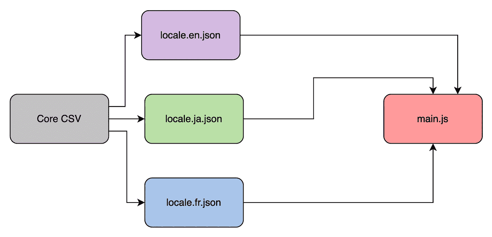
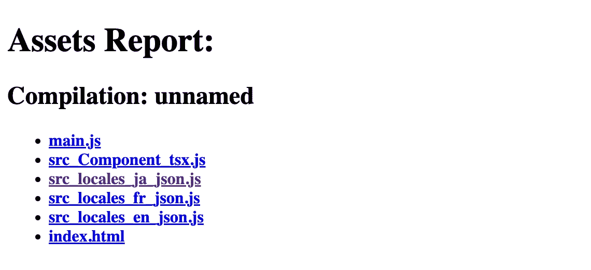
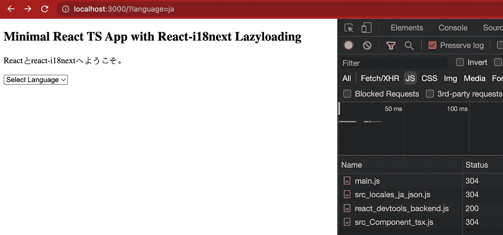
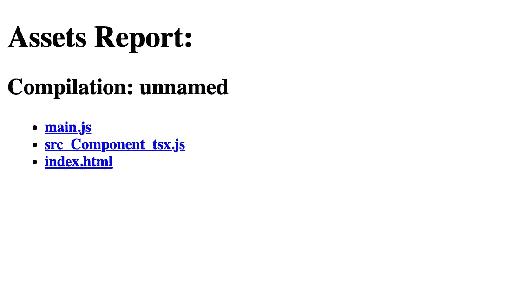

# 使用动态导入的代码分割 react-i18n 语言环境

> 原文：<https://levelup.gitconnected.com/code-splitting-react-i18n-locales-using-dynamic-imports-97af247ad6f0>

对于您的前端项目来说，实现国际化可能是一项艰巨的任务，但幸运的是，像 [i18n](https://www.i18next.com/) 这样的工具通过提供有用的 API 来帮助我们快速前进，从而使我们的生活变得更加轻松。

***免责声明*** *:这篇文章期望你已经知道一些关于 react、本地化、webpack 和 i18n 的基本概念。*

***TLDR；***

[](https://github.com/rajeshbabu-oviva/react-i18n-codesplitting-locales) [## GitHub-rajeshbabu-oviva/react-i18n-code splitting-locales:一个简单的 react-18n to code-splitting locale…

### 一个简单的 react-i18n 使用动态导入对语言环境文件进行代码分割。npm 安装 npm 运行服务器//打开…

github.com](https://github.com/rajeshbabu-oviva/react-i18n-codesplitting-locales) 

照片由[蒂姆·莫斯霍尔德](https://unsplash.com/@timmossholder?utm_source=unsplash&utm_medium=referral&utm_content=creditCopyText)在 [Unsplash](https://unsplash.com/s/photos/split?utm_source=unsplash&utm_medium=referral&utm_content=creditCopyText) 上拍摄

# 一般建筑

在现代前端应用程序中，我们理想地拥有一个核心 *CSV* ，从中我们为我们支持的每种语言生成我们的 *locale.json* 文件。假设我们支持英语、法语和日语，那么我们将分别拥有三个 locale.json。

如果您使用像 webpack 这样的模块捆绑器，国际化的基本实现将包括导入所有的 locale.json 文件并将它们捆绑在一个捆绑包中。



一般建筑

> 这种体系结构的问题是，main.js 包会将所有 JSON 文件捆绑在一起，即使您并不需要它们。

假设您的应用程序是为一种语言加载的，其他两种语言的 JSON 文件也是 main.js 包的一部分，尽管这对于较小的应用程序来说可能不是问题，但是随着应用程序的扩展和您支持的语言数量的增加，这种基本的实现会慢慢消耗您的性能预算。

因此，更好的解决方案是只加载所需的语言环境文件，或者按需加载。而这可以通过一个叫做 [***的概念来实现***](https://developer.mozilla.org/en-US/docs/Glossary/Code_splitting) 。

# 代码分割

简而言之，代码分割就是根据一定的标准将代码分割成更小的包，从而获得更好的加载时间。

大多数现代捆绑器，如 [webpack](https://webpack.js.org/guides/code-splitting/#dynamic-imports) ，都有自己的配置，用于在编译时进行代码分割。有多种方法可以强制你的 webpack 配置来分割你的代码，但是在我们的例子中，我们将使用[动态导入](https://webpack.js.org/api/module-methods/#dynamic-expressions-in-import)。

以下代码块在与 webpack 这样的现代捆绑器捆绑在一起时，将为*区域设置*目录中的所有文件生成一个块，并根据变量 *langKey* 的计算值按需加载它们。

```
async function loadResources(langKey) {
   const resources = await import(`./locales/${langKey}.json`); // do something with the resource.
}
loadResources().then(() => console.log('resource loaded dynamically'));
```

这样，我们的架构保持不变，但是 bundler 会负责将我们的应用程序代码分割成更小的块。

# 在 React-i18n 中使用动态导入

在我们进入实际代码库的演示之前，让我们看看如何用 [react-i18n](https://react.i18next.com/legacy-v9/step-by-step-guide#2-lazy-loading-translations) 实现动态导入。官方文档推荐使用后端插件，然而，它也可以通过 webpack 轻松完成，因为它支持开箱即用的动态导入。

当我们使用动态导入来加载文件时，我们应该注意加载资源和调用***use translation***钩子之间的竞争情况。

> 在我们执行 useTranslation 钩子的方法之前，i18n init 方法应该已经完成了(例如:t('key '))。

我们可以结合使用 *React.lazy* 和*悬念*来等待动态导入，然后在这里实际使用 useTranslation [。](https://github.com/rajeshbabu-oviva/react-i18n-codesplitting-locales/blob/master/src/App.tsx#L4)

或者，我们也可以使用 *I18nProvider* 来传递 i18n 对象的值，使用*suspension*来等待资源的加载，如此处的[所示](https://github.com/rajeshbabu-oviva/react-i18n-codesplitting-locales/blob/master/src/AppWithI18nProvider.tsx)。

如果在资源可用之前调用 useTranslation 挂钩，您可能会得到这样的警告


警告反应-i18n

# 演示

我使用这个[样板文件](https://github.com/rajeshbabu-oviva/react-ts-boilerplate)快速启动了我的应用程序，这个样板文件是我基于我在这里写的文章[构建的。](https://medium.com/@rajeshdavid/a-quick-guide-to-choosing-a-robust-frontend-tech-stack-1f47c0458f08)

## 使用代码分割

在你最喜欢的编辑器中克隆并打开这个[代码库](https://github.com/rajeshbabu-oviva/react-i18n-codesplitting-locales)，按照 read me 上的说明运行这个项目。代码目前是代码分裂，你怎么知道？

一旦你安装并运行了这个项目

```
npm run install
npm run serve
// visit http://localhost:3000/webpack-dev-server
```

您应该会看到关于当前 dev-server 的 dist 目录的以下信息:



Webpack 开发-服务器构建目录

当你最初加载应用程序并切换语言时，你应该能够看到这些块( *src_locales_ja_json.js* 等)。，)从网络选项卡下载。

当我们访问[*http://localhost:3000*](http://localhost:3000)*/？我们只加载日语的 JSON 信息，而不加载英语和法语的 JSON 信息。*

> 这实际上是基于动态导入的代码分割。



块加载的网络选项卡

既然我们已经看到了代码分割在起作用，那么让我们看看没有代码分割的项目是如何进行的。

## 没有代码分割

让我们继续用下面的代码修改我们的 [*i18n.ts*](https://github.com/rajeshbabu-oviva/react-i18n-codesplitting-locales/blob/master/src/i18n.ts) 文件

```
import i18n from 'i18next';
import { initReactI18next } from 'react-i18next';
import en from './locales/en.json';
import fr from './locales/fr.json';
import ja from './locales/ja.json';const LANG_KEY: string = new URLSearchParams(window?.location?.search).get('language') || 'en';// eslint-disable-next-line @typescript-eslint/no-explicit-any
const resources: any = { en, fr, ja };export const init = () => {
  i18n.use(initReactI18next).init(
   {
    resources,
    lng: LANG_KEY
   });
};export default i18n;
```

并且访问[*http://localhost:3000/web pack-dev-server*](http://localhost:3000/webpack-dev-server)*会给我们以下结果—*

**

*没有代码分割*

*在这里，我们可以看到所有导入的语言环境文件都与 main.js 包捆绑在一起，因此增加了包的大小。*

*如果你喜欢这篇文章，请留下一些掌声，并确保克隆代码和周围玩它。*

*[](https://github.com/rajeshbabu-oviva/react-i18n-codesplitting-locales) [## GitHub-rajeshbabu-oviva/react-i18n-code splitting-locales:一个简单的 react-18n to code-splitting locale…

### 一个简单的 react-i18n 使用动态导入对语言环境文件进行代码分割。npm 安装 npm 运行服务器//打开…

github.com](https://github.com/rajeshbabu-oviva/react-i18n-codesplitting-locales)* 

# *分级编码*

*感谢您成为我们社区的一员！更多内容见[级编码出版物](https://levelup.gitconnected.com/)。
跟随:[推特](https://twitter.com/gitconnected)，[领英](https://www.linkedin.com/company/gitconnected)，[通迅](https://newsletter.levelup.dev/)
**升一级正在改造理工大招聘➡️** [**加入我们的人才集体**](https://jobs.levelup.dev/talent/welcome?referral=true)*