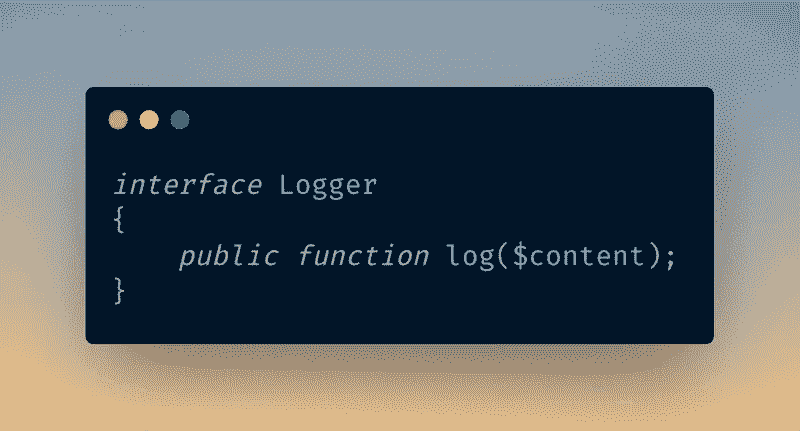

# 代码到接口:Laravel 中的一个例子

> 原文：<https://levelup.gitconnected.com/code-to-interface-an-example-in-laravel-a8a5ec0a859b>

## 接口代码指南



使用[碳](https://carbon.now.sh)制作的图像

接口代码是编程中使用的一种技术，在这种技术中，您基于抽象(接口)而不是具体(类)来构建应用程序。

如果你是一名程序员，那么你可能听说过这样的短语，如**代码到接口，而不是实现**，**程序到接口**，**使用抽象而不是具体化**等等。

都是指同一件事。我们应该以这样一种方式编码我们的应用程序，它应该依赖于抽象(接口)而不是具体化(类)。

# 为什么？

这是我第一次听到这个短语时的确切反应。为什么我要使用接口而不是类？即使我创建了一个接口，我也需要创建一个实现该接口的类。这不是浪费时间吗？

当然**没有**！

这个世界上唯一不变的是变化本身，或者换句话说，**变化**是唯一不变的**。**

**在编程的情况下，这个规则也没有例外。业务需求随着时间而变化，我们的代码也是如此。**

**所以我们的代码必须灵活。**

**代码到接口使我们的代码松散耦合且灵活。**

# **怎么会？**

**考虑下面的代码示例。**

```
class Logger {

    public function log($content) 
    {
        //Logs content to file.
        echo "Log to file";
    }
}
```

**这是一个简单的类，将内容记录到一个文件中。我们可以在控制器中使用它。**

```
class LogController extends Controller
{
    public function log()
    {
        $logger = new Logger;
        $logger->log('Log this');
    }
}
```

**但是，如果我们想登录多个目标，如`db`、`file`、`cloud`等，该怎么办呢？**

**然后我们可以改变我们的`LogController`类和`Logger`类来适应这些变化。**

```
class Logger {

    public function logToDb($content) 
    {
        //Logs content to db.
    }

    public function logToFile($content) 
    {
        //Logs content to file.
    }

    public function logToCloud($content) 
    {
        //Logs content to cloud.
    }

}
```

**将`LogController`改为**

```
class LogController extends Controller
{
    public function log()
    {
        $logger = new Logger;

        $target = config('log.target');

        if ($target == 'db') {
            $logger->logToDb($content);
        } elseif ($target == 'file') {
            $logger->logToFile($content);
        } else {
            $logger->logToCloud($content);
        }
    }
}
```

**好了，现在我们可以登录不同的目标了。但是，如果我们想向一个`redis`服务器添加另一个目标，比如 log，该怎么办呢？我们将最终修改`Logger`类和`LogController`类。**

**正如你所看到的，这很快脱离了我们的控制，代码变得混乱。`Logger`级很快成为一个庞然大物。这是一场噩梦。**

**所以我们需要分东西。遵循坚实的原则，我们可以将责任转移到相应的类中。**

```
class DBLogger
{
    public function log()
    {
        //log to db
    }
}

class FileLogger
{
    public function log()
    {
        //log to file
    }
}

class CloudLogger
{
    public function log()
    {
        //log to cloud
    }
}
```

**并且控制器被改变为**

```
class LogController extends Controller
{
    public function log()
    {
        $target = config('log.target');

        if ($target == 'db') {
            (new DBLogger)->log($content);
        } elseif ($target == 'file') {
            (new FileLogger)->log($content);
        } else {
            (new CloudLogger)->log($content);
        }
    }
}
```

**好多了。现在，如果我们想为日志添加其他目标，我们可以创建一个新的类，并将其添加到控制器中的`if-else`。**

**但是，我们的控制器负责选择一个记录器。对于控制器来说，它不需要知道不同的记录器并在它们之间进行选择。它只需要一个带有`log()`方法的 logger 类来记录内容。**

# **胜利的界面**

**这是使用接口的恰当情况。那么什么是[接口](https://www.cs.utah.edu/~germain/PPS/Topics/interfaces.html)？**

> ***接口是一个对象可以做的动作的描述。***

**回到我们的例子，控制器只需要一个带有`log()`方法的 logger 类。所以我们的接口必须描述它必须有一个`log()`动作。**

```
interface Logger
{
    public function log($content);
}
```

**正如你所看到的，它只包含函数声明，而不包含它的实现，这就是它被称为`abstraction`的原因。**

**实现接口时，实现接口的类必须提供接口中定义的抽象方法的实现细节。**

**在我们的例子中，任何实现了`Logger`接口的类都必须提供抽象方法`log()`的实现细节。**

**然后，我们可以在控制器中输入这个接口的类型提示。**

```
class LogController extends Controller
{
    public function log(Logger $logger)
    {
        $logger->log($content);
    }
}
```

**现在控制器不关心哪种类型的记录器被传递给它。它只需要知道它必须实现`Logger`接口。**

**所以我们需要修改我们的日志类来实现这个接口。**

```
class DBLogger implements Logger
{
    public function log()
    {
        //log to db
    }
}

class FileLogger implements Logger
{
    public function log()
    {
        //log to file
    }
}

class CloudLogger implements Logger
{
    public function log()
    {
        //log to cloud
    }
}
```

**我们现在可以在不接触现有代码的情况下添加更多的记录器。我们所要做的就是创建一个实现我们的`Logger`接口的新类。**

```
class RedisLogger implements Logger
{
    public function log()
    {
        //log to redis
    }
}
```

**我们的代码现在是灵活和松散耦合的。我们可以在任何时候交换实现，而不需要修改现有的代码。**

# **依赖注入**

**当使用像 Laravel 这样的框架时，我们可以利用它的[服务容器](https://laravel.com/docs/7.x/container)来自动注入接口的实现。**

**由于 Laravel 支持[方法注入](https://laravel.com/docs/7.x/controllers#dependency-injection-and-controllers)开箱即用，我们只需要[将接口绑定到它的实现](https://laravel.com/docs/7.x/container#binding-interfaces-to-implementations)。**

**首先，我们需要为记录器创建一个配置文件。所以创建一个文件`config/log.php`**

```
<?php

return [
    'default' => env('LOG_TARGET', 'file'),

    'file' => [
        'class' => App\Log\FileLogger::class,
    ],

    'db' => [
        'class' => App\Log\DBLogger::class,
    ],

    'redis' => [
        'class' => App\Log\RedisLogger::class,
    ]
];
```

**并且在你的`AppServiceProvider.php`里面`app/Providers`添加下面的代码。**

```
class AppServiceProvider extends ServiceProvider
{
    public function register()
    {
        $default = config('log.default');
        $logger = config("log.{$default}.class");

        $this->app->bind(
            App\Contracts\Logger::class, // the logger interface
            $logger
        );
    }
}
```

**它从配置文件中读取默认日志，并将其绑定到`Logger`接口。因此，每当我们请求`Logger`接口时，容器都会解析它并返回默认的 logger 实例。**

**由于默认的记录器是使用`env()`助手指定的，我们可以在不同的环境中使用不同的记录器，比如在`local`环境中的`file`和在`production`环境中的`db`。**

# **结论**

**接口允许我们创建松散耦合的代码，同时提供一定程度的抽象。它允许我们在任何时候改变我们的实现，而不改变它们被使用的上下文。因此，请始终将应用程序中的所有可变部分编码到一个接口中。**

# **参考**

1.  **[接口](https://www.php.net/manual/en/language.oop5.interfaces.php)**
2.  **[服务容器](https://laravel.com/docs/7.x/container)**