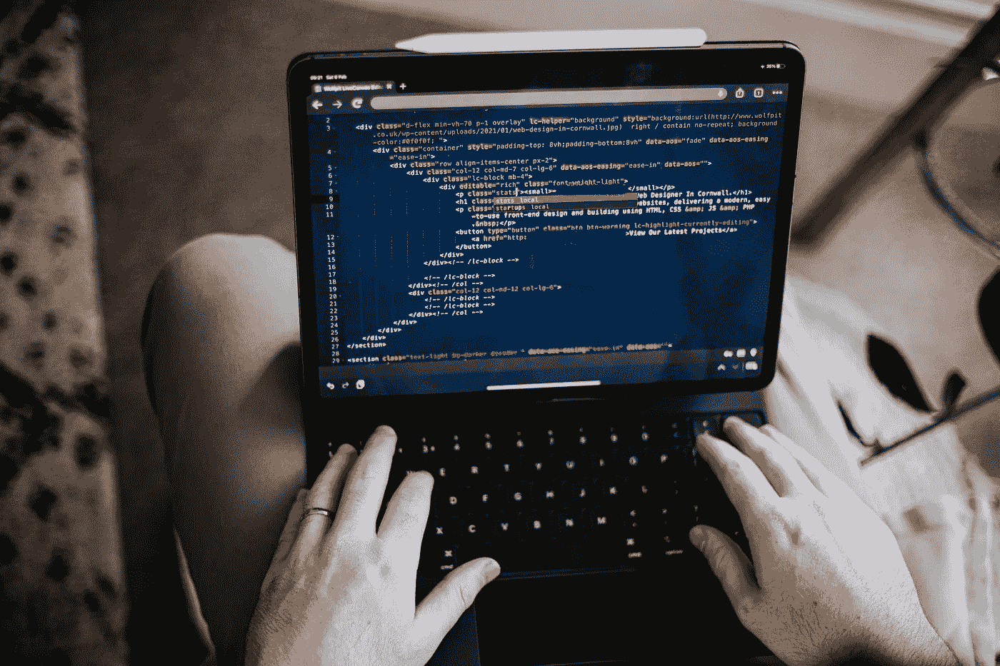
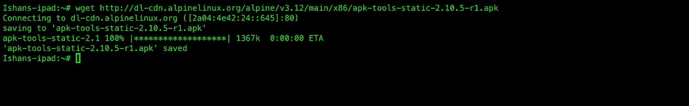
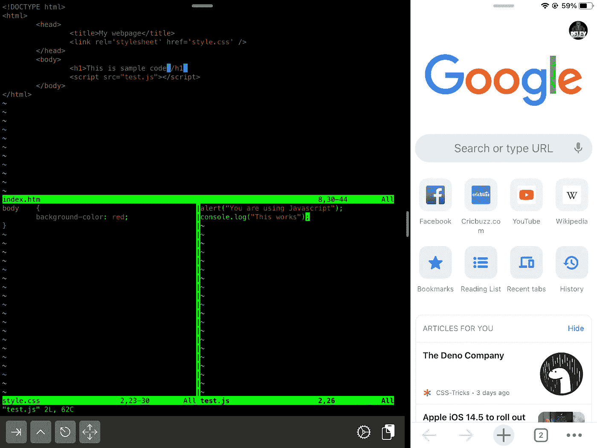
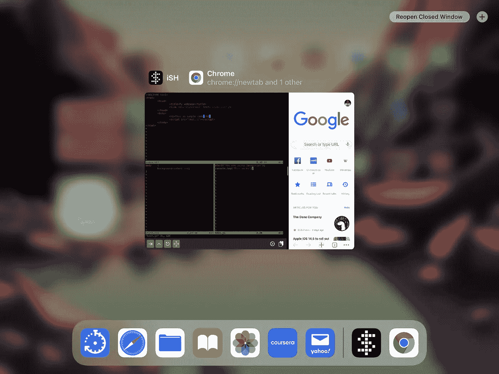
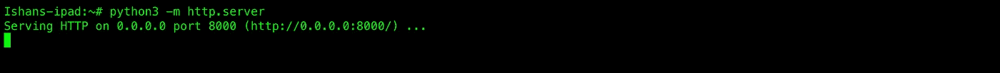
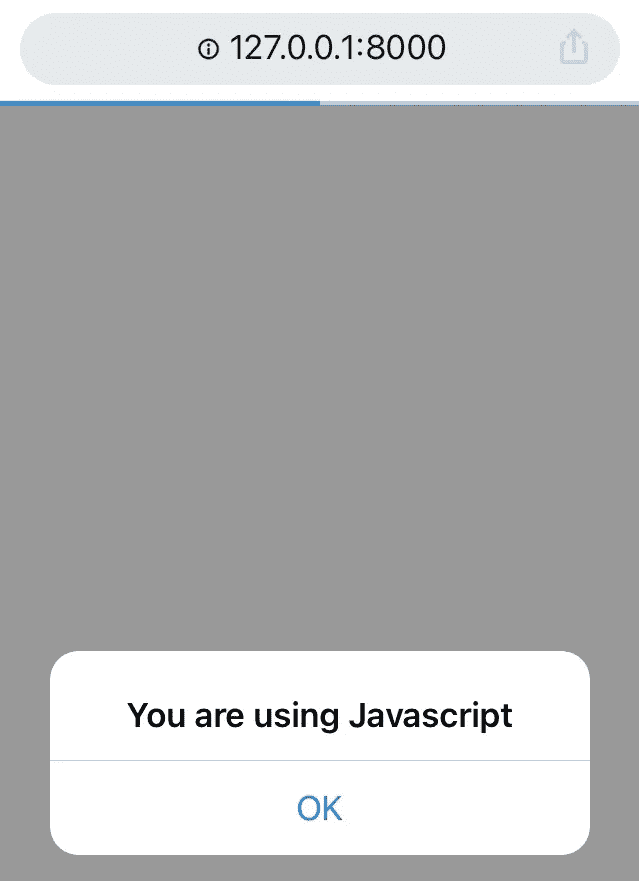
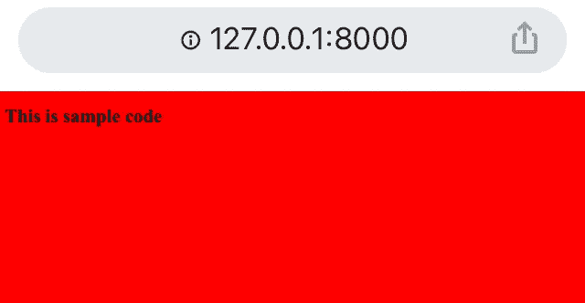
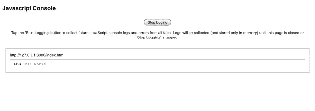

# 无论身在何处，如何设置 iPad 进行远程开发|代码！

> 原文：<https://levelup.gitconnected.com/code-wherever-you-are-how-to-setup-your-ipad-for-remote-development-2cb94a381b3d>



刺猬数码在 [Unsplash](https://unsplash.com/s/photos/ipad-coding?utm_source=unsplash&utm_medium=referral&utm_content=creditCopyText) 上拍摄的

今天，我将向您展示如何设置 iPad，使其成为您的开发环境。虽然我不建议你在 it 上进行非常大的项目，但我可以肯定地说，小项目可以很容易地进行。您可以不断测试自己环境的极限。

首先，我们将使用 App Store 上的一个免费应用程序，该程序适用于 iPhone 和 iPad。该应用程序的名字是 iSH shell，它运行 Linux。因此，如果您不习惯 Linux 命令，我建议您学习最基本的命令。

我还建议您在继续本教程之前学习如何使用 vim，因为我们将在 iPad 上使用 vim 作为我们的主要代码编辑器。Vim 有一个陡峭的学习曲线，但由于它使用了大量的键绑定，可以帮助您在编码时更有效率。

我们开始吧！所以先从 app store 下载 iSH shell。正如我之前提到的，它是完全免费的，你不需要支付任何费用。现在打开应用程序，输入这个命令来安装一个包管理器，这样就可以安装 node 和 python 等包了。

```
wget [http://dl-cdn.alpinelinux.org/alpine/v3.12/main/x86/apk-tools-static-2.10.5-r1.apk](http://dl-cdn.alpinelinux.org/alpine/v3.12/main/x86/apk-tools-static-2.10.5-r1.apk)
```



如果您收到这样的消息，那么这意味着软件包管理器已经安装。现在我们的下一步是安装一个代码/文本编辑器。为此，我们将使用 Vim。所以只需输入:

```
apk add vim
```

在我们继续之前，我想指出的是，出于演示的目的，我将它设置为一个 web 开发环境。现在让我们继续安装 python3:

```
apk add python3
```

现在我们可以开始编码了！所以让我们首先在分屏视图中打开另一个 iSH shell。你可以使用 iPads 的内置功能打开多个应用程序。现在让我们先创建一个文件。因此，在命令行中编写 vim 之后，只需输入文件名，就可以在 vim 中创建一个文件，如下所示:

```
vim index.htm
```

我将放入 HTML，CSS 和 JavaScript 代码，以显示它的工作。一旦文件打开，只要写下一些基本的 HTML 或者你可以复制我写的代码。您还可以创建一个 CSS 和 JavaScript 文件，看看我们的设置是否有效。

HTML:

```
<!DOCTYPE html>
<html>
     <head>
          <title>My webpage</title>
          <link rel=”stylesheet” href=”style.css” /> 
          <!—-You can create this later your self—>
     </head>
     <body>
           <h1>This is sample code</h1>
           <script src=”test.js”></script>
     </body>
```

CSS:

```
body {
      background-color: red;
}
```

JavaScript:

```
alert(“You are using JS”);
console.log(“This works!”);
```

现在，我强烈建议您在继续之前在 iPad 上安装 google chrome，以便我们可以在控制台上看到消息。首先，我将向您展示我是如何为开发而设置 windows 的:



这就是我如何编码并看到我的输出。为了运行一个实时服务器，我创建了一个新的 iSH 窗口。做那件事很简单。你所要做的就是在 iSH 应用程序中打开 dock，然后在 dock 中点击 iSH 应用程序。



点击顶部‘+’按钮打开一个新的 iSH shell 窗口。在这里，我运行我的实时服务器。好了，现在我们可以用 python 来做这件事。所以键入:

```
python3 -m http.server
```



现在切换回上一个窗口，如上所示。键入“127.0.0.1:8000”或它显示的任何端口号。端口号是冒号后显示的数字。这是将要发生的第一件事:



是的，这是我们的 Javascript 警告。现在如果你点击确定:



我们的 CSS 样式和 html 文本。此外，为了检查我们显示的标题是否正确，我们可以单击“显示所有选项卡”选项来查看我们设置的标题。现在我们的下一步也是最后一步是拥有一个 JavaScript 控制台。打开一个新的 chrome 标签，输入“chrome://inspect”。您将看到一个弹出页面，其中有一个“开始记录”按钮。点击那个。然后回到你的服务器页面并重新加载。关闭 JavaScript 警告后，返回到 chrome://inspect 页面，您会看到:



这就是我们在 JavaScript 代码中写的内容。原来如此。这就是你如何在编码环境中使用你的 iPad。到目前为止，我只在 web 开发中测试过这一点。我们也可以使用 python，因为我们通过它使用了实时服务器
。

好了，这篇博客到此为止。请在评论中让我知道这是否对你有用，以及到目前为止你用它做了什么。如果你认为其他人会觉得这很有帮助，请分享这个博客。

感谢阅读！