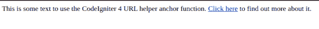
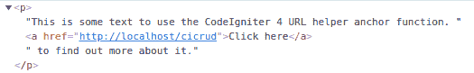
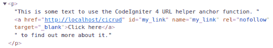

# CodeIgniter 4 anchor() URL 辅助函数

> 原文：<https://levelup.gitconnected.com/codeigniter-4-anchor-url-helper-function-c7eefbf7252c>

最近，我尽可能地依赖于 CodeIgniter 4 框架的每一个内置功能。我经常使用的一个工具是`anchor()` URL 帮助函数。继续阅读以了解更多关于此功能的信息…

图片来自 [Pixabay](https://pixabay.com/?utm_source=link-attribution&utm_medium=referral&utm_campaign=image&utm_content=3168021)

自我推销:

如果你喜欢这里写的内容，尽一切办法，把这个博客和你最喜欢的帖子分享给其他可能从中受益或喜欢它的人。因为咖啡是我最喜欢的饮料，如果你愿意，你甚至可以给我买一杯！

## 什么是 URL anchor()辅助函数

`anchor()`函数根据你的站点 URL 创建一个 HTML 锚标签(``)。

## 如何使用 URL anchor()帮助器

与许多其他 CodeIgniter 4 助手函数不同， [URL 助手](https://codeigniter.com/user_guide/helpers/url_helper.html)由框架在每个请求中自动提供。因此，由于您不必*手动*加载 URL 助手，因此在您的任何视图或标记中使用 [**anchor()** 函数](https://codeigniter.com/user_guide/helpers/url_helper.html#anchor)只需调用该函数即可。

CodeIgniter 4 `anchor()` URL helper 函数语法如下:

[PHP 和 MySQL 开发者简讯](http://openlamptech.substack.com)

假设我们的一个视图中有这个 HTML 标记:

在下面的截图中，我们可以看到在浏览器呈现的段落中已经创建了``元素:

CodeIgniter 4 anchor()函数在浏览器中显示元素。

如果你想支持这个博客和我的工作，在我的小费罐里放些零钱。谢谢大家！

检查 Chrome 开发者工具**元素**标签，我们可以看到原始的 HTML 代码:

注意，`base_url()`函数本质上是`href`属性，而第二个“*单击此处*”参数是位于开始和结束 HTML 锚标记之间的文本。

📝:函数`base_url()`也是 URL 助手库的一部分，它返回在站点配置中指定的基于站点的 URL。如果需要，这个函数也可以接受一个参数。

## URL helper anchor()函数:属性

CodeIgniter 4 `anchor()` URL 辅助函数根据您的需要接受可选的第三个属性参数——作为一个[关联数组](https://www.w3schools.com/php/php_arrays_associative.asp)或一个字符串。下面的例子涵盖了 PHP 代码的变化和在 Chrome 开发者控制台中看到的原始 HTML。

## 作为关联数组的属性

## 字符串形式的属性

正如您所看到的，在这两个实例中，``元素具有所有指定的属性。

## CodeIgniter 4 类似读数

我写过几篇关于 CodeIgniter 4 的博文。请随意访问下面的任何帖子，并与他人分享。谢谢！

*   [CodeIgniter 表单助手库一览](https://joshuaotwell.com/codeigniter-form-helper-library-at-a-glance/)(非现场链接)
*   [使用 CodeIgniter 的查询构建器进行 MySQL 聚合查询](https://joshuaotwell.com/mysql-aggregate-query-using-codeigniters-query-builder/)(非现场链接)
*   [如何在 CodeIgniter 4 中检索 MySQL 最后插入 ID](https://joshuaotwell.com/how-to-retrieve-mysql-last-insert-id-in-codeigniter-4/)(非现场链接)
*   [使用 CodeIgniter 4 表单助手启用文件附件](https://joshuaotwell.com/enable-file-attachment-with-codeigniter-4-form-helper/)(非现场克林)

一如既往，如果你有任何问题或看到代码中的任何错误，请通过评论让我知道。建设性的意见有助于我提供准确的博客帖子，我非常感激。感谢您的阅读！

[***订阅 PHP 和 MySQL 开发者简讯***](http://openlamptech.substack.com)

喜欢你读过的？看到什么不正确的吗？请在下面评论，感谢阅读！！！

# 行动的号召！

感谢你花时间阅读这篇文章。我真心希望你发现了一些有趣和有启发性的东西。请在这里与你认识的其他人分享你的发现，他们也会从中获得同样的价值。

访问 [Portfolio-Projects 页面](https://wp.me/P28ctb-3KD)查看我为客户完成的博客帖子/技术写作。

要在最新的博客文章发表时收到来自本博客(“数字猫头鹰散文”)的电子邮件通知(绝不是垃圾邮件)，请点击“点击订阅！”按钮在首页的侧边栏！(如有任何问题，请随时查看[数字猫头鹰的散文隐私政策页面](https://wp.me/P28ctb-3gI):电子邮件更新、选择加入、选择退出、联系表格等……)

请务必访问我的最佳博客文章的收集页面。

[作为一名 SQL 开发人员和博客写手，Josh Otwell](https://joshuaotwell.com/about/) 热衷于学习和成长。其他最喜欢的活动是让他埋头于一本好书、一篇文章或 Linux 命令行。其中，他喜欢桌面 RPG 游戏，阅读奇幻小说，并与妻子和两个女儿共度时光。

免责声明:本文中的例子是关于如何实现类似结果的假设。它们不是最好的解决方案。所提供的大多数(如果不是全部)示例都是在个人发展/学习工作站环境中执行的，不应被视为生产质量或就绪。您的特定目标和需求可能会有所不同。使用那些最有利于你的需求和目标的实践。观点是我自己的。

[**给我买杯咖啡！**](https://ko-fi.com/joshlovescoffee)

*原载于 2021 年 12 月 8 日 https://joshuaotwell.com***。**