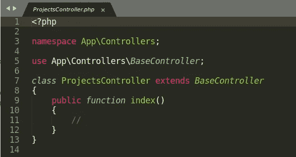
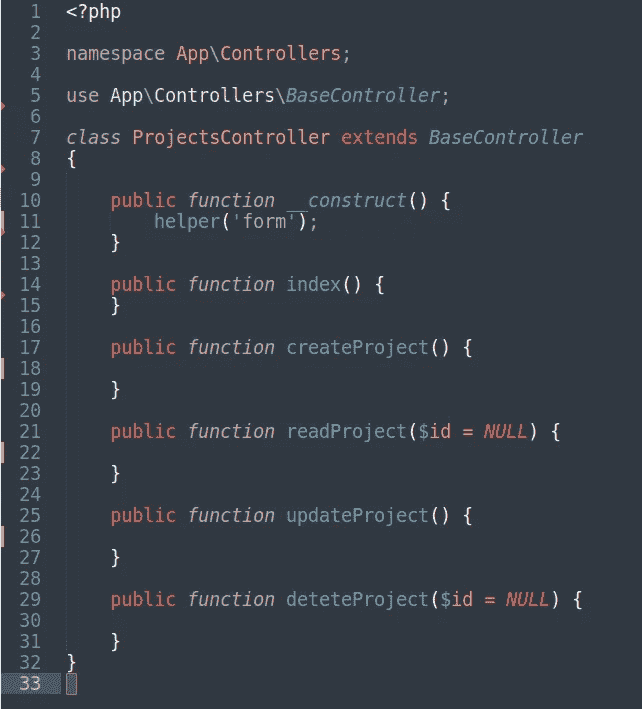
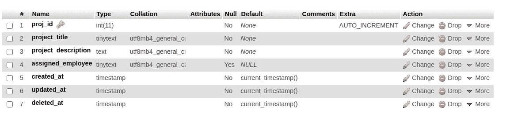
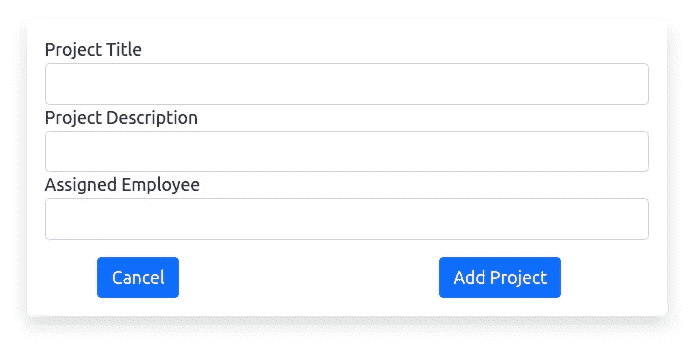
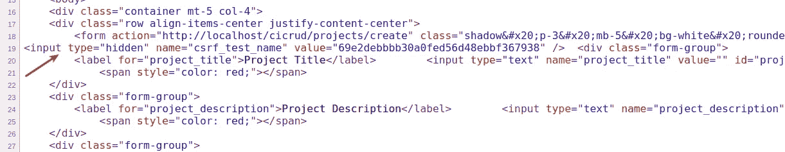
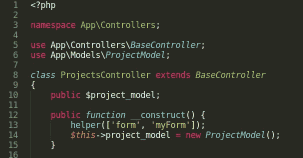
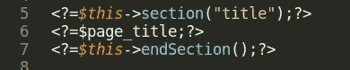
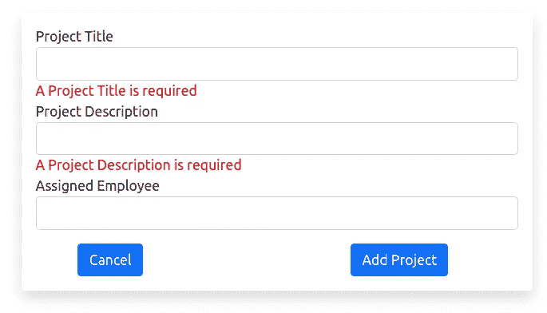
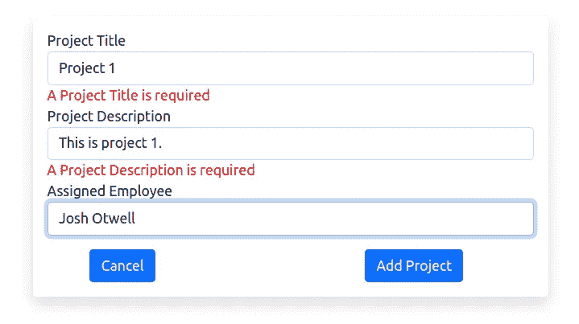
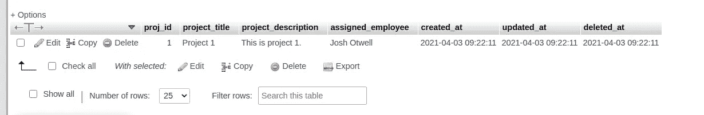

# 带有 MySQL 的 CodeIgniter 4 CRUD 系列:创建

> 原文：<https://levelup.gitconnected.com/codeigniter-4-crud-series-with-mysql-create-f2533edbd5e8>

CRUD 操作——创建、读取、更新和删除——在任何有数据存在的应用程序中都是不可或缺的。引入新的一行或多行数据属于 Create 的范畴，将在本文中讨论。

[CodeIgniter 4](https://codeigniter.com/user_guide/intro/index.html) 是一个强大的 PHP web 开发框架，使开发人员能够快速构建 web 应用程序，可选地遵循 [MVC 架构](https://www.tutorialspoint.com/mvc_framework/mvc_framework_introduction.htm)模式。除了许多内置的助手库之外，一个关键组件是 CodeIgniter 模型。模型中增加了跨应用程序通用的数据库 CRUD 操作方法，并在整个开发生命周期中使用。

你是[中](http://medium.com/)成员吗？如果是这样的话，[每次我在这里发表博客时都会收到电子邮件通知](https://parabollus.medium.com/subscribe)。不是会员？别担心！使用[我的注册链接](https://parabollus.medium.com/membership)(我将获得佣金，无需额外费用)并加入。加入后，你可以在平台上获得无限的文章，而不是只有 3 篇。我真的很喜欢阅读这里所有精彩的内容，我知道你也会喜欢的！！！

在这篇博文中，我将通过一个收集用户输入进行处理的简单 web 表单，使用 CodeIgniter 的模型类方法在 MySQL 表中创建数据。*示例应用程序*将是一个简单的*项目跟踪类型的列表。*

## 系列概述

这篇文章以及整个系列的大部分焦点都集中在内置的 *helper* 库、`CodeIgniter\Model`类以及特定于 CodeIgniter 4 框架的通用开发实践上。

期待这些主题的示例和覆盖范围:

*   控制器和视图创建
*   使用 CodeIgniter 模型和验证库进行表单数据验证
*   模型脚手架和设置
*   自定义 [URI 路由](https://codeigniter4.github.io/userguide/incoming/routing.html)

(**题外话**:虽然使用 CodeIgniter 4 时不需要，但我将使用 CodeIgniter 4 CLI 生成器来创建许多需要的文件。点击阅读文档[中关于这一便利功能的更多信息。)](https://codeigniter4.github.io/CodeIgniter4/cli/cli_generators.html)

## 创建控制器

在项目根级别的终端中，执行下面的`spark`命令，我创建了一个 ProjectsController 控制器文件:

`php spark make:controller Projects — suffix`

访问位于**/app/Controllers/ProjectsController . PHP**的 projects controller 文件，这个默认的*脚手架*已经包含:

初始项目控制器控制器文件。

我将使用 CodeIgniter 4 附带的 form helper 内置库(阅读更多关于[它提供的许多方法](https://link.medium.com/QBdPkIOWTeb))来创建应用程序中需要的任何表单。

## 加载表单帮助程序库

为了使 form helper 库可用于 ProjectsController 控制器中的所有方法，我在类构造函数中调用了`helper()`函数，如下所示:

除了 ProjectsController `index()`方法，我还创建了 4 个其他方法，每个方法代表 CRUD 操作的一个方面:

*   `createProject()`
*   `readProject($id = NULL)`
*   `updateProject()`
*   `deleteProject($id = NULL)`

由于包含了 ProjectsController 类构造函数方法和 4 个额外的 CRUD 操作方法，ProjectsController 控制器文件现在具有以下结构:

ProjectsController 控制器文件。

我们仍然需要*充实*这个`createProject()`方法，并且会随着博文的进展这样做。

## 创建 MySQL 表和附带的模型

所有数据都将存储在一个 MySQL 表中。使用 phpMyAdmin，我创建了一个“项目”表，其结构如下:

(**相关**:如果你有兴趣了解如何使用 phpMyAdmin ，我写了一篇关于[创建表格的帖子。)](https://link.medium.com/PaWVPnEPcfb)

我每周写一封关于我正在学习并感兴趣的 SQL/PHP 的邮件。如果这听起来像是你想参与的事情，[点击](https://digitalowlsprose.ck.page/1b35a06295)(非现场链接)了解更多信息。谢谢大家！

## CodeIgniter 4 模型 CRUD 方法

CodeIgniter 4 模型配备了 CRUD 操作所需的大部分功能。与其从头开始编写 CRUD 方法，不如节省开发时间，利用框架提供的 CRUD 方法。

使用下面的`spark`命令，我在 **/app/Models/** 目录中创建一个模型:

`php spark make:model project — return object — suffix`

`ProjectModel.php`模型文件有如下代码:

注意，CodeIgniter 4 CLI `spark make:model`命令创建了模型文件中使用的大部分代码。

事实上，只有`protected $table`属性是强制的。但是，我将使用其他几个可用的类属性，也就是说，我已经对其中的两个属性进行了编辑，使其包含以下信息:

*   `protected $primaryKey = ‘proj_id’;` —该列唯一标识表中的一条记录。
*   `protected $allowedFields = [‘project_title’, ‘project_description’, ‘assigned_employee’];` —仅允许使用`insert`和`update`方法编辑或更改该数组中指定的字段。

## CodeIgniter 4 数据验证

在控制器中处理数据验证是一个非常有效的选择，但是，我觉得对于可移植性来说，更好的选择是使用模型。

`protected $validationRules`和`protected $validationMessages`属性都已经设置了一些非常基本的验证规则和定制的验证消息:

**相关**:探索[在线文档](https://codeigniter4.github.io/userguide/libraries/validation.html#available-rules)中所有可用的数据验证规则。

我总是渴望一杯浓咖啡！！！

## 使用 CodeIgniter 4 表单助手库创建表单

为了获取项目数据信息，我们需要一个表单。我将广泛使用 CodeIgniter 的表单帮助库来创建表单。

在【create.php】/app/Views 文件夹中，我创建了一个文件**，其中包含以下代码:**

**CodeIgniter 4 表单帮助器库用于创建项目导入表单。**

## **home 和 CRUD 方法的 URL 路由**

**我们还需要几个路径，包括表单提交后的动作(`projects/create`)，以及如果单击**取消**按钮时返回的主页 URL。**

**我用一个 *home* route 修改了 **/app/Config/Routes.php** 文件，以显示在`projects`端点的所有数据，除了需要的*创建* route，命名为`projects/create`:**

*   **`$routes->get(‘projects’, ‘ProjectsController::index’);`**
*   **`$routes->match([‘post’, ‘get’], ‘projects/create’, ‘ProjectsController::createProject’);`**

****注意**:因为我对`GET`和`POST`请求都使用了`‘projects/create’`端点，所以我使用了`match()`方法。**

**在访问 URL**/CIC rud/projects/create**时，我们看到在浏览器中呈现的 **/app/Views/create.php** 文件中创建的表单:**

****

**用于收集数据的项目导入 web 表单。**

**(**注意**:我的示例项目的名称是 **cicrud，**如果 CodeIgniter 4 应用程序不在我的 Linux [XAMPP](https://www.apachefriends.org/index.html) 安装上，而是在 *live web* 上，它将是一个类似 www.cicrud.com 的站点地址。因此， **cicrud/projects/create** 的 URL 模式映射为:*site _ address*/*controller _ class*/*controller _ method)***

## **附加:CSRF 保护**

**CodeIgniter 4 自带[跨站请求伪造](https://owasp.org/www-community/attacks/csrf)保护开箱即用。但是， ***必须启用并配置*** 。**

**由于我使用的是表单助手库，`form_open()`方法会自动用应用程序的`csrf`标记创建一个隐藏的`input`字段。看到这个页面截图来源:**

****

**由 CodeIgniter 4 form helper 创建的内置 CSRF 令牌输入标记。**

**你必须参观**。env** 文件并启用 CSRF 保护，取消对该行的注释并将值改为`true`:**

**`app.CSRFProtection = true`**

**此外，编辑位于**/app/Config/filters . PHP**的文件，并取消注释该处`public $globals`关联数组中的*‘csrf’*值，如以下代码片段所示:**

## **整理项目控制器`createProject()`方法**

**上次我们看到，ProjectsController 控制器文件非常简单。特别是，`createProject()`方法是不完整和不起作用的，所以我将首先解决这个问题。**

**为了访问 ProjectModel 提供的验证处理和数据库方法，除了在 ProjectsController 控制器类构造函数中创建 ProjectModel 模型类的实例之外，我还用`use`语句将它包含在 ProjectsController 控制器文件中:**

****

**在 ProjectsController 中包含 ProjectModel。**

**下面的代码块显示了`createProject()`方法的最终实现(到目前为止):**

**createProject() CRUD 方法。**

**下面是一个快速的总结，涉及到这些独特的兴趣点。**

*   **`$data`关联数组被传递给**create.php**视图文件。它有两个键:`page_title`和`errors`。“`page_title`”键(希望名称是不言自明的)提供了页面标题，并呈现在这里的 **/app/Views/create.php** 文件中:**

****

**在 create.php 视图文件中呈现页面标题。**

*   **回想一下，每个表单`input`字段也有一个``标记，其中我有一个名为`displayModelValidationError()`的自定义错误消息函数，它接受两个参数:一个`$errors`变量和目标字段的名称。**

**(**注**:自定义助手函数`displayModelValidationError()`及其创建超出了本文的范围，不在本文讨论之列。)**

*   **`$errors`变量包含来自特定字段的 ProjectModel 模型验证的任何错误，如果该字段的提交数据未能通过验证。最初，没有验证错误，因此，当在浏览器中呈现表单时，`$errors`被设置为`NULL`。**
*   **我使用 [IncomingRequest 类](https://codeigniter4.github.io/userguide/incoming/incomingrequest.html)方法`getMethod()`，确定是否有`POST`请求被提交到这个 URL。在`if`条件中， [HTTP Requests](https://codeigniter.com/user_guide/concepts/http.html) `getVar()`方法用于从表单中检索每个字段的输入。所有表单域数据存储在一个`$project_data`关联数组中。**
*   **通过扩展 CodeIgniter\Model，ProjectModel 模型类自动继承了几个内置方法，包括在`createProject()`方法中调用的`insert()`方法——其中我将`$project_data`数组作为参数传入。数据验证由 ProjectModel 模型管理。如果`insert()`方法失败(返回`false`，验证错误消息将被返回并在浏览器中显示给用户。**

## **CodeIgniter 4 模型插入()方法**

**从[在线模型插入()文档](https://codeigniter4.github.io/userguide/models/model.html#saving-data)中，以下是该 CRUD 方法的描述:**

> **数据的关联数组作为在数据库中创建新数据行的唯一参数传递给该方法。数组的键必须与$表中的列名匹配，而数组的值是为该键保存的值**

## **测试表格提交和数据验证**

**为了测试数据验证是否有效，我将尝试存储一个空项目。**

**将所有字段留空并单击**添加项目**按钮，返回每个字段的错误，如该屏幕截图所示:**

****

**尝试存储不符合验证要求的数据失败。**

**注意，错误消息是在**/app/Models/project Model**Model`protected $validationMessages`属性中设置的。**

**但是，如果我填写了所有必填字段并提交了表格，如果没有验证错误，我将通过`redirect()->to()` [全局功能](https://codeigniter4.github.io/userguide/general/common_functions.html?highlight=redirect#redirect)重定向到主屏幕(未显示)。**

****

**填写所有必填字段并重新提交表单。**

**访问 phpMyAdmin 中的 MySQL‘projects’表，显示上面的 web 表单中新创建的行已经被存储:**

****

**成功地将数据存储在 phpMyAdmin 中。**

**我已经使用内置的 CodeIgniter\Model `insert()`方法在数据库中成功创建了一个新的数据行，涵盖了 CRUD 操作的创建部分。**

**我希望您喜欢 CodeIgniter 4 CRUD 系列的第一部分，以及 MySQL 博客文章系列。我对 CodeIgniter 4 研究、学习和使用得越多，我就越希望写下并与他人分享我所学到的东西。**

**请务必访问第二篇文章，在这篇文章中，我探讨了 CRUD 操作的读取方面。**

**一如既往，如果你有任何问题或看到代码中的任何错误，请通过评论让我知道。建设性的意见有助于我提供准确的博客帖子，我非常感激。感谢您的阅读**

**喜欢的内容，你在这个帖子里看过？那么你肯定会喜欢我博客上的博文，[数字猫头鹰的散文](http://joshuaotwell.com)(非现场链接)。**

**在那里你会找到关于 SQL 数据库开发/编程和 LAMP stack web 开发的博文。**