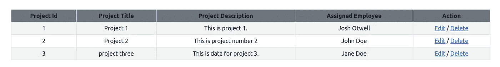
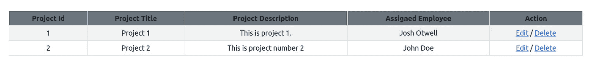

# 带有 MySQL 的 CodeIgniter 4 CRUD 系列:删除

> 原文：<https://levelup.gitconnected.com/codeigniter-4-crud-series-with-mysql-delete-97d81274ea80>

SQL `DELETE`命令用于从数据库表中删除现有数据。

也许你想删除所有的数据。一个未过滤的*`DELETE`就可以做到这一点(小心！！！).*

*另一方面，也许您需要更加*选择性地*删除哪一行。这就是带有`WHERE`条款的`DELETE`的用武之地。或者一个*过滤掉的*T4。*

## *带有 MySQL 的 CodeIgniter 4 CRUD 系列*

*请务必访问整个系列中的任何当前帖子，以了解最新情况:*

*   *[使用 MySQL 的 CodeIgniter 4 CRUD 系列:创建](/codeigniter-4-crud-series-with-mysql-create-f2533edbd5e8)*
*   *[带 MySQL 的 CodeIgniter 4 CRUD 系列:阅读](/codeigniter-4-crud-series-with-mysql-read-96c994e33e4e)*
*   *[带 MySQL 的 CodeIgniter 4 CRUD 系列:更新](/codeigniter-4-crud-series-with-mysql-update-876a6d20335a)*

**

*图片来自 [Pixabay](https://pixabay.com/?utm_source=link-attribution&utm_medium=referral&utm_campaign=image&utm_content=146096)*

*你是[中](http://medium.com/)成员吗？如果是这样，[每当我在这里发表博客文章时，都会收到电子邮件通知](https://parabollus.medium.com/subscribe)。不是会员？别担心！使用[我的注册链接](https://parabollus.medium.com/membership)(我会向你收取佣金，无需额外费用)并加入。我真的很喜欢阅读这里所有精彩的内容，我知道你也会喜欢的！！！*

## *CodeIgniter 4 模型 delete()方法*

*CodeIgniter 4 Model`delete()`method[documentation](https://codeigniter4.github.io/userguide/models/model.html#deleting-data)提供了这些信息(下面部分分享):*

> *将主键值作为第一个参数，并从模型的表中删除匹配的记录:*
> 
> *如果模型的$useSoftDeletes 值为 true，这将更新行以将 deleted_at 设置为当前日期和时间。您可以通过将第二个参数设置为 true 来强制永久删除。*
> 
> *主键数组可以作为第一个参数传入，以便一次删除多条记录*
> 
> *如果未传入任何参数，将像查询构建器的 delete 方法一样，需要事先调用 where:*

## *使用 delete()方法*

*在这篇文章中，我将介绍用 Model `delete()`方法只删除一条记录。*

*我们目前在 MySQL 数据库中有 3 个*项目*:*

**

*我已经在 **app/Config/Routes.php** 文件中添加了这条路径:*

*`$routes>get(‘projects/delete/(:num)’,‘ProjectsController::deleteProject/$1’);`*

*我每周写一封关于我正在学习并感兴趣的 SQL/PHP 的邮件。如果这听起来像是你想参与的事情，[在这里](https://digitalowlsprose.ck.page/1b35a06295)(非现场链接)了解更多。谢谢大家！*

## *控制器 deleteProject()方法*

*在 ProjectsController 控制器文件中，我有这个`deleteProject($id)`方法:*

*`deleteProject()`方法接受 1 个参数:表中行的`$id`，我们希望是`DELETE`。*

*单击项目三的**删除**链接，将其从 MySQL 表中完全删除，我们将被重定向回所有项目视图:*

**

*如上面截图中的 all projects 表所示，项目 3 已经使用 CodeIgniter 4 Model `delete()`方法从 MySQL 数据库表中删除，出现在从第 3 行开始的`if()`语句中，该行代码为:`$this->project_model->delete($id)`。*

*正如在`delete()`方法文档中提到的，提供主键作为单个参数会删除单独的数据行。*

*虽然这个操作在执行上很简单，但是在从数据库中删除记录时必须小心。除非你是在一个事务内操作，有机会执行一个`ROLLBACK`，被删除的记录都不见了。*

## *包扎*

*带有 MySQL 的 CodeIgniter 4 CRUD 系列现在已经完成。这篇文章是拼图的第四块也是最后一块*。我希望你喜欢这个系列，并从帖子中学到一些有价值的东西。**

*请随意留下您可能有的任何意见或建议。*

*一如既往，如果你有任何问题或看到代码中的任何错误，请通过评论让我知道。建设性的意见有助于我提供准确的博客帖子，我非常感激。感谢您的阅读*

*喜欢的内容，你在这个帖子里看过？那么你肯定会喜欢我博客上的博文，[数字猫头鹰的散文](http://joshuaotwell.com/)(非现场链接)。*

*在那里你会找到关于 SQL 数据库开发/编程和 LAMP stack web 开发的博文。*