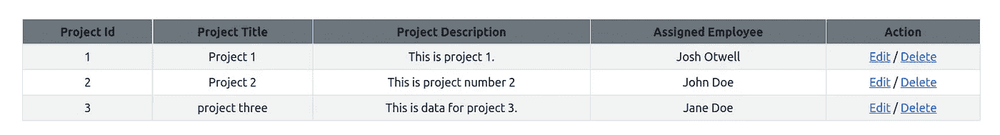

# 带 MySQL 的 CodeIgniter 4 CRUD 系列:阅读

> 原文：<https://levelup.gitconnected.com/codeigniter-4-crud-series-with-mysql-read-96c994e33e4e>

在文章[CodeIgniter 4 CRUD Series with MySQL:Create](/codeigniter-4-crud-series-with-mysql-create-f2533edbd5e8)中，我介绍了如何使用 CodeIgniter\Model 内置`insert()`方法在 MySQL 数据库表中创建新的数据行。有相当多的*样板文件*需要设置以使项目*启动并运行。*

这第二根柱子应该更直接，所有的*基础脚手架*都在适当的位置并被处理好。

## 读取数据

既然项目数据已经存在于数据库中，就有可能有人想要查看它。通常，读取数据是几个不同操作中的一个:

*   一种情况是，所有可用的数据都应该显示出来供查看，没有任何过滤或限制。
*   另一种常见的模式是选择一个特定的数据点或一组相似的数据点。换句话说，就是过滤数据。

你是[中级](http://medium.com/)会员吗？如果是这样，[每当我在这里发表博客文章时，都会收到电子邮件通知](https://parabollus.medium.com/subscribe)。不是会员？别担心！使用[我的注册链接](https://parabollus.medium.com/membership)(我将免费向你收取佣金)并加入。我真的很喜欢阅读这里所有精彩的内容，我知道你也会喜欢的！！！

CodeIgniter 4 模型具有内置的 CRUD 功能，因此基本上不需要重新创建已经存在的功能。

我们可以用来查找和过滤数据的两个 CodeIgniter 4 模型类方法是:

*   `find()` —从表中返回主键与所提供的第一个参数匹配的行。
*   `findAll()` —返回所有可用的行。

## 合并 find()和 findAll()方法

ProjectsController 控制器文件有一个`index()`方法，在访问 URL / **cicrud/projects** 时执行，正如在 **/app/Config/Routes.php** 文件中设置的那样。

Codeigniter\Model 类内置的`findAll()`方法返回模型的 protected `$table`类属性中指定的表中的所有行。使用`findAll()`，我们可以将检索到的数据传递给一个视图，在浏览器中显示所有结果，这就是 ProjectsController(默认)`index()`方法的作用:

项目表显示在浏览器中:

通过使用`findAll()`，我们不必手动编写任何 MySQL 查询，这在我看来并不是一件*坏事*。

我认为自己是一个 SQL 优先的开发人员。SQL 是我的热情、焦点和 T 型技能。因此，我完全有能力在需要时编写复杂的 SQL 查询。

但是，对于检索所有数据而不涉及聚合或分析函数的简单需求，利用现有功能代替编写定制代码和查询是有意义的。

在浏览器中显示项目表数据的 **project_index.php** 视图文件包含以下代码:

[**我总是起来喝一杯浓咖啡！！！**](https://ko-fi.com/joshlovescoffee)

在 **project_index.php** 视图文件中，一些*新的*——但与 CRUD 功能无关——是由 [CodeIgniter url 助手库](https://codeigniter.com/user_guide/helpers/url_helper.html)提供的`base_url()`和`anchor()`方法。

为了使用`url`助手，它被加载到 ProjectsController `__construct()`类的构造函数方法中，并在整个控制器中使用其他助手:

**找到一个具体的项目**

我在项目列表中添加了一个额外的项目(未显示),使总数达到 3:

如果我想更改项目三的任何信息，点击该行的**编辑**按钮，显示该表格和相关数据:

实际的更新功能将在一篇文章中单独介绍。在这一点上，我们正在为过滤一个特定的数据点——在这个例子中是一个单独的项目——并且要这样做，使用`find()`方法。

我每周写一封关于我正在学习并感兴趣的 SQL/PHP 的邮件。如果这听起来像是你想参与的事情，[在这里](https://digitalowlsprose.ck.page/1b35a06295)(场外链接)了解更多。谢谢大家！

## 筛选特定行的数据

那么单个项目表单是如何展示的呢？

我已经创建了一个视图文件， **edit_project.php，**，其中的代码显示了表单和数据:

我还修改了 **/app/Config/Routes.php** 文件并包含了这个路径:

在 ProjectsController 控制器文件中，我有一个包含以下代码的`readProject()`方法:

在这里，我向模型`find()`方法提供了`$id`值，并检索了一个特定的数据行，该数据行随后被返回到 **edit_project.php** 视图文件。

同样，CodeIgniter 4 模型 CRUD 方法可以轻松地为我们处理这个*基本*功能，而无需编写任何 MySQL 查询/语句。

够简单了吧？

## 概述

我们已经完成了这个系列的第 2 部分。我们已经看到了`find()`和`findAll()`模型方法如何使用很少的代码为我们返回所有数据或特定数据点。

在本系列的下一部分中，我们将使用 CRUD 方法根据更新的需要更改当前数据。

一如既往，如果你有任何问题或看到代码中的任何错误，请通过评论让我知道。建设性的意见有助于我提供准确的博客帖子，我非常感激。

## 相似阅读

*   【MySQL 之间的运算符查询包含吗？
*   [用 MySQL 中的 SUBSTRING()递归 CTE 乐趣](/recursive-cte-fun-with-substring-in-mysql-3a06fab881cd)
*   [使用 CodeIgniter 的查询构建器进行 MySQL 聚合查询](https://medium.com/an-idea/mysql-aggregate-query-using-codeigniters-query-builder-fbba11f5ef69)

喜欢的内容，你在这个帖子里看过？那么你肯定会喜欢我博客上的博文，[数码猫头鹰的散文](http://joshuaotwell.com)(站外链接)。

在那里你会找到关于 SQL 数据库开发/编程和 LAMP stack web 开发的博文。