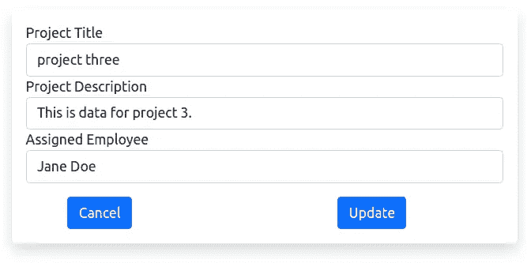
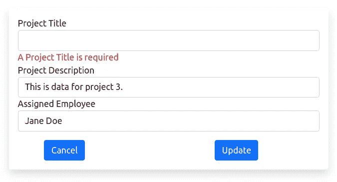

# 带有 MySQL 的 CodeIgniter 4 CRUD 系列:更新

> 原文：<https://levelup.gitconnected.com/codeigniter-4-crud-series-with-mysql-update-876a6d20335a>

数据很少保持不变。应用程序处理不断变化的数据。

用户更改个人资料信息。经理将项目分配或重新分配给员工。银行账户通过提款和存款进行更新。

你明白了。

**数据是不断变化的。**

图片来自 [Pixabay](https://pixabay.com/?utm_source=link-attribution&utm_medium=referral&utm_campaign=image&utm_content=1876659)

你是[中级](http://medium.com/)会员吗？如果是这样，[每当我在这里发表博客文章时，都会收到电子邮件通知](https://parabollus.medium.com/subscribe)。不是会员？别担心！使用[我的注册链接](https://parabollus.medium.com/membership)(我将免费向您收取佣金)并加入。我真的很喜欢阅读这里所有精彩的内容，我知道你也会喜欢的！！！

## SQL 更新命令

在 SQL 中，`UPDATE`命令改变*现有的*行数据。

恰好，CRUD 操作的 Update 元素与执行其功能的命令同名。

在帖子[CodeIgniter 4 CRUD Series with MySQL:Create](/codeigniter-4-crud-series-with-mysql-create-f2533edbd5e8)和 [CodeIgniter 4 模型文档](/codeigniter-4-crud-series-with-mysql-read-96c994e33e4e#saving-data)对这些方法的描述如下:

1.  `update()`:

> 更新数据库中的现有记录。第一个参数是要更新的记录的$primaryKey。数据的关联数组作为第二个参数传递给该方法。数组的键必须与＄表中的列名匹配，而数组的值是为该键保存的值:

> 2.`save()`:
> 
> 这是 insert()和 update()方法的包装器，根据是否找到与$primaryKey 值匹配的数组键，自动处理插入或更新记录:

## 控制器类别更新方法和路线

回想一下在**ProjectsController.php**控制器文件中，我有一个`updateProject()`方法，代码如下:

我还在**Routes.php**文件中为“`projects/update`”端点添加了一条路线:

`$routes->post(‘projects/update’, ‘ProjectsController::updateProject’);`

我每周写一封关于我正在学习并感兴趣的 SQL/PHP 的邮件。如果这听起来像是你想参与的事情，[在这里](https://digitalowlsprose.ck.page/1b35a06295)(非现场链接)了解更多。谢谢大家！

## 更新特定项目

和其他方法一样，我使用 Request `getMethod()`方法并验证提交的请求是一个`POST`请求。此时，所有表单域数据都用`getVar()`方法捕获，并根据数据类型进行清理。

接下来，我尝试使用 ProjectModel `project_model`实例和 Model `update()`方法更新现有数据。

在*所有项目*表格视图中，点击项目 3 的**编辑**链接，在浏览器中调出该表格:

ProjectModel 模型文件中规定的验证规则在这里仍然*起作用*，并且必须*遵守*用于更新操作。

如下面的截图所示，我从表单中删除了项目标题字段，并将其提交到后端进行处理。但是，对该字段的验证会返回相应的验证错误消息:

现在，我们已经确认了验证仍然适用于更新操作，我们可以继续更新这个特定的项目并查看更改。

`update()`方法接受两个参数，主键和数据的关联数组(表的列有匹配的键)。

在线上:

`$this->project_model->update($id, $project_data)`

我传入从表单提交中检索到的`$id`，以及关联数组`$project_data`中的其他表单字段数据。如果更新成功，用户将被重定向回 all-projects 视图。

但是，如果 Model `update()`方法失败并返回 false，用户将返回到`‘edit_project’`视图，并附带验证错误和该记录的数据。

相当直接。

还有 CodeIgniter 4 CRUD 系列与 MySQL 的更新部分。在下一篇文章中，我们将看到如何使用模型`delete()`方法移除数据。

## 相似阅读

享受我写的其他类似的博客帖子，并请与喜欢它们的人分享！谢谢大家！

*   [SQL 连接—简单指南](https://joshuaotwell.com/sql-joins-a-simple-guide/)(非现场链接)
*   [递归 CTE 乐趣与 MySQL 中的 SUBSTRING()](https://joshuaotwell.com/recursive-cte-fun-with-substring-in-mysql/)(场外链接)
*   [运算符查询之间的 MySQL 它们是包含性的吗？](https://joshuaotwell.com/mysql-between-operator-queries-are-they-inclusive/)(异地链接)

喜欢的内容，你在这个帖子里看过？那么你肯定会喜欢我博客上的博文，[数字猫头鹰的散文](http://joshuaotwell.com/)(站外链接)。

在那里你会找到关于 SQL 数据库开发/编程和 LAMP stack web 开发的博文。