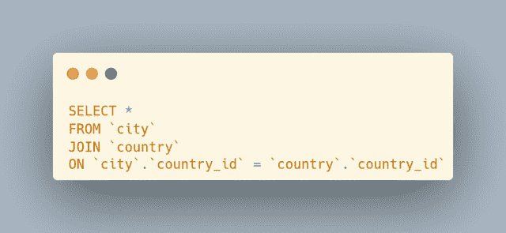
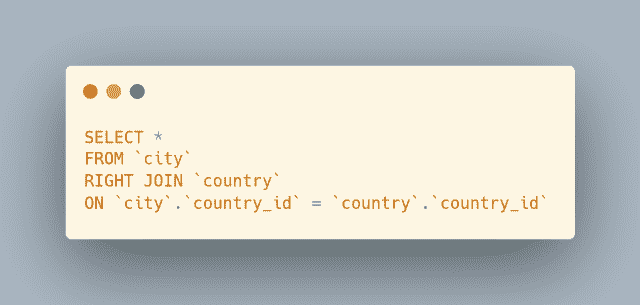
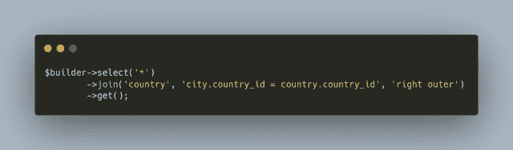

# CodeIgniter 4 查询生成器 join()方法解释

> 原文：<https://levelup.gitconnected.com/codeigniter-4-query-builder-join-method-explained-650f2cd522c8>

CodeIgniter 4 查询构建器类为框架中的数据库操作提供了类似于*ORM 的 T15 功能。作为开发人员，我们知道 SQL `JOIN`是基础性的，常常是检索正确数据所必需的。查询构建器类有一个专用的`join()`方法，在构造需要`JOIN`的查询时可以使用。继续阅读并学习如何使用 CodeIgniter 4 查询构建器`join()`方法…*


收到一本我的电子书，*《给每个人的 10 个 MySQL 技巧》*，**，*绝对免费*** 当你[订阅 ***OpenLampTech*** 简讯](http://openlamptech.substack.com)时。

**相关**:不确定什么是 SQL `JOIN`，或者有不同类型的`JOIN`可用？我已经写了一篇精彩的博文，介绍了`JOIN` s， [SQL 连接——一个简单的指南](https://joshuaotwell.com/sql-joins-a-simple-guide/)。

## 家政

我将使用`$db->getLastQuery()`方法记录和共享 MySQL `JOIN` s，这样我们就知道执行了哪些查询。我写了一篇高级概述，[CodeIgniter 4 Query Helper $ d b->getLastQuery()方法用于 SQL 原型制作](https://link.medium.com/HjTMPRYd9nb)，你可以阅读更多关于这个方便的内置方法的信息。

我将使用这个到著名的 Sakila 数据库的连接，作为本文中的示例查询:

```
$db = db_connect('sakilaGroup');
$builder = $db->table('city');
```

## CodeIgniter 4 查询生成器 join()方法语法

查询构建器`join()`方法可以在`$builder`或模型实例上调用:

```
$builder->join('join_table', on_condition, JOIN type)
```

*连接类型*参数是可选的，如果省略，默认为`INNER JOIN`。

可用的`JOIN`类型有:

*   内部的
*   左边的
*   正确
*   外面的
*   左侧外部
*   右侧外部

📝在撰写本文时，MySQL 或 MariaDB 不支持一个`OUTER JOIN`。有关 MySQL 加入的更多信息，请参见 [MySQL 在线加入文档](https://dev.mysql.com/doc/refman/8.0/en/join.html)。

加入***【MySQL 学习层】*** 会员，发现优质文章、深度指南、学习和教学视频等。拥有此会员资格，您可以访问未在任何地方发布的独家内容。随着新内容的定期添加，[继续学习任何级别的 MySQL](http://ko-fi.com/joshlovescoffee/tiers)。

## CodeIgniter 4 查询生成器 join()方法:内部

一个`INNER JOIN`是最常用的`JOIN`类型之一。这是`join()`方法的默认设置。如果您完全省略第三个参数，您将得到一个`INNER JOIN`(去掉可选的`INNER`关键字，因为默认的`JOIN`类型不需要它):


这个`join()`方法产生下面的 MySQL 查询，由`$db->getLastQuery()`返回:



正如在 MySQL `JOIN`查询中`INNER`关键字是可选的一样，CodeIgniter 4 查询构建器`join()`方法也是可选的。但是，如果需要，您可以将其作为第三个参数:


这也在服务器上执行一个`INNER JOIN`查询:


因为这种类型的`JOIN`不需要`INNER`关键字，所以这两个示例`JOIN`是等价的。

🔒请在我的 Kofi 页面上打开这篇优质文章来支持我的内容:[作为一名自学成才的开发人员，我认识到的 5 个事实](https://ko-fi.com/post/5-Truths-Ive-Come-To-Realize-As-a-Self-taught-Dev-R5R2BL9J6)。谢谢大家！🙏🏻

## CodeIgniter 4 查询生成器 join()方法:left

虽然`INNER JOIN`可能是最常见的`JOIN`类型，但`LEFT JOIN`的使用频率比人们想象的要高。事实上，有时使用`LEFT JOIN`是确保检索所有数据的最佳选择，包括匹配和不匹配的行。

在`join()`方法调用中，只需将“left”指定为第三个参数:


查询构建器的“左”`join()`方法变体产生一个 MySQL `LEFT JOIN`。


## CodeIgniter 4 查询构建器 join()方法:右

如在' left' `JOIN` *变体*中，您可以在`join()`方法调用中指定' right ',并执行一个`RIGHT JOIN`:


使用“右”第三个参数执行`join()`方法会产生一个`RIGHT JOIN` MySQL 查询:



感谢您的光临！今天用一个提示帮助支持我的内容。🙏

## CodeIgniter 4 查询构建器 join()方法—左外部和右外部

对于' outer' `JOIN`查询，`OUTER`关键字是可选的。但是，您也可以将它作为第三个参数中的`join()`方法调用的一部分，并生成等效的 MySQL `JOIN`查询:


如果你在这篇文章中发现了价值，你可以表达你的感激，并请我喝杯咖啡。这是我最喜欢的饮料！



## 额外收获:CodeIgniter 4 查询构建器 join()方法—表别名

您知道吗，您甚至可以在`join()`方法调用中为`JOIN`表分配它们自己的别名？你可以的！

作为第一个参数的一部分，包括连接表别名的*,然后在第二个参数中作为`ON`子句条件的一部分引用它:*


我发现在我的查询中集成`JOIN`时，使用 CodeIgniter 4 查询构建器`join()`方法变得简单而无缝。我希望你从这篇文章中学到了更多关于`join()`方法的知识。

一如既往，如果你有任何问题或看到代码中的任何错误，请通过评论让我知道。建设性的意见有助于我提供准确的博客帖子，我非常感激。感谢您的阅读。

## 相似阅读

除了这篇文章之外，你还可以阅读以下文章:

*   [OpenLampTech 第 15 期— CodeIgniter 4 select()方法深度](https://joshuaotwell.com/openlamptech-issue-15-codeigniter-4-select-methods-in-depth/)
*   [如何在 CodeIgniter 4 中检索 MySQL 最后插入 ID](https://joshuaotwell.com/how-to-retrieve-mysql-last-insert-id-in-codeigniter-4/)
*   [使用 AS 关键字的 MySQL 列别名](https://joshuaotwell.com/mysql-column-aliases-using-the-as-keyword/)

喜欢你读过的？看到什么不正确的吗？请在下面评论，感谢阅读！！！

# 行动的号召！

感谢你花时间阅读这篇文章。我真心希望你发现了一些有趣和有启发性的东西。请在这里与你认识的其他人分享你的发现，他们也会从中获得同样的价值。

访问 [Portfolio-Projects 页面](https://wp.me/P28ctb-3KD)查看我为客户完成的博客帖子/技术写作。

[**用咖啡支持我！**](https://ko-fi.com/joshlovescoffee)

要在最新的博客文章发表时收到来自本博客(“数字猫头鹰散文”)的电子邮件通知(绝不是垃圾邮件)，请点击“点击订阅！”按钮在首页的侧边栏！(如有任何问题，请随时查看 [Digital Owl 的散文隐私政策页面](https://wp.me/P28ctb-3gI):电子邮件更新、选择加入、选择退出、联系表格等……)

请务必访问[“最佳”](https://joshuaotwell.com/where-blog_post-in-digital-owls-prose-best-of/)页面，收集我的最佳博客文章。

[Josh Otwell](https://joshuaotwell.com/about/) 作为一名 SQL 开发人员和博客作者，他热衷于学习和成长。其他最喜欢的活动是让他埋头于一本好书、一篇文章或 Linux 命令行。其中，他喜欢桌面 RPG 游戏，阅读奇幻小说，并与妻子和两个女儿共度时光。

免责声明:本文中的例子是关于如何实现类似结果的假设。它们不是最好的解决方案。所提供的大多数(如果不是全部)示例都是在个人发展/学习工作站环境中执行的，不应被视为生产质量或就绪。您的特定目标和需求可能会有所不同。使用那些最有利于你的需求和目标的实践。观点是我自己的。

***有什么可以帮你的*** ？

*   免费 [MySQL 查询语法口头禅 PDF](https://ko-fi.com/s/3631fc7d00) 备忘单。记住这个咒语的查询语法顺序。
*   你想开一个博客吗？我用 WordPress 写博客。让我们都在提供的计划上省钱。💸
*   从[我的 Etsy 商店](https://www.etsy.com/shop/digitalowlsprose/)获取 Gmail HTML 电子邮件签名模板，让您的电子邮件更加醒目。✉️
*   需要托管你的下一个网络应用程序或 WordPress 网站吗？我使用并强烈推荐 [Hostinger](https://www.hostg.xyz/aff_c?offer_id=6&aff_id=94641) 。他们有很好的价格和服务。
*   🔒[作为一名自学成才的开发人员，我意识到的 5 个事实](https://ko-fi.com/post/5-Truths-Ive-Come-To-Realize-As-a-Self-taught-Dev-R5R2BL9J6)
*   今天就在我的 [Kofi 商店](https://ko-fi.com/joshlovescoffee#)发现优质的 MySQL 学习资料吧！

***披露*** :本帖中的部分服务和产品链接为附属链接。在没有额外费用给你，你应该通过点击其中一个购买，我会收到佣金。

当你[订阅 ***OpenLampTech*** 时事通讯](http://openlamptech.substack.com)时，收到一本我的电子书*《给每个人的 10 个 MySQL 技巧】****绝对免费*** 。

*原载于 2022 年 4 月 6 日 https://joshuaotwell.com*[](https://joshuaotwell.com/codeigniter-4-query-builder-join-method-explained/)**。**