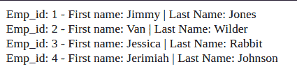
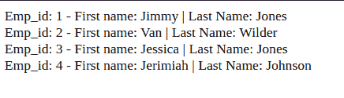
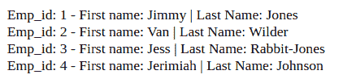

# 带有 update()的 CodeIgniter 4 查询构建器 set()函数

> 原文：<https://levelup.gitconnected.com/codeigniter-4-query-builder-set-function-with-update-a1f5839361e7>

CodeIgniter 4 查询构建器类有一个用于处理`UPDATE`数据操作语言(DML)命令的`update()`函数。使用`update()`作为一个独立的函数调用是完全有效的。然而，还有一个用于设置列值的`set()`函数，就像在 SQL `UPDATE`语句中使用`SET`关键字一样。与查询构建器的`where()`函数结合使用，你可以很容易地`UPDATE`一行或多行的列值。继续阅读了解更多信息…

图片由 [OpenIcons](https://pixabay.com/users/openicons-28911/?utm_source=link-attribution&utm_medium=referral&utm_campaign=image&utm_content=97588) 来自 [Pixabay](https://pixabay.com/?utm_source=link-attribution&utm_medium=referral&utm_campaign=image&utm_content=97588)

***披露*** :本帖部分服务和产品链接为附属链接。在没有额外费用给你，你应该通过点击其中一个购买，我会收到佣金。

自我推销:

如果你喜欢这里写的内容，尽一切办法，把这个博客和你最喜欢的帖子分享给其他可能从中受益或喜欢它的人。既然咖啡是我最喜欢的饮料，如果你愿意，你甚至可以给我买一杯！

***openlamp . tech***，面向 PHP 和 MySQL 开发者的时事通讯。[今天就订阅加入](http://openlamptech.substack.com)。学习成长。帮助建立一个社区。

我使用一个简单的' *employees* '表(MySQL)来举例说明这个虚构的数据:

所有员工信息。

我有一个带有 **all_emps()** 方法的基本 EmployeeModel，它提供了来自*‘employees’*表的所有数据，如上面的屏幕截图所示:

# 查询构建器 set()、update 和 where()函数

我已经在模型中创建了这个 **updateEmpLastName()** 方法，并使用查询构建器`set()`、`update()`和`where()`函数来编辑雇员的姓氏:

然后我们可以在我创建的名为 **updateLastName()** 的控制器方法中调用模型 **updateEmpLastName()** 方法:

您可以在下面的截图中看到，在调用控制器 **updateLastName()** 方法后，雇员“Jessica Rabbit”现在的姓氏是“Jones”:

使用查询生成器 set()、where()和 update()函数更新了 last_name 列。

如果你觉得我博客上的内容有价值，并且想支持我的工作，你可以在我的[小费罐](https://digitalowlsprose.ck.page/products/appreciation-support)里扔一些零钱。非常感谢！！！

# 查询构建器 set()函数—通过链接进行多次调用

通过*一个接一个地链接*，可以多次调用查询构建器`set()`函数，允许您一次在多个列上设置值。在这个下一个模型方法中，**updateEmpFirstAndLastName()**，I*chain*2 Query Builder`set()`共同作用；一个用于*‘名字’*列值，一个用于*‘姓氏’*列:

再次关注虚构的*员工 3* 、*‘杰西卡·琼斯’*，我用新数据更新了*‘名字’*和*‘姓氏’*列。结果见后续截图:

使用查询生成器 set()、update()和 where()函数更新了 first_name 和 last_name 列。

你是[中](http://medium.com/)成员吗？如果是这样，[在我每次发表博客文章时都会收到一封电子邮件通知](https://parabollus.medium.com/subscribe)如果你更喜欢中型平台。不是会员？别担心！使用[我的注册链接](https://parabollus.medium.com/membership)(我将获得佣金，无需额外费用)并加入。我真的很喜欢阅读所有伟大的内容，我知道你也会！！！

## CodeIgniter 4 查询生成器信息资源

请访问官方的 [CodeIgniter 4 文档](https://codeigniter4.github.io/userguide/index.html)了解帖子中涉及的任何功能:

一如既往，如果你有任何问题或看到代码中的任何错误，请通过评论让我知道。建设性的意见有助于我提供准确的博客帖子，我非常感激。感谢您的阅读。

## 关闭

查询构建器`set()`函数也可以与`insert()`函数调用一起使用，我计划在以后的博客文章中介绍这种用法。请务必订阅我的免费时事通讯， [OpenLamp.tech](http://openlamptech.substack.com/) ，这是一份面向 PHP/MySQL 开发人员的时事通讯，并关注 PHP 和 SQL 相关内容的最新动态。

喜欢你读过的？看到什么不正确的吗？请在下面评论，感谢阅读！！！

# 行动的号召！

感谢你花时间阅读这篇文章。我真心希望你发现了一些有趣和有启发性的东西。请在这里与你认识的其他人分享你的发现，他们也会从中获得同样的价值。

访问[投资组合-项目页面](https://wp.me/P28ctb-3KD)，查看我为客户完成的博客帖子/技术写作。

我非常喜欢喝咖啡。帮我一把！

要在最新的博客文章发表时收到来自本博客(“数字猫头鹰散文”)的电子邮件通知(绝不是垃圾邮件)，请点击“点击订阅！”按钮在首页的侧边栏！(如有任何问题，请随时查看 [Digital Owl 的散文隐私政策页面](https://wp.me/P28ctb-3gI):电子邮件更新、选择加入、选择退出、联系表格等……)

请务必访问[“最佳”](https://joshuaotwell.com/where-blog_post-in-digital-owls-prose-best-of/)页面，收集我的最佳博文。

[Josh Otwell](https://joshuaotwell.com/about/) 作为一名 SQL 开发人员和博客作者，他热衷于学习和成长。其他最喜欢的活动是让他埋头于一本好书、一篇文章或 Linux 命令行。其中，他喜欢桌面 RPG 游戏，阅读奇幻小说，并与妻子和两个女儿共度时光。

免责声明:本文中的例子是关于如何实现类似结果的假设。它们不是最好的解决方案。所提供的大多数(如果不是全部)示例都是在个人发展/学习工作站环境中执行的，不应被视为生产质量或就绪。您的特定目标和需求可能会有所不同。使用那些最有利于你的需求和目标的实践。观点是我自己的。

***OpenLamp.tech*** ，面向 PHP 和 MySQL 开发者的简讯。[今天就加入](http://openlamptech.substack.com)我们。一起学习，一起成长。

***有什么可以帮你的*** ？

*   你想开一个博客吗？我用 WordPress 写博客。让我们都在提供的计划上省钱。💸
*   从[我的 Etsy 商店](https://www.etsy.com/shop/digitalowlsprose/)获取 Gmail HTML 电子邮件签名模板，让您的电子邮件更加醒目。✉️
*   需要托管你的下一个网络应用程序或 WordPress 网站吗？我使用并强烈推荐 [Hostinger](https://www.hostg.xyz/aff_c?offer_id=6&aff_id=94641) 。他们有很好的价格和服务。

*原载于 2021 年 12 月 22 日*[*https://joshuaotwell.com*](https://joshuaotwell.com/codeigniter-4-query-builder-set-function-with-update/)T22。