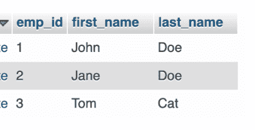
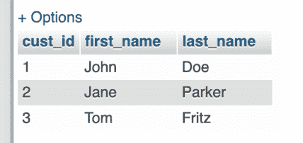
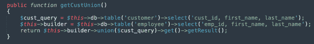
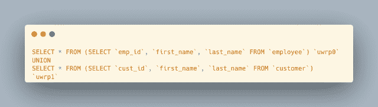
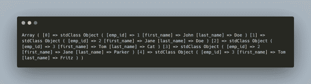
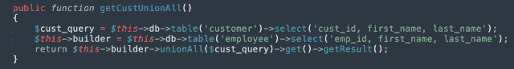
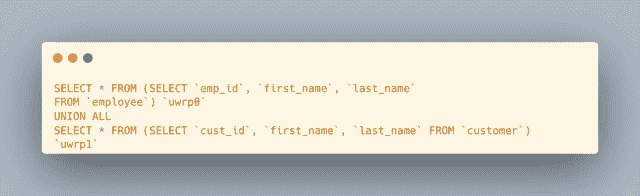
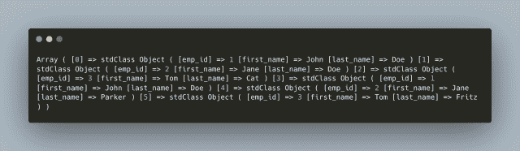

# CodeIgniter 4 查询生成器 union()和 unionAll()方法

> 原文：<https://levelup.gitconnected.com/codeigniter-4-query-builder-union-and-unionall-methods-de00668e785c>

`UNION`和`UNION ALL`集合运算符返回一个或多个`SELECT`查询的组合行。CodeIgniter 4 查询构建器现在支持分别使用`$builder->union()`和`$builder->unionAll()`方法的`UNION`和`UNION ALL`查询。在本文中学习如何创建这些类型的查询。

这篇文章和后面的许多文章是我写的一系列文章的一部分，当我学习新概念的时候，我会分享这些文章。作为一名自学成才的开发人员，我认为分享我所学到的东西是一种责任。在我们继续学习和成长的过程中，我们都需要相互支持。**# buildinpublic****# learn inpublic****# indie hacker****# developer**

## PHP 和 MySQL 开发人员的时事通讯

收到一本我的电子书，*《给每个人的 10 个 MySQL 技巧》*，**，*绝对免费*** 当你[订阅 ***OpenLampTech*** 简讯](http://openlamptech.substack.com)。

## 数据设置和内务管理

对于示例查询，我使用了两个包含最少数据的简单表，一个是 customer 和 employee 表:



雇员表数据示例



示例客户表数据

在我正在使用的模型类中，我还有这两个受保护的属性:

```
protected $db;
protected $builder;
```

我将使用`$db->getLastQuery()`方法记录(未显示)所有执行的查询。关于 `[$db->getLastQuery()](/codeigniter-4-query-helper-db-getlastquery-method-for-sql-prototyping-b8c7d78f18a1?sk=df1ec71ed16aef4d74435eb8e8e017af)`我在过去已经有[深入写过，所以这里就不赘述了。](/codeigniter-4-query-helper-db-getlastquery-method-for-sql-prototyping-b8c7d78f18a1?sk=df1ec71ed16aef4d74435eb8e8e017af)

## CodeIgniter 4 查询生成器$builder->union()方法

关于这两个表的一个经典的数据库练习问题可能是:*“在一个表中显示所有的雇员和客户。”*

通过使用`$builder->union()`方法，我们完全可以用`UNION`做到这一点。



对`$builder->union()`的调用产生了等效的`UNION`查询，如 MySQL 代码所示:



**我的观察**:看看执行的 SQL 语句，马上就会发现一些有趣的事情:

*   两个`SELECT`语句实际上都在查询一个派生表。
*   每个`SELECT`语句都被自动赋予一个别名，其中“uwrp0”是主查询，任何后续的`SELECT`作为具有“uwrp+n”的`UNION`的一部分

请注意，在下面的关联数组结果中，尽管在 customer 和 employee 表中都有一个*‘John Doe’*行，但只有一个元素用于*‘John Doe’*记录。

`$builder->union()`只返回没有重复的非重复行。



在 ***OpenLampTech*** 时事通讯中[投放可负担得起的分类广告，让您的品牌、产品或服务得到应有的关注。谢谢大家的支持！](https://ko-fi.com/s/7dfe9ce108)

## CodeIgniter 4 查询生成器$builder->unionAll()方法

在这种情况下，您需要返回所有行——包括重复的——`$builder->unionAll()`方法可以做到这一点:



我们可以在下面的 MySQL 代码中看到，`$builder->unionAll()`方法中使用了`UNION ALL`集合操作符:



请注意，在下面的关联数组中，employee 和 customer 表中的*‘John Doe’*行都包括在内，因为`$builder->unionAll()`返回所有行:



CodeIgniter 4 不断改进框架，发布的版本使您能够使用查询构建器创建强大的固定查询。请在下面的评论中告诉我你是否已经移植或者正在你的模型查询中使用任何`$builder->union()`和/或$ `builder->unionAll()` 方法。

## 附加阅读

*   [如何在 CodeIgniter 4 中检索 MySQL 最后插入 ID](https://joshuaotwell.com/how-to-retrieve-mysql-last-insert-id-in-codeigniter-4/)
*   [CodeIgniter 4 查询参数绑定与 MySQL 中的例子](https://joshuaotwell.com/codeigniter-4-query-parameter-binding-with-examples-in-mysql/)
*   [CodeIgniter 4 查询构建器 join()方法讲解](https://joshuaotwell.com/codeigniter-4-query-builder-join-method-explained/)

感谢你阅读这篇文章。请与同样喜欢它的人分享。

[**用一杯咖啡支持我的内容！**](https://ko-fi.com/joshlovescoffee)

[Josh Otwell](https://joshuaotwell.com/about/) 热衷于成为 PHP 开发人员、SQL 专家和技术博客/作家。

免责声明:本文中的大多数示例都是在个人发展/学习工作站环境中执行的，不应将 ***视为生产质量或就绪*** 。您的特定目标和需求可能会有所不同。像往常一样，**你能做某件事并不意味着你应该做**。我的观点是我自己的。

***我能帮助的更多方面***

*   开博客？我用 WordPress 来写数字猫头鹰的散文博客。让我们都在提供的计划上省钱
*   在[***OpenLampTech***时事通讯](http://openlamptech.substack.com/)中投放价格合理的分类广告，让您的品牌、产品或服务得到应有的关注。
*   需要托管你的下一个网络应用程序或 WordPress 网站吗？我强烈推荐 [Hostinger](https://www.hostg.xyz/aff_c?offer_id=6&aff_id=94641) ，用它们来托管[我的小众鲈鱼钓鱼网站](http://louisianabassnation.com/)。该服务是首屈一指的，他们提供免费的 SSL。
*   作为一名自学成才的开发人员，我逐渐认识到的 5 个事实

***披露*** :本帖部分服务和产品链接为附属链接。在没有额外费用给你，你应该通过点击其中一个购买，我会收到佣金。

## PHP 和 MySQL 开发人员的时事通讯

当你[订阅***【OpenLampTech】***时事通讯](http://openlamptech.substack.com)时，收到一本我的电子书*《给每个人的 10 个 MySQL 技巧】****绝对免费*** 。

通过在 ***OpenLampTech*** 时事通讯中投放价格合理的分类广告，让您的品牌、产品或服务获得所需的关注[。谢谢大家的支持！](https://ko-fi.com/s/7dfe9ce108)

*原载于 2022 年 12 月 7 日 https://joshuaotwell.com**[*。*](https://joshuaotwell.com/codeigniter-4-query-builder-union-and-unionall-methods/)*