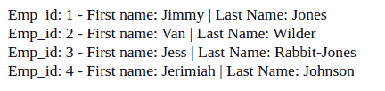
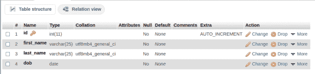
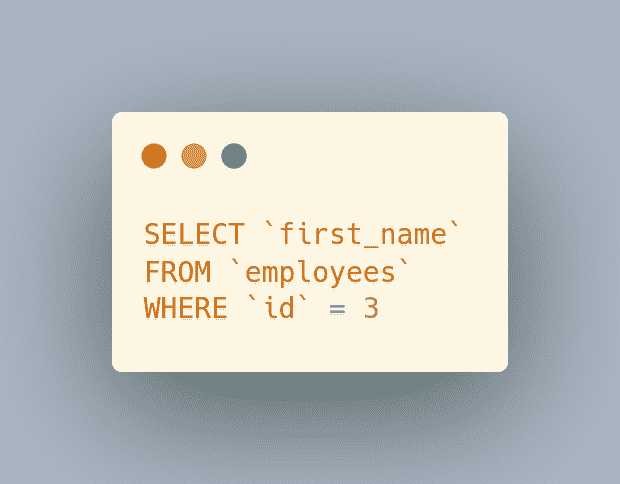
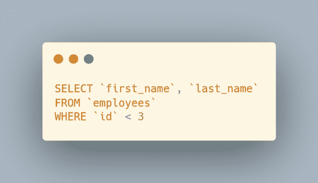
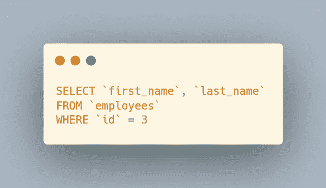
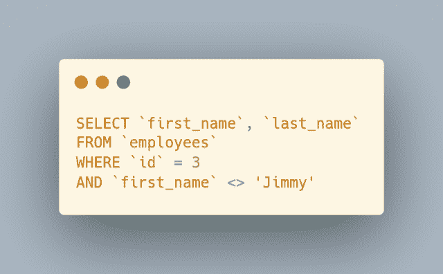
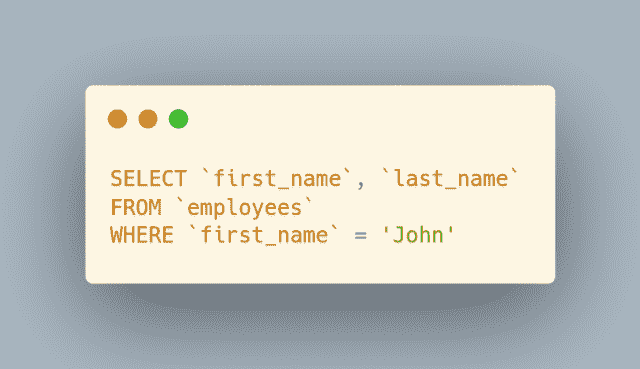

# CodeIgniter 4 查询生成器 where()函数和参数结构与 MySQL

> 原文：<https://levelup.gitconnected.com/codeigniter-4-query-builder-where-function-and-parameter-structure-with-mysql-932bfccd659d>

在 SQL 中，`WHERE`子句使用一个或多个搜索条件过滤器过滤由`SELECT`查询中的`FROM`子句表返回的行。在应用程序开发中，我们经常接受用户输入值，这些值反过来是针对表列的`WHERE`子句条件过滤器。在这篇文章中，我将介绍 CodeIgniter 4 `where()`函数和参数绑定，以便在`SELECT`查询中进行更安全的过滤。继续阅读并查看 MySQL 中的示例…


来自 [Pixabay](https://pixabay.com/?utm_source=link-attribution&utm_medium=referral&utm_campaign=image&utm_content=4941301) 的 [IO-Images](https://pixabay.com/users/io-images-1096650/?utm_source=link-attribution&utm_medium=referral&utm_campaign=image&utm_content=4941301) 图像

每天通过 Refind 将定制的文章发送到您的收件箱。Refind 是我日常阅读习惯的一部分。使用[我的推荐链接](https://refind.com/joshua-otwell?invite=5440c95e39)让它成为你的一部分。在不增加您费用的情况下，我将有资格通过我的链接获得更多注册的高级订阅。****网络的精华，每天早上都在你的收件箱里。免费订阅****

**自我推销:**

**如果你喜欢这里写的内容，尽一切办法，把这个博客和你最喜欢的帖子分享给其他可能从中受益或喜欢它的人。既然咖啡是我最喜欢的饮料，如果你愿意，你甚至可以给我买一杯！**

*****OpenLampTech*** 是面向 PHP/MySQL 开发者的简讯。获得每周发送到您收件箱的最佳策划和原创内容。免费的。了解更多信息…**

## **内务处理和使用的数据**

**对于本文中的例子，我使用的是一个*模拟*“雇员”表，它的数据和结构如下:**

********

**对于本帖中的查询示例，我还使用这个查询构建器连接实例连接到“雇员”表:**

```
**$db = \Config\Database::connect();
$builder = $db->table('employees');**
```

**为了更好地理解每个查询示例，我将分享通过来自`$db->getLastQuery()`方法的日志信息发送到服务器的确切查询。如果您还没有使用过这个方法，我强烈推荐您使用它来理解执行的查询。我在帖子[CodeIgniter 4 Query Helper $ d b->getLastQuery()method for SQL prototyping](/codeigniter-4-query-helper-db-getlastquery-method-for-sql-prototyping-b8c7d78f18a1)中写了所有相关内容。**

## **CodeIgniter 4 查询生成器 where():键值**

**有几种不同的方法可以为 CodeIgniter 4 `where()`函数提供参数。最简单的方法之一是简单的键/值对。**

**只需指定一个目标表列作为第一个参数，并指定一个对应的值作为第二个参数来过滤该列:**

**上面的构建器模式返回这个由`$db->getLastQuery()`记录的`SELECT`查询:**

****

**请注意，这个特殊的 CodeIgniter 4 `where()`功能键/值结构使用=比较操作符进行相等比较。这是默认设置，除非您在 key 参数中使用不同的比较运算符。**

## **CodeIgniter 4 查询生成器 where():自定义键值**

**下一个可选的`where()`函数参数语法为键/值结构提供了很大的灵活性，允许实际的比较操作符成为第一个参数中键本身的一部分。**

**我们可以看到，键“`id <`”使用小于比较运算符，导致对“id”列值小于 3 的行进行`SELECT`查询过滤，如以下执行的 MySQL 查询代码所示:**

****

***链接*一个或多个额外的`where()`函数调用形成一个`AND`逻辑运算符类型的查询:**

**(**注**:附加`where()`函数链接在所有形式的参数结构中都有效，并且 ***不仅限于*** 自定义键/值过滤。)**

****

**让你的 WordPress 网站或网络应用程序在 [Hostinger](https://www.hostinger.com/) 上运行。我用主机托管我所有的个人网络开发应用和项目。价格等级是行业中最好的，服务也是其他任何服务都无法比拟的。使用[我的推荐链接](https://www.hostg.xyz/aff_c?offer_id=6&aff_id=94641)获得您的主机。在绝对没有额外的费用给你，我会收到一笔佣金，如果你通过这个链接购买 Hostinger 的托管计划之一。谢谢大家！**

## **CodeIgniter 4 查询生成器 where():关联数组**

**CodeIgniter 4 `where()`函数参数结构可以使用一个[关联数组](https://www.w3schools.com/php/php_arrays_associative.asp)用于过滤条件。**

**创建一个带有键/值对的关联数组，并将该数组作为参数传递给`where()`函数调用。同样，关键字是我们正在筛选的表中的一列:**

****

**关联数组可以有多个键/值对，包括作为键一部分的比较运算符本身。注意，在下一个例子中，`<>`(不等于)比较运算符是`$data_array`关联数组的第二个元素中“名字”键的一部分:**

****

**向我的[小费罐](https://digitalowlsprose.ck.page/products/appreciation-support)捐款支持我的博客和内容。非常感谢！**

## **CodeIgniter 4 查询生成器 where():自定义字符串**

**我们将访问的最后一个参数结构是为 CodeIgniter 4 `where()`函数创建您自己的自定义字符串。如 [where()函数文档](https://codeigniter.com/user_guide/database/query_builder.html#looking-for-specific-data)， ***中所述，为`where()`函数创建自定义查询字符串*** 时，您必须手动转义任何用户提供的输入。在到目前为止的`where()`函数示例中，输入参数已经被自动转义。但是，当您将自定义查询字符串作为`where()`函数参数编写时，输入不会自动转义。**

**下面是一个使用`$db->escape()`方法对‘John’的`$first_name`变量值进行转义的例子:**

****

**使用`where()`函数为查询构建`WHERE`子句条件的几个选项，CodeIgniter 提供了一种灵活的方法来检索您需要的确切数据。**

## **相似内容**

**如果你喜欢这篇文章的内容，你可能也会喜欢这些相关的文章:**

*   **[如何在 CodeIgniter 4 中检索 MySQL 最后插入 ID](https://joshuaotwell.com/how-to-retrieve-mysql-last-insert-id-in-codeigniter-4/)**
*   **[使用 CodeIgniter 的查询生成器进行 MySQL 聚合查询](https://joshuaotwell.com/mysql-aggregate-query-using-codeigniters-query-builder/)**
*   **[使用 CodeIgniter 4 表单助手启用文件附件](https://joshuaotwell.com/enable-file-attachment-with-codeigniter-4-form-helper/)**

**你是[中](http://medium.com/)成员吗？如果是这样的话，[每次我发表博客文章时都会收到一封电子邮件通知](https://parabollus.medium.com/subscribe)如果你更喜欢中型平台的话。不是会员？别担心！使用[我的注册链接](https://parabollus.medium.com/membership)(我将免费向您收取佣金)并加入。我真的很喜欢阅读所有伟大的内容，我知道你也会！！！**

**一如既往，如果你有任何问题或看到代码中的任何错误，请通过评论让我知道。建设性的意见有助于我提供准确的博客帖子，我非常感激。感谢您的阅读。**

**喜欢你读过的？看到什么不正确的吗？请在下面评论，感谢阅读！！！**

# **行动的号召！**

**感谢你花时间阅读这篇文章。我真心希望你发现了一些有趣和有启发性的东西。请在这里与你认识的其他人分享你的发现，他们也会从中获得同样的价值。**

**访问 [Portfolio-Projects 页面](https://wp.me/P28ctb-3KD)查看我为客户完成的博客帖子/技术写作。**

**[**咖啡是我最喜欢的饮料！**](https://ko-fi.com/joshlovescoffee)**

**要在最新的博客文章发表时收到来自本博客(“数字猫头鹰散文”)的电子邮件通知(绝不是垃圾邮件)，请点击“点击订阅！”按钮在首页的侧边栏！(请随时查看 [Digital Owl 的散文隐私政策页面](https://wp.me/P28ctb-3gI)，了解您可能有的任何问题:电子邮件更新、选择加入、选择退出、联系表格等……)**

**请务必访问[“最佳”](https://joshuaotwell.com/where-blog_post-in-digital-owls-prose-best-of/)页面，收集我的最佳博客文章。**

**[Josh Otwell](https://joshuaotwell.com/about/) 作为一名 SQL 开发人员和博客作者，他热衷于学习和成长。其他最喜欢的活动是让他埋头于一本好书、一篇文章或 Linux 命令行。其中，他喜欢桌面 RPG 游戏，阅读奇幻小说，并与妻子和两个女儿共度时光。**

**免责声明:本文中的例子是关于如何实现类似结果的假设。它们不是最好的解决方案。所提供的大多数(如果不是全部)示例都是在个人发展/学习工作站环境中执行的，不应被视为生产质量或就绪。您的特定目标和需求可能会有所不同。使用那些最有利于你的需求和目标的实践。观点是我自己的。**

***有何贵干？***

*   ***你想开一个博客吗？我用 WordPress 写博客。让我们都在提供的计划上省钱。💸***
*   ***从[我的 Etsy 商店](https://www.etsy.com/shop/digitalowlsprose/)获取 Gmail HTML 电子邮件签名模板，让您的电子邮件更加醒目。✉️***
*   ***需要托管你的下一个网络应用程序或 WordPress 网站吗？我使用并强烈推荐 [Hostinger](https://www.hostg.xyz/aff_c?offer_id=6&aff_id=94641) 。他们有很好的价格和服务。***
*   ***我喜欢每天早上在你的收件箱里阅读 Refind: *网络的精髓。免费订阅*。通过我的推荐链接为您自己[注册，帮助我获得高级订阅。](https://refind.com/joshua-otwell?invite=5440c95e39)***
*   **抓住一个[免费的手机包*创作者*壁纸](https://click.convertkit-mail4.com/d0uvkov9k4s0h22640am/p8hehqu9xxnm2zbr/aHR0cHM6Ly9zcGFya2xwLmNvL2pvc2h1YWMwM2U2Mw==)。**
*   **刚入门还是想学 MySQL？在这里找到我的[高级博客文章和 MySQL 初学者系列](https://digitalowlsprose.ck.page/03da7bb182)。**

*****OpenLampTech*** 是面向 PHP/MySQL 开发者的简讯。今天就免费订阅这份刊物吧！**

*****披露*** :本帖中部分服务和产品链接为附属链接。在没有额外费用给你，你应该通过点击其中一个购买，我会收到佣金。**

**【https://joshuaotwell.com】原载于 2022 年 2 月 2 日[](https://joshuaotwell.com/codeigniter-4-query-builder-where-function-and-parameter-structure-with-mysql/)**。****