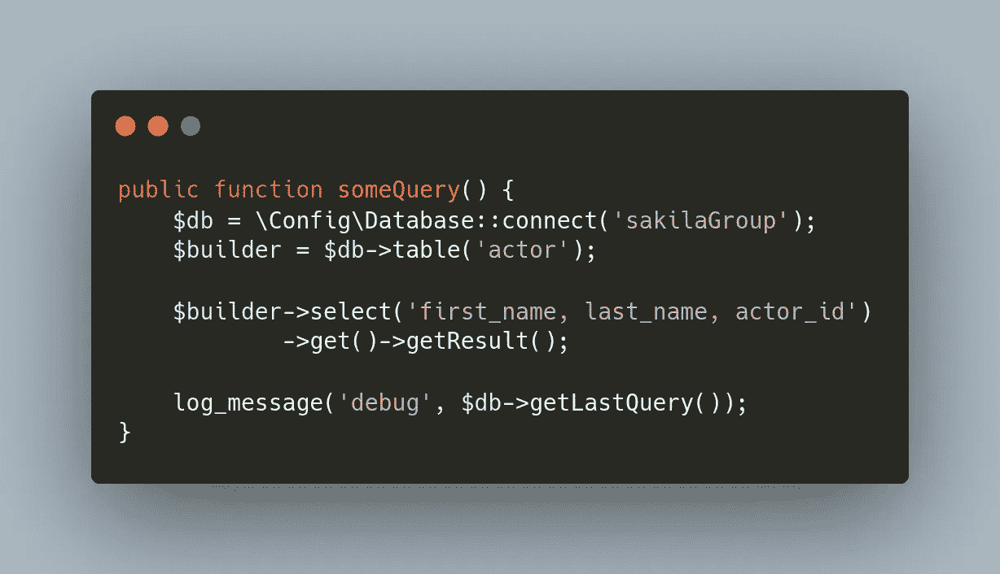

# CodeIgniter 4 查询助手$db->getLastQuery()方法用于 SQL 原型

> 原文：<https://levelup.gitconnected.com/codeigniter-4-query-helper-db-getlastquery-method-for-sql-prototyping-b8c7d78f18a1>

在开发程序和应用程序时，我们总是在代码中调试或原型化一些东西。

作为一名 *SQL 优先*类型的开发人员，我喜欢编写复杂的 SQL 查询，因此，*将它们通过*移植到我正在使用的任何 ORM(或 *ORM-like* 特性，如 CodeIgniter 4 查询构建器类)上。

我已经在几个项目中大量使用了 CodeIgniter 4 PHP 框架(我真的真的很喜欢它),并希望分享我在使用 MySQL 查询的 Query Builder 方法时的一个首选*工作流*。

 [## 如何在 CodeIgniter 4 中检索 MySQL 最后插入 ID

### 我在学习、个人项目和应用程序开发中大量使用 CodeIgniter 4。在这篇文章中，我涵盖了 2…

levelup.gitconnected.com](/how-to-retrieve-mysql-last-insert-id-in-codeigniter-4-c727e68b3efb) 

你是[中级](http://medium.com/)会员吗？如果是这样，[每当我在这里发表博客文章时，都会收到电子邮件通知](https://parabollus.medium.com/subscribe)。不是会员？别担心！使用[我的注册链接](https://parabollus.medium.com/membership)(我将获得佣金，无需额外费用)并加入。我真的很喜欢阅读这里所有精彩的内容，我知道你也会喜欢的！！！

## 查询助手$db->getLastQuery()

如果您也在使用 CodeIgniter 4，并且想知道您的查询构建器`$builder`方法如何*映射出*到实际执行的 SQL，您可以使用[查询助手](https://codeigniter.com/user_guide/database/helpers.html) `[$db->getLastQuery()](https://codeigniter.com/user_guide/database/queries.html#the-query-class)` [方法](https://codeigniter.com/user_guide/database/queries.html#the-query-class)并且(可选)使用[全局](https://codeigniter.com/user_guide/general/common_functions.html?highlight=log_message#log_message) `[log_message()](https://codeigniter.com/user_guide/general/common_functions.html?highlight=log_message#log_message)` [函数](https://codeigniter.com/user_guide/general/common_functions.html?highlight=log_message#log_message)记录查询。

[OpenLamp.tech](http://openlamptech.substack.com) ， ***针对 PHP/MySQL 开发者的简讯*** 。立即注册(这是免费的)并帮助建立社区。

为了便于理解，举一个我在一个模型类中创建的下面的`someQuery()`方法，从众所周知的 [sakila 实践数据库](https://dev.mysql.com/doc/sakila/en/)中设置“actor”表上的`$db->table()`方法:

使用 CodeIgniter 4 的 getLastQuery()方法进行调试。

下面是`$db->getLastQuery()`的记录结果:

`$db->getLastQuery()`方法返回发送到 MySQL 数据库的查询。因此，通过使用`log_message()`记录查询，您可以看到实际的 SQL 查询，并根据需要进行相应的调整。

对于复杂的查询——通常等同于复杂的`$builder`模式——这是原型化和调试查询中不可或缺的方法。

我一直使用`$db->getLastQuery()`方法。我希望你也能在你的工作流程中找到它的用处！

[OpenLamp.tech](http://openlamptech.substack.com) ，**，*PHP/MySQL 开发者快讯*，**。立即注册(这是免费的)并帮助建立社区。

 [## CodeIgniter 4 anchor() URL 辅助函数

### 最近，我尽可能依赖 CodeIgniter 4 框架的每一个内置功能。一个我已经…

levelup.gitconnected.com](/codeigniter-4-anchor-url-helper-function-c7eefbf7252c)  [## OpenLamp.tech 第 3 期—你应该知道的 5 个 MySQL 字符串函数

### 这周的 OpenLamp.tech，PHP/MySQL 开发人员的时事通讯，已经出版了，它是每月一期的…

parabollus.medium.com](https://parabollus.medium.com/openlamp-tech-issue-3-5-mysql-string-functions-you-should-know-efd900b14c4f) 

一如既往，如果你有任何问题或看到代码中的任何错误，请通过评论让我知道。建设性的意见有助于我提供准确的博客帖子，我非常感激。感谢您的阅读！

我总是在我的博客上写关于 SQL、PHP 和 CodeIgniter 的文章。此外，我正在用我的免费每周简讯 [OpenLamp.tech](http://openlamptech.substack.com) 建立一个由志同道合的 PHP/MySQL 开发人员组成的社区，如果你注册的话，我会非常感激。