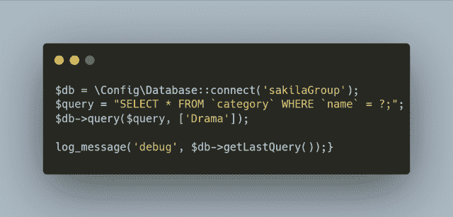
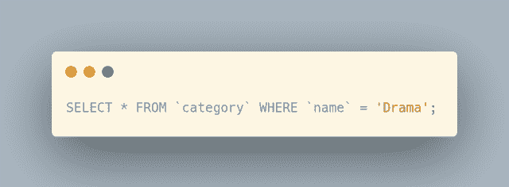
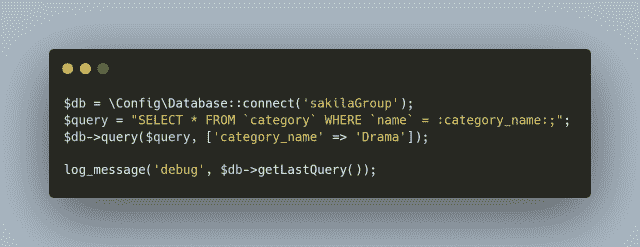
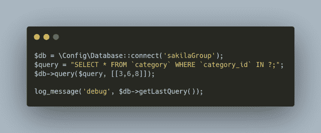

# CodeIgniter 4 查询参数绑定与 MySQL 中的示例

> 原文：<https://levelup.gitconnected.com/codeigniter-4-query-parameter-binding-with-examples-in-mysql-1729c6c532ef>

尽管 CodeIgniter 4 查询构建器类方法和函数非常强大和有用，但有时您需要手工制作自己的查询。也许它们很复杂。或者，您更愿意编写原始的 SQL 语句。了解如何安全地使用您需要的输入——通常作为`WHERE`子句条件的一部分——通过 MySQL 中的例子使用 2 种不同的参数绑定变体。

来自 [Pixabay](https://pixabay.com/?utm_source=link-attribution&utm_medium=referral&utm_campaign=image&utm_content=27203) 的[Clker-Free-Vector-Images](https://pixabay.com/users/clker-free-vector-images-3736/?utm_source=link-attribution&utm_medium=referral&utm_campaign=image&utm_content=27203)的图像

当你[订阅 ***OpenLampTech*** 时事通讯](http://openlamptech.substack.com)时，就能收到一本我的电子书*《给每个人的 10 个 MySQL 技巧】】。*

## 查询生成器 where()函数

**相关**:阅读我在 CodeIgniter 4 查询构建器 where()函数上写的[详细指南，了解更多关于各种可用参数结构的信息。](https://joshuaotwell.com/codeigniter-4-query-builder-where-function-and-parameter-structure-with-mysql/)

对于这篇博文中的例子，我将记录并显示通过使用`$db->getLastQuery()`方法发送到服务器的查询。在本文的[中阅读并了解更多关于`$db->getLastQuery()`的信息。](https://joshuaotwell.com/codeigniter-4-query-helper-getlastquery-method-mysql-prototyping/)

## 位置参数绑定

位置参数绑定(`?`)在 SQL 标准中定义，CodeIgniter 4 也支持。

在第一个例子中，我使用了`WHERE`子句条件过滤器``name` = ?`，并在`$db->query()`方法的第二个`array()`参数中提供了过滤器值‘Drama ’:

下面我们看到从`$db->getLastQuery()`发送到服务器的查询:

用[提示](https://digitalowlsprose.ck.page/products/appreciation-support)帮助支持这个博客和内容。谢谢大家！

## 命名绑定

您不仅可以使用位置参数绑定，还可以在查询中使用命名占位符绑定。

只需用冒号将命名绑定括起来，并使用一个关联数组作为`$db->query()`方法中的第二个参数:

同样，我们看到从`$db->getLastQuery()`记录的发送到服务器的确切查询:

通过在 ***OpenLampTech*** 时事通讯中投放价格合理的分类广告，让您的品牌、产品或服务获得所需的关注[。谢谢大家的支持！](https://ko-fi.com/s/7dfe9ce108)

## ()中的位置参数绑定

如果您需要在任何查询中使用`IN()`操作符，也可以使用位置参数绑定。

在`IN`关键字后放置“`?`”(没有任何括号，它们将被自动包含)，并在`$db->query()`的第二个数组参数中包含一个数组值:

注意，该查询有带值的`IN()`操作符。

尽管本文中的示例查询非常简单，但是您现在已经知道如何在 CodeIgniter 4 中使用参数绑定和`query()`方法，以满足更复杂的查询需求。

喜欢你读过的？看到什么不正确的吗？请在下面评论，感谢阅读！！！

# 行动的号召！

感谢你花时间阅读这篇文章。我真心希望你发现了一些有趣和有启发性的东西。请在这里与你认识的其他人分享你的发现，他们也会从中获得同样的价值。

访问 [Portfolio-Projects 页面](https://wp.me/P28ctb-3KD)查看我为客户完成的博客帖子/技术写作。

我爱死咖啡了！

要在最新的博客文章发表时收到来自本博客(“数字猫头鹰散文”)的电子邮件通知(绝不是垃圾邮件)，请点击“点击订阅！”按钮在首页的侧边栏！(请随时查看 [Digital Owl 的散文隐私政策页面](https://wp.me/P28ctb-3gI)，了解您可能有的任何问题:电子邮件更新、选择加入、选择退出、联系表格等……)

请务必访问[“最佳”](https://joshuaotwell.com/where-blog_post-in-digital-owls-prose-best-of/)页面，收集我的最佳博文。

作为一名 SQL 开发人员和博客作者，Josh Otwell 热衷于学习和成长。其他最喜欢的活动是让他埋头于一本好书、一篇文章或 Linux 命令行。其中，他喜欢桌面 RPG 游戏，阅读奇幻小说，并与妻子和两个女儿共度时光。

免责声明:本文中的例子是关于如何实现类似结果的假设。它们不是最好的解决方案。所提供的大多数(如果不是全部)示例都是在个人发展/学习工作站环境中执行的，不应被视为生产质量或就绪。您的特定目标和需求可能会有所不同。使用那些最有利于你的需求和目标的实践。观点是我自己的。

*有何贵干？*

*   *免费 [MySQL 查询语法真言 PDF](https://ko-fi.com/s/3631fc7d00) 备忘单。记住这个咒语的查询语法顺序。*
*   *你想开一个博客吗？我用 WordPress 写博客。让我们都在提供的计划上省钱。*
*   *通过在 ***OpenLampTech*** 时事通讯中投放价格合理的分类广告，让您的品牌、产品或服务获得所需的关注度。*
*   *需要托管你的下一个网络应用程序或 WordPress 网站吗？我使用并强烈推荐 [Hostinger](https://www.hostg.xyz/aff_c?offer_id=6&aff_id=94641) 。他们有很好的价格和服务。*
*   *[作为一名自学成才的开发人员，我逐渐认识到的 5 个事实](https://ko-fi.com/post/5-Truths-Ive-Come-To-Realize-As-a-Self-taught-Dev-R5R2BL9J6)*
*   *今天就在我的[科菲商店](https://ko-fi.com/joshlovescoffee#)发现优质的 MySQL 学习材料吧！*

****披露*** :本帖部分服务和产品链接为附属链接。在没有额外费用给你，你应该通过点击其中一个购买，我会收到佣金。*

*订阅***【OpenLampTech】***简讯即可获赠一本我的电子书*【给大家的 10 个 MySQL 小技巧】****绝对免费*** [。](http://openlamptech.substack.com)*

*通过在 ***OpenLampTech*** 时事通讯中投放价格合理的分类广告，让您的品牌、产品或服务获得所需的关注[。谢谢大家的支持！](https://ko-fi.com/s/7dfe9ce108)*

**原载于 2022 年 7 月 27 日 https://joshuaotwell.com**[*。*](https://joshuaotwell.com/codeigniter-4-query-parameter-binding-with-examples-in-mysql/)**

# **分级编码**

**感谢您成为我们社区的一员！在你离开之前:**

*   **👏为故事鼓掌，跟着作者走👉**
*   **📰查看[升级编码出版物](https://levelup.gitconnected.com/?utm_source=pub&utm_medium=post)中的更多内容**
*   **🔔关注我们:[Twitter](https://twitter.com/gitconnected)|[LinkedIn](https://www.linkedin.com/company/gitconnected)|[时事通讯](https://newsletter.levelup.dev)**

**🚀👉 [**加入升级人才集体，找到一份惊艳的工作**](https://jobs.levelup.dev/talent/welcome?referral=true)**