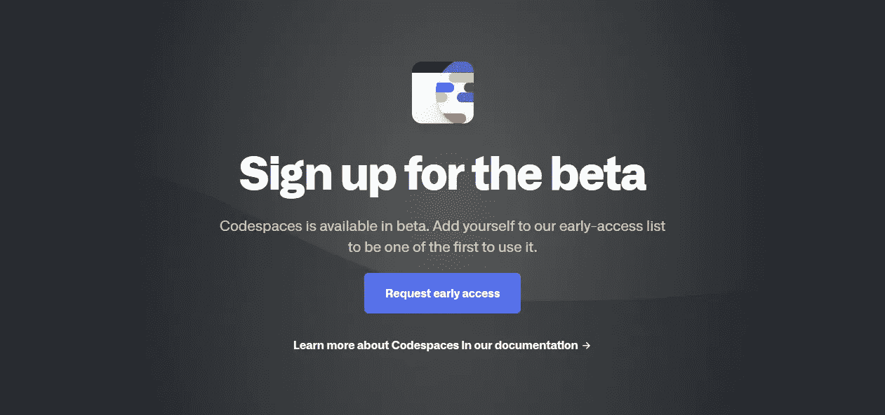
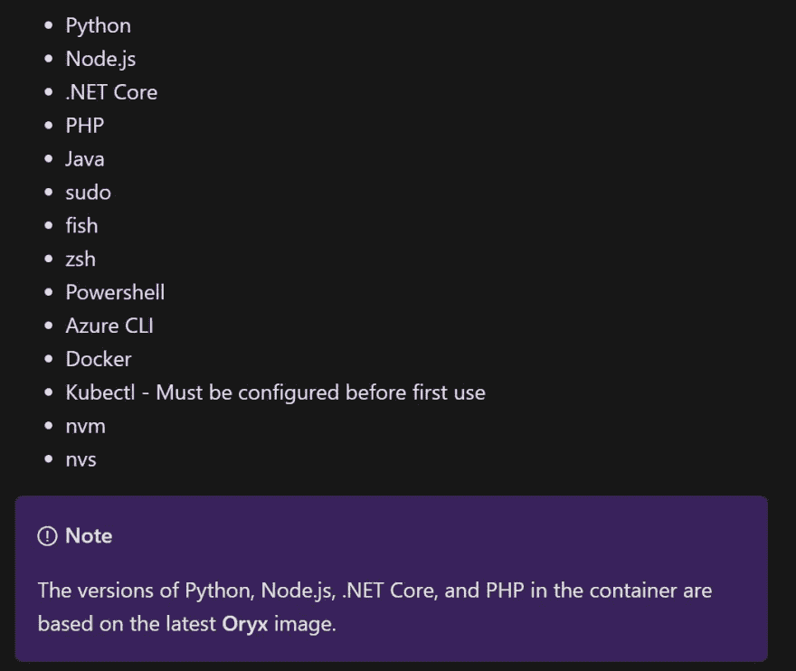
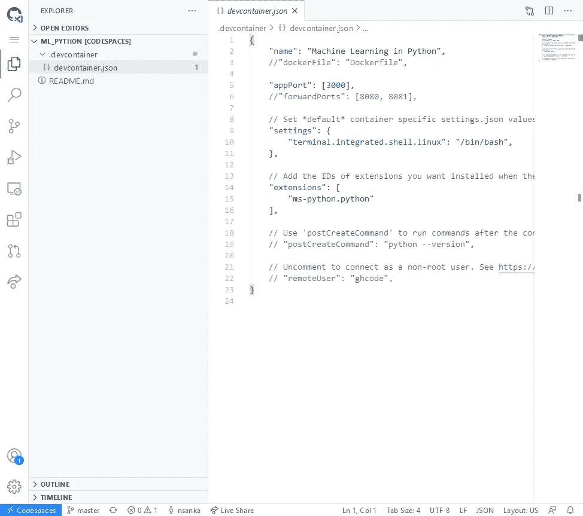

# GitHub 中的代码空间

> 原文：<https://levelup.gitconnected.com/codespaces-in-github-6457533fc7f1>

创建和设置 Python 开发环境

# 介绍

GitHub Codespaces 就是运行在 Azure 中的 Linux 上的 Visual Studio 代码，使用你的 GitHub 帐户。这意味着您可以在您最喜欢的开发环境(VSCode IDE)中直接从 GitHub repository 页面打开您的项目代码，并提供所有必要的依赖项来开始工作/测试/运行。这很酷，因为它完全在浏览器中运行，所以不需要安装任何东西，也不需要修改本地计算机的配置。

如果您喜欢从 Visual Studio 代码空间开始，请参阅我的前一篇文章。本文中描述的大部分定制都适用于 **Visual Studio 代码空间**和 **GitHub 代码空间**，因为它们基本上是相同的服务。

# 从哪里开始

我假设你已经有一个 GitHub 帐户，如果没有注册免费帐户[在这里](https://github.com/)。GitHub Codespaces 有测试版，所以首先你需要[请求访问 Codespaces](https://github.com/features/codespaces) 。一旦您获得了对代码空间的访问权，您就可以打开代码空间中的任何存储库。下面让我们看看如何创建和配置您的第一个代码空间。



# 用户特定定制

在 GitHub 帐户中创建名为“dotfiles”的公共存储库，并将所有公共定制文件独立于该存储库中的任何项目/环境。常见的例子有。bashrc，。gitignore 和. editorconfig。请注意，该方法将为您在 Codespaces 中打开的任何项目的 GitHub 用户帐户中的所有 Codespaces 环境应用定制。你可以在[这里](https://github.com/nsanka/dotfiles)看到我的一些示例文件。

# 项目特定定制

为你的项目创建一个新的资源库，姑且称之为“my_project”。这个存储库应该是公共的，以便代码空间从现在开始工作。您也可以选择添加您选择的自述文件和许可文件。一旦它被创建，它将带你到那个库的代码页。

在存储库主文件夹中，单击“添加文件”->“创建新文件”按钮。在文件名框中输入"。devcontainer/devcontainer.json”。这个文件将用于为使用这个特定项目的任何用户应用代码空间环境的定制。定制代码空间的更多细节可以在[这里](https://docs.microsoft.com/en-us/visualstudio/codespaces/reference/configuring#use-docker-within-a-codespace)找到。

```
{
  "name": "Machine Learning in Python",
  //"dockerFile": "Dockerfile",

  "appPort": [3000],
  //"forwardPorts": [8080, 8081], // Set *default* container specific settings.json values
  "settings": { 
    "terminal.integrated.shell.linux": "/bin/bash",
  }, // Add the IDs of extensions you want to install
  "extensions": [
    "ms-python.python",
  ], // Commands to run after the container is created.
  // "postCreateCommand": "python --version", // Uncomment to connect as a non-root user.
  //"remoteUser": "vscode",
}
```

# 容器特定定制

这一步是可选的。如果我们没有在“devcontainer.json”文件中指定任何 Dockerfile，GitHub 将创建一个包含基本 Linux 映像的代码空间。基本 Linux 映像包括用于跟踪框架或 SDK 的工具。



如果您想要构建自定义容器，请在您的存储库主文件夹中单击 Add file -> Create new file 按钮。在文件名框中输入"。devcontainer/Dockerfile”。您的自定义容器可以包含您想要的任何内容。如果您正在使用标准映像中不存在的框架或 SDK，或者如果您必须安装特定的包，这将非常有用。我建议使用**标准代码空间图像**作为基础图像，然后在此基础上构建，如下所示。如果您想从不同于标准映像的框架开始，请检查在 [vscode-dev-containers](https://github.com/microsoft/vscode-dev-containers) 存储库中提供的 Visual Studio 代码的预构建容器配置。

```
FROM mcr.microsoft.com/vscode/devcontainers/universal:linux# [Optional] Uncomment this section to install additional OS packages.
# RUN apt-get update && export DEBIAN_FRONTEND=noninteractive \
#     && apt-get -y install --no-install-recommends <your-package-list-here>
```

# 开放代码空间

我们已经设置好一切，准备开始代码空间。从您的存储库主页中，单击绿色的“代码”按钮，“使用代码空间打开”和“新代码空间”。这需要几秒钟的时间，你会在浏览器中看到你的代码空间。



# 设置 Python 环境

为了在 Linux 下得到 Python，我建议安装 Anaconda 个人版。Anaconda 个人版是一个免费的、易于安装的包管理器、环境管理器和 Python 发行版，它收集了 1500 多个开源包，并有[免费社区支持](https://groups.google.com/a/anaconda.com/forum/?fromgroups#!forum/anaconda)。Anaconda 是平台无关的，所以无论您是在 Windows、macOS 还是 Linux 上都可以使用它。

要安装 Anaconda，请在代码空间浏览器窗口中打开一个新的终端(Ctrl+Shift+` ),并输入以下命令。详细说明可以在[这里](https://docs.anaconda.com/anaconda/install/linux/)找到。

```
# Download Anaconda script
wget [https://repo.anaconda.com/archive/Anaconda3-2020.07-Linux-x86_64.sh](https://repo.anaconda.com/archive/Anaconda3-2020.07-Linux-x86_64.sh)# Verify the downloaded file
sha256sum [https://repo.anaconda.com/archive/Anaconda3-2020.07-Linux-x86_64.sh](https://repo.anaconda.com/archive/Anaconda3-2020.07-Linux-x86_64.sh)# Install
bash [https://repo.anaconda.com/archive/Anaconda3-2020.07-Linux-x86_64.sh](https://repo.anaconda.com/archive/Anaconda3-2020.07-Linux-x86_64.sh)# Follow the instructions such as Accept License, Select Path, yes to initialize condasource ~/.bashrc# Verify Installation
conda list
```

除了选择标准的 Linux 映像并安装 Anaconda，您还可以使用用于 Visual Studio 代码的 [Anaconda Python 容器](https://github.com/microsoft/vscode-dev-containers/tree/master/containers/python-3-anaconda)。

# 使用 SSH 访问代码空间

要启用 SSH，首先我们需要更新代码空间用户的密码。连接到代码空间后，使用 VS 代码中的终端来设置密码。

```
# Change current user password
sudo passwd $(whoami)
```

接下来，按 F1 并选择转发端口…并输入端口 2222。在本地终端中使用下面的命令，通过 SSH 连接到代码空间。如果您没有使用代码空间用户，请相应地更改命令。

```
# SSH using port 2222
ssh -p 2222 -o StrictHostKeyChecking=no -o UserKnownHostsFile=/dev/null codespace@localhost
```

# 安装 VNC 服务器

我们可以使用代码空间环境来开发控制台和 web 应用程序。我们可以使用代码空间中的端口转发特性在本地计算机中打开 web 应用程序，以查看和测试该应用程序。如果您想将此环境用于需要 GUI 的桌面应用程序，我们可以安装 vnc 服务器，并在任何 VNC 查看器中打开进行调试/测试。详细说明可以关注sudo git clone [https://github.com/novnc/noVNC.git](https://github.com/novnc/noVNC.git) /opt/novnc# Install Websockify
sudo git clone [https://github.com/novnc/websockify](https://github.com/novnc/websockify) /opt/novnc/utils/websockify# Create default page for noVNC
echo "<html><head><meta http-equiv=\"Refresh\" content=\"0; url=vnc.html?autoconnect=true&reconnect=true&reconnect_delay=1000&resize=scale&quality=9\"></head></html>" > index.html# Move the default page to correct location
sudo mv index.html /opt/novnc/index.html

添加以下命令来创建别名，以启动 VNC 服务器和 VNC 服务器。代码空间将自动转发 5901、6080 端口。

```
 # Add Start VNC Shortcut
echo "alias svnc='vncserver -kill :1 && vncserver -geometry 1920x1080 && /opt/novnc/utils/launch.sh --web /opt/novnc --vnc localhost:5901 --listen 6080 >/dev/null 2>&1 &'" >> ~/.bashrc# Reload Terminal or Source
source ~/.bashrc# Run VNC Server
svnc
```

如果端口由于某种原因没有被转发，您可以通过单击端口选项卡中的转发端口按钮来转发它们。打开 6080 端口旁边的链接查看 VNC 会话。

这就完成了我们在 GitHub 代码空间中的 Python 开发环境设置。

# 结论

GitHub Codespaces 对开发者来说是一个非常棒的基于云的环境，我们可以在预定义的环境中快速打开项目代码，构建并测试它。随着 GitHub Codespaces 的推出，为软件开发创建和维护开发环境的难度进一步降低。

# 参考和链接:

*   [GitHub 卫星演示视频](https://youtu.be/dy2eYaNxaQc)
*   [GitHub 代码空间文档](https://docs.github.com/en/github/developing-online-with-codespaces)