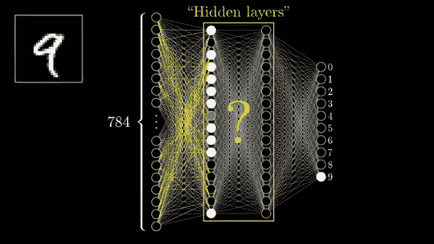

# 使用 numpy 从头开始编码深度神经网络

> 原文：<https://levelup.gitconnected.com/coding-a-deep-neural-network-from-scratch-17bbc507e7c0>



几周前，我写了一篇关于感知机编码的文章，目的是巩固我自己的理解，并希望在此过程中提供价值。出于同样的原因，我选择挑战自己，从头开始编写一个深度神经网络。像 Tensorflow 和 Torch 这样的框架允许我们轻松地利用神经网络，而不必重新发明轮子，但我相信，对于任何想进入机器学习领域的人来说，理解这些算法的底层技术概念是很重要的。

本文假设您对神经网络及其工作方式有一个基本的了解，所以我将只是浏览代码，剖析每个函数。你可以在这里找到这个项目的 [**全部代码**](https://github.com/mohdabdin/Neural-Network-from-scratch/blob/main/MLP_using_numpy.py) 。

# 概观

在本文中，我将实现一个具有两个隐藏层的深度神经网络，该网络使用带动量的随机下降，并使用 MNIST 数据集来训练和测试模型。这个数据集是最常用于初级深度学习的，由从 0 到 9 的带标签的手写数字组成。我承认有更多有趣的应用，但为了简单起见，我们将使用这个数据集。

我将一步一步地解释每一个组成部分，虽然我不会过多地讨论数学细节，但我会尽最大努力保持直观，并提供一些我认为有用的资源，这些资源深入探讨了某些主题。你需要做的只是对神经网络、线性代数和微积分有一些基本的了解。所以让我们开始吧！

# 构造器

首先让我们从进口开始

```
import numpy as np
import mnist
```

正如我在概述中提到的，我们将使用 MNIST 数据集来训练我们的网络并测试其准确性。有许多方法可以导入这个数据集，但是我发现这个由 Hyeonseok Jung 设计的项目是最方便的，因为我们使用的是 numpy 数组。

这里我们定义超参数:

*   **eta(学习率)**:学习率表示权重收敛所采取的步长大小。
*   **alpha(动量因子)**:我们将使用动量来加速我们的学习过程并提高准确性，但使用动量的主要动机是通过改变权重变化的方向来防止我们的模型陷入局部最小值。我发现 [**这篇文章**](https://towardsdatascience.com/stochastic-gradient-descent-with-momentum-a84097641a5d) 提供了一个简洁的势头的交代。
*   简单地说，这是我们训练模型所要经历的迭代次数。
*   最后，我们将分批训练我们的网络，这意味着我们将分批检查样本。这有助于我们的模型训练更快，使用更少的内存。

请记住，这些超参数的值是任意的，例如，在少数情况下，根本不使用动量可能更有利。

# 一键编码

首先让我们定义一个函数，使我们的模型能够理解输出。

这个函数的作用是将我们当前的标签(基本上是从 0 到 9)转换成一个大小为 10 的 numpy 数组，在对应于数字的位置填充 0 和 1。例如，一个标签' **1** '会变成 **[0，1，0，0，0，0，0，0，0]** ，' **5** '会变成 **[0，0，0，0，0，1，0，0]** 等等…

# 初始化权重和偏差

接下来，我们需要在矩阵中随机初始化权重，以符合我们的网络架构。

如前所述，我们将有 2 个隐藏层，1 个输入和 1 个输出。第一个权重矩阵的形状为(100，784+1)，这里的加号是我们的偏差单位。网络的第一层，即输入层，将具有形状(50，785)。在单层网络中，我们有一组权重用于计算我们的输出，这里隐藏层充当其前一层的输出。

此外，我们还定义了一个函数，使用方向参数将偏差单位添加到层中，这是因为我们的输入向量将处于列方向，而对于隐藏层，偏差单位将被添加到行中。

# 计算向前传球

现在我们可以进入神经网络的核心。该函数将输入作为一个参数，返回每一层的激活和未激活结果，反向传播函数稍后将使用这些结果来计算每一层的梯度并相应地调整权重。

我使用 sigmoid 函数压缩每个输入并返回一个激活的输入。还在激活后向每层添加偏置单元。

# 预测和损失函数

首先，这里的 predict 函数基本上反转了我们之前所做的一键编码，返回实际的数字，而不是大小为 10 的数组。我们将用它来衡量我们模型的准确性，然后在一些测试样本上使用我们训练好的模型。

我们的第二个功能是计算损失，我们的模型将尝试在每次迭代中最小化损失。我不会详细介绍这个函数的推导过程，因为我还不确定具体怎么做，但我发现如果你想深入了解数学细节，这篇文章 会很有帮助。但本质上它所做的只是返回一个值，表明我们的预测离正确的标签有多远。

# **计算向后传递**

现在谈谈我们学习过程的主要部分。这里我们将使用向前传递函数计算的值来获得重量变化。

从输出层开始，直观地说，我们将从最后一层的激活输出中减去标签，以获得权重变化，我们将使用它来应用随机梯度下降。然后，第一个增量用于计算它之前的层的增量，直到我们得到所有层的权重变化。最后，我们将每个增量与相应层的激活向量矩阵相乘，以获得梯度。

# 将所有这些放在一起 Fit()函数

既然我们已经完成了繁重的工作，我们可以开始把所有东西放在一起，并定义将训练网络的函数。

我们将每个隐藏层的大小设为 100，然后我们将使用我们之前定义的函数初始化我们的权重，该函数接受我们的层的大小。然后，我们初始化将用于动量的先前权重。如果我们不想在我们的模型中使用动量，也可以不使用这些，或者让 alpha 等于 0，但仍然可以成功，所以如果你想让事情变得简单，请随意这样做。我们还定义了列表 train _ losses 和 train_acc 来跟踪损失和准确性。

在我们的内部循环中，我们将枚举 X(图像)和 y(标签)。首先，我们对标签进行一次性编码。然后，网络将计算前向传递，获得损失，计算后向传递，获得梯度，并使用它们来更新我们的权重。之后，我们在每个时期检查我们的模型的准确性，以便在它训练时给我们关于它的性能的反馈。

# 导入和准备我们的数据集

在我们的类之外使用下面的函数可能更有意义，但是我会把所有的东西都放在同一个类中。

正如我在开始提到的，我将使用 [**这个项目**](https://github.com/hsjeong5/MNIST-for-Numpy) 来导入数据集作为一个 numpy 数组。 *prep_data()* 函数获取图像输入(X)和标签(y ),并将其转换为 50 个一批的数据，因此我们将处理(1200，50，784)个图像，而不是一个大小为(60000，784)的 numpy 数组。最后，我们使用归一化函数将像素亮度转换为 0 到 1 之间的值。

# 训练我们的模型

现在我们已经准备好了模型，我们将它初始化为 mlp，加载我们的训练数据，使用 prep_data 函数准备它，最后调用 fit()函数开始训练过程。


训练迭代

我发现该模型在大约 200 次迭代(n_iter=200)后能够达到 0.95 的准确率。随意摆弄超参数，观察精度的变化。

# 结论和最终想法

这是一个有趣的挑战，我决定接受它来理解深度神经网络，我希望你能从中发现价值。我自己还有很多需要了解的地方，如果不是以前做过这件事的人的很多教程的帮助，我不会走到这一步。我个人发现，当我编写一个算法时，我对它背后的思想有了更强的理解。我花了很多时间看其他人的类似项目，下载他们的代码，一行一行地去理解。我也鼓励你在这里下载完整的代码[](https://github.com/mohdabdin/Neural-Network-from-scratch/blob/main/MLP_using_numpy.py)****并使用变量，打印向量的形状等。****

****也请随时联系我，我仍然是一名学生，我很乐意在这个令人兴奋的领域联系和认识更多的人！****

# ****参考****

******【1】***二元交叉熵 aka Log Loss——逻辑回归中使用的代价函数*。(2020 年 11 月 9 日)。检索自 Analytics vid hya:[https://www . analyticsvidhya . com/blog/2020/11/binary-cross-entropy-aka-log-loss-the-cost-function-used-in-logistic-regression/](https://www.analyticsvidhya.com/blog/2020/11/binary-cross-entropy-aka-log-loss-the-cost-function-used-in-logistic-regression/)****

******【2】**布沙耶夫诉(2017 年 12 月 3 日)。*带动量的随机梯度下降*。检索自《走向数据科学:[https://Towards Data Science . com/random-gradient-descent-with-momentum-a 84097641 a5d](https://towardsdatascience.com/stochastic-gradient-descent-with-momentum-a84097641a5d)****