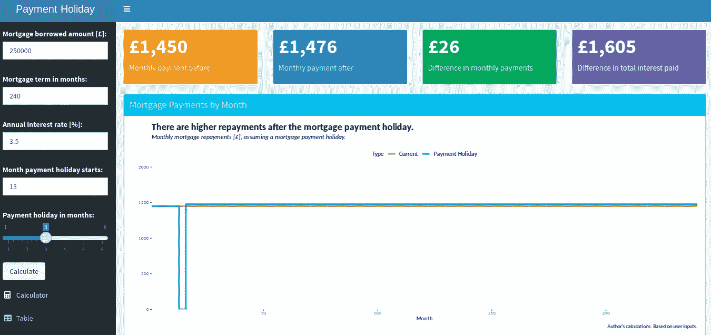

# 编写一个支付假期计算器

> 原文：<https://levelup.gitconnected.com/coding-a-payment-holiday-calculator-75ad694e251d>

## 我更新了一个抵押贷款支付假期计算器。

一些机构为人们提供了从抵押贷款中解脱出来的能力。

使用 R 和*闪亮的*，我创造了[一个抵押贷款支付假期计算器](https://anthonybmasters.shinyapps.io/Mortgage-Payment-Holiday-Calculator/)。这篇文章是关于计算器的工作原理和代码。

# 开发计算器

冠状病毒危机意味着一些人无法工作。反过来，这些人无法履行抵押贷款等义务。金融机构可能允许人们几个月内不支付抵押贷款。

**抵押付款假期不是利息假期。**

抵押贷款累积利息，而抵押贷款是未付的。因此，当人们恢复还贷时，他们将有更高的抵押贷款偿还额。问题是:高出多少？

这是计算器回答的问题。



对于默认的投入，还款差额是每月 26。(图片:[闪亮](https://anthonybmasters.shinyapps.io/Mortgage-Payment-Holiday-Calculator/))

最初的版本只显示了前四个价值箱:

*   **月付前:**支付假期前的月金额。
*   **月付后:**节后每月还款。
*   **月供差额:**这两个数值之间的差额。
*   **支付利息总额的差异:**支付假期产生的额外利息总额。这种计算假设相同的年利率通过抵押贷款。

在一次更新中，我添加了一个图表和一个 CSV 表供用户下载。

# 应用规则

计算器通过使用输入和创建完整的抵押贷款表来工作。该表包含每月还款金额、利息和剩余债务。

因为这是一个迭代计算，所以我使用了循环。如果没有支付期，我们使用标准公式计算每月还款:

```
std_paym_A <- round(df$debt[1]*(int_rate/12)/(1-(1+int_rate/12)^(-term_month)),2)std_paym_B <- round(df$debt_holiday[hol_end]*(int_rate/12)/(1-(1+int_rate/12)^(-term_month+hol_end-1)),2)
```

对于支付假期，我们可以使用用例。在这里，我们用代码表示支付假期的规则。

*   **赎回:**如果房贷已经还清，则没有还款。

```
df$repayment_holiday[i] = dplyr::case_when(
df$debt_holiday[i-1] <= 0 ~ 0
```

*   **最终还款:**如果还款高于剩余债务，则赎回。如果是最后一个月也是如此。

```
df$debt_holiday[i-1] + df$interest_holiday[i] < df$repayment_holiday[i-1] ~ df$debt_holiday[i-1] + df$interest_holiday[i],i == nrow(df) ~ df$debt_holiday[i-1] + df$interest_holiday[i]
```

*   **节前:**节前几个月，我们进行标准还款。

```
i < hol_start ~ std_paym_A
```

*   **放假期间:**不还款。

```
i >= hol_start & i <= hol_end ~ 0
```

*   假期结束后，我们继续还款。偿还使用新的，更高的债务金额。

```
i > hol_end ~ std_paym_B
```

*   **其他情况:**对于任何其他情况，我们进行起始还款。“case when”功能按顺序检查每个条件。这种情况不是为了使用，而是作为一种意外情况存在。

```
TRUE ~ std_paym_A)
```

# 反应值

对于[闪亮的应用](https://rstudio.github.io/shinydashboard/get_started.html)，UI(用户界面)和服务器文件一起工作。

对我来说，一个认识是:

**反应值是没有参数的函数。**

服务器文件接受输入并生成一个反应数据表。这个数据表包含所有需要的每月抵押贷款信息。

```
mortgage_table <- eventReactive(input$calculate,
{mortgage_holiday(
input$loan_value,
input$term_month,
input$interest_rate_pc/100,
input$holiday_start,
input$holiday_period)}, ignoreNULL = FALSE)
```

当我们再次访问抵押表时，它是一个函数。

```
paym_before <- reactive({mortgage_table()$repayment_holiday[2]})
```

计算器本身需要更好的输入验证。可能有一种更有效的方法来编写计算器，但它很适合这个目的。

该计算器的代码是 GitHub 上提供的[。这个计算器可供人们免费使用。](https://github.com/anthonybmasters/rstudio-cloud/tree/master/Mortgage%20Payment%20Holiday%20Calculator)