# 用 Flutter 和 Feeds 编码 Instagram 克隆

> 原文：<https://levelup.gitconnected.com/coding-an-instagram-clone-with-flutter-and-feeds-50e3d9a7506e>

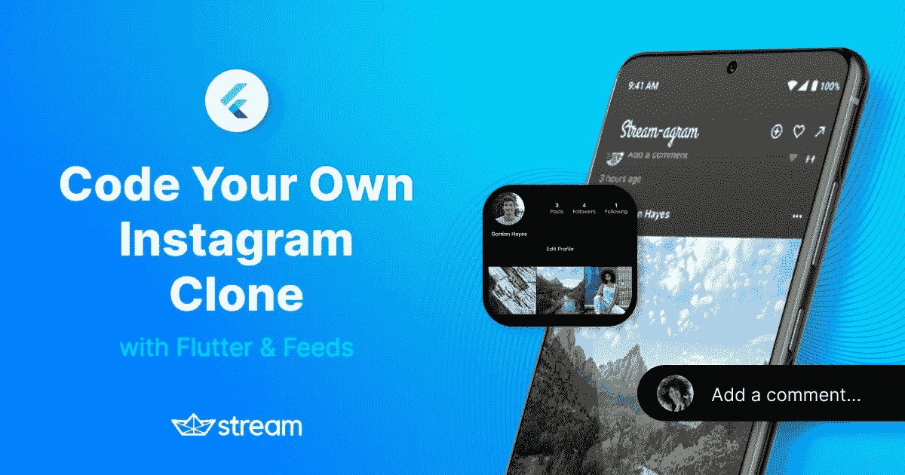

在这篇博文中，我们将向您展示如何使用 Stream Feeds 和 Flutter 轻松创建 Instagram 的克隆。

我们将非常有创意地称我们的克隆体为流图。您还将学习许多 Flutter 概念，以改进动画、手势、过渡和状态管理。

链接在下面的**视频带你一步一步地浏览整篇博文，并附有额外的代码说明。如果你遇到困难，或者你更喜欢通过视频学习，那么视频可以帮助你！**

陪伴视频

此克隆将允许您:

*   使用不同的**用户账户**登录
*   添加和更改**个人资料图片**
*   将**照片帖子**添加到您自己的用户订阅源(活动)
*   **订阅/取消订阅**其他用户的订阅源
*   添加**评论**和**喜欢**(反应)

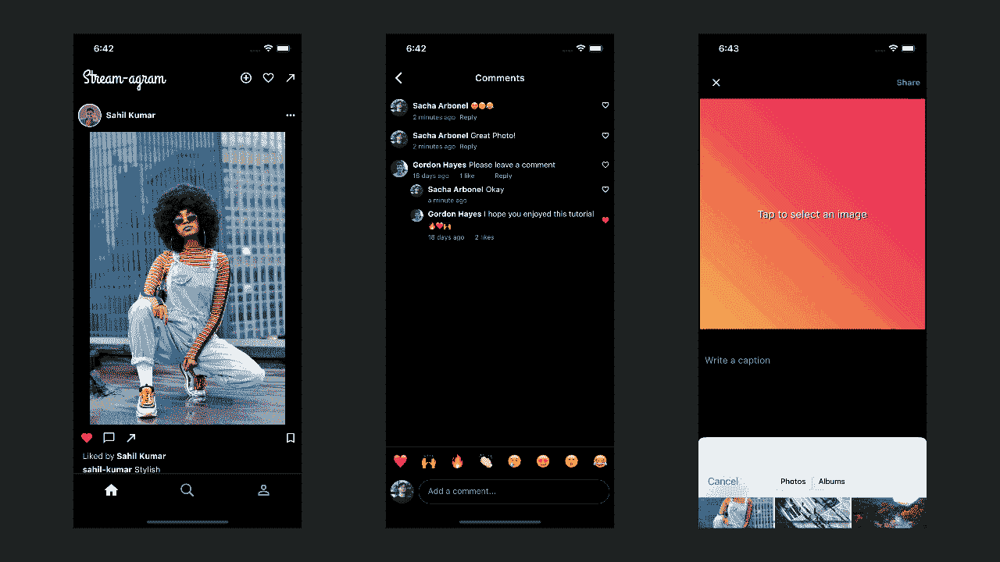

Instagram 是一个复杂的应用程序，我们不能指望复制它。但我们会尽最大努力，在这个过程中创建一个令人敬畏的 Flutter 应用程序——包括状态管理、手势、动画和过渡。

无论你是初学者还是有经验的颤振工程师，这篇文章都会对你有价值。通过完成本教程，您还将学习以下颤振概念:

*   如何整洁地组织你的代码？
*   如何使用 Provider 和基本的 Flutter 组件轻松管理您的应用程序状态。
*   主题化你的应用程序以支持明暗模式。
*   自定义页面过渡。
*   英雄动画以及如何定制它们。
*   何时使用隐式动画，何时使用显式动画。
*   如何创建自己的明确的动画？
*   性能考虑。
*   很多颤振布局等小技巧。
*   扩展方法。
*   使用**文本编辑控制器**、**页面控制器**和**焦点节点**。
*   使用**AutomaticKeepAliveClientMixin**缓存页面。

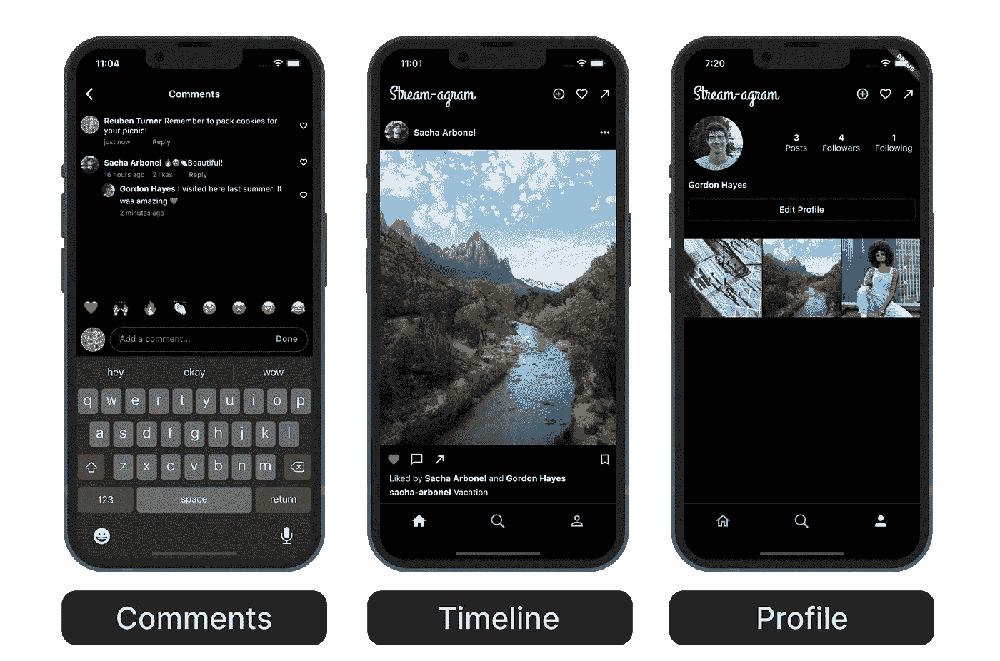

应用程序页面

# 什么是活动订阅源？

要了解 Stream 的 [Flutter Feed SDK](https://getstream.io/activity-feeds/sdk/flutter/tutorial/) 为你提供了什么，你首先需要了解[什么是活动 Feed](https://getstream.io/blog/activity-feeds-101/)。

> *有时称为新闻源或活动流，活动源是用户在应用程序或网站上执行的操作的实时列表。活动源显示来自用户在线社区的信息，如赞、关注、评论、帖子和内容共享。*

Stream 将管理这些活动提要的复杂性变得简单，而 Stream Feed Flutter SDK 从前端的角度将它变得简单。

# 用 Feeds 构建 Instagram 克隆

让我们讨论一下在构建 Instagram 克隆的背景下，活动订阅源是如何工作的。您将制作一个用户生成的图片帖子(活动)的提要。这些帖子还应该以喜欢和评论的形式显示用户的参与度和反应。应该允许用户关注他们感兴趣的特定用户，并查看他们关注的所有人的帖子的时间表。他们还应该能够看到他们发表的所有帖子。

随着一些更高层次的概念被排除，我们终于可以开始了。

# 创建一个颤振应用程序

这个旅程的第一步是…创建一个新的 Flutter 应用程序🚀。

在您的终端中，在您选择的目录中运行以下命令:

```
$ flutter create stream_agram
```

*你可以随意更改应用程序的名称。*

在您首选的 IDE 中打开文件夹。

# 包依赖关系

打开`pubspec.yaml`文件，添加以下**依赖**:

```
dependencies:
  flutter:
    sdk: flutter
  cupertino_icons: ^1.0.2
  stream_feed_flutter_core: ^0.7.0+1
  provider: ^6.0.2
  google_fonts: ^2.3.1
  image_picker: ^0.8.4+9
  cached_network_image: ^3.2.0
  transparent_image: ^2.0.0
  jiffy: ^5.0.0
```

> *⚠️* ***注意:*** *在您阅读本文时，这些包可能有更新版本。如果您想完全遵循，使用上面提到的版本会更安全。一旦你熟悉了所有的代码，你可以运行* `*flutter pub outdated*` *来查看哪些包需要更新。*

# 流设置

在进入代码部分之前，首先需要创建一个流应用程序来处理所有的提要基础设施。

在 Stream 上创建一个应用程序真的很简单，不需要很长时间。它也是免费的，不需要信用卡💸30 天试用期，或者您可以注册一个 Maker 帐户，无限期地免费使用 Stream Chat。

## 第一步—创建账户

首先，[注册一个账户](https://dashboard.getstream.io/)。

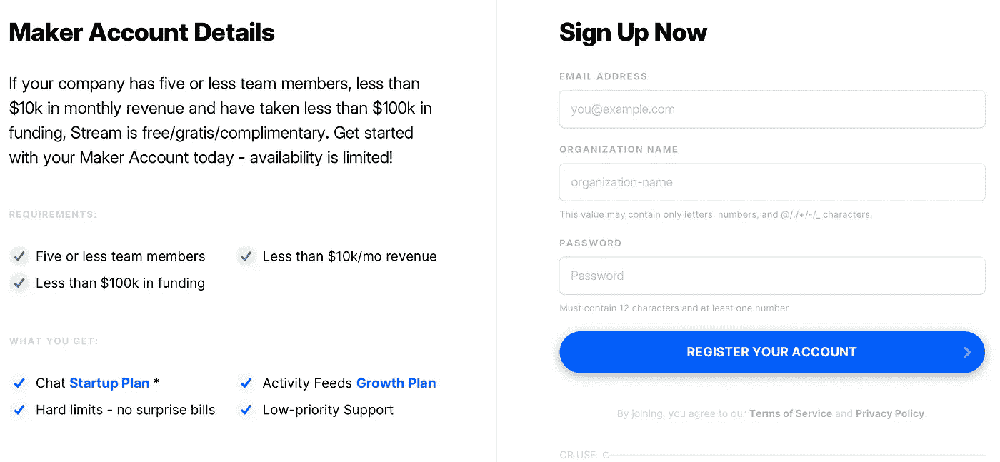

连续注册账户

## 第二步——创建应用程序

创建帐户后，创建一个应用程序并将其命名为:

1.  转到您的[流仪表板](https://dashboard.getstream.io/)。
2.  选择**创建应用**。
3.  输入一个**应用名称**(例如**stream gram**)。
4.  设置您的**服务器位置**。
5.  将**环境**设置为**开发**。
6.  选择**创建应用**。

创建应用程序后，您应该会看到它列在应用程序的仪表板中。从这里你可以编辑应用程序，创建用户和订阅组，访问数据，并进行许多高级操作。如果你想熟悉提要，看一看[提要 101 文档](https://getstream.io/activity-feeds/docs/react/feeds_101/)。

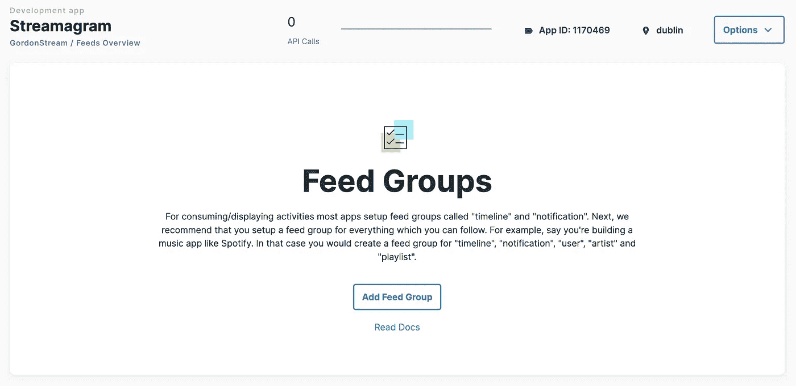

流源仪表板

## 第三步——创建用户和时间线 Instagram 订阅源

为了让您的 Instagram clone 获得与使用该应用程序时相同的 feeds 交互性，您将创建两个**平面 Feeds:**

*   用户
*   时间表

> ***平面*** *提要是唯一可以关注的提要，因此是一个很好的用于添加活动的提要类型。平面提要还可以用来消费来自其他提要的活动——以类似“时间线”的方式。*

Instagram 应用程序中的每个用户都有自己独特的订阅源。**用户平面提要**将是用户发布图片的提要。这些帖子被称为**活动**。

**时间轴平面提要**将用于订阅其他用户，以及我们自己的**用户提要**。

总之，如果你登录到 **Stream-agram** 应用程序，那么**用户订阅源**将显示所有**你的**帖子，而**时间线订阅源**将显示你订阅的所有**用户订阅源**。

> *❓* ***注意*** *:您可以随意命名这些提要，但是* ***用户*** *和* ***时间线*** *是两个标准名称，您将在以后的代码中引用这些名称。*

要了解更多关于 feed 组的信息，请参见不同 feed 类型的[文档](https://getstream.io/activity-feeds/docs/react/creating_feeds/)(**平面**、**聚合**、**通知**)。

现在，点击**添加进给组**按钮，并创建一个**用户**和**时间线**平面进给。创建**用户**提要的示例如下所示。

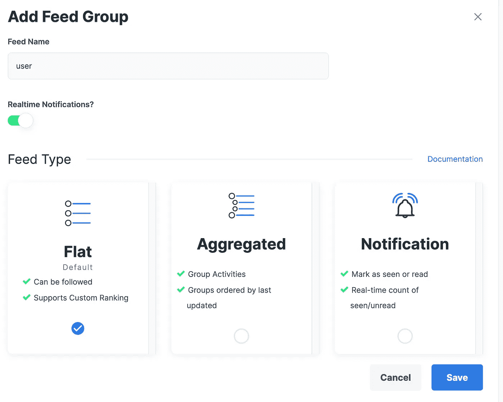

创建提要后，您现在应该看到:

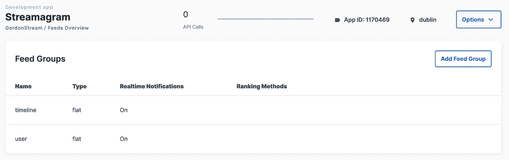

太好了！你的订阅已经设置好了。如果你向下滚动，你还应该看到你的应用程序的**密钥**和**秘密**。

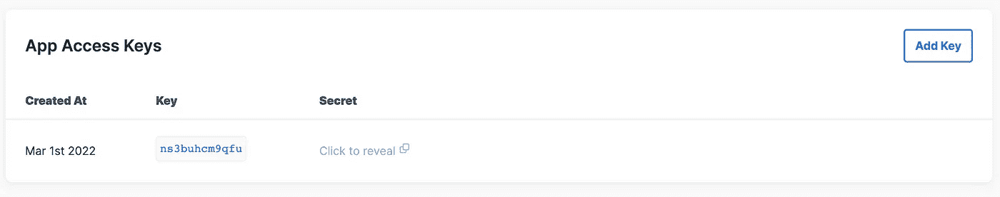

您的 **API 密钥**只是一个应用程序标识符，公开共享是安全的。您的**秘密**有助于生成经过认证的用户令牌并执行敏感的 API 操作。秘密在任何时候都应该保密——它相当于一个密码。

请记下您的应用程序的**密钥**和**秘密**，您将在下一节用到它们。🕵️‍♀️

## 第四步—创建前端令牌

在流提要中创建和更新用户很简单。但是，为了让您的客户端应用程序与流提要 API 进行通信，您首先需要身份验证令牌来验证您的服务器请求。通常，您可以通过创建自己的自定义后端应用程序来执行各种敏感的服务器操作，并跟踪所有用户。

但是，出于演示目的，您将在应用程序中硬编码您的用户及其令牌。

> *❗️*

Stream Feed 提供了许多不同的[后端客户端](https://getstream.io/activity-feeds/sdk/#backend-clients)，包括 Dart！鉴于我们是 Flutter 开发人员，我们将使用 Dart 客户端来生成令牌。

[这个 Github 存储库](https://github.com/HayesGordon/stream-feed-cli)包含的代码向您展示了如何使用 Dart [stream-feed 包](https://pub.dev/packages/stream_feed)作为服务器客户端，通过 CLI 生成前端令牌。

如果你对代码如何工作感兴趣，你可以自己检查。这真的很简单，它:

*   读入您的 API **密钥**和**秘密**
*   读入**用户名**
*   它为给定的用户名生成**前端令牌**

要运行 CLI，请执行以下操作:

1.  `git clone [https://github.com/HayesGordon/stream-feed-cli](https://github.com/HayesGordon/stream-feed-cli)`
2.  `cd stream-feed-cli`
3.  `dart run`
4.  按照提示操作

您可以在 Instagram 克隆中创建任意数量的用户，并随意命名。对于本文，我们将生成四个用户，用户名如下:

*   **沙夏-羰基化合物**
*   戈登-海斯
*   鲁本-特纳
*   **萨希尔-库马尔**

记下所有用户的前端令牌。您将在下一节用到它。

> 更简单的方法可能是严格遵循并创建这些用户，因为这将需要更少的代码修改。

# 编码你的 Instagram 克隆

您正处于教程的有趣部分。

在继续之前，让我们快速讨论一下构建 Instagram 克隆的方法。

我们的 Stream-agram 应用程序将由几个主要的 UI 组件组成，我们将在本教程的剩余部分中构建这些组件:

*   **登录界面**:你将登录的地方(一个模拟的展示)。
*   **主屏幕**:为应用程序的其他区域提供各种导航控件(默认显示**时间线页面**)。
*   **时间线页面**:在这里你可以看到你关注的用户的反馈。
*   个人资料页面:在这里你可以看到个人资料和你发表的所有文章。
*   **搜索页面**:可以关注和取消关注其他用户。
*   **编辑个人资料画面**:通过更改个人资料图片，可以编辑个人资料信息。
*   **添加帖子屏幕**:您可以在这里向您的**用户订阅源**添加新帖子(**活动**)。

我们将从每个屏幕的简化版本开始，随着我们一层一层地增加更多的复杂性和功能，我们将对它们进行迭代。最终结果将是一个(几乎)相同的 Instagram 克隆。

# 颤动文件和文件夹结构

每个应用程序都是独特的，需要自己的文件夹结构。本教程中使用的方法绝不比其他任何方法更好。这只是组织这个特定应用程序代码的一种便捷方式。

这个应用程序将所有东西都放在两个高层文件夹下:**应用程序**和**组件**。

一个**组件**是将在 UI 中呈现的任何东西，或者你可以把它想象成一个可以独立运行的应用程序的一部分，例如，页面、按钮和小部件。**组件**目录还包含一个名为 **app_widgets** 的文件夹，其中包含应用程序中使用的通用小部件。

**app** 目录包含与整个应用程序相关的类，或者多个**组件**将使用的代码。比如 app 状态和导航。

本教程使用桶文件整齐地组织进口。

> *桶是一种将多个文件中的导入内容汇总到一个方便的文件中的方法。*

在本教程结束时，你的文件和文件夹布局应该是这样的。您可以现在创建所有这些内容，也可以按照教程中的步骤进行创建:

```
├── lib
|   ├── app
│   │   ├── navigation
│   │   │   └── custom_rect_tween.dart
|   |   |   └── hero_dialog_route.dart
|   |   |   └── navigation.dart *
|   |   ├── state
|   |   |   ├── models
|   |   |   |   └── models.dart *
|   |   |   |   └── user.dart
|   |   |   └── app_state.dart
|   |   |   └── demo_users.dart
|   |   |   └── state.dart *
|   |   └── app.dart *
|   |   └── stream_agram.dart
|   |   └── theme.dart
|   |   └── utils.dart
|   ├── components
│   │   ├── app_widgets
│   │   │   └── app_widgets.dart *
|   |   |   └── avatars.dart
|   |   |   └── comment_box.dart
|   |   |   └── favorite_icon.dart
|   |   |   └── tap_fade_icon.dart
|   |   ├── comments
|   |   |   ├── state
|   |   |   |   └── comment_state.dart *
|   |   |   |   └── state.dart
|   |   |   └── comment_screen.dart
|   |   |   └── comments.dart *
│   │   ├── home
│   │   │   └── home_screen.dart
|   |   |   └── home.dart *
|   |   ├── login
|   |   |   └── login_screen.dart
|   |   |   └── login.dart *
│   │   ├── new_post
│   │   │   └── new_post_screen.dart
|   |   |   └── new_post.dart *
|   |   ├── profile
|   |   |   └── edit_profile_screen.dart
|   |   |   └── profile_page.dart
|   |   |   └── profile.dart *
│   │   ├── search
│   │   │   └── search_page.dart
|   |   |   └── search.dart *
|   |   └── timeline
|   |   |   ├── widgets
|   |   |   |   └── post_card.dart
|   |   |   |   └── widgets.dart *
|   |       └── timeline_page.dart
|   |       └── timeline.dart *
│   └── main.dart
├── pubspec.lock
├── pubspec.yaml
```

> *⚠️*

# 创建演示 Instagram 用户

如前所述，出于演示目的，在本教程中，您将对演示用户进行硬编码。

创建文件`app/state/demo_users.dart`，并添加以下内容:

创建演示用户. dart

这个文件中有几个**todo**，因为您需要添加您之前生成的**字符串令牌**。确保为正确的用户添加正确的令牌。

如果您使用不同的**用户名**，那么您将需要根据需要更新该文件的其他部分。

上面的代码有一个名为 **DemoAppUser** 的枚举类，带有一个扩展名 **DemoAppUserX** ，用于访问各种其他数据，比如令牌和用户名。这个文件并不太重要，您可以选择以您希望的任何方式创建您的演示用户。

创建`app/state/state.dart`桶文件并添加导出:

```
export 'demo_users.dart';
```

然后创建一个更高级别的桶文件，名为`app/app.dart`，并添加以下导出:

```
export 'state/state.dart';
```

# 主题化你的 Instagram 克隆

你会注意到我们使用了与你在 Instagram 上看到的相同的字体和配色方案，给你的克隆应用带来了真实世界应用的外观和感觉。最后，值得注意的是，我们的克隆还包括一个光明的☀️和一个黑暗的🌚模式。首选模式基于平台偏好。让你的手机根据一天中的时间来切换模式，这可能超出了本教程的范围😉

创建`app/theme.dart`并添加以下内容:

创建主题. dart

您可以按照自己的进度回顾一下，或者在本教程的后面部分使用这些定义时探索一下。

更新`state/state.dart`桶文件:

```
export 'state/state.dart';
export 'theme.dart'; // ADD THIS
```

# 型号(用户)

你能相信这个大的应用程序只需要你创建一个模型类吗？😱

好吧，相信它，因为大多数模型将来自流饲料包。

创建`app/state/models/user.dart`并添加以下内容:

创建 user.dart

这是你的**用户数据类**。它存储许多字段并提供方便的方法，如`toMap`、`fromMap`和`copyWith`。这些以后会派上用场的。创建这个类的原因是为了方便地从为每个流提要用户存储的额外数据中创建一个对象。

尽管我们只有一个模型，但我们会成为好公民，无论如何都要创建我们的桶文件。

创建`app/state/models/models.dart`并添加以下内容:

```
export 'user.dart';
```

并在`app/state/state.dart`桶文件中添加:

```
export 'demo_users.dart';
export 'app_state.dart';
export 'models/models.dart'; // ADD THIS
```

# 状态管理(提供者)

辩论的热门话题。

对于这个 Instagram 克隆，您只需要管理基本的应用程序状态，这样您就可以轻松地将更改传播到 UI。

大多数状态将由[**stream _ feed _ flutter _ core**包](https://pub.dev/packages/stream_feed_flutter_core)管理，但是，您仍然需要一种简单的方法来传递应用程序中的一些状态，例如，当前已验证的 used。

这篇文章并不是要对国家管理固执己见。一个简单的 [InheritedWidget](https://api.flutter.dev/flutter/widgets/InheritedWidget-class.html) 有时就是你所需要的，而 [Provider](https://pub.dev/packages/provider) 使继承的小部件变得非常容易，并且提供了一些其他的强大功能，我们将在本教程中进行更多的探讨。

创建文件`app/state/app_state.dart`并添加以下内容:

创建应用状态. dart

这门课并不太复杂。稍后，您将需要扩展它多一点。

目前，它只以响应的方式管理本地用户及其数据。一个[**change notifier**](https://docs.flutter.dev/development/data-and-backend/state-mgmt/simple#changenotifier)类是一种在 Flutter 应用程序中管理状态的简单方法。您将可变变量存储在类中，然后可以对其进行更新；更新后，您可以通过调用`notifyListeners`方法通知任何侦听器。

在这个类中，您将看到一个名为`_streamagramUser`的变量，它最初为空，一旦您调用`connect`方法，它将被设置，这需要一个 **DemoAppUser** 。

StreamFeedClient 可能是这个类中最重要的。它有多种方法可以轻松地与流提要 API 进行交互。例如，`setUser`方法就是这样，它在本地为应用程序设置当前的流提要用户，然后在流提要后端创建或读取用户(取决于用户是否已经存在)。

**StreamFeedClient** 上的`setUser`方法需要一个**用户**对象，它接收:

*   唯一的用户 id(我们的用户名)
*   额外的**数据**将用于设置服务器上的用户信息(姓名、个人资料图片 URL 或任何您想要的信息)
*   和**前端令牌**

这个方法是一个异步的[未来](https://api.dart.dev/stable/2.16.1/dart-async/Future-class.html)，一旦完成，你就通过调用`fromMap`方法更新本地`_streamagramUser`对象，这将从**映射**中创建一个新对象。之后，您调用`notifyListeners`来更新这个变化的任何监听器。

更新`app/state/state.dart`桶文件:

```
export 'demo_users.dart';
export 'app_state.dart'; // ADD THIS
```

# 初始化和提供程序

创建一个新文件，`app/stream_agram.dart`，并添加以下内容:

创建 stream_agram.dart

在这个文件中有几件重要的事情要做:

*   用您独特的流应用程序的 API 密钥**初始化 **StreamFeedClient** 。**
*   创建 **AppState** 类，传入 **StreamFeedClient** 。
*   创建一个 **FeedBloc，**它是您的流提要应用程序的业务逻辑。这个类来自 Stream Feed 包，在教程的后面你会用到它。
*   用一个 **ChangeNotifierProvider** 包装 **MaterialApp** ，暴露出你的 **AppState** 对象。这将确保整个应用程序可以轻松地访问您的应用程序状态。使用`.value`工厂很重要，因为它公开了已经创建的`appState`对象。
*   将 **home** 参数设置为**登录屏幕**。您将很快创建此屏幕。
*   使用**构建器**参数用 **FeedProvider** 包装您的应用程序，这将向整个应用程序公开`feedBloc`对象。流提要小部件需要 **FeedProvider** 来轻松访问 **FeedBloc** ，无论它们在小部件树中的什么位置。

更新您的`app/app.dart`桶文件:

```
export 'state/state.dart';
export 'theme.dart';
export 'stream_agram.dart'; // ADD THIS
```

# 扩展类—实用程序

接下来，创建一个`app/utils.dart`文件，它将包含一些有用的扩展，您将在整个应用程序中使用这些扩展。这些扩展将使应用程序 UI 中的某些操作变得更容易，并减少执行重复操作所需的代码量。

这些扩展将允许您:

*   移除并显示带有提示信息的**小吃条**。
*   从 **BuildContext** 中访问 **AppState** 。

添加以下内容:

创建 utils.dart

现在，更新最后一次🥳:的`app/app.dart`桶文件(至少现在是这样):

```
export 'state/state.dart';
export 'theme.dart';
export 'stream_agram.dart';
export 'utils.dart'; // ADD THIS
```

# 创建您的模拟 Instagram 登录屏幕

接下来，您将创建一个“登录屏幕”，一个模拟屏幕来选择一个演示用户。

创建文件`components/login/login_screen.dart`并添加以下内容:

创建“模拟”login_screen.dart

您可以自己详细研究这个文件。简单总结一下，这个小部件有以下功能:

*   为每个演示用户显示按钮，显示他们的姓名。单击时，它将尝试以该用户身份进行身份验证。
*   在 **AppState** 上调用`connect`，如果响应为 **true** 导航到**主屏幕**，否则在 Snackbar 中显示一条错误消息。
*   显示指示连接状态的 **Snackbar** 消息。

一旦您运行您的应用程序，它将看起来像这样:

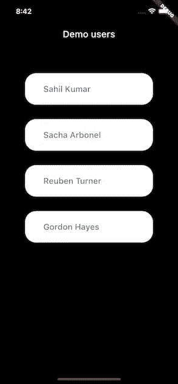

模拟登录屏幕预览

记得创建你的登录桶文件，`components/login/login.dart`:

```
export 'login_screen.dart';
```

# 创建类似 Instagram 的主屏幕

这将是您的应用程序的主屏幕，用于将用户导航到应用程序的各个其他区域。

打开真实世界的 Instagram 应用程序，您可以通过底部导航栏访问各种页面:

*   时间线页面(默认)
*   搜索页面
*   卷轴页面
*   购物页面
*   个人资料页面

该应用程序还允许您轻松访问应用程序栏中的常用功能，例如:

*   创建新帖子
*   导航至活动时间表
*   导航至消息传递

目前，我们将创建一个简化版本。稍后，您将扩展代码，对主屏幕的外观和功能进行一些改进。

首先，您的主屏幕将具有类似于现实世界 Instagram 克隆的导航，通过使用 Flutter **PageView** 和 **BottomNavigationBar** 获得以下页面:

*   时间线页面(默认)
*   搜索页面
*   个人资料页面

目前，所有这些页面都将有简单的文本占位符，稍后您将扩展这些占位符。

您还将创建一个**应用程序栏**，它现在只包含标题。稍后您将使用更多控件来扩展它。

创建`components/home/home_screen.dart`并添加以下内容:

创建 home_screen .镖

让我们来分解一下:

*   该屏幕分为三个独立的部分:**应用栏**、**页面视图**和**底部导航栏**。
*   小部件列表存储在`_homePages`变量中。目前，它们只是简单的文本小部件占位符。
*   一个**页面控制器**在不同的**页面视图**页面之间导航。这在**_ StreamagramBottomNavBar**中使用。控制器中还添加了一个监听器，用于在 UI 发生变化时更新它。
*   **页面视图**的物理设置为`NeverScrollableScrollPhysics`。这确保了更新**页面视图**的唯一方法是按下底部导航栏项目之一。
*   使用 **GoogleFonts** 包中的`grandHotel`字体创建 **AppBar** 标题。

如果您现在运行该应用程序，屏幕应该如下所示:

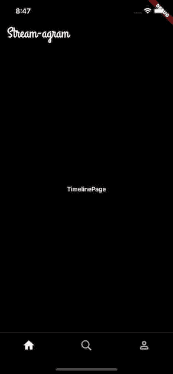

主页预览

你应该能够在**浏览量**的不同页面之间切换。

# 应用程序入口点(main.dart)

拼图的最后一块。删除`main.dart`中的所有内容，替换为以下内容:

创建 main.dart

现在您应该有一个登录屏幕，能够选择一个用户，并导航到主屏幕。如果遇到错误，确保用户的**令牌**、**id**和您的 **API 密钥**是正确的。

可怕的🚀。完成基本的构建模块后，您可以继续学习更高级的部分。

# 创建 Instagram 头像小部件

在你的 Instagram 克隆中会用到一些全局插件。在本教程的过程中，您将添加其中的一些。现在，您将首先创建一个简单的 Avatar 小部件，如果设置了图像，它将显示用户的个人资料图像，如果没有设置图像，则只显示他们的姓名首字母。

创建`components/app_widgets/avatars.dart`，并添加:

创建 avatar.dart

您可以自己探索这个小部件。重要的是它支持一些不同的默认大小的不同命名的构造函数(小的，大的，大的，等等)。).这个小部件将在你显示用户头像的任何地方使用。它还利用 [cached_network_image 包](https://pub.dev/packages/cached_network_image)来缓存图像。

创建`components/app_widgets/app_widgets.dart`桶文件，并导出文件:

```
export 'avatars.dart';
```

# 创建类似 Instagram 的个人资料页面

Instagram 个人资料页面至少需要满足以下要求:

*   头像和用户信息。
*   关注者和后续信息。
*   轻松编辑个人资料信息的功能。
*   用户创建的帖子(活动)列表。
*   轻松添加新帖子的能力。

以下部分将详细讨论这些步骤。

## 创建 Instagram 个人主页

创建文件`components/profile/profile_page.dart`并添加:

创建 profile_page.dart

在这个文件中，您最终使用了一些**stream _ chat _ flutter _ core**小部件来轻松显示提要活动。您可以按照自己的节奏探索 UI 代码。让我们讨论最重要的部分:

*   **FlatFeedCore** 要求您指定`feedGroup`，这将是个人资料页面的“用户”。请记住，这是您在本教程开始时设置的。
*   **FlatFeedCore** 有四个构建器，你需要给它们来处理不同的状态(`loadingBuilder`、`errorBuilder`、`emptyBuilder`、`feedBuilder`)。
*   `emptyBuilder`返回一个 **CustomScrollView** ，显示 **_ProfileHeader** 、 **_EditProfileButton、**和 **_NoPostsMessage** 小工具。
*   稍后您将更新`feedBuilder`。
*   **_ProfileHeader** 小部件使用 Provider 来**观察 **AppState** 的状态。**
*   您稍后将完成一些待办事项。

**FlatFeedCore** 小部件处理检索特定提要的活动的所有复杂性，并使您可以轻松地以您想要的方式显示它们。您可以为这个小部件提供许多不同的参数，以帮助对提要内容进行分页或过滤。然而，现在我们不会深入所有细节。您可以在完成本教程后探索这一点。

创建`components/profile/profile.dart`桶文件并添加:

```
export 'profile_page.dart';
```

然后返回`components/home/home_screen.dart`并修改`_homePages`变量以显示 **ProfilePage** 。它应该是这样的:

```
...import '../profile/profile.dart'; // ADD IMPORT.../// List of pages available from the home screen.
  static const List<Widget> _homePages = <Widget>[
    Center(child: Text('TimelinePage')),
    Center(child: Text('SearchPage')),
    ProfilePage(), // MODIFY THIS
  ];
```

如果您现在运行 Instagram 克隆并导航到**个人资料页面**，您应该会看到类似如下的内容:

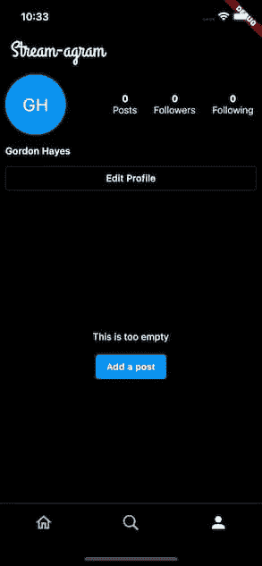

个人资料页面预览

## 创建编辑配置文件屏幕

**编辑个人资料屏幕**显示用户信息(如您的姓名)并允许用户更新其个人资料图片。当然，如果您愿意，可以扩展该页面以添加更多功能。但是现在，我们只想显示用户的头像、姓名和用户名。

**更新应用状态**

在创建 UI 之前，您需要更新 **AppState** 类。

打开`app/state/app_state.dart`并修改如下:

上面的代码创建了一个初始设置为**假**的`isUploadingProfilePicture`状态变量。

`updateProfilePhoto`方法做了几件事:

1.  它接受图像的文件路径。
2.  将`isUploadingProfilePicture`设置为**真**。这个变量将在您的用户界面中被观察到。
3.  通过给出一个**附件文件**，使用 **StreamFeedClient** 上传该文件。这将文件上传到流的 CDN。
4.  使用`getResized`方法创建轮廓图片的调整版本。这些是应用程序将在头像显示为微小或小时使用的个人资料图片的较小版本。
5.  用新的个人资料照片网址更新本地`_streamagramUser`。
6.  将`isUploadingProfilePicture`设置为**假**。
7.  调用`currentUser`上的`update`方法来更新流数据库上的用户。

代码还包含一些对`notifyListeners`的调用，以更新 UI 的变化。

**创建一个类似 Instagram 的图像拾取器**

要从设备的照片中为您的 Instagram 克隆个人资料图片选择图像，您将使用 [**image_picker**](https://pub.dev/packages/image_picker) 包。

安装说明见[此处](https://pub.dev/packages/image_picker#installation)。根据您使用的是 Android 还是 iOS，可能需要不同的步骤。

**用户界面—编辑个人资料屏幕**

创建`components/profile/edit_profile_screen.dart`并添加:

创建编辑个人资料屏幕

让我们分解一下上面的代码:

*   有一个自定义的 **PageRouteBuilder** ，它使用一个 **SlideTransition** 从底部滑入页面。类似于 Instagram 的做法。
*   显示用户信息的各种 UI 和布局小部件。
*   一个`_changePicture`方法，它使用 [**image_picker**](https://pub.dev/packages/image_picker) 包从图库中选择一幅图像，并使用您之前制作的`updateProfilePhoto`方法将其上传。
*   您还可以指定**最大宽度**、**最大高度**和**图像质量**，以减小必须上传的图像大小。

页面看起来应该是这样的:

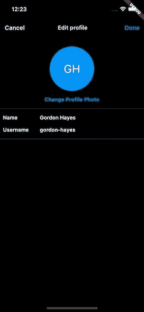

编辑个人资料屏幕预览

修改`components/profile/profile.dart`桶文件:

```
export 'edit_profile_screen.dart'; // ADD THIS
export 'profile_page.dart';
```

在`components/profile/profile_page.dart`中，修改`_EditProfileButton`小部件中的待办事项:

成功！！🥳

如果您完成了上述所有步骤，您的 Instagram 克隆个人资料应允许您使用设备中的图像更新您的占位符头像:

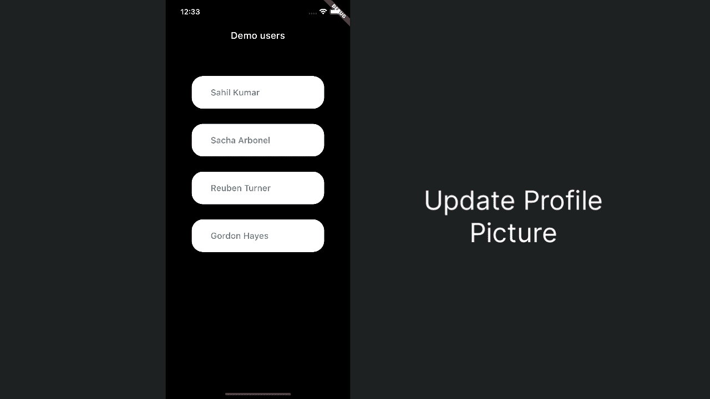

预览上传的个人资料图片

# 创建轻敲渐变图标

是时候使用另一个全球应用程序小部件了。这个小部件只是一个简单的图标小部件，点击时会淡入淡出。

创建`components/app_widgets/tap_fade_icon.dart`并添加:

您可以自己检查这个小部件。

将该类添加到正确的桶文件中。打开`components/app_widgets/app_widgets.dart`，添加:

```
export 'avatars.dart';
export 'tap_fade_icon.dart'; // ADD THIS
```

# 建立你的 Instagram 用户订阅源

如前所述，我们的 Instagram 克隆可以分为用户提要和时间线提要。“user”**feed**对每个用户都是唯一的，它将显示一个用户发表的所有帖子。而“时间线”**提要**则是用户的“用户”**提要**的组合。

在本节中，您将创建将**活动**直接推送到“用户”**提要**的功能。**活动**是出现在提要中的内容，例如 Instagram 克隆中的帖子。

为了对我们的 Stream-agram 应用程序进行编码，使其看起来、感觉起来和交互起来都像它在现实世界中的对应物，我们需要首先通过编写以下代码来完成用户提要:

*   构建一个添加新帖子的屏幕
*   添加具有交互性和过渡动画(英雄动画)的 **PictureViewer**
*   更新应用程序栏，这样我们就可以继续添加更多的帖子
*   启用关注和取消关注其他用户订阅源

完成这些部分后，我们就可以开始构建你的 Instagram timeline feed 了。

## 创建 Instagram 新帖子屏幕

在这个屏幕上，您可以向您的**用户反馈**添加一张带有描述的照片。

创建文件`components/new_post/new_post_screen.dart`并添加:

让我们来分解一下这个屏幕:

*   与之前类似，您使用 **image_picker** 包来选择图像。选择图像后，您可以设置本地`_pickedFile`值。
*   您创建了一个 **TextFormField** ，要求您输入图像的描述。
*   一旦选择了图像并输入了描述，用户就可以按下**分享**按钮。如果不满足这些条件，则会显示一条警告消息。

**Share** 按钮调用`_postImage`方法，该方法完成几件事情:

1.  将加载状态设置为 true。
2.  解码图像—因为这是获取图像大小所必需的。
3.  将图像上传到流 CDN。
4.  使用`getResized`创建调整大小后的较小版本的图像。
5.  使用`FeedProvider.of(context).bloc`检索 **FeedBloc** 类，并使用`onAddActivity`创建一个新的活动。

对于我们的 Instagram 克隆，一个活动将需要三条信息:一个**参与者**，一个**动词**，以及一个**对象**。参与者是执行动作的实体(用户**)。动词是动作的类型(一个**帖子**)。对象就是活动本身的内容(往往是引用，但我们就只说一个**图片**)。**

**所以基本上，**当前用户**是**向“用户”订阅源发布**一个**图像**。然后，您还要指定一些额外的数据，其中最值得注意的包括:**

*   **图像描述**
*   **图像纵横比(稍后您将使用它)**
*   **图像和调整大小的图像 URL**

**更多信息，请参见[添加活动文档](https://getstream.io/activity-feeds/docs/react/adding_activities/)。活动和提要可能相当复杂。但是这种复杂性意味着你可以做一些高级的事情！然而现在，以上是你所需要的。**

**屏幕应该是这样的:**

**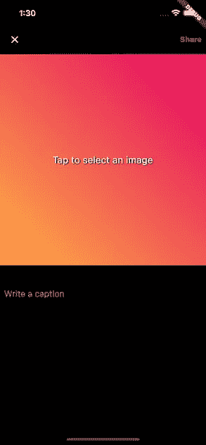**

**创建`components/new_post/new_post.dart`桶文件:**

```
export 'new_post_screen.dart';
```

## **添加导航并显示 Instagram 帖子(活动)**

**打开`components/profile/profile_page.dart`。**

**修改`_NoPostsMessage`小部件以导航到 **NewPostScreen** :**

**更新个人资料页面导航**

**将 **ProfilePage** 小部件的`feedBuilder`修改如下:**

**修改个人资料页面 feedBuilder**

**现在，您的 Instagram 克隆已经能够添加活动(帖子)，您需要处理有活动要显示的场景。上面的构建者:**

1.  **创建一个**自定义滚动视图**。**
2.  **显示 **_ProfileHeader** ，帖子数量设置为活动数量。**
3.  **显示**_ 编辑概要按钮**。**
4.  **将列表包装在一个 **RefreshIndicator** 中，这将允许用户下拉列表并通过获取最新的服务器数据启动页面刷新。这是通过调用`currentUser.get`和`bloc.queryEnrichedActivities`实现的。`queryEnrichedActivities`将更新给定**进给组**的进给块状态。**
5.  **将列表包装在一个 **RefreshIndicator** 中，这将允许用户下拉列表并通过获取最新的服务器数据启动页面刷新。这是通过调用`currentUser.get`和`bloc.queryEnrichedActivities`实现的。`queryEnrichedActivities`将更新给定**进给组**的 FeedBloc 状态。**

**就是这样！现在，您应该能够以用户身份登录，并将图像上传到他们的**用户订阅源**。下面是一段演示视频:**

**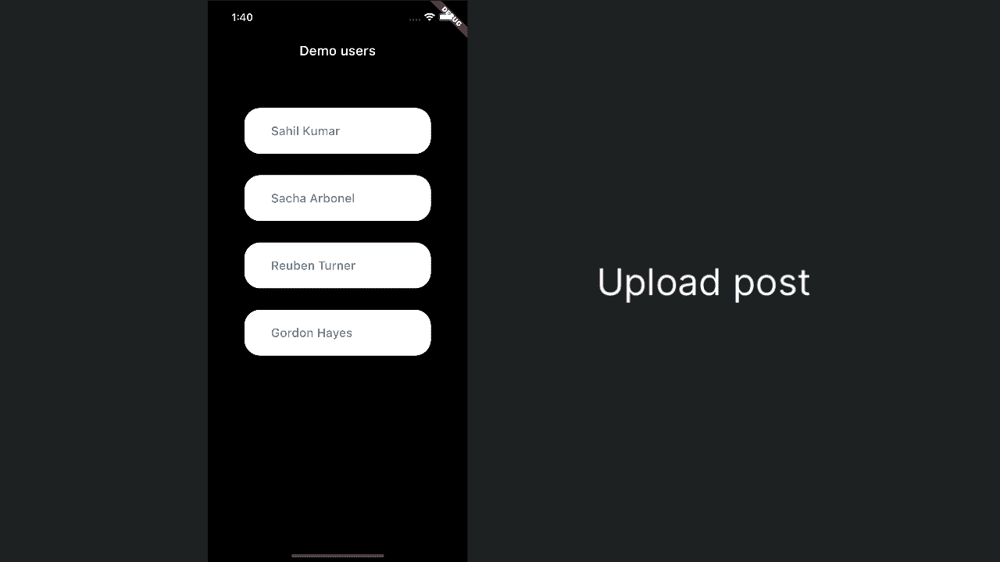**

## **添加图片查看器过渡动画**

**在进入**时间线提要**之前，让我们稍微提高一下页面转换的技巧。**

**使用 Instagram 时，你会注意到该应用程序在选择帖子图片时提供了无缝过渡。为了在我们的 Instagram 克隆中复制这种行为，我们将创建一个图片查看器，当图像被选中时，它会执行一个英雄转换，同时动态地将低分辨率图像切换为高分辨率图像。这将创建一个从网格视图到全屏的无缝转换。您还将添加平移和缩放图片的功能。**

**实现上述行为需要几个步骤:**

1.  **为自定义英雄动画创建 CustomRectTween**
2.  **创建创建 FadeTransition 的 PageRoute**
3.  **更新`components/profile/profile_page.dart`中的 UI 以执行导航**
4.  **利用**缓存网络图像**淡入低分辨率缓存图像，对于高分辨率图像**
5.  **使用 **InteractiveViewer** 小部件添加平移和缩放功能**

****导航****

**首先，您需要为转换创建一些助手类。**

**创建`app/navigation/custom_rect_tween.dart`并添加以下内容:**

**这个类扩展了 **RectTween** 来创建一个定制的 **lerp** 。稍后您将使用它来替换标准的英雄过渡。“lerp”是一个术语，用于描述随着时间(t)在开始和结束值之间的**插值**。这将 **Rect** 从**开始**线性转换为**结束**值。**

**接下来，创建`app/navigation/hero_dialog_route.dart`并添加以下内容:**

**这是一个定制的 **PageRoute** ，它执行一个 **FadeTransition** 并有一个黑色背景。还有其他方法也可以实现同样的过渡效果。探索这个类并尝试覆盖，看看你能创造什么。在本教程的前面，您还使用了 **PageRouteBuilder** ，这是完成上述任务的另一种方法。然而，扩展类给了你更多的控制。**

**创建`app/navigation/navigation.dart`桶文件:**

```
export 'custom_rect_tween.dart';
export 'hero_dialog_route.dart';
```

**更新`app/app.dart`桶文件:**

```
export 'state/state.dart';
export 'theme.dart';
export 'stream_agram.dart';
export 'utils.dart';
export 'navigation/navigation.dart'; // ADD THIS
```

****用户界面****

**打开`components/profile/profile_page.dart`文件，在底部添加以下内容:**

**添加图片查看器**

**上面的代码比较特殊。它做了几件事:**

*   **检索图像和调整大小的图像的网址，以及长宽比。**
*   **返回一个使用图像 URL(全分辨率)的 **CachedNetworkImage** ，并将`placeholder`指定为已经缓存的调整大小的 URL 的当前 **CachedNetworkImage** 。**
*   **使用**aspectatio**小部件将确保缓存的图像(调整大小的 URL)和全分辨率图像占据相同的空间。**
*   **将`fadeInDuration`设置为`Duration.zero`。**
*   **使用**customrectween**作为`createRectTween`参数，将所有内容包装在一个 **Hero** 小部件中。**
*   **将所有内容包装在一个 **InteractiveViewer** 中，允许用户平移和缩放图像。**

**上述所有代码将确保图像在检索后从小缓存版本平滑地渐变到全分辨率版本——同时还进行英雄过渡！🥳**

**现在，在 **ProfilePage** 小部件中，将**SliverChildBuilderDelegate**更新为以下内容:**

**添加 SliverChilBuilderDelegate**

**上面将 **CachedNetworkImage** 包装在 **Hero** 小部件和 **GestureDetector** 中，后者使用新创建的 **HeroDialogRoute** 执行导航，后者打开 **_PictureViewer** 小部件。**

> ***⚠️确保页面上的* ***英雄*** *标签相同，以便过渡正确工作。此外，确保你没有在同一个屏幕上显示重复的标签——这就是为什么你使用* `*activity.id*` *来使它唯一。***

**当你点击一张图片时，你现在应该有一个很棒的动画。请看下面的视频:**

**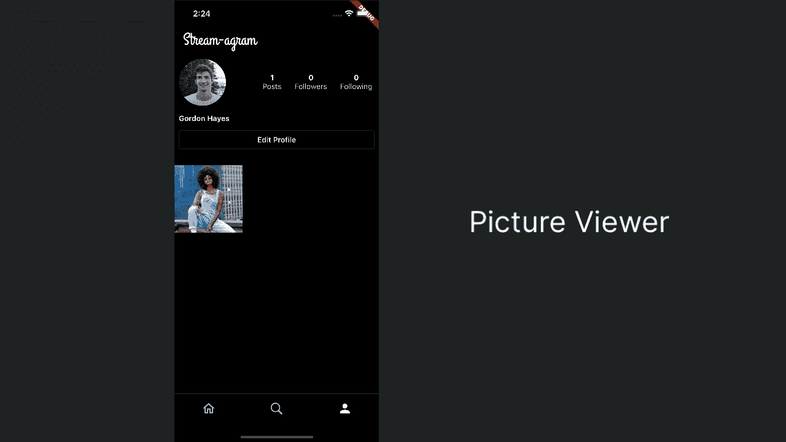**

**预览图片查看器**

# **更新您的 Instagram 应用程序栏操作**

**此时**应用栏**有点空。你可能也注意到了，在第一篇文章被创建之后，现在没有办法再添加更多的文章了。**

**让我们改变这一点。**

**打开`components/home/home_screen.dart`并用一个`actions`参数更新 **AppBar** :**

**这使用了您之前创建的 **TapFadeIcon** 。其中两个图标仅用于装饰，并不是演示应用程序的一部分。但是，第一次点击时会打开 **NewPostScreen** 。**

**AppBar 现在应该看起来像这样，并且应该可以添加多个帖子:**

**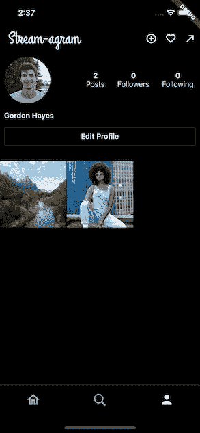**

**使用更新的 AppBar 预览个人资料页面**

# **关注/取消关注 Instagram 用户**

**关注和取消关注其他用户(feeds)是 Instagram 的一个核心功能。如果没有它，你的用户只会发布图片给他们自己看。🤪**

## **创建你的类似 Instagram 的搜索页面**

**创建`components/search/search_page.dart`文件，并添加:**

**这是相当多的代码，可能更容易让您按照自己的速度探索。总结一下，这段代码片段:**

1.  **获取所有演示用户，并从该列表中移除当前已通过身份验证的用户。**
2.  **显示使用 **_UserProfile** 小部件的所有用户。**
3.  **在 **_UserProfile** 小部件状态下调用`getUser`方法。该方法从服务器获取最新的用户信息，并使用 **FeedBloc** 上的`isFollowingFeed`方法检查当前用户是否已经在关注该用户。**
4.  **使用 **FutureBuilder** 小部件等待`getUser`的结果。**
5.  **通过调用`followOrUnfollowUser`方法，为每个用户返回一个 **_ProfileTile** 小部件，该小部件整齐地显示用户信息，并允许关注/取消关注用户。 **FeedBloc** 类用于根据 ID 轻松关注/取消关注某些 feeds。**
6.  ****FeedBloc** 上的`followFeed`和`unfollowFeed`方法的默认值设置为使用**时间线**和**用户**提要。如果您使用不同的名称，可以根据需要自定义这些名称。**

**`followOrUnfollowUser`方法也执行:**

```
FeedProvider.of(context).bloc.queryEnrichedActivities(
          feedGroup: 'timeline',
          flags: EnrichmentFlags()
            ..withOwnReactions()
            ..withRecentReactions()
            ..withReactionCounts(),
        );
```

**这迫使**时间线馈送**更新。**标志**参数很有趣:它告诉 API 用这些标志“丰富”活动。这基本上意味着它将检索活动以及添加到这些活动中的反应。您将在本教程的后面探索这一点。**

**接下来，创建桶文件，`components/search/search.dart`:**

```
export 'search_page.dart';
```

**最后，您需要一种方法来导航到这个页面。打开`components/home/home_screen.dart`，在**主屏幕**小部件中修改`_homePages`变量:**

```
...import 'package:stream_agram/components/search/search.dart';.../// List of pages available from the home screen.
static const List<Widget> _homePages = <Widget>[
  Center(child: Text('TimelinePage')),
  SearchPage(), // ADD THIS
  ProfilePage(),
];...
```

**如果一切正常，你现在应该能够导航到**搜索页面**并看到:**

**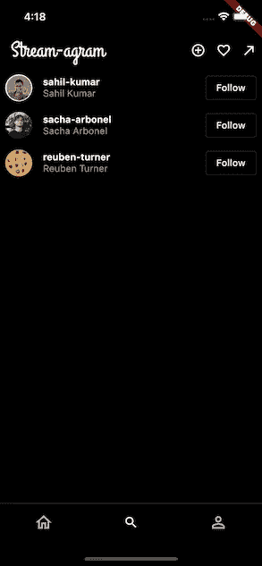**

> ***⚠️* ***注意:*** *如果您得到一个“* ***无法加载概要文件*** *”的错误，那么这可能意味着您还没有创建用户帐户。请确保每个用户帐户至少登录一次！***

# **构建您的 Instagram 时间轴订阅源**

**你的 Stream-agram 用户可以发布到他们的**用户订阅源**，他们可以关注/取消关注特定的用户订阅源，就像现实世界中的 Instagram 应用程序一样。这意味着您现在终于准备好显示**时间线提要**。**

**然而，获得恰到好处的用户界面和动画可能是困难的。因此，与其一头扎进死胡同，不如让我们先创建一些这个类所依赖的 UI 小部件。**

## **创建收藏图标和评论框**

**如果像 Instagram 这样的社交媒体应用程序没有对帖子做出反应的能力，会是什么样子？要将这一功能添加到我们的 Instagram 克隆中，您需要创建一个处理“收藏”(或“喜欢”)帖子的小部件和一个向帖子添加评论的小部件(一个 **TextField** )。**

**让我们从**收藏夹图标按钮**开始。**

**创建`components/app_widgets/favorite_icon.dart`并:**

**这是一个简单的小部件，点击时会高亮显示一个心形图标，并调用 **onTap** 回调。这个小部件用来表示一个帖子或评论已经被喜欢了。**

**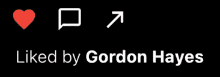**

**类似预览按钮**

**接下来，您将创建 **CommentBox** 小部件。创建`components/app_widgets/comment_box.dart`并添加:**

**总而言之，这个小部件:**

*   **接收一个 **StreamagramUser** ，它将是当前用户，或`commenter`，以显示用户资料图像。它还接受一个 **FocusNode** 、 **TextEditingController** 和一个名为`onSubmitted`的回调方法，它们都在文本编辑过程中使用。当消息发送时将调用`onSubmitted`回调(**完成**按钮，或**返回**)。**
*   **提供各种 UI 和样式。例如，启用和禁用**完成**按钮。**
*   **创建一个方便的表情框，当按下时，用选择的表情值更新 **TextEditingController** 。**

**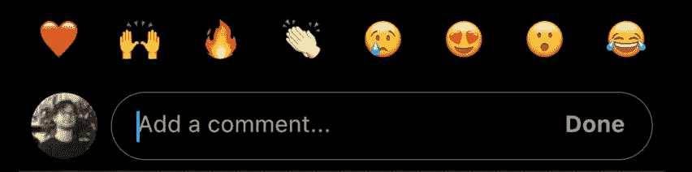**

**最后，曝光`components/app_widgets/app_widgets.dart`桶文件中的文件:**

```
export 'avatars.dart';
export 'tap_fade_icon.dart';
export 'favorite_icon.dart'; // ADD THIS
export 'comment_box.dart'; // ADD THIS
```

## **创建明信片小部件**

**这是一个大的。这个小部件将显示与“帖子”或活动相关的所有内容。**

**这个小部件需要很长时间来详细解释😅。相反，让我们看看它看起来像什么:**

****

**预览明信片小部件**

**上图中的一切都是**明信片**部件的一部分:**

*   **带有海报名称和图片的页眉。**
*   **形象/活动。**
*   **用于点赞和添加评论的栏(共享和书签图标仅用于 UI)。**
*   **图像描述。**
*   **一个评论框。**

**首先，创建`components/timeline/widgets/post_card.dart`并添加以下内容:**

**这份文件内容太多，无法一一详述。重要的部分是:**

*   **您将一个**enrich activity**传递给**明信片**。这基本上是类固醇的一种活动。这包含了额外的信息，比如孩子的活动和反应。反应可以是添加到活动中的任何内容，如评论等。**
*   **传入一个 **OnAddComment** 回调。当按钮被按下来为这篇文章添加评论时，这个函数将被调用。这样做的原因是，当用户点击其中一个表情符号时，您可以立即在您的 **CommentBox** 小部件中填入该值。**
*   **您可以本地管理添加到活动中的**和**反应的状态。这样做的原因是，自己管理它比直接更新 **StreamFeedBloc** 更简单，这将导致当一个帖子被喜欢时整个列表重新构建。**

**值得深入了解一下 **_PictureCarousal** 小部件中的`_addLikeReaction`方法。**

**如果您需要更多信息，请务必观看配套视频。**

**创建`components/timeline/widgets/widgets.dart`桶文件并添加:**

```
export 'post_card.dart';
```

## **创建类似 Instagram 的时间轴页面**

**另一个大部件。在这个页面上，您将使用 **FlatFeedCore** 小部件来显示“时间线”提要。对于提要中的每个活动，您将显示一张**明信片**。还有一些额外的魔法来创建一个浮动的**评论框**，当创建一个评论时，它的可见性是动态的。**

**创建`components/timeline/timeline_page.dart`并添加:**

**创建时间线页面**

**本页最重要的部分:**

**你创建了一个**堆栈**，第一项是 **FlatFeedCore** ，其中`feedGroup`设置为“时间线”。这与您在**个人资料页面**中使用的类似，但是现在您是:**

*   **在`feedBuilder`返回一张**明信片**。**
*   **用 **EnrichmentFlags 设置`flags`参数。**这将确保 **FlatFeedCore** 创建 **EnrichedActivities** ，其中包含所有当前用户的反应(`withOwnReactions`)、所有最近的反应(`withRecentReactions`)以及所有反应计数(`withReactionCounts`)。**

**堆栈的第二个也是最后一个项目是一个 **_CommentBox** 。这是一个私有的小部件，它做了一个奇特的自定义动画来显示和隐藏您之前创建的 **CommentBox** 小部件。**

*   **当`_showCommentBox`的值改变时，动画被触发。这是一个**值通知程序。****

**该文件中的其他一些重要信息:**

*   **`addComment`方法使用**送料块**在**活动**上添加一个**反应**。您正在添加的反应是一个**注释**(类型)，在**时间线**(提要组)上，带有一个字符串**消息**作为额外数据。**
*   **当用户按下区域添加评论，或者选择表情符号时，就会调用`openCommentBox`方法。这做了许多不同的事情来确保**注释框**被显示并聚焦。**
*   ****_CommentBox** 使用自定义显式动画的原因是，当动画完成并且注释框应该隐藏时，您还想将**可见性**设置为 false。这提高了性能，因为您不希望 Flutter 经历创建**注释框**的过程，并在不需要时将不透明度设置为零。在抖动中应用不透明度是非常昂贵的，尤其是在制作动画的时候。使用 **FadeTransion** 小部件是在抖动中制作不透明度动画的最佳方式。**

**咳😮‍💨。好吧，太激烈了。快好了。**

**创建一个桶文件`components/timeline/timeline.dart`并添加:**

```
export 'timeline_page.dart';
```

**然后打开`components/home/home_screen.dart`，修改`_homePages`变量如下:**

```
...import 'package:stream_agram/components/timeline/timeline_page.dart';.../// List of pages available from the home screen.
static const List<Widget> _homePages = <Widget>[
  TimelinePage(), // ADD THIS
  SearchPage(),
  ProfilePage(),
];...
```

**你终于可以运行你的 Instagram 克隆了，你应该会在时间轴上看到一些活动(在你关注已经发布了一些东西的人之后)。你还可以喜欢帖子和添加评论，并让订阅源自动更新🥳.**

**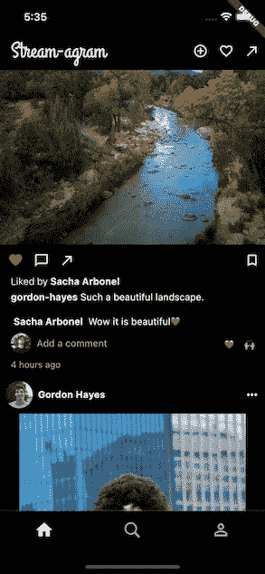**

## **添加更多 Instagram 赞和评论**

**在 Instagram 中，你会期望看到给定活动的所有评论。对于我们的 Instagram 克隆，我们将创建一个评论屏幕，该屏幕将扩展并显示与某个活动相关的所有评论，还允许用户在评论中添加评论，以及点赞评论😱。这些被称为**儿童反应**。**

**这一部分是迄今为止你所学的所有内容的组合！**

## **注释状态**

**对于这个部分，您将需要一个稍微复杂一点的状态管理，因为您需要跟踪用户是否正在向活动添加评论(反应)，或者他们是否正在向评论添加评论(子反应)。**

**创建`components/comments/state/comment_state.dart`并添加:**

**创建评论状态**

**这个 **ChangeNotifier** 管理它是什么类型的注释——注释的类型**:****

*   ****对某个活动的评论/赞(对帖子的反应)。****
*   ****对某个反应的评论/赞(某个评论的儿童反应)。****

****这在看了 UI 代码后会更容易理解。****

****在你的桶文件中暴露这个类，`components/comments/state/state.dart`:****

```
**export 'comment_state.dart';**
```

## ****创建你的类似 Instagram 的评论界面****

****创建`components/comments/comment_screen.dart`，并添加:****

****创建评论屏幕****

****这个文件中的一些重要内容:****

1.  ****您使用 **MultiProvider** 向 **CommentScreen** 的所有子部件公开一个 **FocusNode** 和一个 **CommentState** 。****
2.  ****您创建一个带有私有 **_CommentList** 和 **_CommentBox** 小部件的**堆栈**。****
3.  ******_CommentList** 使用 **ReactionListCore** 显示特定**活动**的所有反应。与前面类似，您指定了 **EnrichmentFlags** 。****
4.  ****利用**动画开关**很好地显示和隐藏一个弹出窗口，表明你是否在回复别人的评论。****
5.  ****在`_handleFavorite`方法中处理喜欢的评论。****
6.  ****使用 **Jiffy** 包显示自注释以来的时间。****
7.  ****在`handleSubmit`中决定一个评论应该是一个**反应**还是一个**子反应**，并使用 **BlocFeed** 相应地添加它。****

****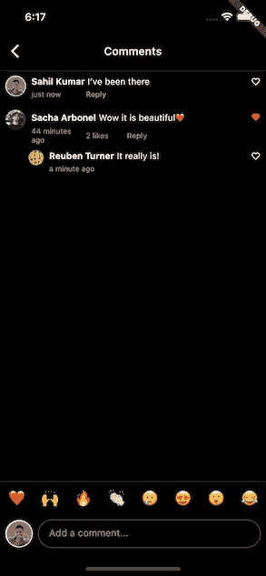****

****预览评论屏幕****

****创建`components/comments/comments.dart`桶文件:****

```
**export 'comment_screen.dart';**
```

****然后更新`components/timeline/widgets/post_card.dart`中的待办事项，导航至**评论屏幕**:****

# ****关注你自己的 Instagram 用户订阅****

****你自己可能已经注意到了这一点。但是当你查看时间线时，当前登录用户的帖子没有显示出来？****

****嗯，那是因为你需要告诉流媒体提要你想关注你自己的用户提要。****

****打开`app/state/app_state.dart`，修改如下:****

****并修改`connect`方法，使其也遵循您自己的提要:****

****现在，如果您重启应用程序并以用户身份连接，您应该会看到他们的帖子也显示在**时间线**上。****

# ****缓存您的 Instagram 页面状态****

****此时您可能已经注意到的另一点是，每次您在应用程序中导航时，页面都会被重新创建(使用**页面视图**)。很烦吧？****

****嗯，幸运的是，这是一个简单的解决办法。****

****打开`components/home/home_screen.dart`,在文件底部添加这个类:****

****这使用了**AutomaticKeepAliveClientMixin**来保持小部件活动。****

****你现在需要做的就是将所有的页面包装在一个`_KeepAlivePage`小部件中。将`_homePages`小部件更新为以下内容:****

****做一个**热重启**，当你在应用中导航时，你应该看到页面保持活跃。****

# ****下一步是什么？****

****你的申请完成了，🥳****

****使用 Flutter 和 Stream Feeds，你可以创建一个 Instagram 克隆。恭喜你一路走到了最后。****

****正如在整个教程中所讨论的，管理活动提要可能相当复杂，而流提要提供了很多我们在本教程中没有探讨的内容。****

****下一步是利用您所学到的知识，创建您自己的活动源应用程序！一定要多读一些关于 [**聚合**](https://getstream.io/activity-feeds/docs/flutter-dart/flat_feeds/?language=dart#aggregated_feeds) 和 [**通知**](https://getstream.io/activity-feeds/docs/flutter-dart/flat_feeds/?language=dart#notification_feeds) 提要的内容，看看你是否能把它们结合起来。****

****我们重视您的反馈，并乐意接受您对未来希望看到的内容的建议。****

****你可以在 Github 上获得完整的[源代码](https://github.com/GetStream/flutter-instagram-clone)。****

*****最初发布于*[*https://getstream . io*](https://getstream.io/blog/instagram-clone-flutter/)*。*****

# ****分级编码****

****感谢您成为我们社区的一员！升级正在改变技术招聘。 [**在最好的公司找到你最理想的工作**](https://jobs.levelup.dev/talent)**。******

******[](https://jobs.levelup.dev/talent) [## 提升——改变招聘流程

### 🔥让软件工程师找到他们热爱的完美角色🧠寻找人才是最痛苦的部分…

作业. levelup.dev](https://jobs.levelup.dev/talent)******