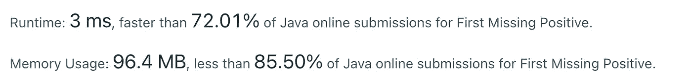
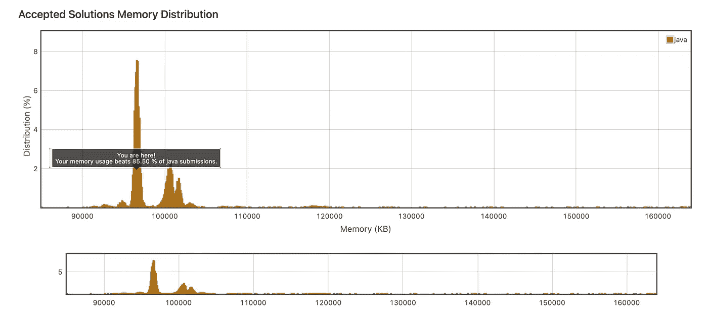
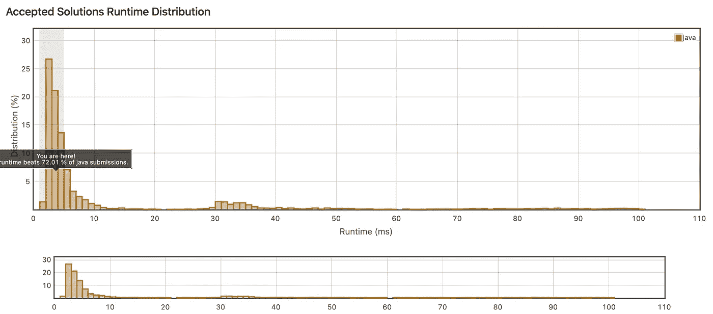

# 编码挑战:第一个缺失的正数🔥🔥🔥

> 原文：<https://levelup.gitconnected.com/coding-challenge-first-missing-positive-6316efd84558>


# 问题:

> 给定一个未排序的整数数组`nums`，返回最小的缺失正整数。您必须实现一个在`O(n)`时间内运行并使用恒定额外空间的算法。

**例一:**

```
**Input:** nums = [1, 2, 0]
**Output:** 3
```

**例二:**

```
**Input:** nums = [3, 4, -1, 1]
**Output:** 2
```

**例 3:**

```
**Input:** nums = [7, 8, 9, 11, 12]
**Output:** 1
```

**例 4:**

```
**Input:** nums = [1, 2, 4, 6, 3, 7, 8]
**Output:** 5
```

**约束:**

*   1 ≤ nums .长度≤ 5 * 10⁵
*   -2 ≤ nums[I] ≤ 2 -1

# 说明

*   我们希望在正整数数组中找到最小的缺失正整数，或者我们可以理解为，在一个包含 **n 个元素**的数组中，找到不在数组中的**【0】**和**【n-1】**之间的最小元素。如果数组包含所有这些，则解是数组大小 **n** 。
*   我们有一个来自 **[1】的 **n** 的数组..100，000]** 元素，这些是我们的参数。数组的元素是[-2 …2 -1]中的一个整数

# 方法 1 | O (n)

解决这个问题的传统方法是在给定的数组中从 1 开始搜索所有正整数。我们可能在给定的数组中得到 **(n+1)** 个数字，所以这在最坏的情况下需要 O(n)。

# 方法 2:使用排序数组| O (N log N)

*   我们可以先用**排序**以较小的时间复杂度求解。如你所知，当排序时会花费 O(N log N)的时间。一旦对数组进行了排序，我们需要做的就是对数组进行线性扫描，所以这需要 O (N log N + n)的时间，也就是 O (N log N)
*   这意味着我们有线性复杂度，即 O (N log N)，N 是输入的长度。



内存(KB)



运行时间(毫秒)

# 方法 3:使用标志| O (n)

*   在这个问题中，我们创建了一个 boolean **false** 值的列表，其大小为给定数组的 max()值。每当我们在原始数组中遇到任何正值时，我们将 **false** 值更改为 **true，**在我们完成后，我们简单地遍历修改后的列表，我们遇到的第一个 0，就是(index + 1)应该是我们的答案，因为索引从 0 开始
*   *对于输入数组中匹配布尔数组索引的每个整数，我们将对应的值设置为* ***真*** *。*
*   *我们的标志数组为输入数组中出现的每个整数保存* ***真*** *，否则保存* ***假*** *。我们可以遍历 flags 数组并返回第一个包含 false 的索引。如果没有，我们返回数组长度。*

***更清楚:***

*   数字 **1，2，…，n + 1** 中至少有一个不在数组中。让我们创建一个大小为 **(n+ 1)** 的布尔数组 **B** 来存储这些数字是否存在。
*   我们找到从 1 到 n + 1 的数字，我们在 **B 中标记相应的条目。**如果我们看到的数字不符合这些界限，就跳过它，继续下一个。
*   在处理完输入之后，我们可以在布尔数组 **B** 中找到第一个未标记的条目

*   对于**时间复杂度，**我们不对输入进行排序，我们只遍历两个大小相同的数组，这意味着我们的时间复杂度应该是 **O(2n)** 或者简化为 **O(n)**
*   对于**空间复杂度**，我们创建与输入大小相同的第二个数组，这意味着我们有 **O(n)** 空间复杂度。


# 参考

*   [https://leetcode.com/problems/first-missing-positive/](https://leetcode.com/problems/first-missing-positive/)
*   [https://github.com/nphau/leetcode.solution](https://github.com/nphau/leetcode.solution)