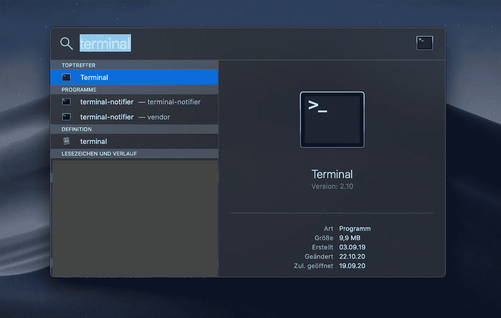
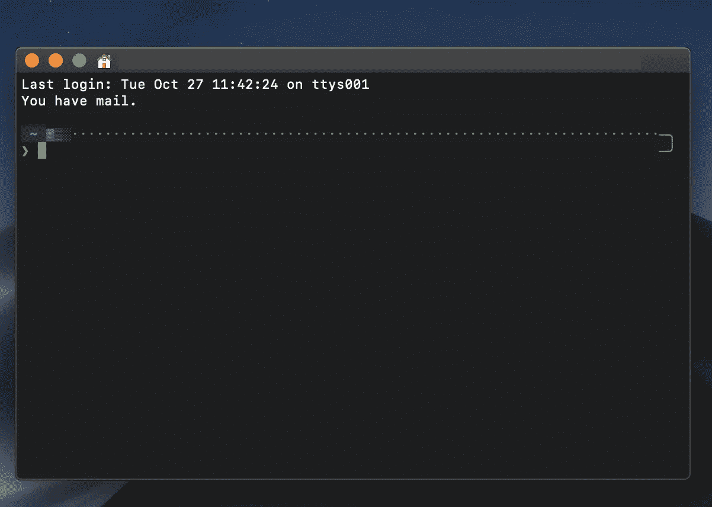
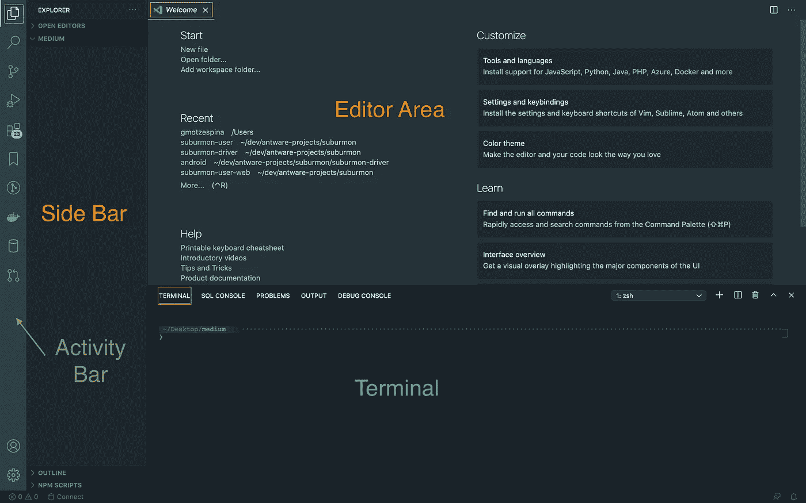
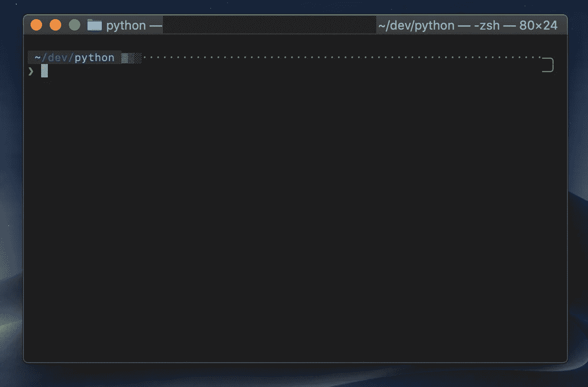
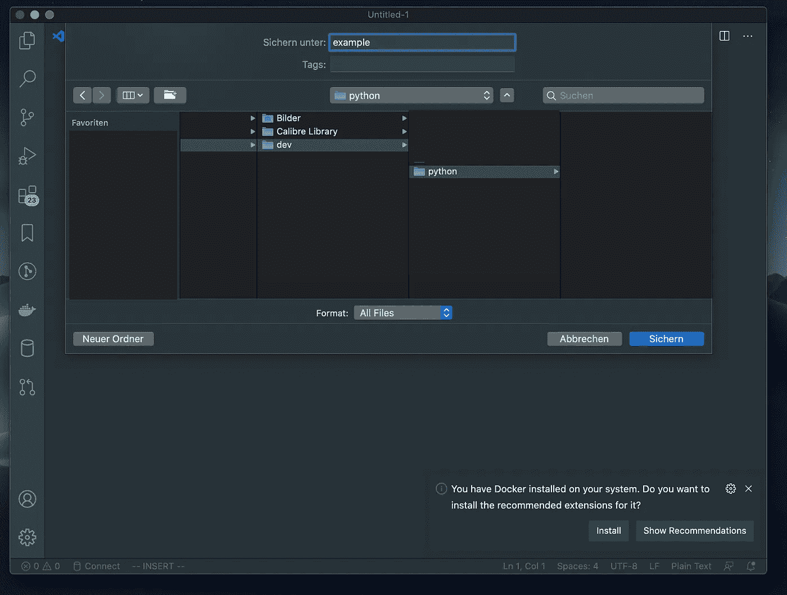
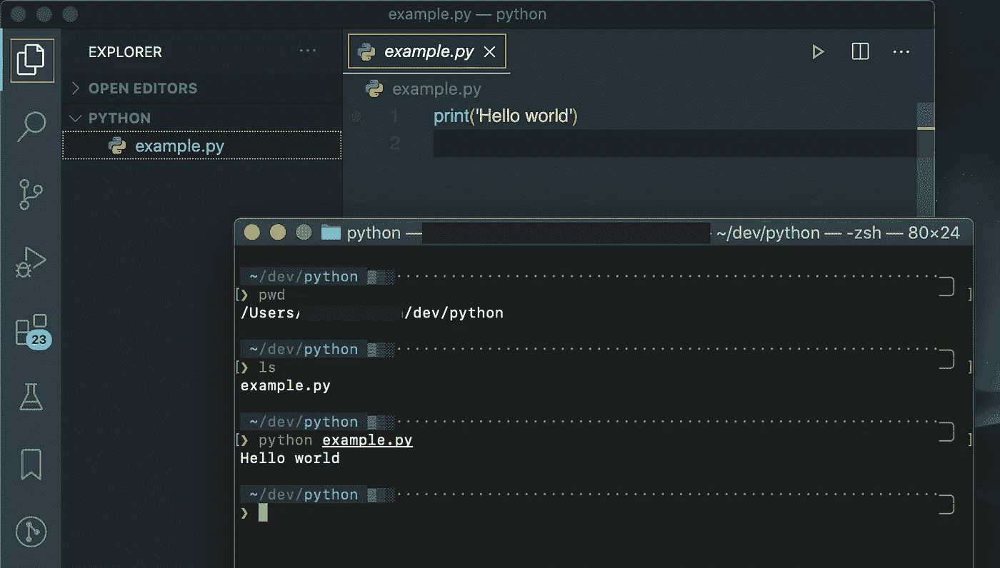

# 完全初学者的编码

> 原文：<https://levelup.gitconnected.com/coding-for-complete-beginners-64e8cf9f0b26>

## 5 分钟从 0 到初学者！

在 [Unsplash](https://unsplash.com/s/photos/coding?utm_source=unsplash&utm_medium=referral&utm_content=creditCopyText) 上拍摄的 [ThisisEngineering RAEng](https://unsplash.com/@thisisengineering?utm_source=unsplash&utm_medium=referral&utm_content=creditCopyText)

我经常从非程序员朋友那里听到，他们想开始编程，但他们抱怨说，那里的大多数课程都假设你知道并理解真正的基础知识。而且让没有经验的人很难开始编码。

## 我说的真正的基础是什么意思？

外面有很多课程，假设你知道如何使用终端或者什么是文本编辑器。那些课程解释了编程语言的基础，但是他们没有告诉你终端是什么，它是用来做什么的，或者如何正确地使用文本编辑器。

它可能看起来非常简单，因为它对我们(软件工程师/开发人员)来说是隐含的。我们每天都使用终端和文本编辑器。对我们来说，使用文本编辑器和终端对某些人来说就像使用 Word、Excel 和 Power Point，对一个孩子来说就像画画。因此，我们通常想当然地认为，每个人都已经知道了“真正的基础知识”，他们只想亲自动手编写代码。

有些人甚至不知道什么是文本编辑器/IDE，也不知道如何在控制台中导航和运行脚本。所以，如果你知道“真正的基础”，这篇文章不适合你，但是如果你以前从未使用过终端或文本编辑器，这篇文章适合你！

# 基本概念

## 什么是 IDE(集成开发环境)？

> 一个**集成开发环境** ( **IDE** )是一个[软件应用](https://en.wikipedia.org/wiki/Application_software)，为[计算机程序员](https://en.wikipedia.org/wiki/Computer_programmer)进行[软件开发](https://en.wikipedia.org/wiki/Software_development)提供全面的设施。一个 IDE 通常至少包括一个[源代码编辑器](https://en.wikipedia.org/wiki/Source_code_editor)、[构建自动化](https://en.wikipedia.org/wiki/Build_automation)工具和一个[调试器](https://en.wikipedia.org/wiki/Debugger)。

简而言之，IDE 是一种允许开发人员以更简单的方式编码的软件，它有文本自动完成、自动化等工具。今天的大多数 ide 都可以用第三方插件来增强。

我最喜欢的是 Jetbrain 的大多数想法。

## 什么是文本编辑器？

文字编辑器顾名思义就是一个可以让你编辑文字的软件。它没有给你 IDE 可能给你的所有工具，但它也是一个更轻便的程序，它需要更少的时间来加载，它在你的计算机上消耗更少的内存。

我最喜欢的是 [Visual Studio Code](https://code.visualstudio.com/) ，我实际上在日常工作中使用它。

## 文本编辑器与 IDE——使用哪一个？

IDE 很棒，但是在我看来，可视化代码可以和 IDE 一样好。在 VS 代码中，有大量的扩展可以增强你的开发体验。除此之外，它超级快，比 IDE 快多了。

所以如果我是你，我会选择 Visual Studio 代码。

## 什么是终端或命令行？

终端，也称为命令行或控制台，允许我们执行某些操作，并用一串预设的命令向计算机发出指令。命令因操作系统而异，大多数 linux 和 Mac OS 都有类似的命令。**我将重点介绍 Mac。**

## 木星笔记本是什么？

[Jupiter Notebook](https://jupyter.org/) 是一个工具，允许你在一个超级友好的环境中运行 python 代码，实际上看起来像一个笔记本，你可以写文本来解释你在做什么，并记住你为获得某个结果所采取的步骤。

# 末端的

注意:我使用 Mac 进行开发，所以如果您有 Mac 或 Linux 环境，所有终端命令和我将解释的大部分内容都可以正常工作。

## 如何打开终端？

您可以通过点击“cmd +空格键”来搜索您的终端，spotlight 将会弹出，

聚光灯

在这里你可以搜索“*终端”*，选择弹出的黑色方块。

搜索结果聚焦

瞧，你已经打开了终端。根据您的配置，它应该类似于下图。

末端的

## 基本命令

*   `ls`–列出您当前所在目录中的所有文件。
*   `pwd`–显示当前目录
*   `mkdir [name]`–在当前目录下创建一个文件夹。例如:`mkdir my_folder`
*   `cd [name]`–允许你浏览你的文件，你必须键入`cd`，然后是一个现有文件夹的名称。比如:`cd my_folder`。
*   `cd ..`–退出当前目录的上一级
*   `python [file_name]`–运行 python 脚本。文件必须有`.py`扩展名。例如:`python my_file.py`

# Visual Studio 代码

你可以在这里下载[。然后，下载后，您可以通过双击刚刚下载的文件来继续安装它。](https://code.visualstudio.com/)

## Visual Studio 代码概述

可视代码有 4 个主要部分:

*   编辑器区域:它会显示你的文件内容
*   导航侧边栏:你可以在那里浏览你的文件
*   活动栏:在那里你可以根据你安装的插件做不同的事情
*   终端:这个部分为您打开了一个终端，因此您可以使用 VS 代码中内置的终端，而不必使用我上面提供的步骤手动打开它。

VS 代码段

如果您看不到这些部分，您可以通过进入顶部菜单上的*查看>外观*并选择您想要切换的部分来手动打开它们。

# 让我们把手弄脏吧

现在，您已经了解了终端和可视代码的基本知识，并掌握了两者的工作原理，让我们一起创建一个脚本，并在终端和可视代码上执行它。

首先，让我们使用终端创建一个文件夹来存储我们的文件:

1.  打开终端
2.  键入`mkdir dev`创建一个名为 *dev* 的目录
3.  键入`cd dev`导航到我们刚刚创建的 dev 目录
4.  键入`mkdir python`在 dev 目录中创建一个名为 python 的目录
5.  键入`cd python`导航到 python 目录

如果您按照正确的步骤操作，您应该会看到类似下面的内容:

dev/python 目录内的终端

注意:前面的步骤是可选的。我只是喜欢用编程语言来组织我的项目，以防将来你会用不同的语言。

现在我们有了一个文件夹来存储我们的 python 文件，让我们继续用可视化代码创建一个脚本吧！

1.  打开可视代码
2.  一旦进入可视代码，选择`file > new file`
3.  选择`file > save`
4.  导航到我们在弹出的窗口中创建的文件夹，并命名您的文件。我将它命名为 *example.py* (不要忘记添加扩展名。py 到你的文件名)*。通常你应该为你的文件选择一个好名字。*

在保存文件之前，它应该看起来像这样，

我们已经创建了第一个 python 文件！现在我们可以开始添加一些代码了！

在程序员的世界里有一个传统，那就是每当你开始一门新的测试项目，你要做的第一件事就是在屏幕上打印**“Hello world”**。你可以在这里了解更多信息[。](https://en.wikipedia.org/wiki/%22Hello,_World!%22_program)

所以我们就这么做吧！

在新创建的 python 文件中键入以下内容，

`print('Hello world')`

就是这样！我们有一个超级基本的脚本应该打印在屏幕上“你好世界”。因此，让我们继续使用终端运行它吧！

1.  去你的终端
2.  使用`pwd`命令并按回车键，检查您是否在正确的目录中
3.  这将向您显示以下内容:`/Users/your_username/dev/python`
4.  现在看一下文件夹的内容，看看我们创建的文件是否在那里。键入`ls`并按回车键。您应该能够看到您的文件的名称。这意味着文件在那里，我们可以继续执行它
5.  在终端上键入`python example.py`,然后按回车键运行文件
6.  如果您遵循这些步骤，您应该会看到以下输出:“Hello world”
7.  就是这样！您刚刚使用每个软件开发人员都会使用的主要工具创建了您的第一个脚本！

运行 example.py 脚本的步骤

# 下一步做什么？

现在，您已经了解了如何使用终端创建目录、使用可视代码创建和编辑文件、在终端中导航以及执行 python 脚本。

我建议你一遍又一遍地重复这个过程，直到它粘在你身上，你觉得它很自然。如果你真的想成为一名软件开发人员，或者至少经常这样做，你应该能够不假思索地完成所有这些过程。

# 其他建议

在我看来，开始学习 python 最友好的方式是使用 Jupiter Notebook。它并没有给你一个真正的程序员工作的概述，但是它让你以一种简单的方式进行实验。另一个超级友好的方法是使用一个在线编译器，比如 https://www.tutorialspoint.com/execute_python_online.php.的 T10，它不会给你所有你在电脑里会有的功能，但是它会让你用 python 做一些基本的实验。

如果你真的想拥有生产就绪的代码，或者你真的想得到一份程序员或数据科学家的工作，上面提到的两个选项都是不推荐的。现实世界里没人用木星笔记本。因此，如果你真的想进入编码领域，能够使用终端和代码编辑器或 IDE 是至关重要的。

即使您认为使用文本编辑器和终端会使一切变得更加麻烦，我也建议您这样做。最好从一开始就跳进深水里。很快你就会知道如何漂浮:)。