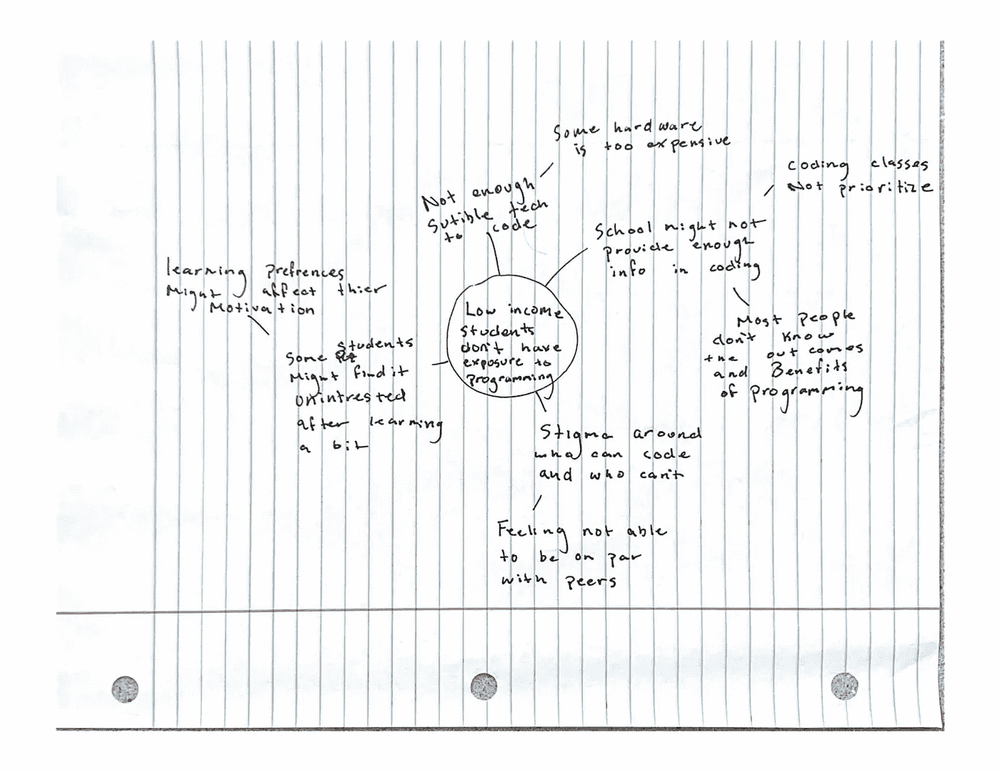
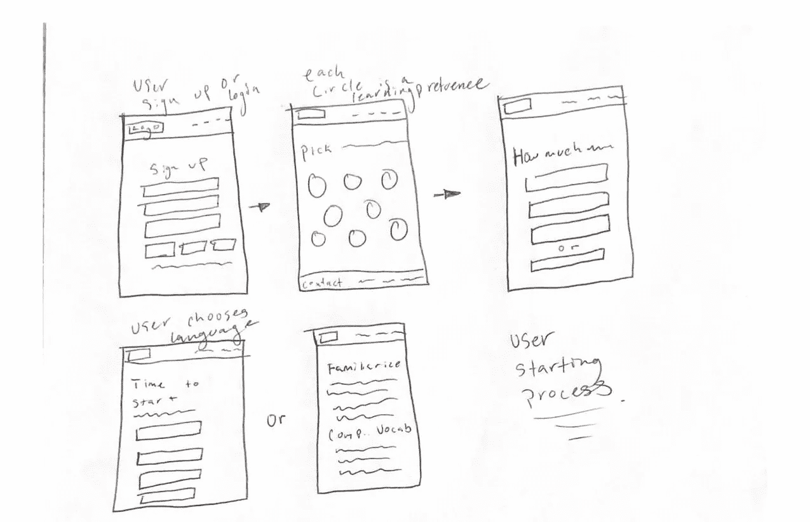

# 为新人编码

> 原文：<https://levelup.gitconnected.com/coding-for-newbies-5fbbd8cc2e73>

## ***更有*** 过分简单化的曝光给所有人编码

## 介绍

技术进步日新月异，如果你跟不上，你就会被这个蓬勃发展的行业甩在后面。虽然这并不像看上去那么简单，但我亲眼看到成为一名成功的软件工程师并不容易。我的梦想仍在进行中，但随着我的学习，我对教那些还没有接触过代码世界的人产生了浓厚的兴趣。开始上学对我来说是一个大开眼界，因为我太天真了，以为我可以和以前有代码经验的同事平起平坐。这种情况丝毫没有让我气馁；在我看来，这是朝着我的目标不断努力的更多动力。我才刚刚起步，已经遇到了一些障碍，比如不了解我的设备或任何软件，不知道编码术语。这意味着我必须更加努力去完成我的最终目标。

## 项目！

我想做一些免费的系统，帮助这些低收入的人打开一扇新的机会之门，学习如何在一个更直接和更具成本效益的水平上编码。由于一些网站要求你知道如何操作和移动你的代码，不经常使用计算机的低收入人群可能仍然难以完全理解，即使有一个计算机术语的网站细目分类。有些人拥有会员资格，可以享受免费服务，但更深层次的信息却被锁了起来，因为你没有订阅这项服务。有许多不同的方式来提供信息，但大多数时候，这是有代价的。

## 这个项目的时间到了吗？

## 社会学趋势:

一种社会学的趋势推动我提出了这个想法。新冠肺炎影响了我们对类似情况下工作方式的看法。大多数人都想找一份他们觉得自己的职位有保障的工作。大部分人无法在家办公，导致裁员；作为一名软件工程师，这不是一个大问题，因为你可以很容易地贡献、参与和与同事一起工作。

没有持续的计算机可用性的人不知道如何正确地导航或阅读代码，这在学习编码时可能有点令人沮丧。与低收入者从事的常规工作相比，成为一名软件工程师或进入这类行业的好处更多。

## 技术趋势:

技术趋势永无止境；科技行业不会停止增长或发展。将会有人拥有制造这些未来强大机器的程序所需的技能。有了远程学习，每个人面前都有一台电脑。计算机对初学者来说可能是令人生畏的，但是在帮助和指导下，他们也能制作他们在屏幕上看到的程序。

## 政治趋势:

激励我的政治趋势是听到总统。候选人更多地谈论低收入家庭的学生如何在追求教育方面做得更多。这种趋势影响了我，因为我来自一所低收入学校，看到我的一些朋友因为费用和对有能力接受高等教育的恐惧而不愿意接受高等教育。候选人正在谈论社区如何帮助这些学生和家庭，因为他们将是进入劳动力市场的美国净一代，即使儿童和青少年正在努力获得良好的互联网连接，或者似乎在使用计算机方面有困难。

## 经济趋势:

当今世界的经济趋势是巨大的；他们对市场产生了显著的影响。好的和坏的变化，例如，食品和服务，由于 COVID 和可用资源而被夸大。科技产品的价格似乎有所下降，奢侈品需要在这段时间获得收入。当需要食物、水和卫生用品等必需品时，大多数人不会买电脑或昂贵的衣服。有大量的美国公民失业，确切地说是创纪录的高。由于这一事实，年轻人可能会感到恐惧，认为他们需要一份有保障的工作。

## 竞争格局

我想进入的竞争环境已经非常拥挤了。这个群体有多种多样；例如，W3schools 是一个提供教程、练习和如何编码的例子的网站。另一个竞争者是 Codecademy 这是一个引导你选择编程语言的网站，但这是有代价的。会员资格是人们远离的东西，因为大多数人想免费学习，而其他人可能没有钱支付固定的订阅费。学习偏好也是考虑的因素，因为其中一些网站缺乏教育视频，这可能会帮助一部分用户。用户还希望通过反馈沉浸在他们的工作中，并看到跟踪的进展。Codecademy 擅长于此，而 w3schools 则不然。我认为在开始使用这些网站时的一个问题是，你似乎需要关于如何导航你的计算机和阅读代码的背景知识。这两个例子可能会让绝对的初学者望而却步，这造成了一种只有聪明人才能编程的耻辱。事实上，人们可以做到这一点。

也有编码训练营，在那里你可以去一段时间学习编程。新兵训练营偶尔会教授一些各种语言的知识，而掌握代码语言本身就是一项艰巨的任务。我的节目或网站会免费，你可以一次专注语言；如果你是电脑新手，它会指导你了解你的硬件。它将提供视频和对程序中使用的词汇的进一步解释。它还将包含一个反馈和传递系统，用户可以从中看到他们需要改进的地方。

## 洞察面试

我进行了一些用户采访，我还没有得到我想要的所有人。我问了一些不需要深入回答的开放性问题。我得到的这几个答案让我明白了我想如何实现这个解决方案，但现在我仍然不确定最终产品。我的问题包括:

1.  你目前在学校注册了吗？
2.  上过编码课吗？
3.  你对未来的职业感兴趣吗？
4.  你的主要爱好是什么？
5.  你创造的最后一个“项目”是什么？
6.  你想知道事物是如何运作的吗？
7.  你经常使用哪种应用程序或网络浏览器？
8.  你的学习偏好是什么？

我在一次电话采访中采访了我的一些同行和我的弟弟和父母。我得到的答案并不是我真正想要的，因为我的观众是 k-12 年级的学生，以及很少接触电脑或互联网的人。即便如此，我还是得到了一些颇有见地的观点。

从我的家庭成员开始，因为我的小弟弟离我的目标用户最近。当我问他上面的问题时，我的结论是大多数孩子喜欢做项目和写代码。他说他的第一次编码经历很无聊，因为他们做的都是讲座。孩子们没有真正的实践经验，所以他像同龄人一样辍学了。似乎当你向某人介绍代码时，你抓住了他们的注意力，并向他们展示了使用代码的无限可能性。

在我看来，我的父母是一个很好的回应，因为他们不知道如何使用技术。当我问他们是否曾经接触过编码或代码时，他们对他们所有的应用程序和计算机如何工作以及他们可以用它们做什么感兴趣。他们回答说，计算机太复杂了，只有受过教育的人才能进入这种劳动大军。

当采访我的同行时，这有点太复杂了，因为他们中的一些人以前有过经验，一些人像我一样开始学习。一个令人兴奋的发现是，学生在编码时更依赖视频和演练来摆脱困境，而不是阅读解释。我的每一个面试官都遇到了一些语言的语法问题。此外，他们周围的人也指责他们不能做我的同龄人正在做的事情——能够访问你需要编码的硬件。稳定的互联网连接是一个问题，因为它会导致挫折，阻碍人们继续工作。

引导我做这个项目的思维导图

我帮助低收入家庭的学生通过一个应用程序获得技术经验和编码技能，并采用各种学习方法，不需要接触任何技术。即使我的竞争对手提供或多或少相同的知识，我也有优势。我的应用程序功能和服务将是免费的。它将拥有大量的学习方法来适应用户的喜好。在使用它之前，用户不需要有计算机背景知识。

# 用户旅程示例

“我是 Victor Conda，我的哥哥告诉了我编码和技术的好处。他让我参考他的申请，让我注册一个账户来跟踪我的进度。然后，它让我选择我的学习偏好，然后提示我以前有过什么样的技术体验。之后它给了我选择我想学什么编程语言的机会。我可以从一个写着跟踪进度的 tad 上获得关于我的进度的反馈，但我会在以后开始我的编码之旅时使用它。”

“我叫基拉·克劳福德；我是一名国际移民，来到美国寻求一份更好的工作。我甚至没有技术或编码经验，所以我想了解和探索这个职业。我发现这个应用程序是为了在通过应用程序商店时学习编码和熟悉技术。当我启动应用程序时，系统提示我注册进度检查。然后我被问及学习偏好和我以前接触科技的经历。屏幕显示学习编程；我们首先让我熟悉了我的硬件和工具。然后只有在我们可以开始学习编码语言之后。”

我所做的这些用户旅程将帮助我了解用户将如何使用我的应用程序，并给我更多改进的想法。这将更容易看到用户将在应用程序上采取的过程。它还将提供应用程序的细节，并为那些想知道应用程序是什么的人设定期望。所有这些对我心目中的“火箭船”想法至关重要，但我们应该首先从基础开始。

## 线框

我的项目的线框

上面的线框确实帮助我进一步开发了用户体验。这真的有助于想象我希望注册过程是什么样子，以及我将如何设计页面。使用手拉线框是有成本效益和可塑性的。如果你有一个新的想法，你可以简单地简化它，并添加到线框。使用高分辨率模型是有用的，但改变其内容将是一个很难决定，这样做。