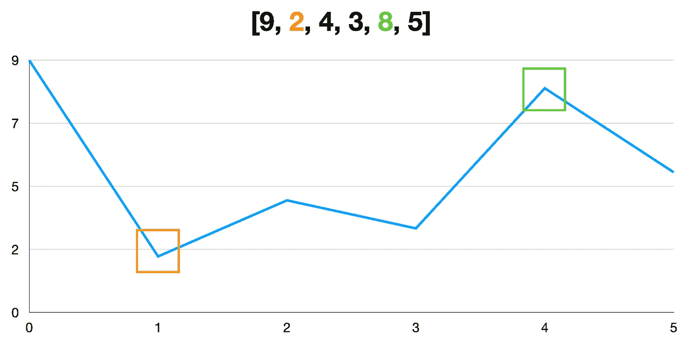
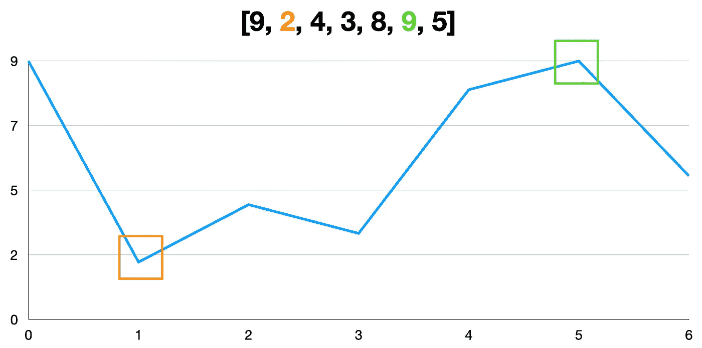
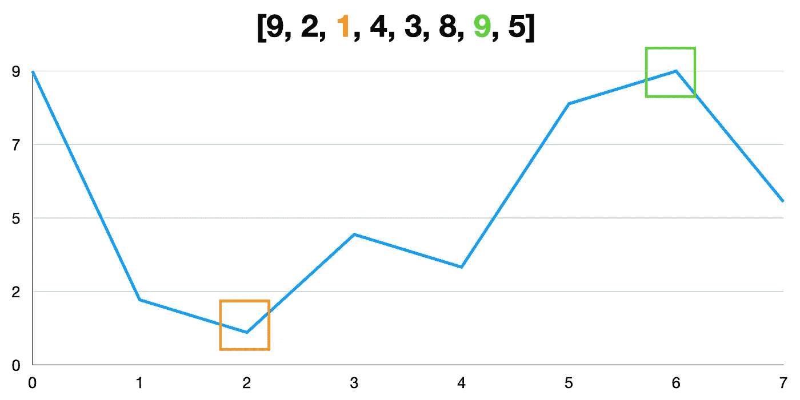
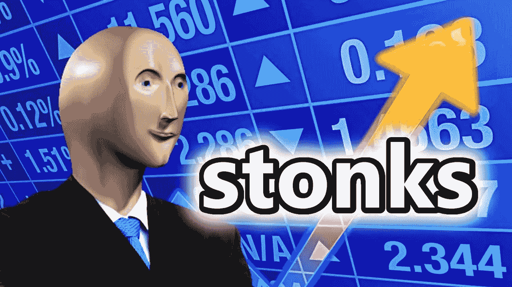

# 编码面试问题:买卖股票的最佳时机

> 原文：<https://levelup.gitconnected.com/coding-interview-question-best-time-to-buy-and-sell-stock-351314bfa37>

本文将带您浏览 JavaScript 中的“买卖股票的最佳时机”编码面试问题。 [**全编码面试课程:Skilled.dev🚀**](https://skilled.dev/)

我从这些视频中得到了很多乐趣，如果你觉得它们有帮助的话，我还打算制作更多。喜欢和 [***在 YouTube 上订阅***](https://www.youtube.com/c/treyhuffine1?sub_confirmation=1) *让我知道我应该坚持下去。*

## 问题

您将获得一个整数数组，其中的项目对应于股票价格，数组的索引对应于连续的天数。写一个函数`getMaxProfit`，计算你买一次卖一次能赚的最大金额。你能做的最坏的事情是 0 美元的利润(你甚至买/卖或者根本不买/卖)。

你只能在买入股票的第二天卖出。

*   买之前不能卖
*   你不能在买入的同一天卖出

## 样本输入和输出

**例 1:**

```
**Input:** [9,2,4,3,8,5]
**Output:** 6
**Explanation:** Buy on day 1 (price = 2) and sell on day 4 (price = 8), profit = 8-2 = 6.
```

**例 2:**

```
**Input:** [9,8,7,6,5]
**Output:** 0
**Explanation:** Since all pricing are decreasing, we would never buy, so max profit = 0.
```

## 强力解决方案— O(n)

我们将从强力解决方案开始。我们将遍历数组，通过以当前价格购买来计算每件商品的利润，然后在嵌套循环中通过以每个价格出售来确定利润。我们维护最大利润，并在遍历完所有项目后返回这个值。

该功能在`O(n²)`时间内运行。每当我们看到嵌套的`for`循环，这几乎总是表明你将有二次时间。

## 最佳线性时间解— O(n)

为了更直观地了解如何改进我们的解决方案，我们先来看一些例子。

第一天我们以 2 美元买入，第四天以 8 美元卖出，获利 6 美元。



现在让我们添加一个新的点—另一个 9 美元的股票价格，但在稍后的一天。在这种情况下，我们以 2 美元买入，9 美元卖出。



最后，让我们在目前 2 美元的低点后再加上 1 美元的价格。



当我们加上 9 美元的额外价格时，我们以更高的价格出售，当我们加上 1 美元的价格时，我们以更低的价格购买。

通过查看这些图表，我们可以看到，我们不需要跟踪所有的价格，只需要两个数据点。我们需要跟踪的是在任何时候出售的最低价格和最大利润。

因为我们总是在向前看，当我们遇到一个新的低价时，我们知道根据我们现有的数据在这里买入是最好的选择。这是因为当我们在时间上向前移动时，它将产生更大的利润。

然后，当我们遇到更高的价格时，我们以最大价格出售。

我们在每一步都寻找最佳选择。通过计算每个区间的利润，一旦我们完成迭代，我们将知道整个数组的最佳选择。

我们的[贪婪方法](https://en.wikipedia.org/wiki/Greedy_algorithm)允许我们只用一个循环就能确定最大利润。这将我们的强力`O(n²)`解决方案优化为`O(n)`线性时间解决方案。

我正在建立一个更深入的课程。注册电子邮件列表以获得独家折扣并获得发布通知。

[](https://skilled.dev) [## 编写面试问题

### 掌握编码面试的过程

技术开发](https://skilled.dev) 