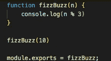
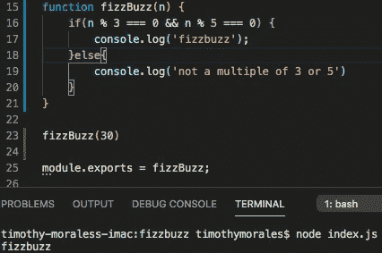
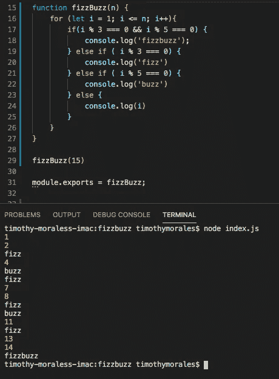
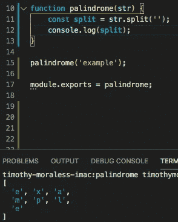
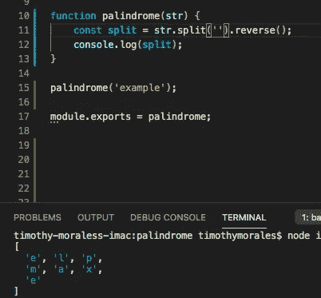
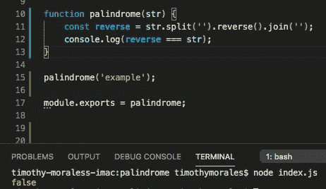
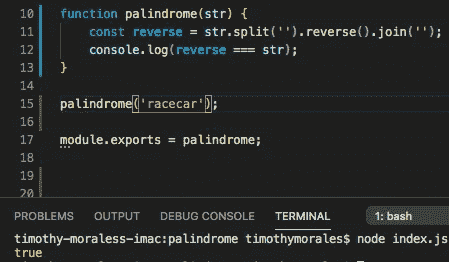

# 编码面试:常用算法

> 原文：<https://levelup.gitconnected.com/coding-interviews-common-algorithms-8ecf8787731>

从编码训练营毕业后，我大部分时间都在专注于构建应用和网站；这对简历来说很好，但是实际的面试过程呢？与我交谈过的大多数开发人员都赞同这种方法，但很快让我知道，如果我不能通过算法问题，这些应用程序就没用了，这些问题肯定会扔给我。所以今天我将分享两种常见的编码算法以及它们的解决方案和一些资源链接，它们将帮助你扩展算法知识。

# 嘶嘶作响

FizzBuzz 绝对是你将被要求解决的最常见的算法之一。这些指令通常要求你编写一个程序，控制台记录或返回数字 1 到 n。如果一个数字是 3 - print 'fizz '的整除(或倍数)，5 - print 'buzz '的倍数，3 和 5-print ' fizz '的倍数。对于这个解决方案，您需要理解循环的[、](https://www.w3schools.com/js/js_loop_for.asp) [if else](https://www.w3schools.com/js/js_if_else.asp) 语句和[模数](https://www.w3schools.com/js/js_arithmetic.asp)(余数)运算符。我们应该考虑的第一个问题是，我们如何检查一个数是否能被任何数整除。模数运算符允许我们检查一个数的余数是多少。

该函数将接收 10 作为变量，然后控制台记录结果。

如上图所示，函数的结果将是 1。这是因为 3 乘以 3 是 9，9 除以 10 的余数是 1。简单解释之后，让我们构建一个语句来检查一个数是否是 3 和 5 的倍数(也必须是 15 的倍数)。

吊杆防喷器。嘭嘭。

所以我们在这里说的是，如果一个数(n)对于 3 和(&&) 5 都有余数 0 (===0)，那么控制台日志‘fizzbuzz’。否则控制台日志“不是 3 或 5 的倍数”。我们也可以写“if(n % 15 === 0)”来缩短代码，因为 15 是 3 和 5 的最小公倍数。现在我们已经完成了最难的部分，让我们完成代码。

精彩！正如您在第 16 行看到的，我们的 for 语句创建了一个计数器变量“I”，将其设置为 1，并询问 I 是否小于或等于“n ”,然后运行以下代码，并在每次迭代后将“I”增加 1。正在运行的代码检查变量“n”是否能被 3 和 5 整除，然后是 3，然后是 5。如果它没有通过任何语句，那么只需控制台记录该数字。好了，“fizzbuzz”通过了，让我们再试一次。

# **回文**

回文是一个单词或一系列单词，无论是向前拼写还是向后拼写都是一样的，例如“racecar”。这个问题看起来令人生畏，但是一旦你找到了解决方案，它就变得相当简单了。通过这个函数，我们将使用一些 JS 字符串和数组方法。[拆分](https://www.w3schools.com/jsref/jsref_split.asp)，。[倒档](https://www.w3schools.com/JSREF/jsref_reverse.asp)，和[。加入](https://www.w3schools.com/jsref/jsref_join.asp)。我们要做的是首先使用。拆分(“”)。这将拆分字符串中的每个字符，并将其放入一个数组中，如下例所示。

附注:如果我们在引号中放一个空格，那么它将按照每个空间控制台日志记录['example']来拆分字符串。我们不想这样。

现在我们想使用。反转方法，顾名思义，反转数组。

tsomla ereht(快到了)

现在我们想。join()数组的每个元素，并检查它是否与传递给函数的字符串相同。

使用==和===时要小心。如果被比较的项目完全相同，后者将返回一个基于的布尔值。在这种情况下，他们不是。

成功！请理解这需要时间和耐心。对我们中的一些人来说，分解问题并有条不紊地完成每一步是一个挑战。对于其他人，他们会眨眨眼就有答案。不要太担心你在哪里跌倒，只要担心你如何重新站起来，再试一次。如果你发现自己变得沮丧，那么休息 10-15 分钟做些别的事情。如果你想不出一个密码，那么不要羞于在网上或书里寻找答案。**我们都这样做**。更好地理解代码和算法的唯一方法是通过试验、错误、向他人学习和实践。

综上所述，这里有一些学习和测试你的算法技能以及 javascript 方法的好方法:

[破解 Gayle Laakmann McDowell 的编码访谈](https://www.amazon.com/Cracking-Coding-Interview-Programming-Questions/dp/0984782850)

*   [Codewars.com](https://www.codewars.com/)
*   [Stephen Grider 的算法和数据结构](https://www.udemy.com/course/coding-interview-bootcamp-algorithms-and-data-structure/)
*   [W3 学校](https://www.w3schools.com/js/default.asp)
*   分级编码

# 感谢您成为我们社区的一员！ [**订阅我们的 YouTube 频道**](https://www.youtube.com/channel/UC3v9kBR_ab4UHXXdknz8Fbg?sub_confirmation=1) 或者加入 [**Skilled.dev 编码面试课程**](https://skilled.dev/) 。

编写面试问题

 [## 掌握编码面试的过程

### 技术开发

skilled.dev](https://skilled.dev)