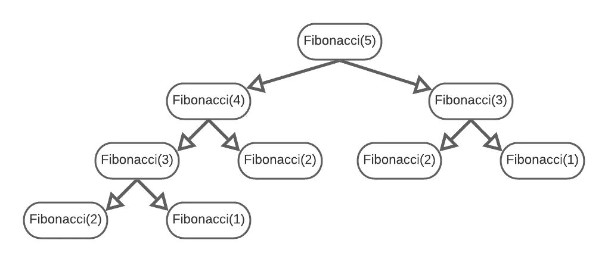
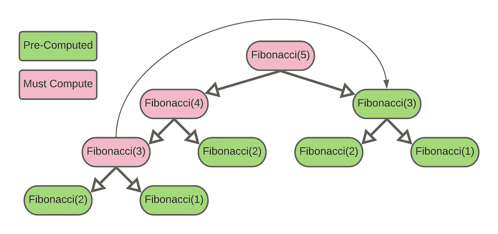

# 编码问题:Golang 中的第 n 个斐波那契数

> 原文：<https://levelup.gitconnected.com/coding-problem-nth-fibonacci-number-in-golang-68db104e318>

## 你知道最优解吗？

来自 DeepDreamGenerator 上的[权池](https://deepdreamgenerator.com/ddream/6e89inus98p)

斐波那契数列是数学中最著名的模式之一。每个术语都是由前两个术语构建而成，以两个基本案例作为模式的开始。第一个基本情况值为零，第二个值为一。从这里，我们可以使用下面的公式计算任何斐波纳契数:

> 斐波那契(n)=斐波那契(n-1)+斐波那契(n-2)

斐波那契数列是一个完美的问题，可以测试你的计算机科学基础知识和编码技能。在本文中，我们将通过三个例子来说明如何使用编程语言 go 尽可能高效地计算第 n 个斐波那契数。作为参考，这个问题也可以在 Leetcode 上解决:

 [## 斐波那契数- LeetCode

### 提高你的编码技能，迅速找到工作。这是扩展你的知识和做好准备的最好地方…

leetcode.com](https://leetcode.com/problems/fibonacci-number/) 

**注意:**本教程假设您了解递归和堆栈数据结构。

我们来编码吧！

# 一个递归解— O(2^N)时间，O(N)空间

最初的简单解决方案是将第 n 个斐波那契数列的公式直接翻译成代码。我们所要做的就是检查我们是否处于`n==1`或`n==2`的基本情况，如果不是，我们递归地返回带有参数`n-1`和`n-2`的`fib()`。说真的，这个解决方案干净简洁！

对这一功能的时间和空间分析比看上去更有逻辑性。因为这是一个递归函数，我们将建立一个调用栈，如下所示。假设我们调用`fib(5)`，这将给我们一个调用栈，总共有 9 个对我们函数的调用。

用 Lucidchart 做的

我们实际上将从左到右遍历树，一旦到达左下方的 Fibonacci(2 ),我们将弹出调用堆栈中的第一个元素。因此，我们的调用堆栈看起来像这样:

> 调用堆栈:`fib(5)->fib(4)->fib(3)->fib(2)`

随着堆栈变大，空间复杂度变为 O(N ),因为在弹出值之前，我们必须在堆栈中存储大约 N 个值。说到时间复杂度，想想我们在斐波纳契树中创建了多少个节点。它看起来类似于二叉树，因为我们必须满足 N=1 或 N=2 的基本条件。

除非斐波纳契树中的一个节点是一个基本情况，否则我们必须为每个节点计算 2 个值。随着树的增长，这很快接近 2^N 节点总数，因此递归斐波纳契的时间复杂度是一个糟糕的 O(2^N).让我们做得更好！

# 动态规划— O(N)时间，O(N)空间

关于上面的例子，你应该注意到的一件事是我们重复自己——很多次。为了优化我们的策略，有一种我们已经见过的存储值的方法，称为*动态编程*。

> 尽管名字好听，动态编程只是意味着我们缓存先前计算的值，以便我们可以引用它们供以后使用。这个过程在计算斐波那契值时给了我们显著的性能提升！

我们首先初始化一个地图，从斐波那契数列的基本情况开始。然后，我们有一个名为`computeCache()`的辅助函数，它接受我们想要的第 n 个斐波那契值以及我们的`baseCases`图作为它的参数。

助手方法`computeCache()`将在第 10 行有一个很好的 Go 条件，在这里它获得`cache`中键`n`的值`val`。如果确实有一个键值对，布尔运算`found`为真，否则为假。因此，在我们得到元组`val, found := cache[n]`后，我们在末尾添加一个`;`，然后如果`found`为真，if 语句将通过。

简而言之，我们检查散列图`cache`，看看我们是否已经计算了当前的斐波那契数列值。

如果我们以前没有见过这个值，我们通过将`cache[n]`赋值为等于对`computeCache()`的递归调用来计算它。我们遵循与第一个例子相同的递归公式，只是现在我们传递一个缓存来跟踪我们的值。嘣！

让我们再来看看我们对这个算法的时空分析。我们仍然有递归调用，所以我们仍然有一个调用栈，从 N 开始，一直到 N=1 或 N=2 的基本情况。一旦我们构建了第一个链，我们将不会执行重复的工作，但是我们仍然受限于 O(N)空间复杂度，因为除了在缓存中存储我们的计算值之外，还有调用栈*。*

使用动态规划计算斐波纳契值

动态编程极大地提高了我们的时间复杂度。我们不需要为每个 Fibonacci 调用计算多达两个值，而只需要计算我们以前没有见过的值。因此，我们需要计算从 N 到我们的基本情况的斐波纳契值，其余的计算是常数时间操作。因此，我们的新算法具有 O(N)时间复杂度。

# Fib on the Fly — O(N)时间，O(1)空间

优化算法有一些共同的主题。问我们自己的两个大问题包括我们是否在重复工作。如果是这样，我们如何存储我们之前计算的值呢？如果我们已经存储了值，有没有一种方法可以实现我们算法的本质，而不必存储任何工件？

最后一步需要非常了解问题的本质。斐波那契数列的本质是什么？就是我们现在的价值是建立在前两个价值之上的。因此，从基础案例开始，如果我们使用之前的两个值计算当前值，然后用新的 Fibonacci 值替换之前的一个值，会怎么样？

让我们把它写成代码。我们首先初始化一个数组`prevFibs[]`(如果你愿意，你可以使用一个元组或者两个单独的变量),它从我们的基本情况值 0 和 1 开始。接下来，我们开始一个 for 循环，它根据前两个 Fibonacci 值计算下一个 Fibonacci 值，然后用我们刚刚计算的值替换最早的 Fibonacci 值。

**注意:**因为我们已经有了 n=1 和 n=2 的基本情况，我们必须初始化`i=3`来开始我们的循环。

一旦我们计算出最后一个斐波纳契值`i=n`，我们需要返回最近计算的数字`prevFibs[1]`。

**另一个注意:**只有一种情况下这个逻辑不成立，那就是当 n=1 时，那么我们必须立即返回基本情况值为 0 的`prevFibs[0]`。

这应该是迄今为止最简单的时空分析。我们有的只是一个从 3 开始向上到 N 的 for 循环，所以我们的时间复杂度简单来说就是 O(N)！除了两个元素的数组之外，我们不再存储任何数据结构。由于这是一个常数成本，我们的空间复杂度将是 O(1)，我们已经成功地优化了在 Go 中计算斐波那契值！

我希望你喜欢这篇文章，并能够学到一些新的东西。如果你有任何其他的话题想写或者只是喜欢这篇文章，我鼓励你在下面留下评论。感谢阅读！