# 多智能体系统的会合局部控制律编码

> 原文：<https://levelup.gitconnected.com/coding-the-rendezvous-local-control-law-for-multi-agent-systems-e9ef9267f8eb>

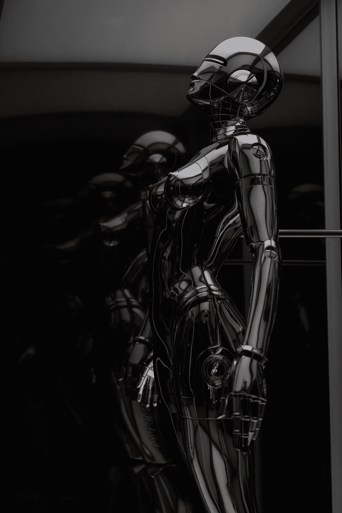

照片由[许](https://unsplash.com/@mrsunburnt?utm_source=unsplash&utm_medium=referral&utm_content=creditCopyText)在[上挥洒](https://unsplash.com/s/photos/robots?utm_source=unsplash&utm_medium=referral&utm_content=creditCopyText)

在下面的文章中，我介绍了网络控制系统的会合问题:

[](https://medium.com/@CalebMBowyer/the-rendezvous-problem-for-multi-agent-systems-889bcfac870b) [## 多智能体系统的会合问题

### 在上一篇文章中，我从较高的层面介绍了网络控制系统领域:

medium.com](https://medium.com/@CalebMBowyer/the-rendezvous-problem-for-multi-agent-systems-889bcfac870b) 

在我最近的一篇文章中，我详细介绍了 N=2 个智能体的简化情况的解析解，并推测了任意大量智能体的解可能是什么(质心搜索控制律):

[](https://medium.com/@CalebMBowyer/analytical-solution-to-the-rendezvous-problem-for-n-2-agents-f6d1ab60bc6e) [## N=2 个智能体会合问题的解析解

### 在我最近的文章中，我介绍了多智能体系统的会合问题:

medium.com](https://medium.com/@CalebMBowyer/analytical-solution-to-the-rendezvous-problem-for-n-2-agents-f6d1ab60bc6e) 

在本文中，我提供了代码来为任意数量的代理和任意维数的状态空间执行会合模拟。然而，在这篇文章中，我举例说明了在 1D 和 2D 的会合。

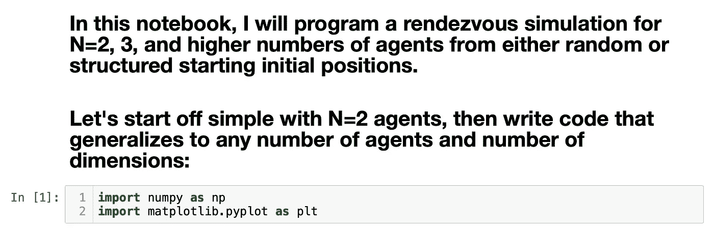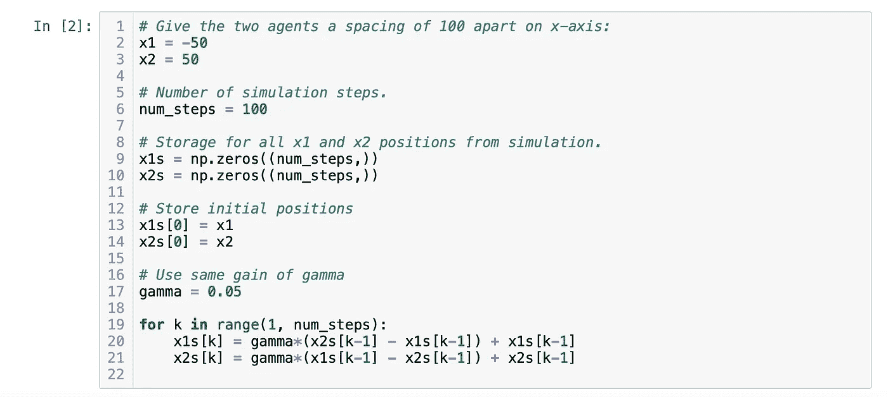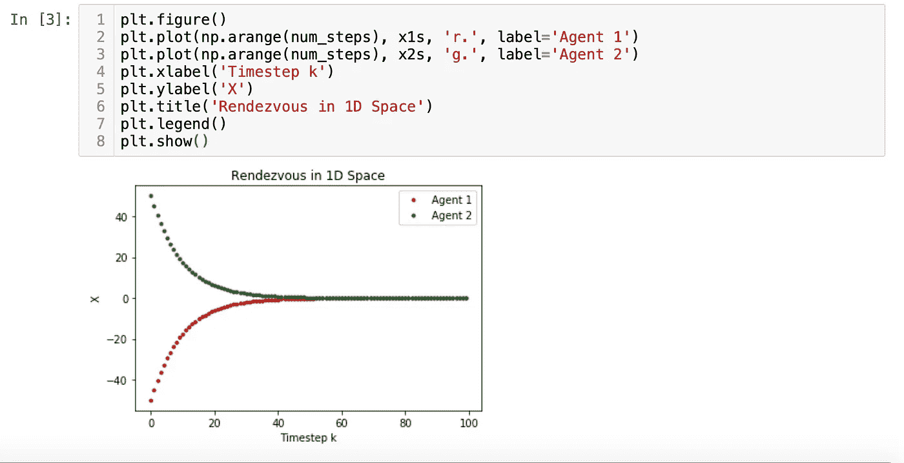

从上面，我们可以看到收敛到一个点或会合确实正在发生，两个代理在他们的中点相遇，就像数学告诉我们的那样！从上面，我们看到两个代理收敛到原点。

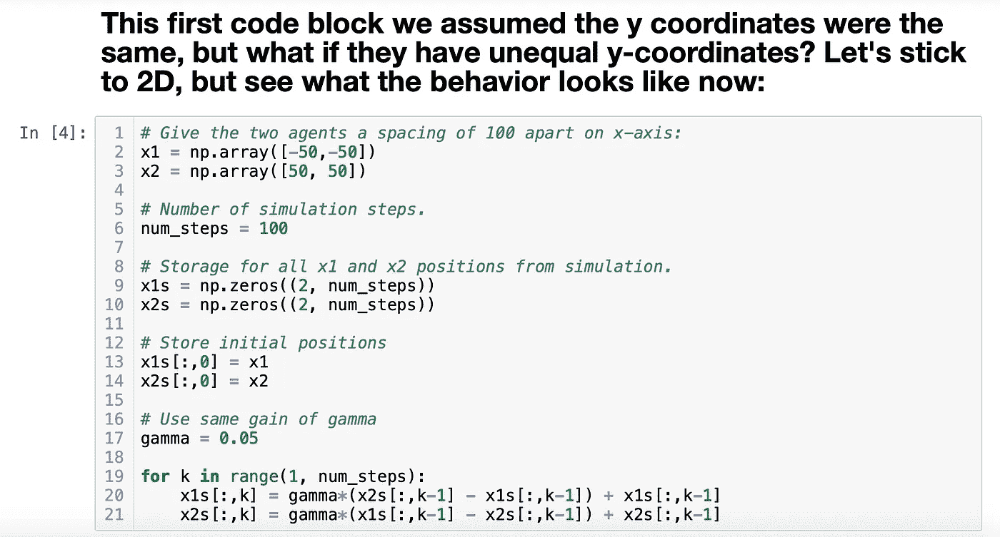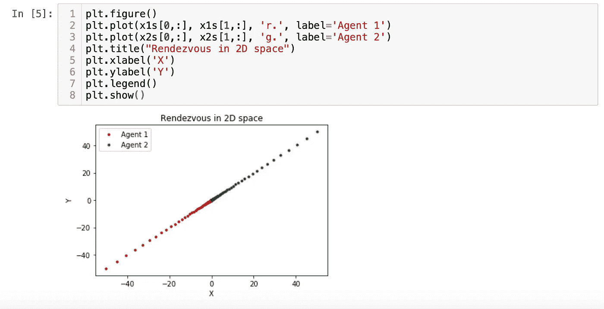

这两个代理再次汇聚到 2D 的原点。你可以看到，当两个代理接近原点时，代理很快收敛，点开始聚集。通过将 gamma 选择为较大的值，可以加快收敛速度。

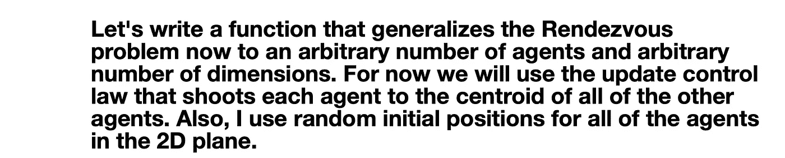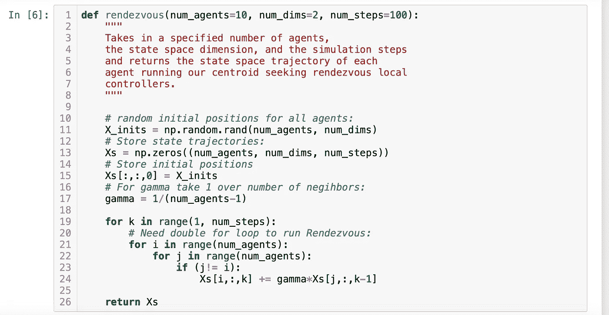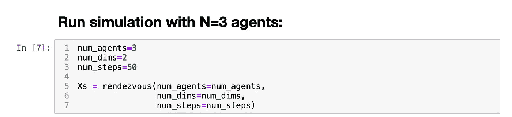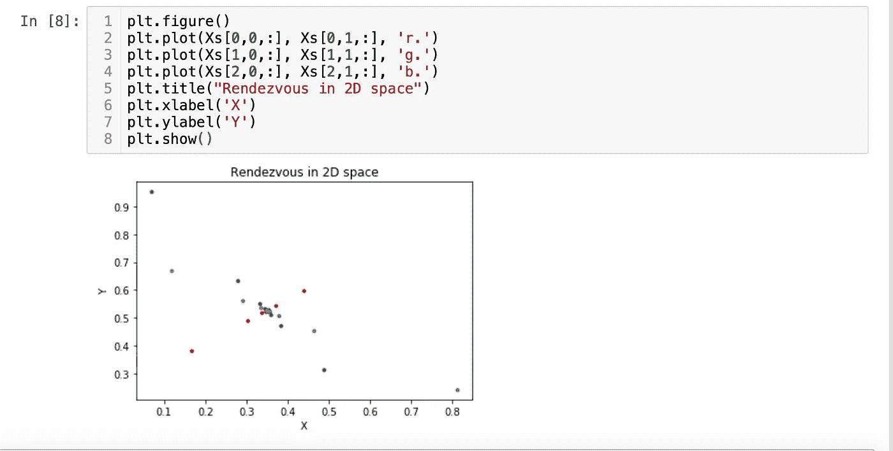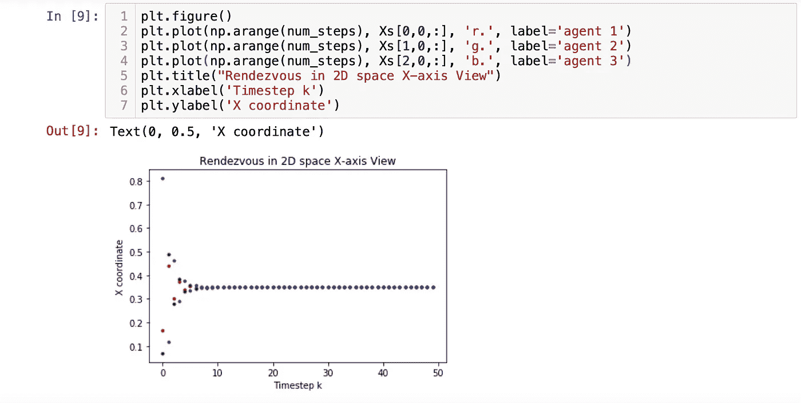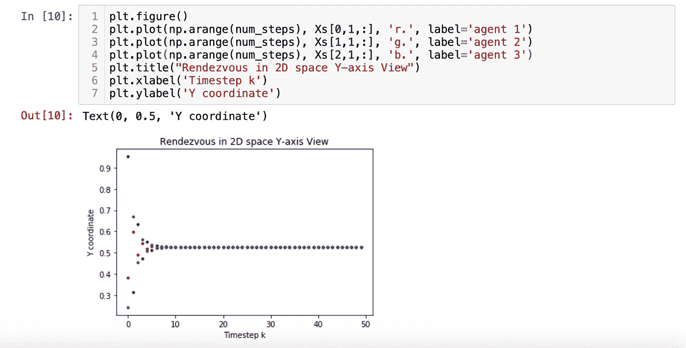

最后，在这个 N=3 的代理模拟中，我们可以看到三个代理收敛到下面的 2D 点。现在回到阶段肖像犁，你会看到这是点开始聚在一起，并确认代理人的收敛或会合！

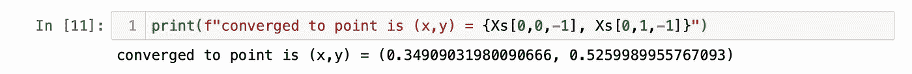

# 你能得到的集合代码:

```
def rendezvous(num_agents=10, num_dims=2, num_steps=100):
    """
    Takes in a specified number of agents, 
    the state space dimension, and the simulation steps
    and returns the state space trajectory of each 
    agent running our centroid seeking rendezvous local
    controllers. 
    """ # random initial positions for all agents: 
    X_inits = np.random.rand(num_agents, num_dims)

    # Store state trajectories:
    Xs = np.zeros((num_agents, num_dims, num_steps)) # Store initial positions
    Xs[:,:,0] = X_inits # For gamma take 1 over number of neighbors:
    gamma = 1/(num_agents-1) for k in range(1, num_steps):
        # Need double for loop to run Rendezvous: 
        for i in range(num_agents):
            for j in range(num_agents):
                if (j!= i):
                    Xs[i,:,k] += gamma*Xs[j,:,k-1] 

    return Xs
```

直到下一次，

凯勒。

考虑成为一个媒体成员，永远不会错过我的故事。无限制地访问我的作品和其他作者的作品:

[](https://medium.com/@CalebMBowyer/membership) [## 加入我的介绍链接媒体-迦勒鲍耶

### 阅读凯莱布·m·鲍耶(以及媒体上成千上万的其他作家)的每一个故事。您的会员费直接支持…

medium.com](https://medium.com/@CalebMBowyer/membership) 

# 分级编码

感谢您成为我们社区的一员！在你离开之前:

*   👏为故事鼓掌，跟着作者走👉
*   📰查看更多内容请参见[升级编码刊物](https://levelup.gitconnected.com/?utm_source=pub&utm_medium=post)
*   🔔关注我们:[Twitter](https://twitter.com/gitconnected)|[LinkedIn](https://www.linkedin.com/company/gitconnected)|[时事通讯](https://newsletter.levelup.dev)

🚀👉 [**软件工程师的顶级工作**](https://jobs.levelup.dev/jobs?utm_source=pub&utm_medium=post)