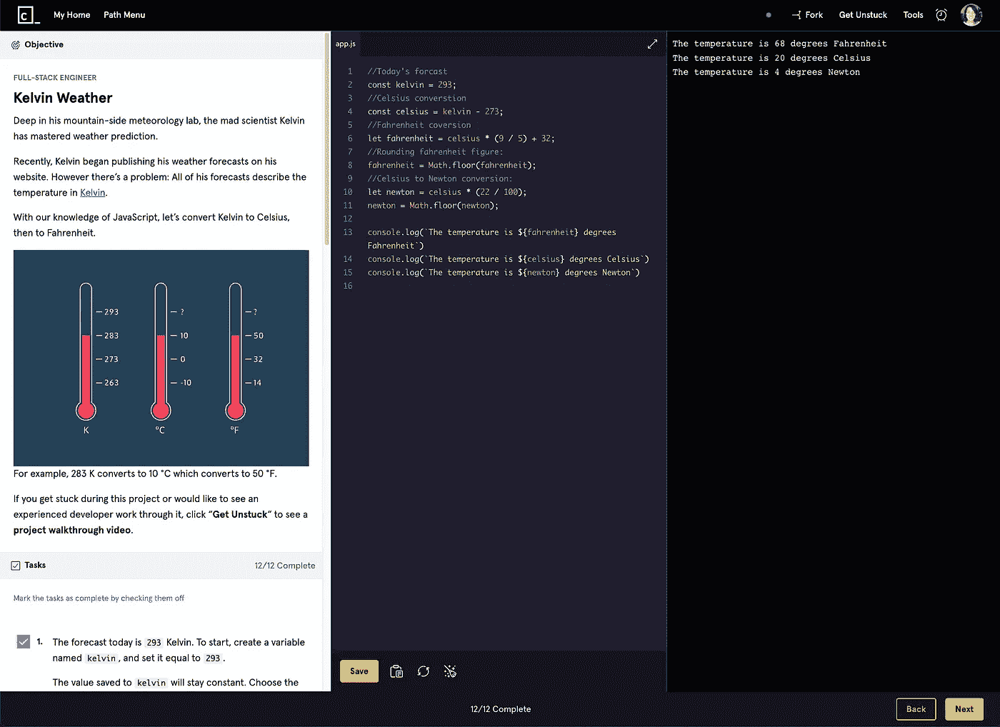
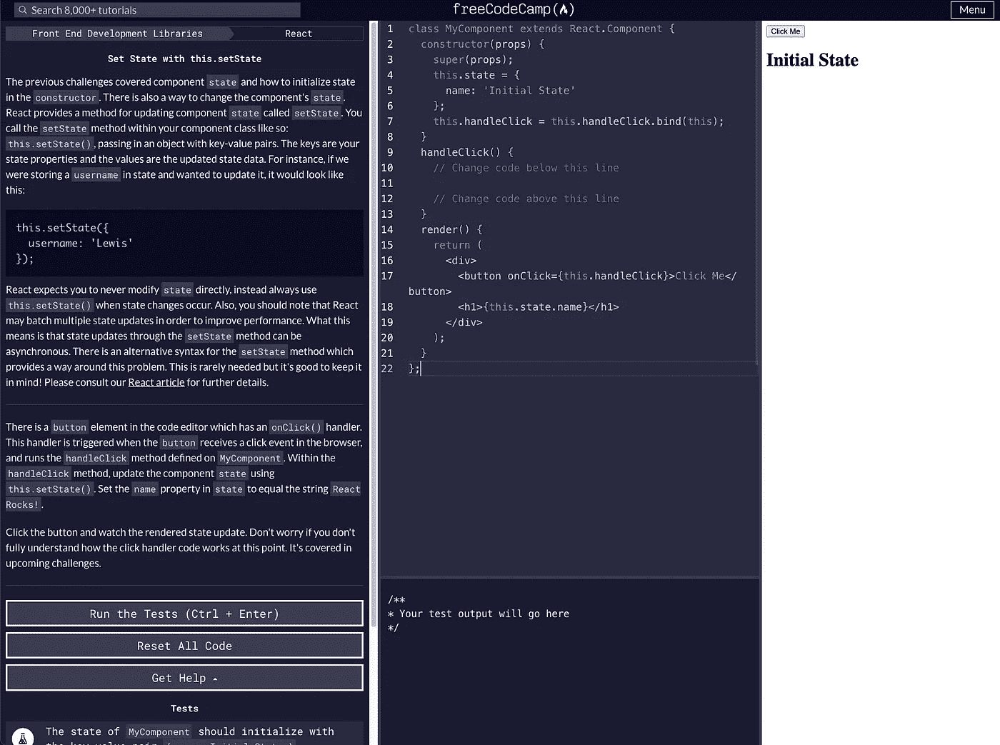
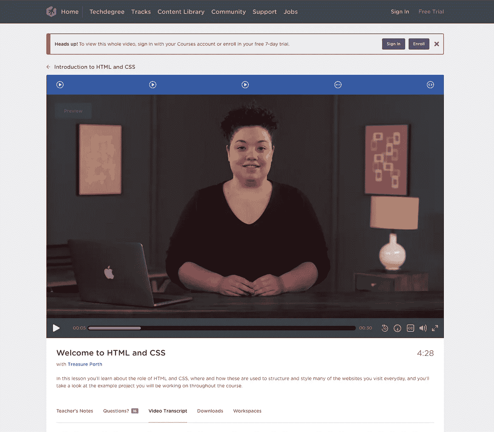
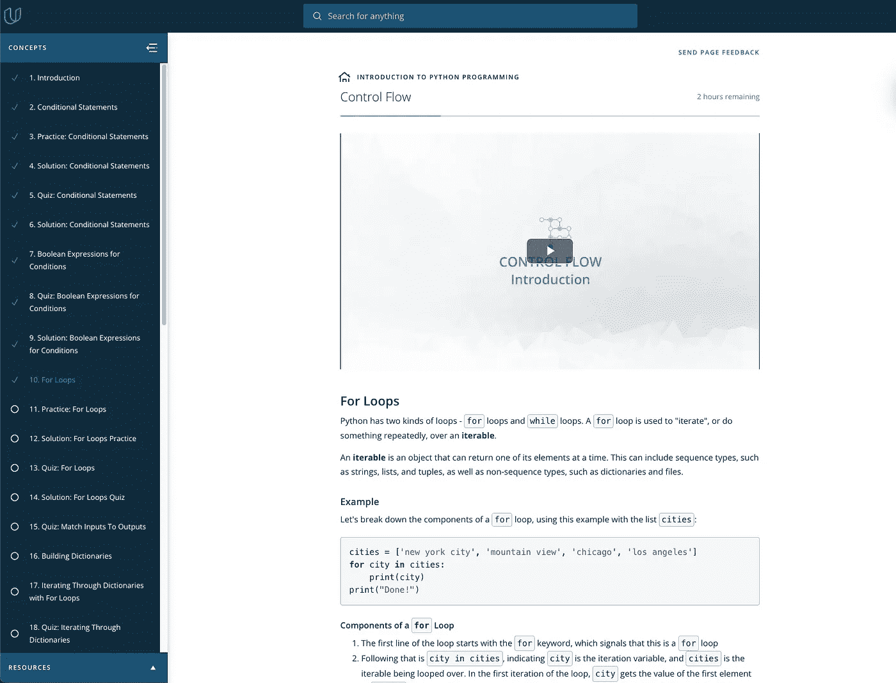

# 编码:从哪里开始

> 原文：<https://levelup.gitconnected.com/coding-where-to-start-2f95cffe4298>

照片由 [Siora 摄影](https://unsplash.com/@siora18?utm_source=unsplash&utm_medium=referral&utm_content=creditCopyText)在 [Unsplash](https://unsplash.com/s/photos/study?utm_source=unsplash&utm_medium=referral&utm_content=creditCopyText) 上拍摄

当我还是一名法学院的学生时，我第一次发现了对编程的热爱。也许是我应该把我的头放在合同教科书上的事实驱使我走上了一条新的道路，或者也许是命运——我还没有决定。自从 2016 年开始我的旅程以来，我一直喜欢学习软件工程领域的新东西。然而，这并不总是一条笔直狭窄的道路，有些细微差别我希望我当时就知道。如果您正在开始您的编码之旅或寻找更多的方向，这是为您准备的！

# 这么多路径！我如何开始挑选一些东西？

与你选择某样东西并带着它跑的想法相比，你最初选择什么来开始学习并不重要。也就是说，我完全相信，如果你选择一些更广泛使用和简单的东西来开始你的旅程，你会建立起你的信心(而且冒名顶替综合症不会那么讨厌)。

我个人是从学习 Codecademy 的 HTML 和 CSS 开始的(见下文)，并很早就开始学习他们的“T4 JavaScript T5”课程。我真的很喜欢这条道路，因为它让我在早期阶段适应了 web 开发，并为我学习其他语言和框架做好了准备。开始使用 JavaScript 的少数缺点之一是，在这种语言中有许多不同的方法来解决一个问题。我推荐使用 TypeScript，但是这从一开始就不太直观。如果你正在研究 web 开发，你将来可能会使用某种框架(Angular，React，Vue…甚至可能是 Svelte？谁知道)。从 JavaScript 开始，你将会成功地使用这些框架。

在我作为软件工程师的一份工作中学习了 Python 之后，我也明白了这可能是一个很好的开始。Python 在大大小小的公司中广受欢迎，并在许多不同的环境中使用。它非常通用，并且有简单直观的语法。Python 的[禅是核心哲学，我建议(至少)浏览一下，看看使用 Python 作为第一语言背后的原因。因为语法易于阅读和理解，所以您通常可以相对快速地开始创建自己的程序，这可能会更容易保持学习的积极性！](https://zen-of-python.info/)

# 学习资源

在开始我的旅程时，我使用最多的两个资源是 Codecademy 和 FreeCodeCamp。我之所以选择这些，是因为它们都是免费的，而且平台也很友好。当然，现在网上有大量的资源，我强烈建议开始一些不同的课程，看看你如何学得最好。一些在线课程更多的是基于视频/讲座，而其他的则更多的是动手操作，需要更多的阅读。试试这些，看看你有什么想法！

## [代码学院](https://www.codecademy.com/catalog)

Codecademy:全栈 JavaScript 课程

Codecademy 是我第一次涉足开发，他们也有一个庞大的学习者社区，随时准备帮助你克服任何关于[不和](https://discord.com/invite/codecademy)的障碍。我个人很喜欢这种形式:阅读新主题的介绍，然后根据需要用提示自己解决例题。这是一种非常实用的方法。Codecademy 在世界各地也有许多当地聚会，包括[纳什维尔](https://sarahmorrisokeefe.medium.com/creating-a-digital-ish-community-9650292781f)！

## [FreeCodeCamp](http://freecodecamp.org)

FreeCodeCamp: React 课程

FreeCodeCamp 是为数不多的专注于教世界编程的非营利企业之一。他们的课简洁易懂，格式和 Codecademy 很像。FCC 的一个很酷的特点是它是完全免费的，所有内容从一开始就是可用的。如果你正在学习，这是一个很好的选择，因为你可以在任何时候开始任何课程！

## [团队树屋](https://teamtreehouse.com/)

树屋:HTML 和 CSS 介绍

树屋有很多令人难以置信的内容，但不幸的是并不是免费的。在撰写本文时，他们的基本费用是每月 25 美元，如果你选择参加他们的一个 Techdegree 项目，可以涨到每月 199 美元。在参加之前，我通过纳什维尔软件学校使用 Treehouse 进行预备课程工作，并喜欢该平台的 UI 和简单性，但价格对一些人来说可能有点高。也就是说，如果你对基于讲座的学习感兴趣，他们会提供 7 天的免费试用！

## [乌达城](https://www.udacity.com/)

uda city:Python 简介

Udacity 是一个平台，我已经在很多其他主题上使用过，事实证明他们在软件开发方面也有丰富的知识！这是一个有趣的平台，因为你可以获得由特定的人教授的课程。他们有大量的免费课程和付费课程，纳米学位课程起价为每月 399 美元。您可以根据主题、难度、价格、持续时间等过滤不同的主题。如果你正在寻找软件开发中的一个特定主题(或者任何技术或商业相关的)，这是一个很好的起点。

# 建立工作关系网

这条信息更多的是关于“我如何得到我的第一份工作”，但是在我看来这仍然是一个很好的实践。为了以更快的速度开始学习并写出更漂亮、更有用的代码，有一群你可以谈论它的人会有所帮助。你可以随时向你的朋友或家人展示你正在做的事情，但是他们不能告诉你为什么应该在你写的那行代码中使用三元组而不是更冗长的 if 语句。这有助于找到一个你可以向其反馈编码想法的人，并且尽早地、经常地获得关于你正在做的工作的反馈。找到你的社区，并在某个地方建立一个存在，这样你就可以放心地在这个旅程中寻求帮助！

说到反馈，这可能是一个解释的好时机*当你向某人寻求对你工作的反馈时，记住他们是在批评工作本身(而不是你个人)*。这个概念在理论上很容易，但是当你不断地得到对你所构建的东西的“吹毛求疵”的评论时，你会感到畏惧。记住，从你周围的人那里获得反馈和建议是你作为开发人员成长的方式！你问的每个人都还会记得他们第一次学习如何编码，所以每个人都经历过你所在的地方。

# 结论

有很多文章都是关于为什么你应该开始学习编码，以及如何去做的。在写这篇文章的时候，我的目标不是增加你大脑中的噪音，而是给你一个我第一次学习 web 开发的例子。如果你有我没有提到的任何提示，或者想问任何问题，请随时发表评论！

寻找一个可以让你作为开发人员学习和成长的在线社区？查看[纳什维尔代码学院聚会](https://community.codecademy.com/nashville/)！我们在田纳西州的纳什维尔当地会面，但每周也有一次在线聚会，让彼此对我们的目标负责。

你可以在 [Twitter](https://twitter.com/sarahmokeefe) 和 [Instagram](https://www.instagram.com/sarahmorrisokeefe/) 上找到我，也可以在纳什维尔 Codecademy discord 服务器上找到我(上面有链接)。希望这是有帮助的！