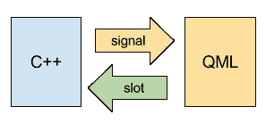
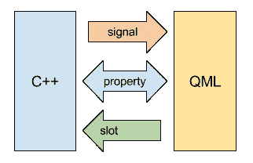

# 用 QML 和 Qt C++编码:改进应用程序开发的史诗指南

> 原文：<https://levelup.gitconnected.com/coding-with-qml-qt-c-class-the-epic-guide-to-improve-your-app-development-e851a7aa0fd1>

使用 QML 进行应用程序开发既简单又强大。但是 Qt C++性能更好，提供了许多特性，并且不容易出错。这篇文章向你展示了如何创建利用这两种语言的应用程序。

# C++和 QML 如何通信

为应用程序的不同功能选择正确的语言非常重要。将 C++组件与 QML 集成，让您的移动应用开发更上一层楼。

# 编码在 QML 的优势

用于基于 Qt 的移动应用和游戏的 Felgo 引擎使用了 **Qt Quick** (QML + Javascript)的强大功能。这种声明式脚本语言非常强大，与其他编程语言相比，它可以节省多达 60%的代码行。

[**在 QML**](https://felgo.com/qt/qt-tutorials-resources-for-beginners) 编码有**几个优点**比**用 C++开发:**

*   用 [QML + JavaScript](https://felgo.com/qt/qt-tutorials-resources-for-beginners) 编码非常容易学习，并且可以减少所需的代码量。
*   像状态、信号或属性绑定这样的语言概念可以节省大量时间。
*   QML 让添加动画变得简单。您可以使用简单的动画组件来制作 QML 类型的每个属性的动画。
*   QML 具有可扩展性和灵活性。例如，您可以内嵌新的属性和功能来扩展对象。无需为小型扩展创建新的可重用类型。
*   QML 渲染引擎提供了出色的性能。渲染器使用 C++ Qt，并依赖于硬件加速场景图。这使得它的速度足以支持高性能游戏。

# 何时使用 C++代替

[用 C++](https://felgo.com/mobile-app-development) 开发 Qt app 也有优势。对于某些场景，您需要只有 Qt C++才有的特性。此外，C++是快速和类型安全的。这允许为长时间运行和数据密集型计算提供最佳性能。

对于这些例子，你会**选择 C++而不是 QML** :

*   原生 C++代码是数据密集型操作的正确选择。它将胜过解释的 QML/JavaScript 代码。
*   C++代码是类型安全的，被编译成目标代码。对于稳定性和安全性很重要的部分，使用 C++有助于使你的应用程序不容易出错。
*   Qt C++组件提供了不同的特性，在某些情况下比 QML 类型提供了更多的特性。例如，高级网络功能。
*   也可以将 C++与 Android(通过 JNI)或 iOS (Obj-C 或 Swift)的原生代码混合使用。这也允许为 QML 提供这样的本地功能。

[Felgo 引擎](https://felgo.com/)为手机 app 和游戏开发扩展 Qt。它已经涵盖了像访问原生设备特性这样的任务——所以你不必担心深入 C++或 Java 和 Obj-C。

不过，为了充分利用您的应用程序，您可以利用这两种语言的优势。该指南的完整示例也可在 [GitHub](https://github.com/FelgoSDK/VPlayCppQML-Example) 上获得:

# 如何从 QML 访问 C++对象

在我们进入任何细节之前，让我们先用 Qt Creator 创建一个简单的 Felgo Apps 项目。如果你是 Felgo 新手，不知道如何操作，请考虑看看[入门教程](https://felgo.com/doc/apps-getting-started/)或 [Felgo 设计师教程视频](https://felgo.com/doc/vplay-video-tutorials/#video-tutorial-v-play-visual-designer-highlights-video)。

要注册并安装 Felgo，请参见 Felgo 网站的[下载页面](https://felgo.com/download/)。

**注意:**用 [QML Live](https://felgo.com/updates/release-2-14-0-live-code-reloading-for-desktop-ios-android) 测试时不支持添加自定义 C++代码。请使用经典的“运行”按钮构建您的项目，以测试下面的示例。

# 在您的 Felgo 项目中创建一个 C++类

1.创建新的应用程序项目后，首先用以下基本结构替换 Main.qml 中的代码:

[**现在在你的 iOS 或 Android 设备上运行这段代码**](https://felgo.com/web-editor/?snippet=681af288) **，并实时重新加载代码**

它只包括主[应用](https://felgo.com/doc/vplayapps-app/)窗口和 NavigationStack 中的[页面](https://felgo.com/doc/vplayapps-page/)以显示包含页面标题的导航栏:

2.这对于我们的基本 QML 设置来说已经足够了。让我们继续创建一个新的 C++类。首先，在 Qt Creator 中右键单击项目的 C++“Sources”文件夹，选择“Add New…”并在 c++部分选择“C++ Class”模板:

3.然后将“*my global object”*设置为*类名*并选择“Include QObject”以包含 **QObject** 类型，因为准备我们的类以供 QML 使用的主要要求是从 QObject 派生。

完成向导后，您的项目在“Headers”文件夹中包含类定义 *myglobalobject.h* ，在项目的“Sources”文件夹中包含实现 *myglobalobject.cpp* 。

请注意*。专业配置现在也包括新文件在*头*和*源*配置。

# 使用信号和插槽实现 C++类，以便与 QML 一起使用

1.打开 *myglobalobject.h* 并添加一些代码到从 QObject 派生的**—所需的 include 语句已经就绪:**

[**现在在你的 iOS 或 Android 设备上运行这段代码**](https://felgo.com/web-editor/?snippet=6b99d0a3) **，并实时重新加载代码**

不要忘记在类定义中添加 Q_OBJECT 预处理宏。

2.现在我们有了一个新的 QObject，让我们添加一个简单的方法，稍后我们将从 QML 调用它。为了使该方法在 QML 可用，需要将其标记为**公共槽**:

[**现在在你的 iOS 或 Android 设备上运行这段代码**](https://felgo.com/web-editor/?snippet=58376ee1) **，并实时重新加载代码**

3.为了完成我们的基本类，打开 *myglobalobject.cpp* 并添加 *doSomething()* 的方法实现。我们保持简单，只把给定的文本打印到调试输出中。

[**现在在你的 iOS 或 Android 设备上运行这段代码**](https://felgo.com/web-editor/?snippet=271ea3d8) **，并实时重新加载代码**

# 将对象作为上下文属性公开给 QML

在 QML 处理 C++对象的一种可能方式是**将对象作为属性添加到 QML 树的根上下文**。您可以决定属性的名称，然后在您的 QML 代码中全局可用。

1.为了创建我们类的新对象并将其作为属性添加，我们扩展了 main.cpp 代码:

[**现在在你的 iOS 或 Android 设备上运行这段代码**](https://felgo.com/web-editor/?snippet=ff1284e2) **，并实时重新加载代码**

注意:在 C++中也可以完全使用这个对象。上面的代码示例已经包含了对我们的 doSomething 方法的测试调用。

2.在我们项目的 Main.qml 中，我们用一个列和第一个 AppButton 扩展了我们的页面，当单击它时调用 doSomething()方法:

[**现在在你的 iOS 或 Android 设备上运行这段代码**](https://felgo.com/web-editor/?snippet=530dcdd4) **，并实时重新加载代码**

3.让我们点击 Qt Creator 中的绿色运行按钮，看看它是如何工作的。调试输出显示 main.cpp 的初始方法调用，点击按钮会出现另一条消息:
*my global object do something with " TEXT FROM QML "*

这就是我们从 QML 调用 C++对象的方法所需要的。这已经允许从 QML 到 C++的简单通信，但是我们还可以做更多。QML 支持许多令人惊奇的概念，比如属性的值改变监听器和属性绑定，这使得开发变得更加容易。所以让我们在 C++类中添加一个全功能的 QML 属性吧！

# 添加完全支持 QML 的类属性

1.打开 *mylgobalobject.h* 并添加一个带有公共 getter 和 setter 方法的私有计数器属性。

[**现在在你的 iOS 或 Android 设备上运行这段代码**](https://felgo.com/web-editor/?snippet=5f800d15) **，并实时重新加载代码**

2.实现所需的方法并初始化 *myglobalobject.cpp* 中的计数器属性

[**现在在你的 iOS 或 Android 设备上运行这段代码**](https://felgo.com/web-editor/?snippet=d2f1a6fb) **，并实时重新加载代码**

3.与 QML 的其他属性类似，我们也希望能够对 QML 代码中的属性变化做出动态反应。换句话说，当 C++属性改变时，我们希望在 QML 中触发函数。与**插槽**不同，插槽使 **C++方法可在 QML** 中调用，**信号**可用于**从 C++** 中触发 QML 代码。所以数据流看起来像这样:

让我们添加一个信号*反转*并在我们的 *setCounter* 实现中触发它:

**myglobalobject.h:**

[**现在在你的 iOS 或 Android 设备上运行这段代码**](https://felgo.com/web-editor/?snippet=8fa374a5) **，并实时重新加载代码**

**myglobalobject.cpp:**

[**现在在你的 iOS 或 Android 设备上运行这段代码**](https://felgo.com/web-editor/?snippet=ade866a3) **，并实时重新加载代码**

4.这个简单的改变已经允许我们为 QML 中的*count changed()*信号添加处理函数。然而，我们的计数器属性仍然是一个普通的 C++属性，带有一个 getter 和 setter 方法。我们可以用一个额外的预处理宏来解决这个问题:

[**现在在你的 iOS 或 Android 设备上运行这段代码**](https://felgo.com/web-editor/?snippet=66c61079) **，并实时重新加载代码**

**Q_PROPERTY** 宏定义了属性*计数器*并配置了读写属性的方法，以及通知属性变化的信号。QML 使用此配置来处理属性。

5.让我们扩展 Main.qml 并使用新的计数器属性。以下代码片段添加了一个增加计数器的新按钮和一个显示值的文本项:

[**现在在你的 iOS 或 Android 设备上运行这段代码**](https://felgo.com/web-editor/?snippet=778a359a) **，并实时重新加载代码**

我们的房产可以像 QML 的其他房产一样使用。感谢我们准备的计数器，每次更换计数器时，文本甚至会自动更新。

这是最后一个示例的样子:

# 如何将你的 C++类注册为 QML 类型

在 QML 使用 C++组件的第二种可能性是将类注册为 QML 类型。这允许直接在 QML 而不是 C++中创建你的类型的对象。最棒的是，我们在前面的例子中使用的信号、插槽和属性的概念仍然适用。

# 何时使用上下文属性，何时使用 QML 对象

如果您只想在 QML 中使用一个对象实例，您可以将该对象添加为**上下文属性**。当你的类有多个实例时，**将它注册为一个 QML 类型**，并在你需要的地方直接在 QML 创建对象。

1.对于这个例子，我们将创建一个可以在 QML 使用的新类型。让我们从添加一个名为 *MyQMLType* 的新 C++类开始

2.用此实现替换 *myqmltype.h* 中的代码:

[**现在在你的 iOS 或 Android 设备上运行这段代码**](https://felgo.com/web-editor/?snippet=a86b1e03) **，并实时重新加载代码**

与前面的例子类似，这个类型将有一个公共槽和一个全功能属性，该属性有一个 getter 方法、一个 setter 方法和一个属性更改信号。increment 方法将给定的整数值加 1，message 属性将存储一个字符串值。

3.要完成该类，请为 *myqmltype.cpp* 添加以下代码:

[**现在在你的 iOS 或 Android 设备上运行这段代码**](https://felgo.com/web-editor/?snippet=075d4060) **，并实时重新加载代码**

# 在 C++和 QML 之间可以传递哪些参数

与前面的例子相反，我们的新类也为增量槽使用返回值。无需进一步调整即可在 QML 获得返回值。对于所有方法参数和返回值，Qt 自动将基本 C++类型映射到 QML 类型。

有关可用 Qt 类型和相应 QML 类型的更多信息，请参见[QML 和 C++](http://doc.qt.io/qt-5/qtqml-cppintegration-data.html) 之间的数据类型转换。

# 注册并使用你的 C++ QML 类型

1.在 main.cpp 中，首先为新类添加一个 include 语句:

[**现在在你的 iOS 或 Android 设备上运行这段代码**](https://felgo.com/web-editor/?snippet=f5cebc9e) **，并实时重新加载代码**

2.然后使用 **qmlRegisterType** 将该类添加为 QML 类型。

[**现在在你的 iOS 或 Android 设备上运行这段代码**](https://felgo.com/web-editor/?snippet=5a0d21da) **，并实时重新加载代码**

该方法有几个参数:模块标识符和版本定义了使用该类型所需的 QML 导入。最后一个参数保存 QML 类型的名称，它可以不同于实际的 C++类名。

3.将与所使用的 qmlRegisterType 配置相匹配的导入添加到 Main.qml:

[**现在在你的 iOS 或 Android 设备上运行这段代码**](https://felgo.com/web-editor/?snippet=0a936d73) **，并实时重新加载代码**

4.对于我们的新 QML 类型的示例用法，在第一个示例下面添加以下代码片段:

[**现在在你的 iOS 或 Android 设备上运行这段代码**](https://felgo.com/web-editor/?snippet=d7852b80) **，并实时重新加载代码**

代码显示我们现在可以像使用任何其他 QML 项目一样使用 *MyQMLType* 。*消息*属性通过属性绑定进行内联初始化，这显示了将 *myGlobalObject.counter* 除以 2 的整数结果。每当计数器发生变化时，该表达式会自动重新计算。

此外，当消息依次改变时(每 2 个计数器步骤)，我们使用 *onMessageChanged* 信号在日志输出中显示新消息。

类似于其他 QML 项目，当 QML 引擎创建对象时， *Component.onCompleted* 信号可用于执行初始化步骤。在这个例子中，我们使用*增量*槽将计数器增加 1。

底部的 AppText 只显示消息属性:

# 使用属性、信号或插槽？

正如我们在前面的例子中已经看到的，属性、信号和插槽在 C++和 QML 之间提供了不同类型的通信:

*   **插槽允许从 QML 到 C++的通信:**插槽用于触发来自 QML 的 C++代码。您可以使用参数和返回值在 C++之间传递数据。
*   **信号允许从 C++到 QML 的通信:**信号用于在 C++发生某些事件时运行 QML 代码。你可以从 C++向 QML 传递参数。但是，您不能从 QML 返回数据。
    与插槽相反，信号可以由零个、一个或多个组件处理。不能保证在 C++中触发一个信号会真正运行 QML 代码，除非定义了一个处理程序。

属性双向工作:属性在 C++和 QML 中都是可读写的。为了支持 QML 中的属性绑定，请确保为属性添加一个 changed-signal，并且不要忘记在 C++中每当值改变时触发该信号。

# 如何从 QML 开始长期运行的 C++操作

上面的例子已经完全涵盖了插槽和属性，但是只使用了一个信号作为属性配置的一部分。为了完成这个例子，让我们添加一个新的槽 *startCppTask* ()、一个新的方法 *doCppTask* ()和一个新的信号*cpptasktfinished*()到 *myqmltype.h* :

[**现在在你的 iOS 或 Android 设备上运行这段代码**](https://felgo.com/web-editor/?snippet=759fa28f) **，并实时重新加载代码**

我们稍后将从 QML 调用 slot *startCppTask()* ，它执行内部的 *doCppTask()* 方法。例如，您可以在此时在另一个线程中运行计算，以避免在执行任务时阻塞 QML 用户界面。这对于您想在 C++中处理的任何 cpu 密集型或长时间操作都很有用。通过将方法的实现添加到 myqmltype.cpp，我们完成了 C++部分。

[**现在在你的 iOS 或 Android 设备上运行这段代码**](https://felgo.com/web-editor/?snippet=014d4db0) **，并实时重新加载代码**

现在一切都准备好了，我们可以添加另一个 AppButton 来启动我们的 C++任务:

[**现在在你的 iOS 或 Android 设备上运行这段代码**](https://felgo.com/web-editor/?snippet=7e2cb23f) **，并实时重新加载代码**

onCppTaskFinished()信号将在 C++部分完成计算时通知我们:

[**现在在你的 iOS 或 Android 设备上运行这段代码**](https://felgo.com/web-editor/?snippet=6e7ed854) **，并实时重新加载代码**

在本例中，我们只需在信号触发时将全局计数器重置为零，这也将更新 MyQMLType 的 message 属性。

这是执行 cpp 任务后最后一个示例的样子:

注意:当使用**上下文属性**时，要在 QML 处理自定义信号，请使用*连接* QML 类型。以下代码片段向 *myGlobalObject* 的 *counterChanged()* 信号添加了一个处理程序:

[**现在在你的 iOS 或 Android 设备上运行这段代码**](https://felgo.com/web-editor/?snippet=e658cfd3) **，并实时重新加载代码**

# 何时从 QQuickItem 而不是 QObject 派生

在所有使用的例子中，我们创建了一个扩展 QObject 的 C++类。但是，QObjects 有一些限制:QObjects 没有可视化表示。这意味着它们不能包含任何子项目，并且关于视觉特征(如大小、位置、可见性)的属性不可用。

一个 QObject 只保存您可以在 QML 中作为属性、信号和插槽使用的数据和逻辑。将 QObject 类注册为 QML 的类型时，请记住以下限制。要用 C++创建一个 QML 项目，它应该支持具有所有默认属性的可视化表示，请改为从 **QQuickItem** 派生。

由于这个简短的介绍并不包括 QQuickItems 的实现，请参见 [Qt 文档](http://doc.qt.io/qt-5/qquickitem.html)了解更多信息。关于集成 QML 和 C++的概述页面可以在[这里](http://doc.qt.io/qt-5/qtqml-cppintegration-topic.html)找到。

本指南中创建的项目的完整源代码可以在 [GitHub](https://github.com/FelgoSDK/VPlayCppQML-Example) 上找到:

# 更多这样的帖子

[向您的 iOS 或 Android 应用程序添加聊天服务和跨平台排行榜以及用户资料](https://felgo.com/cross-platform-app-development/how-to-add-chat-service-and-cross-platform-leaderboard-with-user-profiles-to-your-ios-or-android-app)

[2 . 14 . 1 版:更新至 Qt 5.9.3 |在 macOS 和 Linux 上使用实时代码重载](https://felgo.com/updates/release-2-14-1-update-to-qt-5-9-3-use-live-code-reloading-on-macos-and-linux)

[如何用 Qt 制作跨平台移动应用——fel go 应用](https://felgo.com/cross-platform-app-development/qt-v-play-apps-video)

【https://felgo.com】原载于 2020 年 3 月 29 日**。**